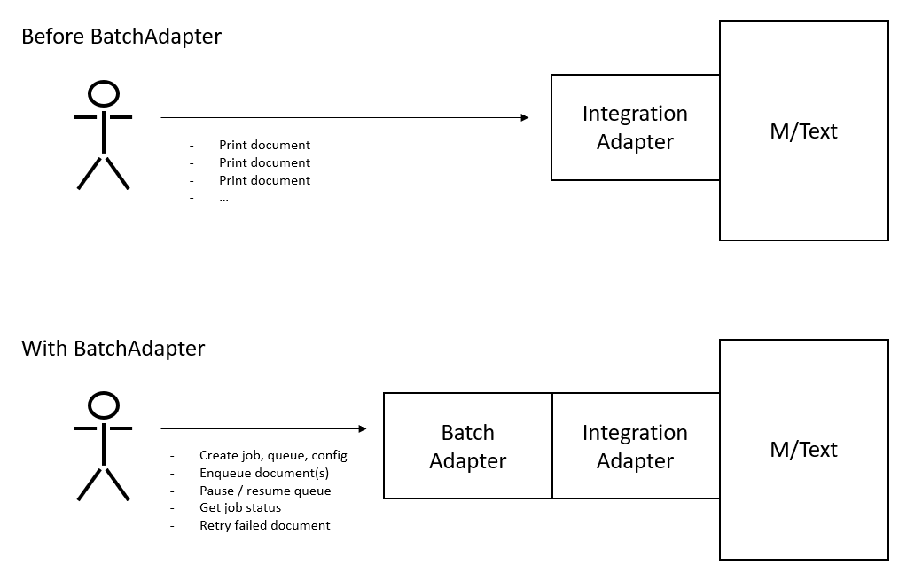
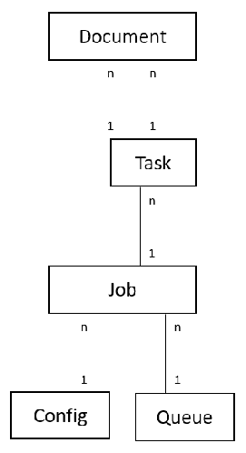
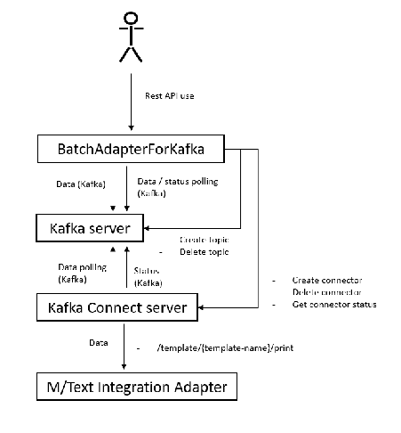
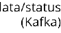
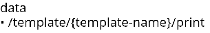

## Serie M/ 6.16

Technical Documentation

# M/TEXT Batch Adapter

This manual was released at 01.04.2025

Tip: Take a look at the PDF file "Serie M/ Glossary" to find out more about terms used in the Serie M/.

Feedback: This manual has been investigated and assembled with the utmost care. If, however, you should come across any errors, unaccouracies or incompletenesses, we would like you to inform us (<documentation@kwsoft.de>).

Note: The underlying databases for Serie M/ products should only be changed using official Serie M/ products. By altering these directly we cannot guarantee that Serie M/ products will continue to operate correctly. We reserve the right to change the database structure at any time and without prior notice.

|The symbols used in the manual:|The symbols used in the manual:|The symbols used in the manual:|The symbols used in the manual:|
|---|---|---|---|
||Example||System dependent|
||Please note||Prerequisite|
||Background||Warning|
||Note||Cross reference|
||Data privacy||Example video|

Copyright © 2025 kühn & weyh Software GmbH

Linnéstr. 1-3, D-79110 Freiburg Fone 0761/8852-0 Fax 0761/8852-666 E-Mail documentation@kwsoft.de Homepage www.kwsoft.de

##### Table of Contents

1. Batch Adapter ........................................................................................................................ 1

- 1.1. Essential Artifacts Overview ........................................................................................ 1
- 1.2. Model ......................................................................................................................... 2
- 1.3. REST API ..................................................................................................................... 4

- 1.3.1. Security ............................................................................................................ 4
- 1.3.2. Data Input Options .......................................................................................... 5

- 1.4. For Kafka Batch Adapter ............................................................................................. 6

- 1.4.1. Setup ............................................................................................................... 7
- 1.4.2. Logging ............................................................................................................ 9
- 1.4.3. Notification Topic ........................................................................................... 10
- 1.4.4. Troubleshooting ............................................................................................. 10
- 1.4.5. Complex test cases ........................................................................................ 11
- 1.4.6. Performance .................................................................................................. 12
- 1.4.7. Embedded Connect (since 6.16) ..................................................................... 13

- 1.5. For Tepine Batch Adapter ......................................................................................... 14

- 1.5.1. Setup .............................................................................................................. 14
- 1.5.2. Complex test cases ........................................................................................ 15
- 1.5.3. AWS S3 Bucket as a Data Input Option for Batch Adapter Tepine .................... 15

M/TEXT Batch Adapter 6.16 iii

### 1. Batch Adapter

Batch Adapter is a web service API, which provides a batch processing feature for M/TEXT. Currently, it has two implementations:

- • Batch Adapter for Kafka
- • Batch Adapter for Tepine

- Figure 1.1.

#### 1.1 Essential Artifacts Overview

|BatchAdapter / BatchAdapterForKafkaJersey|Batch Adapter for Kafka Batch Processor [war]|
|---|---|
|BatchAdapter / BatchAdapterForTepineJersey|Batch Adapter for Tepine Batch Processor [war]|
|BatchAdapter / BatchAdapterForKafkaQuarkus|Batch Adapter for Kafka Batch Processor [Quarkus]|
|BatchAdapter / BatchAdapterForTepineQuarkus|Batch Adapter for Tepine Batch Processor [Quarkus].|
|BatchAdapter / CustomPreprocessorExample|Example implementation of Custom Preprocessing API|
|BatchAdapterRestClient|Java REST client API|
|BatchAdapterRestClientCLI|Java command line tool|
|BatchAdapterIntegrationTest|REST API tests that works with all docker environments (see below)|

|BatchAdapterUI|Web interface for Batch Adapter administration, developed in Angular [static assets | war]|
|---|---|
|BatchAdapterOpenAPI|Open API definition & Swagger UI [war]|

Docker

|docker-wildfly-ba-for-kafka|Example of WildFly BA deployment & test environment|
|---|---|
|docker-wildfly-ba-for-tepine|Example of WildFly BA deployment & test environment|
|docker-quarkus-ba-for-kafka|Example of Quarkus BA deployment & test environment|
|docker-quarkus-ba-for-tepine|Example of Quarkus BA deployment & test environment|

#### 1.2 Model

- • Document (MXCS_BATCH_DOCUMENT) – Tracked document with an id (random UUID), job id, name (based on the input file), status (QUEUED, COMPLETED, FAILED), datasource, print configuration, error message, etc.
- • Job (MXCS_BATCH_JOB)
- • When a new Job is created, it can be associated with an existing Queue and Config, allowing multiple Jobs to share the same Queue and Config. This can be useful in situations where multiple batch processing jobs require the same configuration settings or share the same processing queue.
- • By reusing the Queue and Config entities, the Batch Adapter service can reduce the overhead of creating new Queues and Configs for each new Job and improve the efficiency of the batch processing system.
- • The Job entity further contains document counters for each state. These counters keep track of the number of documents in each state, allowing to monitor progress of the batch processing job.
- • Task (MXCS_BATCH_TASK) – Since 6.15
- • It is created automatically by BatchAdapter server for every `POST /api/jobs/{job-id}/ process` call and the Task ID is returned in a response.
- • Like the Job entity, the Task entity further contains document counters for each state. These counters keep track of the number of documents in each state, allowing to monitor progress of the batch.
- • Additionally, it also contains state of the enqueue process.
- • Queue (MXCS_BATCH_QUEUE) – Queue is an entity that represents a queue of documents to be processed by Batch Adapter.
- • When a new document is added to the queue, it is assigned a status of QUEUED, and the document counter in the corresponding Job entity is incremented. Then the batch processor picks up a document from the queue for processing. Once the processing is complete,

- the status is changed to either COMPLETED or FAILED, depending on the outcome of the processing.
- • Kafka: queue is mapped to Kafka topic and Kafka Connector, 1:1:1 (if not manually set otherwise).
- • Tepine : queue is mapped to java.util.concurrent.ThreadPoolExecutor, 1:1.
- • The DB entity itself only stores a configuration (depending on the batch processor used). See Section 1.4, “For Kafka Batch Adapter” and Section 1.5, “For Tepine Batch Adapter”.

- • Config (MXCS_BATCH_CONFIG) – Contains a document print configuration and optionally a splitting configuration .
- • Document print configuration
- • In .properties file format.
- • Properties:
- • template-name
- • mtext.print.enabled: If true the /template/{template-name}/print will be selected, /template/{template-name}/create otherwise, default: true
- • mtext.folder.path: It would prefix document name (which comes from input filename) if set
- • batch-adapter_store-datasources – ALL/NONE/FAILED_ONLY, default: ALL
- • Query parameters M/TEXT IntegrationAdapter REST API, endpoint: /template/ {template-name}/print, see docs
- • Available placeholders:
- • Document name: ${DOCUMENT_NAME}
- • Document id: ${DOCUMENT_ID}
- • A value from datasource: ${$<datasource>.<x>.<y>.<z>}
- • Use cases/examples:
- • Template name can be extracted from datasource: template-name= ${$DATA.document.template}
- • Set metadata: mtext.documentMetaDataParameter.BA_ID=${DOCUMENT_ID}

- Figure 1.2. Entity relationship model

#### 1.3 REST API

- • Swagger API definition: For details, see JavaDoc in the assembled directory \target\bin\API \mtextBatchAdapterRest\doc or on kwconnect

- • REST API Client: BatchAdapterRestClient project
- • Used by: BatchAdapterRestClientCLI project
- • Used by: BatchAdapterIntegrationTest project
- • Java CLI Client: BatchAdapterRestClientCLI project
- • Example TypeScript/Angular client can be found in BatchAdapterUI project

- 1.3.1 Security

Batch Adapter server does not handle authentication itself, but it is possible to use the capabilities of the application server (Wildfly/Quarkus) to restrict access to the API. Batch Adapter CLI and Batch Adapter Integration Tests have support for working with the API secured by BASIC or OIDC authentication.

Examples (auth is disabled by default, see READMEs to enable it):

- • docker-wildfly-ba-for-kafka – example of WildFly with Keycloak auth
- • docker-wildfly-ba-for-tepine – example of WildFly with Keycloak auth
- • docker-quarkus-ba-for-kafka – example of Quarkus with BASIC auth
- • docker-quarkus-ba-for-tepine – example of Quarkus with BASIC auth

##### 1.3.2 Data Input Options

- • HTTP Multipart/Form-Data (/api/jobs/{job-id}/process)
- • Filesystem (/api/jobs/{job-id}/process-from-fs)
- • To enable filesystem input option, there are two configuration entries in batch-adapter.properties; by default they are exposed as BatchAdapterFilesystemInputDir and BatchAdapterFilesystemInputEnqueuedDir.
- • AWS S3 Bucket (/api/jobs/{job-id}/process-from-s3)
- • To enable AWS S3 input option, environment variables introduced by the AWS SDK need to be set: AWS_ACCESS_KEY_ID, AWS_SECRET_ACCESS_KEY, AWS_REGION (opt).
- • Furthermore, there are some configuration entries in batch-adapter.properties.
- • For an example configuration see Section 1.5.3, “AWS S3 Bucket as a Data Input Option for Batch Adapter Tepine”.

####### Supported File Types:

- • XML - with or without splitting
- • CSV
- • ZIP – with XML or CSV files inside

Batch Adapter provides a Custom Preprocessing API that was introduced to handle situations where input transformation to a supported data source format (CSV, XML) is needed. See BatchAdapterCustomPreprocessors exposed parameter. See BatchAdapter / CustomPreprocessorExample.

- 1.3.2.1 Handling High Data Volumes

These are some tips for installations with high data volumes:

- • Batch Adapter is designed for batches – enqueueing documents one by one is not efficient. This applies especially for the Kafka version. There are many ways to avoid calling /api/jobs/ {job-id}/process for each individual document – for example, using CSV, a large XML with splitting, packaging documents into a ZIP, or process-from-fs.
- • Use the Kafka version. During the enqueue process, input data is streamed to Kafka, and at the end, a commit confirms them, preventing memory overflow.
- • Use /api/jobs/{job-id}/process-from-fs or /api/jobs/{job-id}/process-froms3 instead of sending data in large HTTP requests, as there are often some limitations.
- • Consider different data source storing strategies. This can be configured via the document config property batch-adapter_store-datasources, which accepts ALL, NONE, or FAILED_ONLY. The default is ALL.
- • Regularly clean up the database. You can use the REST API to delete old jobs or tasks.
- • Set Kafka log retention (delete policy) appropriately.
- • If you have extra large batches so that the duration of /process or /process-from-* may approach or exceed one minute, you will need to increase Kafka's transaction.timeout.ms; See batch-adapter.properties

- • If you have large datasources, you should check https://www.confluent.io/learn/kafkamessage-size-limit; Then see batch-adapter.properties

#### 1.4 For Kafka Batch Adapter

Kafka Batch Adapter stacking structure:

- • BatchAdapterForKafka – Server with REST API, further containing:
- • Batch Adapter Kafka Producer – Used to enqueue documents into Kafka;
- • Batch Adapter Kafka Document Consumer – Used for writing enqueued and committed documents into DB;
- • Batch Adapter Kafka Status Consumer – Status processing (updating documents to status: COMPLETED);
- • Batch Adapter Kafka Dead Letter Queue (DLQ) Consumer – Failed document processing (updating documents to status: FAILED);
- • Kafka server – That contains all the queues (topics);
- • Kafka connect server, further containing:
- • Group of Batch Adapter Kafka Connectors (one per queue if not manually set otherwise);
- • M/TEXT Integration Adapter

Kafka consumer == interface / Kafka concept; Batch Adapter Kafka Document Consumer == implementation

- Figure 1.3. HTTP communication view

The Queue entity is mapped to a Kafka topic and a Batch Adapter Kafka Connector (they are associated by name).

When a new document is accepted by the Batch Adapter API (POST /api/jobs/{job-id}/ process) and preprocessed/split successfully, it is serialized into a message and sent (using Batch Adapter Kafka Producer) to the Kafka topic associated with the Queue entity. After all the documents within the API request are enqueued successfully, thr commit is made and new messages in the topic can be processed. Also, Job's QUEUED documents counter is updated. The whole load of documents can be either successfully enqueued or rejected due to an error. The API call is blocked until everything is stored in Kafka and DB.

Simultaneously Batch Adapter Kafka Document Consumer and Batch Adapter Kafka Connector poll the Kafka topic for new (committed) messages to be processed:

- • The Batch Adapter Kafka Document Consumer: The message containing the document is deserialized and indexed in the DB (MXCS_BATCH_DOCUMENT). This asynchronous way of storing documents has a side effect: API calls like GET /api/documents/{document-id} could temporarily return 404 – not strong consistency but eventual consistency!
- • The Batch Adapter Kafka Connector: The message containing the document is deserialized and the document is send to M/TEXT Integration Adapter, then the result is serialized back into a message and sent to another Kafka topic – Status topic. Failed documents and broken messages are send to the Dead letter queue (DLQ). The DLQ is a standard way how to handle exceptions in Kafka.

The Status topic is monitored by Batch Adapter Kafka Status Consumer. The Dead letter queue is monitored by Batch Adapter Kafka DLQ Consumer. They retrieve results from the topics and depending on the outcome of the processing, document statuses and counters on corresponding Job entities are updated.

Batch Adapter Connectors and consumers are fail-proof – they will be automatically (by default) restarted on any failure and messages will be processed again.

Document status meaning:

- • QUEUED – accepted by Kafka
- • COMPLETED – print successful
- • FAILED – print failed

##### 1.4.1 Setup

|Install Kafka server|Example configuration: See Docker examples|
|---|---|
|Install Kafka Connect server|• Place the BatchProcessorKafkaConnector .jar file in the correct location, so it can be loaded by Kafka Connect server. • Example configuration: See Docker examples |
|Database configuration|Environment variables: (the highest priority)  • BATCH_ADAPTER_DATA_SOURCE • BATCH_ADAPTER_DB_SCHEMA • BATCH_ADAPTER_DB_TYPE   It can be also set in the BatchAdapter|Database section in server.ini:  [BatchAdapter|Database] DataSource=DataSource|MTEXT  [DataSource|MTEXT]|

| |ContainerDSName=java:/MTEXTDS Database=postgresql DBSchema=mtext  It can be also set in Quarkus configuration file:  • Data source is always managed by Quarkus (quarkus.datasource.*) • de.kwsoft.mtext.batch.adapter.db.schema |
|---|---|
|Batch Adapter configuration:|Exposed properties:  • BatchAdapterKafkaBootstrapServers  Comma-separated list of host and port pairs that are the addresses of the Kafka brokers in a "bootstrap" Kafka cluster that a Kafka client connects to initially to bootstrap itself. It will be accessed from the context of Batch Adapter server.  • BatchAdapterKafkaConnectServerUrl  URL of Kafka Connect server. It will be accessed from the context of Batch Adapter server.  • BatchAdapterKafkaConnectBootstrapServers  Kafka bootstrap servers. It will be accessed from the context of Kafka Connector (the only difference from BatchAdapterKafkaBootstrapServers above).  • BatchAdapterMTextUrl  URL to M/TEXT Integration server. It will be accessed from the context of Kafka Connector.  • BatchAdapterMTextUser M/TEXT user. • BatchAdapterMTextPasswordEncrypted M/TEXT encrypted password. • BatchAdapterCustomPreprocessors   Optional list of custom preprocessor class names separated by comma.  These can be set as environment properties (the highest priority) or in server.ini configuration (BatchAdapter section) or in Quarkus configuration file.  Advanced options (optional):  There are many things to configure in Batch Adapter and in complex scenarios the exposed properties (above) may not be enough. But there is a way to override the default base configuration and/or expose what is needed.  • Path to config .properties file. Default config with an explanation: BatchAdapter/BatchAdapterForKafka/src/main/resources/batchadapter.properties • How to set: • Environment property (the highest priority): BATCH_ADAPTER_CONFIG |

| |• server.ini configuration (BatchAdapter section): ConfigPath • Quarkus property: de.kwsoft.mtext.batch.adapter.config.file • How often the config should be loaded from the file (Default = Long.MAX_VALUE) • How to set: • Environment property (the highest priority): BATCH_ADAPTER_CONFIG_CACHE_TTL_MS • server.ini configuration (BatchAdapter section): ConfigTTL.ms • Quarkus property: de.kwsoft.mtext.batch.adapter.config.cache.ttl.ms • Most of the Batch Adapter properties could be modified without a server restart. • (!) The configuration change does not affect Kafka consumers • To reload configuration, running Kafka consumers could be restarted using Batch Adapter REST API. • (!) The configuration change does not affect already created connectors on the Kafka Connect server. |
|---|---|
|Create a queue, a config and a job – using REST API or Batch Adapter UI|• Queue  • Connector and topic are both created automatically if de.kwsoft.mtext.batch.processor.kafka.connect.managed is set to true. • It could be further configured. Example config:  |# Kafka Topic configuration topic.partitions=1 topic.replication.factor=1  # Optional Kafka Topic properties (see Kafka docs) # - prefixed by "topic.properties.": topic.properties.compression.type=gzip # Optional Kafka Connector properties (see Kafka docs) # - prefixed by "connector.properties.": connector.properties.tasks.max=1|
|---|
  • Default config is equivalent to:  |topic.partitions=1 topic.replication.factor=1|
|---|
  • Config – See Section 1.2, “Model”.  • Job – Just link up the created queue and the config. |

##### 1.4.2 Logging

Unlike other M/TEXT projects, Batch Adapter is using SLF4J for logging. This is due to historical reasons (Batch Adapter was a standalone service) but also because Kafka libraries and Kafka Connect use it internally anyway.

Tip: Set de.kwsoft.mtext.batch to DEBUG and org.apache.kafka to WARN.

In case of Quarkus deployment, logging could be configured in the https://quarkus.io/guides/ logging#loggingConfigurationReference.

In case of a WAR deployment, a SLF4J proxy implementation is included and logs will end up in the KW Logging system. But the application server may have its own implementation of SLF4J and a way to configure logging. In this case, you may need to take some actions or simply accept the application server's logging configuration method.

##### 1.4.3 Notification Topic

Set Notification Topic name to enable Batch Adapter Kafka notifications. It provides a more suitable and efficient alternative to the REST API & active waiting. A message will be generated on a task status change – ENQUEUE_RUNNING, ENQUEUE_FAILED, QUEUED, FAILED, COMPLETED. In the future, there could be more types of notifications.

Batch Adapter server config (Advanced options / batch-adapter.properties) example:

|de.kwsoft.mtext.batch.processor.kafka.producer.notification.topic.name=ba-  notifications # Kafka properties - prefixed with \ de.kwsoft.mtext.batch.processor.kafka.producer.notification.property # https://docs.confluent.io/platform/current/installation/configuration/producerconfigs.html de.kwsoft.mtext.batch.processor.kafka.producer.notification.property.compression.type=gzip|
|---|

Example messages:

|./kafka-console-consumer --bootstrap-server localhost:9092 --topic ba-  notifications {"notificationType":"TASK_STATUS_CHANGE","data":{"taskId":1111,"status":"ENQUEUE_RUNNING"}} {"notificationType":"TASK_STATUS_CHANGE","data":{"taskId":1111,"status":"QUEUED"}} {"notificationType":"TASK_STATUS_CHANGE","data":{"taskId":1111,"status":"FAILED"}}|
|---|

##### 1.4.4 Troubleshooting

General warning: Batch Adapter property change will affect newly created Kafka Connectors, but it will not affect those already created. Make sure that connector is recreated every time a related property like BatchAdapterMTextUrl or

BatchAdapterKafkaConnectBootstrapServers is changed.

####### 1) When documents are not processed and remain in the QUEUED status...

- • Open Batch Adapter UI and check the queue status.
- • Browse Kafka Connect server and Batch Adapter server logs for more details. Common problems:
- • Kafka Connect server or M/TEXT Integration Adapter is not reachable...

- • Make sure that host is set correctly when assigning URL properties.
- • For example when running Kafka and Kafka Connect inside Docker with standard (host machine) M/TEXT server installation, host.docker.internal instead of localhost may be used to address M/TEXT Integration Adapter from context of Kafka Connect.
- • Kafka Connector cannot be initialized because its implementation BatchProcessorKafkaConnector .jar file is not configured on the Kafka Connect server.
- • Related Kafka Connector cannot be found (was deleted, etc.) – use edit button and submit the dialog to re-create it.
- • Kafka Connect server is not configured properly. There may be a problem with message parsing etc.
- • The related Document database entry was not found – delete the task/job and all such documents will be dropped.

####### 2) Job statistics in negative values

• Job statistics could be changed (corrected) manually through the UI or the API.

##### 1.4.5 Complex test cases

How various challenges were solved and also a baseline for testers.

###### 1.4.5.1 Related to document enqueuing (Kafka producer)

- • Error while enqueuing documents (error while spitting, connection problem, etc.)
- • /api/jobs/{job-id}/process is transactional (use Kafka transactions while working with Kafka producer)
- • The whole load of documents can be either successfully enqueued or rejected due to an error
- • The API call is blocked until everything is stored in Kafka & DB (if not se otherwise using `async` query parameter).

###### 1.4.5.2 Related to document processing (Kafka connector)

- • Deleted/corrupted Kafka Connector could be re-created using PUT /queues/{queue-id}
- • Kafka Topic properties cannot be modified using PUT /queues/{queue-id}
- • Document processing result can be saved into a file as an alternative to the DLQ (if not available)
- • To test this unset de.kwsoft.mtext.batch.processor.kafka.connector.property.errors.deadletterqueue.topic.name and send a document that will fail (without correct path to a template etc.).

###### 1.4.5.3 Related to document status processing (Kafkaconsumers)

- • A consumer fails to write documents / message status into DB
- • Possible reasons: configuration, DB down
- • Messages won't be lost, they would remain in Kafka
- • Resolution: messages will be (re)fetched and processed after consumer restart (restart is automatic by default)
- • Attempt to write COMPLETE/FAILED status before document is stored in DB
- • This is exceptional but could happen naturally because of the nature of distributed system
- • Exception will be thrown and messages will be processed later – after consumer restart (restart is automatic by default)
- • A consumer can't see Kafka server (Kafka server started after BatchAdapter server)
- • Messages just won't be processed and remain in Kafka
- • Resolution: messages will be fetched and processed after consumer restart (restart is automatic by default)
- • Corrupted consumer configuration
- • Consumer won't start, messages would remain in Kafka
- • Resolution: configuration needs to be fixed and followed by consumer restart (restart is automatic by default) 1.4.5.4 Related to deleting
- • DELETE /configs/{configId} while the config is used by a job
- • Returns status: 400
- • DELETE /queues/{queueId} while the queue is used by a job
- • Returns status: 400
- • DELETE /jobs/{jobId} with QUEUED documents
- • Returns status: 400
- • Note that this may be modified by adding ?force=true

##### 1.4.6 Performance

- • Batch Adapter is designed for large batches of documents - posting documents one by one is not efficient - use Integration Adapter API directly instead
- • Kafka producers/consumers/connectors need to be configured precisely

##### 1.4.7 Embedded Connect (since 6.16)

While the solution with Kafka Connect Server is robust, it has proven to be problematic for several reasons:

- • Requires setting up and managing an additional server.
- • Kafka Connect requires specific configurations.
- • Deployment involves managing the custom JAR within Kafka Connect.
- • Updates are error-prone; forgetting to update either the JAR or configuration can lead to issues.
- • Kafka Connect is cumbersome to work with.

Embedded Connect is a lightweight replacement for the Kafka Connect server. It can be considered in cases of low data volumes where load distribution is not necessary. For a single queue, one Kafka Consumer with connector functionality is created and managed within the Batch Adapter server.

- Figure 1.4. HTTP communication view

||
|---|

||
|---|

You can enable it easily by not specifying BatchAdapterKafkaConnectServerUrl and BatchAdapterKafkaConnectBootstrapServers. However, make sure you are not using an outdated batch-adapter.properties file. When switching an existing instance, it is best to delete all queues. Otherwise, caution is required. The main risk is the duplication of all documents due to the auto.offset.reset = earliest consumer setting. Furthermore, if there are queued documents, the group.id must be handled.

- • Kafka Connect Server >> Embedded Connect... is usually not problematic.

- • Embedded Connect >> Kafka Connect Server... may be problematic because auto.offset.reset = earliest is the default setting for consumers on Kafka Connect Server.

#### 1.5 For Tepine Batch Adapter

Tepine is minimalistic Thread Pool In-memory Batch Adapter. Compared to the Batch Adapter for Kafka, it is lightweight and easy to configure and to set up. It may be viewed as a starting batch processing solution. It does not store all documents in MXCS_BATCH_DOCUMENT table, only the failed ones.

##### 1.5.1 Setup

|Database configuration|See Section 1.4, “For Kafka Batch Adapter”|
|---|---|
|Batch Adapter configuration|See Section 1.4, “For Kafka Batch Adapter” Exposed properties:  • BatchAdapterMTextUrl URL to M/TEXT Integration server. • BatchAdapterMTextUser M/TEXT user. • BatchAdapterMTextPasswordEncrypted M/TEXT encrypted password. • BatchAdapterCustomPreprocessors  Optional list of custom preprocessor class names separated by comma.  • BatchAdapterDocumentCache Document cache size. Default: 100000. |
|Create a queue, a config and a job – using REST API or Batch Adapter UI|• Queue • For every queue anjava.util.concurrent.ThreadPoolExecutor instance is created. • It could be further configured. Example config:  |# this is default config corePoolSize=1 maximumPoolSize=1 keepAliveTime=30000 keepAliveTime.unit=MILLISECONDS|
|---|
  • For more information read the ThreadPoolExecutor javadoc. • Config – see Section 1.2, “Model”  • Job – just link up the created queue and the config |

###### 1.5.1.1 Logging

See Section 1.4, “For Kafka Batch Adapter”

|[Logging|Logger|de|kwsoft|mtext|batch|adapter] Level=DEBUG Appender=consoleAppender|
|---|

1.5.2 Complex test cases

How various challenges were solved and also a baseline for testers.

###### 1.5.2.1 Related to document enqueuing

- • Error while enqueuing documents (error while spitting, etc.)
- • /api/jobs/{job-id}/process is transactional
- • The whole load of documents can be either successfully enqueued or rejected due to an error
- • The API call is blocked until everything is enqueued

1.5.2.2 Related to deleting

- • DELETE /configs/{configId} while the config is used by a job
- • Returns status: 400
- • DELETE /queues/{queueId} while the queue is used by a job
- • Returns status: 400
- • DELETE /jobs/{jobId} with QUEUED documents
- • Returns status: 400
- • Note that this may be modified by adding ?force=true

##### 1.5.3 AWS S3 Bucket as a Data Input Option forBatch Adapter Tepine

To use AWS S3 Bucket as a data input option for Batch Adapter Tepine (/api/jobs/{job-id}/processfrom-s3), the environment variables for the container running the Batch Adapter introduced by the AWS SDK need to be set: AWS_ACCESS_KEY_ID, AWS_SECRET_ACCESS_KEY, AWS_REGION (optional).

If you use Kubernetes it is ideal to set the access as follows using a secret:

|- name: AWS_ACCESS_KEY_ID valueFrom: secretKeyRef: name: aws-s3-secret key: AWS_ACCESS_KEY_ID - name: AWS_SECRET_ACCESS_KEY valueFrom: secretKeyRef: name: aws-s3-secret key: AWS_SECRET_ACCESS_KEY --apiVersion: v1 kind: Secret metadata: name: aws-s3-secret namespace: dev type: Opaque data: AWS_ACCESS_KEY_ID: AWS_SECRET_ACCESS_KEY: - |
|---|

Furthermore, there are two configuration entries in batch-adapter.properties:

- • Bucket name, for example: de.example.mtext.batch.adapter.aws.bucket=batch-data-exchange
- • Bucket region, for example: de.example.mtext.batch.adapter.aws.region=eu-west-1

