## Serie M/ 6.16

Installation und Konfiguration

# M/TEXT TONIC Content Hub

Handbuch herausgegeben am 25.07.2025

Tipp: Für die zentralen Begriffe im Rahmen der Serie M/ steht das "Glossar zur Serie M/" als gesonderte PDF-Datei zur Verfügung.

Feedback: Das vorliegende Handbuch wurde mit großer Sorgfalt recherchiert und zusammengestellt. Sollten Sie dennoch auf einen Fehler, eine Ungenauigkeit oder eine Unvollständigkeit stoßen, bitte informieren Sie uns (<documentation@kwsoft.de>).

Hinweis: Die Datenbanken unserer Produkte dürfen nur über das Produkt selbst geändert

werden. Andernfalls können wir keine Gewähr dafür übernehmen, dass das Produkt weiterhin problemlos läuft. Zudem behalten wir uns vor, die Struktur der Datenbank jederzeit und ohne vorherige Ankündigung zu ändern.

|Bedeutung der im Handbuch verwendeten Symbole|Bedeutung der im Handbuch verwendeten Symbole|Bedeutung der im Handbuch verwendeten Symbole|Bedeutung der im Handbuch verwendeten Symbole|
|---|---|---|---|
||Beispiel||Systemabhängig|
||Bitte beachten||Voraussetzung (Ausnahme, Einschränkung)|
||Hintergrund||Warnung|
||Hinweis||Querverweis|
||Datenschutz||Beispielvideo|

Copyright © 2025 kühn & weyh Software GmbH

Linnéstr. 1-3, D-79110 Freiburg Telefon 0761/8852-0 Telefax 0761/8852-666 E-Mail documentation@kwsoft.de Homepage www.kwsoft.de

##### Inhalt

- 1. Was ist neu? .......................................................................................................................... 1

- 1.1. Neue Features in Release 6.16 .................................................................................... 1

2. Einführung ............................................................................................................................. 2

- 2.1. Funktionsweise ........................................................................................................... 2

3. Technischer Überblick ............................................................................................................ 4

- 3.1. Wie fügt sich Content Hub in die Serie M/ ein? ........................................................... 4

- 4. Installation und Setup ......................................................................................................... 13

- 4.1. Systemanforderungen ............................................................................................... 13
- 4.2. Ablauf der Installation ............................................................................................... 13

- 4.2.1. Assemblierung ............................................................................................... 13
- 4.2.2. Konfigurationsparameter ............................................................................... 14
- 4.2.3. Datenbank einrichten ..................................................................................... 15

- 4.3. Einrichten von Versionsverwaltungs-Systemen im Kontext von Content Hub ............. 16

- 4.3.1. Im Git-Modus ................................................................................................. 16
- 4.3.2. Im Datenbank-Modus ..................................................................................... 24
- 4.3.3. Konfiguration des Repository-Synchronisationsskriptes .................................. 25

4.4. Benutzerverwaltung .................................................................................................. 28

- 4.4.1. Allgemeine Benutzer-Berechtigungen ............................................................. 28

- 4.5. Projekte und Vorlagen einrichten für Mandanten ...................................................... 32
- 4.6. Editiervorlagen einrichten ......................................................................................... 34
- 4.7. Benutzeroberfläche anpassen ................................................................................... 34
- 4.8. Automatische Aktualisierung mehrfach referenzierter Bausteine konfigurieren ......... 35
- 4.9. Checkliste zur Einrichtung von Content Hub ............................................................. 35
- 4.10. Aufruf der Content Hub-Anwenderoberfläche ......................................................... 36

- 4.4.2. Projektspezifische Benutzer-Berechtigungen .................................................. 30
- 4.4.3. Konfiguration für Multi-Mandanten-Szenarien ................................................ 31
- 4.4.4. Benutzerindividuelle Anpassung der VCS-Konfiguration für den Git-Modus ..... 31

- 5. Content Hub Overlay-Ressourcen ........................................................................................ 38

- 5.1. Verwalten von Content Hub Overlay-Ressourcen aus M/Workbench ......................... 39
- 5.2. Status von Content Hub Overlay-Ressourcen ............................................................ 41

- 6. Konfliktbehandlung und Fehlerbehebung ............................................................................ 43

- 3.2. Der Ressourcen-Workflow in Content Hub .................................................................. 5

- 3.2.1. Ressourcen-Workflow im Git-Modus ................................................................. 7
- 3.2.2. Ressourcen-Workflow im Datenbank-Modus .................................................... 8

3.3. Der Git-Modus ............................................................................................................ 9

- 3.3.1. Voraussetzungen zur Nutzung des Git-Modus .................................................. 9 3.3.2. Details zum Git-Modus ..................................................................................... 9

- 6.1. Konfliktursachen ....................................................................................................... 43
- 6.2. Konflikt beim Veröffentlichen .................................................................................... 43
- 6.3. Konflikt bei der Repository-Synchronisierung ............................................................ 44
- 6.4. Löschen von Overlay-Ressourcen .............................................................................. 45
- 6.5. Aktualisierung des In-Memory-Workspace-Modells ................................................... 46
- 6.6. Diagnose-Daten des Content Hub ausgeben ............................................................. 46
- 6.7. Anzeigen von leeren Projektordnern ......................................................................... 47

M/TEXT TONIC Content Hub 6.16 iii

### 1. Was ist neu?

Unsere Produkte werden fortlaufend verbessert und weiterentwickelt. Sämtliche Neuerungen, Hinweise zur Kompatibilität, Verbesserungen sowie Korrekturen für das Release 6.16 finden Sie in den zugehörigen ReleaseNotes.

Eine Auswahl der besonders hervorzuhebenden Änderungen für M/TEXT TONIC Content Hub finden Sie nachfolgend aufgelistet.

#### 1.1 Neue Features in Release 6.16

######## Referenzsuche

• Content Hub-Benutzerinnen und -Benutzer haben nun die Möglichkeit, sich anzeigen zu lassen, in welchen Vorlagen oder Bausteinen die Bausteine aufgerufen werden, die sie bearbeiten möchten. Auf diese Weise vermeiden sie Änderungen in Vorlagen, die sie nicht vorgesehen haben. Zur Aktivierung der Referenzsuche muss eine SuchmaschinenInstanz vorhanden sein: Entweder ElasticSearch oder OpenSearch. Des Weiteren werden einige Einträge in der Datei server.ini benötigt (siehe Abschnitt 4.2.2.1, „Konfiguration der Referenzsuche“).

######## Konfiguration

- • Es ist zu Testzwecken möglich, ein Zugriffstoken zu Git-Repositories direkt in der Content HubOberfläche einzugeben.
- • In der Content Hub-Ressourcenansicht in M/Workbench gibt es neue Funktionen zum Exportund Import von Content Hub-Ressourcen sowie zum Vergleich zwischen verschiedenen Ressourcen-Versionen.
- • Conent Hub im Git-Modus unterstützt jetzt den Ausschluss von Top-Level-Projekten eines Repositories, um Projektkonflikte durch identische Ordnernamen zu vermeiden. Ausgeschlossene Ordner werden von Content Hub beim Laden der Projektliste für ein Repository nicht berücksichtigt. Weitere Informationen finden Sie im Abschnitt 4.3.1.1.2, „Repository-Konfigurationseigenschaften“.

######## Usability

• Die Ansicht der Benutzer- und Rollenspezifischen VCS-Konfiguration wurde verbessert. Es gibt nun in der Perspektive M/User in den Eigenschaften eines Benutzers und einer Rolle eine neue Registerkarte VCS-Konfiguration.

######## Debugging

• In der Sicht Server wurde eine neue Kontextmenü-Funktion Content Hub Diagnosedaten ausgeben eingeführt. Mit dieser Funktion kann der Server angewiesen werden, eine Diagnosedaten-Ausgabedatei zu erstellen, die bei der Analyse von Problemen im Zusammenhang mit dem Content Hub Gitmode hilfreich ist.

### 2. Einführung

Der Prozess der Vorlagenerstellung beinhaltet sowohl technische als auch fachliche Aspekte. In der Praxis werden die entsprechenden Aufgaben typischerweise von Personen mit unterschiedlichen Skills und Rollen durchgeführt.

Technische Redakteure erstellen die Rahmenvorlage und zugehörige Ressourcen-Frameworks mit zentralen Elementen wie Layouts und Stilen (CI/CD). Sie kümmern sich um die vorlagenspezifische Datenversorgung und legen die Regeln für die Ausgabesteuerung und die damit verbundene grundsätzliche Struktur der Vorlage fest. Die technische Redaktion erfolgt mit M/Workbench.

Fachliche Redakteure erweitern die Rahmenvorlage um die fachlichen Inhalte. Sie erstellen Texte, Tabellen und Formulare und verwenden dabei Elemente, die durch die Rahmenvorlage und das Ressourcen-Framework zur Verfügung gestellt werden (Stile, Bausteine, Grafiken, ...). Die fachliche Redaktion erfolgt typischerweise in den Fachabteilungen der Unternehmen.

M/TEXT TONIC Content Hub ist das Redaktionssystem der Serie M/. Es ermöglicht die Erstellung und Änderung von M/TEXT TONIC Vorlagen und Bausteinen im Rahmen des fachlichen Redaktionsprozesses.

#### 2.1 Funktionsweise

Vorlagen und Bausteine, die mit dem Redaktionssystem erstellt oder bearbeitet werden, sind Teil der Serie M/ Projektstruktur. Das Redaktionssystem verfügt über einen Projekt-Explorer, in dem alle Anwendungsprojekte angezeigt werden. Projekte der technischen Redaktion (Bibliotheksprojekte), in denen sich die Ressourcen befinden, die in der fachlichen Redaktion nur verwendet werden, werden im Projekt-Explorer nicht angezeigt.

Die Erstellung von Vorlagen im Redaktionssystem erfolgt nur in Anwendungsprojekten und basiert immer auf Rahmenvorlagen, die durch technische Redakteure vorbereitet wurden. Eine neue Vorlage wird durch Klonen einer Rahmenvorlage in einem Assistenten erzeugt. Rahmenvorlagen, die durch technische Redakteure in Anwendungsprojekten abgelegt wurden, können direkt bearbeitet werden. Falls ein Anwendungsprojekt nicht im Content Hub sichtbar ist, kann eine entsprechende Berechtigung fehlen (siehe Abschnitt 4.4, „Benutzerverwaltung “). Die Pflege der fachlichen Inhalte einer Vorlage erfolgt mit einem Editor, der grundsätzlich dem TONIC

Einführung

Anwendereditor entspricht. Der Editor ist zusätzlich mit einem Strukturbaum ausgestattet, wie er auch im Vorlagendesigner in M/Workbench enthalten ist.

Die Ressourcenpflege im Redaktionssystem basiert auf dem Versionsverwaltungssystem, welches auch der M/Workbench zugrunde liegt. Im Gegensatz zur M/Workbench bleibt das Versionsverwaltungssystem für den fachlichen Redakteur aber im Verborgenen. Die benötigten Operationen (Checkout, Commit, ...) werden vom System intern durchgeführt.

Zur Vereinfachung verhindert das Redaktionssystem Konfliktsituationen, die bei der konkurrierenden Ressourcenbearbeitung auftreten können. Nimmt ein Benutzer eine Ressource in Bearbeitung, bleibt sie bis zur Änderungsveröffentlichung oder bis zum Rückgängigmachen der Änderungen für andere Content Hub-Benutzer im Content Hub gesperrt. Die vorgenommenen Änderungen sind bis zur Änderungsveröffentlichung nur für den ändernden Benutzer sichtbar.

Beachten Sie, dass in M/Workbench an der selben Ressource wie in Content Hub gleichzeitig Änderungen vorgenommen werden können. Dies kann zu einem Versionskonflikt führen.

### 3. Technischer Überblick

Dieser Abschnitt zeigt die technischen Hintergründe des M/TEXT TONIC Content Hub auf.

#### 3.1 Wie fügt sich Content Hub in dieSerie M/ ein?

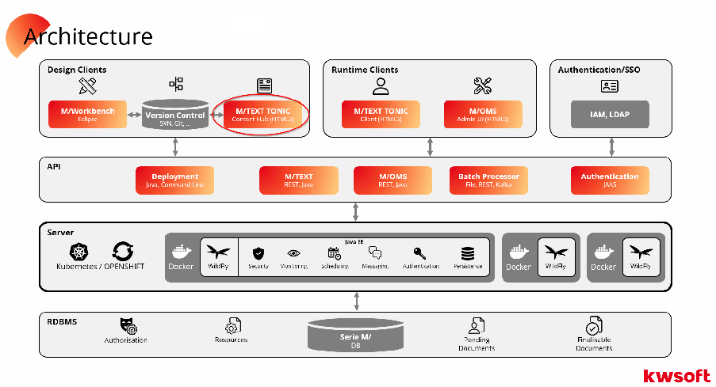

Funktional reiht sich das Redaktionssystem M/TEXT TONIC Content Hub zwischen M/Workbench und dem M/TEXT TONIC Anwendereditor ein. Es stellt eine Mischung aus funktional reduzierter M/Workbench und funktional erweitertem M/TEXT TONIC Anwendereditor dar. M/TEXT Content Hub kann für verschiedene Betriebsmodi konfiguriert werden:

- • Git-Modus: Dieser Modus ist flexibler und ermöglicht die meisten realen, komplexen Anwendungsfälle. Im Git-Modus können Nutzer gleichzeitig und wahlweise auf verschiedenen Git-Featurebranches arbeiten und Ressourcen darin ändern. Zum Betrieb dieses Modus wird eine Git-Hosting-Plattform benötigt.
- • Datenbank-Modus: Dieser Modus ermöglicht die Bearbeitung von Ressourcen in nur einem einzigen zugeordneten Branch im Versionsverwaltungssystem. In diesem Modus ist Content Hub fest mit diesem Branch verbunden, das heißt, Feature-Branches werden nicht unterstützt. Damit eignet sich dieser Modus für einfachere Bearbeitungs-Workflows.

Content Hub wird fest für einen Betriebsmodus konfiguriert und verhält sich je nach Betriebsmodus leicht unterschiedlich. Die Unterschiede werden in den folgenden Kapiteln dargestellt.

#### 3.2 Der Ressourcen-Workflow in ContentHub

Die Ressourcenentwicklung und das Ressourcen-Deployment in der Serie M/ basieren auf der Ressourcenablage in einem Versionsverwaltungssystem mit konfigurierter RepositorySynchronisation. Dieses Verfahren stellt ein elementares Konzept der Serie M/ dar. Der Zugriff auf Ressourcen im Versionsverwaltungssystem im Kontext von Content Hub wird über das Repository-Synchronisationsskript gesteuert.

Für Ressourcen, die im fachlichen Redaktionsprozess bearbeitet werden, gelten die gleichen Anforderungen an Versionierung und Deployment wie für die Ressourcen des technischen Redaktionsprozesses in M/Workbench. Damit die im fachlichen Redaktionsprozess geänderten Ressourcen nahtlos in bestehende Prozesse und Verfahren integriert werden können, basiert auch die Ressourcenpflege im Redaktionssystem M/TEXT TONIC Content Hub auf dem Versionsverwaltungssystem, welches auch M/Workbench zugrunde liegt.

Zu Beginn der Bearbeitung von Ressourcen durch Content Hub wählt der Textredakteur eine Ressource aus der Projektstruktur aus. Je nach Betriebsmodus (Git/Datenbank) stammen die gelesen Ressourcen entweder aus einem Git-Branch oder direkt aus dem Serie M/ Ressourcenspeicher; dies wird im Anschluss erklärt. Unterschiedliche Ressourcen können von verschiedenen Textredakteuren gleichzeitig bearbeitet werden.

Bearbeitet ein Benutzer eine Ressource, so bleibt diese bis zur Änderungsveröffentlichung oder bis zum Rückgängigmachen der Änderungen für andere Content-Hub-Benutzer gesperrt. Die vorgenommenen Änderungen sind bis zur Änderungsveröffentlichung nur für den ändernden Benutzer sichtbar.

Geänderte Ressourcen werden bis zur Veröffentlichung in speziellen Änderungstabellen der Serie M/ Datenbank als sog. Overlay-Ressourcen gespeichert und überlagern für den ändernden Benutzer die entsprechenden Originalressourcen. Andere Content-Hub-Benutzer sehen während dieser Zeit weiterhin die Original-Ressource.

Die Veröffentlichung von bearbeiteten Ressourcen erfolgt mit einem Assistenten, mit dem die zu veröffentlichenden Ressourcen ausgewählt werden können, um den abschließenden Commit im Versionsverwaltungssystem anzustoßen. Der zugehörige Commit-Kommentar wird vom Benutzer abgefragt.

Die Veröffentlichung bewirkt ein Aufheben der Sperre und einen Commit in das zugeordnete Versionsverwaltungssystem. Von dort gelangen die geänderten Ressourcen über die regulären Ressourcen-Deployment-Prozesse (Repository Synchronisation) in den Ressourcenspeicher der Serie M/ Datenbank und erzeugen eine neue Version der Originalressource.

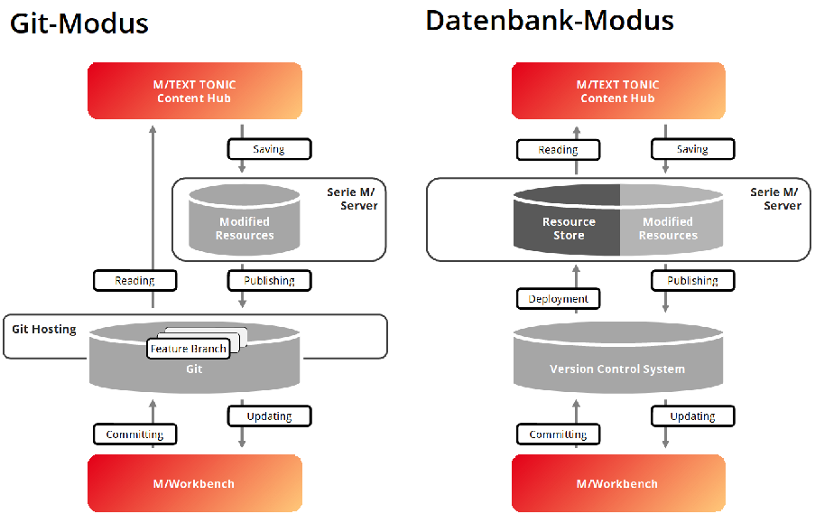

######### Der Datenfluss beider Varianten wird im Folgenden erläutert.

##### 3.2.1 Ressourcen-Workflow im Git-Modus

Zum Zugriff auf die Serie M/ Projektstruktur und die darin enthaltenen Ressourcen greift M/TEXT TONIC Content Hub im Git-Modus lesend auf einen (oder mehrere) Branches in einem (oder mehreren) Git-Repositories über die HTTP API des Git-Hosts zu. Diese Repositories müssen über eine Git Hosting Lösung zur Vergügung gestellt werden.

Solange der Benutzer an einer Ressource in Content Hub arbeitet, werden die Änderungen an Ressourcen in der M/TEXT Server-Datenbank zwischengespeichert. Wenn der Benutzer die Änderungen veröffentlicht, schreibt Content Hub die geänderten Ressourcen direkt in den GitBranch zurück, von dem sie gelesen wurden. Dies geschieht über ein Git Commit.

Die Konfiguration des anzuschließenden Versionsverwaltungssystems erfolgt in einer Sicht in M/Workbench. Hier werden die Einstellungen für die Git-Hosting-Plattform und die Repositories angegeben, auf die Content Hub Zugriff erhält. Die Vergabe von speziellen Leseund Schreibrechten für einzelne Nutzer oder Rollen erfolgt über M/User.

##### 3.2.2 Ressourcen-Workflow im Datenbank-Modus

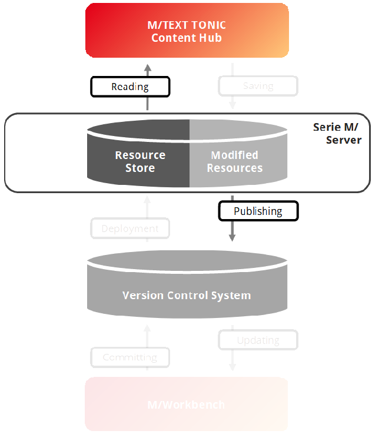

Im Datenbank-Modus liest Content Hub die zur Bearbeitung angebotenen Ressourcen direkt aus

- dem Serie M/ Ressourcenspeicher aus.

Content Hub synchronsiert sich im Datenbank-Modus mit genau einem Branch im angebundenen Versionsverwaltungssytem. Dieser Branch ist fest konfiguriert und bildet in diesem Modus die Basis für die Ressourcen-Bearbeitung.

Das Repository wie auch der Branch sind in der Konfigurationsdatei server.ini konfigurierbar.

######## Verwendung von Projekten aus unterschiedlichen Branches

Komplexere Umgebungen sind so aufgebaut, dass die M/TEXT-Projekte auf unterschiedliche Repositories oder Repository-Branches verteilt sind und bei der Repository-Synchronisation zusammengeführt werden. Für diese Szenarios empfehlen wir die Verwendung des Git-Modus (siehe Abschnitt 3.2.1, „Ressourcen-Workflow im GitModus“).

Falls Sie den Git-Modus nicht nutzen können (z. B. wenn ein anderes VCS zum Einsatz kommt), so können Sie diese Arbeitsweise auch mithilfe eines angepassten RepositorySynchronisationsskriptes umsetzen.

#### 3.3 Der Git-Modus

##### 3.3.1 Voraussetzungen zur Nutzung des Git-Modus

- • M/TEXT-Projekte müssen in einem oder mehreren Git-Repositories vorliegen.
- • Die Repositories müssen auf einer unterstützten Git-Hosting-Plattform gehostet werden: GitHub cloud/enterprise, GitLab cloud/self-hosted, Gitea cloud/self-hosted (Open-source).
- • Die Git-Hosting-Plattform muss über HTTP(S) vom Content Hub-Server aus zugänglich sein.
- • Es muss möglich sein, die Git-Repositories über HTTP(S) zu klonen.

##### 3.3.2 Details zum Git-Modus

Einbinden mehrerer Repositories

- • Sie können mit Projekten aus mehreren Repositories arbeiten, z. B. wenn Sie die Projekte aus jeder Abteilung in einem separaten Repository halten. Alle Projekte aus den konfigurierten Repositories werden vom Content Hub-Server kombiniert und dem Endbenutzer wie in einem einzigen Arbeitsbereich präsentiert.
- • Es ist möglich, gleichzeitig verschiedene Git-Hosting-Plattformen für verschiedene Repositories zu verwenden (z. B.: einige Repositories in GitHub und andere in GitLab).
- • Projektname-Konflikte: Im Gegensatz zum Datenbank-Modus wird der Benutzerarbeitsbereich im Git-Modus dynamisch basierend auf den in der Content Hub VCS-Konfiguration angegebenen Repositories und den vom Benutzer ausgewählten Branches zusammengesetzt.

Dabei kann es technisch vorkommen, dass ein Projekt gleichen Namens in mehreren Repositories vorliegt. Content Hub kann solche Konflikte nicht auflösen und lässt die Auswahl einer solchen Konstellation in der Anwenderoberfläche nicht zu.

Berechtigungsverwaltung

• Die Benutzerberechtigungen für die angeschlossenen Repositories werden mit M/USERMechanismen zugewiesen (pro Rolle oder pro Benutzer), z. B. können Sie einige Repositories nur lesend nutzen lassen oder Sie verweigern einem Benutzer oder einer Benutzerrolle den Zugriff auf einige Repositories.

Arbeiten mit mehreren Branches

- • In der Content Hub-Oberfläche werden den Benutzern alle vorhandenen Branches aus dem Git-Repository angeboten und Benutzer können direkt in der Benutzeroberfläche frei den Branch wechseln, an dem sie arbeiten.
- • Bearbeitete/gesperrte Ressourcen bleiben ihrem Git-Branch zugeordnet und werden nur innerhalb dieses Branches gesperrt. (z. B.: wenn der Benutzer eine Ressource in einem Branch bearbeitet/sperrt und zu einem anderen Branch wechselt, bleibt die Sperre (und die Änderungen) im ursprünglichen Branch erhalten. In weiteren Branches ist die Ressource dann nicht gesperrt).

Sichtbarkeiten von Projekten, Ordnern und Dateien in der Content Hub Anwenderoberfläche

- • Die Sichtbarkeiten unterscheiden sich zwischen Datenbank-Modus und Git-Modus. In beiden Modi sieht der Benutzer eine "gefilterte" Sicht und nicht alle Ordner und Dateien, die physisch im VCS-Workspace liegen, der konkret angewendete Filter unterscheidet sich aber:
- • Da im Datenbank-Modus nur Ressourcen aus dem Serie M/ Ressourcen-Speicher sichtbar sind, werden keine Ressourcen angezeigt, die bereits vom Aktivierungsprozess oder der Repository-Synchronisation ausgeschlossen wurden.
- • Der Git-Modus arbeitet direkt mit den ungefilterten Dateien im Git-Repository.

Um Verwirrung bei der Anzeige in Content Hub zu vermeiden, werden dieselben "Standard"Verzeichnisse und -Dateien herausgefiltert, wie es der Aktivierungsprozess tun würde (z.B. Ordner .settings, Datei .XXX.template.testcases, …).

Das Filtern sichtbarer Ressourcen für die Anwenderoberfläche in Content Hub mithilfe der Datei .repositorySynchronisation.ignored wird aktuell noch nicht unterstützt (Stand Version 6.15).

Das Verfahren zum Ausschluss von Ressourcen während der RepositorySynchronisation wird im Handbuch Ressourcenverwaltung in der Serie M/ beschrieben.

Speicherkonfiguration im Content Hub-Server

- • Content Hub hält Ressourcen aus Git in einem Cache. Stellen Sie sicher, dass die Arbeitsspeicher-Größe des Content Hub Servers ausreicht.
- • Generell wird empfohlen, den maximalen Speicher des Servers höher zu konfigurieren als die Größe des Arbeitsbereichs.

Einschränkungen

- • Das Einfügen von Bausteinen mithilfe des Bausteinsuchbaums wird in der Content Hub-Anwenderoberfläche derzeit nicht unterstützt. Bausteine können nur aus dem projektbasierten Einfügedialog eingefügt werden.
- • Anpassungen der Anwenderoberfläche, die in der Datei default.contenthub.layout.xml definiert sind, werden nicht automatisch aktualisiert, wenn ein Branch gewechselt wird. Die Einstellungen des anderen Branches können in der Oberfläche angewendet werden, indem Sie zum gewünschten Branch wechseln und die Anwendung im Browser neu zu laden (F5). Einzig Anpassungen der Farben werden sofort angewendet.
- • Die Liste der Branches wird nur einmal geladen, wenn die Anwenderoberfläche im Browser geladen wird. Um neue Branches angezeigt zu bekommen, müssen Sie die Anwenderoberfläche neu laden (F5).
- • Zur Konfiguration der Benutzerrechte auf ein Projekt (in der Sicht Redaktionsberechtigungen in M/Workbench) ist es notwendig, dass das Projekt im Serie M/ Ressourcenspeicher aktiviert ist.

Es ist geplant, die Notwendigkeit der Aktivierung des Arbeitsbereichs in einer zukünftigen Version zu entfernen und stattdessen Content Hub-Ordner für die Konfiguration der redaktionellen Rechte zu verwenden (Stand Version 6.15).

- • Einschränkungen bei der möglichen Länge von Host/Repository/Branch-Namen: Content Hub verwendet die Tabelle mxcs_overlay_folders in der M/TEXT-Datenbank, um virtuelle Ordnernamen zu speichern, die als <host id>:<repo id>:<branch name> konstruiert werden. Der virtuelle Ordnername darf nicht länger sein als:

|Datenbank|maximale Länge des virtuellen Ordnernamens|
|---|---|
|PostgreSQL|128 Zeichen|

|Datenbank|maximale Länge des virtuellen Ordnernamens|
|---|---|
|DB2|254 Zeichen|
|SQLServer|254 Zeichen|
|Oracle|254 Zeichen|

Automatische Synchronisation mit dem Git-Repository

- • Während des Betriebs wird das Git-Repository auch auf das Dateisystem des Content HubServers geklont, um kostspielige Übertragungen großer Blobs über HTTP zu vermeiden und die Leistung zu verbessern. Dieser Klonvorgang kann unter Umständen eine längere Zeit in Anspruch nehmen. Bis der Vorgang abgeschlossen ist, verwendet der Content Hub-Server HTTP-API-Anfragen, um die Ressourcen abzurufen.

Derzeit wird nur der HTTP-Transport für das Klonen von Git-Repositories unterstützt. Die Unterstützung für das Klonen über SSH ist für eine zukünftige Version geplant.

- • Zusätzlich zum geklonten Dateisystem des Workspace verwaltet Content Hub einen InMemory-Cache des geklonten Workspace-Zustands.
- • Um externe Änderungen im Git-Repsitory zeitnah zu erkennen, führt Content Hub zu bestimmten Schlüsselereignissen einen Abgleich durch. Diese Schlüsselereignisse sind:
- • wenn Projekte in den Projekt-Explorer geladen werden
- • wenn ein Benutzer eine Vorlage im Editor öffnet

Wenn eine Änderung erkannt wird, aktualisiert Content Hub den Arbeitsbereich im Hintergrund. Dieser Vorgang kann eine bemerkbare Zeit in Anspruch nehmen (insbesondere für große Arbeitsbereiche mit einer hohen Anzahl von Änderungen). Webclients werden mit

- dem alten Arbeitsbereich bedient, bis das Update abgeschlossen ist.

Ratenbegrenzung der HTTP-API

- • Cloud-basierte Git-Hosting-Plattformen implementieren normalerweise eine Ratenbegrenzung für ihre HTTP-APIs, um zu vermeiden, dass ihre Server von den Benutzern überlastet werden.

Die Grenzen sind spezifisch für jede Git-Hosting-Plattform, aber im Allgemeinen werden diese Grenzen für einen bestimmten Zeitraum (z. B.: eine Stunde) für jeden Benutzer gemessen. GitHub erlaubt einem Benutzer beispielsweise, 5000 HTTP-APIAnfragen pro Stunde durchzuführen. Für selbstgehostete Lösungen ist es in der Regel möglich, diese Grenzen bei Bedarf zu erhöhen.

Content Hub muss HTTP-API-Aufrufe durchführen, die diesen Ratenbeschränkungen unterliegen. Um diese Beschränkungen zu umgehen, verwendet der Content Hub-Server wann immer möglich einen auf dem Server geklonten Git-Repository-Mirror. Die lokale Kopie kann jedoch für bestimmte Operationen nicht verwendet werden, wie z. B. das Überprüfen, ob ein lokaler Branch auf dem neuesten Stand ist, für das Auflisten von Remote-Branches oder das Committen.

|Git-Host-Plattform|Mindestversion|Ratenbegrenzung|
|---|---|---|
|GitHub Cloud|API 2022-11-28|5 000 Anfragen / 1 Stunde Online-Dokumentation|
|GitHub Enterprise Server|3.11 (API 2022-11-28)|15 000 Anfragen / 1 Stunde Online-Dokumentation|
|GitLab|API v4|Online-Dokumentation|

|Git-Host-Plattform|Mindestversion|Ratenbegrenzung|
|---|---|---|
|GitLab für Unternehmen|17.1|Dokumentation für allgemeine Limits, Repository-API-Limits  |
|Gitea (selbst gehostet)|1.22.1|Keine Ratenbegrenzung|
|Gitea Cloud|1.22.1|Nicht dokumentiert|

- • Auf einigen Git-Hosting-Plattformen (GitHub) werden ETags genutzt, um zu vermeiden, dass API-Anfragen, die keine neuen Daten abgerufen haben, auf das Ratenlimit angerechnet werden.
- • Für einige Git-Hosting-Plattformen ist es möglich, die aktuellen Ratenlimit-Zähler für einen Benutzer über Content Hub einzusehen (siehe Abschnitt 6.6, „Diagnose-Daten des Content Hub ausgeben“).

### 4. Installation und Setup

Im Folgenden wird die Installation des M/TEXT TONIC Content Hub beschrieben sowie die Einrichtung der M/TEXT TONIC Content Hub Anwenderoberfläche. Eine Checkliste zur Einrichtung von M/TEXT TONIC Content Hub finden Sie unter Abschnitt 4.9, „Checkliste zur Einrichtung von Content Hub“.

#### 4.1 Systemanforderungen

|Unterstütze Datenbanken|PostgreSQL, DB2, Oracle, SQLServer|
|---|---|
|Unterstütze Anwendungsserver|WildFly|

#### 4.2 Ablauf der Installation

##### 4.2.1 Assemblierung

Bei der Assemblierung von M/TEXT TONIC Content Hub mit dem Assembly Tool muss die Produktkomponente contenthub in das Property installer.product der Datei profile.properties aufgenommen werden.

|installer.product=mtext,moms,contenthub|
|---|

- • Die Skripte für die Erstellung der MXCS_OVERLAY_* Tabellen werden als Ergebnis der Assemblierung geliefert, wenn das Modul contenthub angegeben wurde. Eine entsprechende Schemaanpassung muss dann noch erfolgen.
- • Zwischen den verschiedenen ausgelieferten GA-Versionen und insbesondere zwischen verschiedenen Releases können immer wieder neue Properties dazukommen. Daher empfehlen wir grundsätzlich, eine neue "Vorlagendatei" profile-template.properties zu erstellen und diese dann in profile.properties umzubenennen, um sie für die Assemblierung zu verwenden.

###### 4.2.1.1 Loggingeinträge von Content Hub

Folgende Logging-Einträge werden für Content Hub durch das Assembly Tool generiert:

[Logging|Appender|ContentHub] class=org.apache.log4j.FileAppender

[Logging|Appender|ContentHub|options] Append=true File=${CSHome}/contenthub.log Layout=fileLayout

[Logging|Logger|de|kwsoft|mtext|tonic|contenthub] Appender=ContentHub

Level=TRACE

Detaillierte Information zum Thema Logging finden Sie in der in der Referenz 'Die Konfigurationsdateien der Serie M/' im Kapitel "Logging-Einstellungen"

##### 4.2.2 Konfigurationsparameter

In der Datei server.ini wird angegeben, ob M/TEXT TONIC Content Hub im Datenbank-Modus (DBMODE) oder im Git-Modus (GITMODE) betrieben wird. Wenn kein Wert angegeben ist, verwendet das System den Datenbank-Modus.

|[Tonic|ContentHub] BackendMode=DBMODE | GITMODE|
|---|

Für den Datenbank-Modus wird außerdem ein Eintrag benötigt, der die URL des angebundenen Repositories angibt. Diese URL wird bei der Kommunikation mit dem RepositorySynchronisationsskript als Parameter ${repositoryUrl} übergeben.

|[Tonic|ContentHub] RepositoryURL=<URL>|
|---|

Die Einstellungen zum Versionskontrollsystem und zur Git-Hosting-Plattform werden für den GitModus nicht in der server.ini, sondern in einem Editor in M/Workbench vorgenommen.

Für den Git-Modus können Sie optional einen Verzeichnispfad angeben, in dem der Content Hub-Server Remote-Repositories klont. Wenn dieser Pfad nicht angegeben wird, verwendet Content Hub standardmäßig den Ordner, der unter [M/TEXT] Work angegeben ist, in dem der Unterordner contenthub_repo_cache erstellt wird.

|[Tonic|ContentHub] MirrorCachePath=/tmp/mirror_cach_temp|
|---|

Der Eintrag MirrorCachePath muss auf einen leeren Ordner verweisen, dessen Inhalt von Content Hub gelöscht werden kann, um veraltete Repositories zu entfernen, wenn sich die VCS-Konfiguration ändert.

###### 4.2.2.1 Konfiguration der Referenzsuche

Für Anwenderinnen und Anwender von Content Hub ist eine Referenzsuche sehr hilfreich. Mit dieser können sie leicht herausfinden, in welchen Vorlagen (bzw. Bausteinen) Bausteine verwendet werden. So können sie vermeiden, dass sich Änderungen an ungeplanter Stelle auswirken. Für die Konfiguration der Referenzsuche in Content Hub muss eine SuchmaschinenInstanz vorhanden sein: Entweder ElasticSearch oder OpenSearch. Content Hub benötigt alle Indizes-Berechtigungen (indices privileges) in der Suchmaschinen-Instanz.

- Des Weiteren werden die folgenden Einträge in der Datei server.ini benötigt:

|[Tonic|ContentHub|ReferenceSearch] EngineURL=<URL> AuthMode=NONE | BASIC | BEARER | ELASTIC_APIKEY | ELASTIC_OAUTH_CLIENT_CREDENTIALS AuthUser=<user> AuthPass=<password> AuthToken=<token> IndexNamePrefix=<prefix>|
|---|

Geben Sie unter EngineURL die URL der Suchmaschinen-Instanz an, die Sie verwenden wollen. Geben Sie unter IndexNamePrefix einen Präfix an, der für die Indizes der Content Hub-Instanz

verwendet werden soll (z. B. contenthub-ref-search). Geben Sie unter AuthMode die Methode der Authentifizierung an der Suchmaschine an. Die folgende Liste gibt Details zu den möglichen Werten:

- • NONE - keine Authentifizierung
- • BASIC - Anmeldung mit User und Passwort. Diese geben Sie an unter AuthUser und AuthPass.
- • BEARER - Verwendung von OAuth Bearer Token / Service Token

Die Erstellung und Erneuerung von Token werden in der Suchmaschine vorgenommen. Den Token geben Sie unter AuthToken an.

Hinweise zur Erstellung von Token in ElasticSearch finden Sie hier: https:// www.elastic.co/guide/en/elasticsearch/reference/current/security-api-get-token.html und https://www.elastic.co/guide/en/elasticsearch/reference/current/security-apicreate-service-token.html

- • ELASTIC_APIKEY

Diese Möglichkeit gilt nur für ElasticSearch. Die Erstellung und Erneuerung von "Api Keys" wird in der Suchmaschine vorgenommen. Den "Api Key" geben Sie unter AuthToken an.

Hinweise zur Erstellung von "Api Keys" in ElasticSearch finden Sie hier: https:// www.elastic.co/guide/en/elasticsearch/reference/current/security-api-create-apikey.html

- • ELASTIC_OAUTH_CLIENT_CREDENTIALS

Diese Möglichkeit gilt nur für ElasticSearch. Die Erstellung und Erneuerung von Client Credentials für OAuth wird in der Suchmaschine vorgenommen. Diese geben Sie unter AuthUser und AuthPass an.

Hinweise zur Erstellung von Client Credentials für OAuth in ElasticSearch finden Sie hier: https://www.elastic.co/guide/en/elasticsearch/reference/current/security-api-gettoken.html

##### 4.2.3 Datenbank einrichten

Content Hub braucht zusätzliche Tabellen, um die bearbeiteten Ressourcen vorübergehend zu speichern. Solche Tabellen beginnen mit dem Präfix mxcs_overlay_*.

Das Assembly-Tool generiert die DDL-Skripte *CreateOverlayTables.sql und

*CreateOverlayTriggers.sql zum Anlegen dieser Tabellen.

Wie auch M/TEXT verfügt auch M/TEXT TONIC Content Hub über ein Datenbankschema mit einer Versionsnummer. Beide Systeme verwenden unterschiedliche Versionsnummern.

Die Content Hub-Anwendung wird als WAR mtextTonicContentHub.war in das EAR gepackt und greift auf die Datenbanktabellen zu, indem sie die vom Anwendungsserver bereitgestellte DataSource nutzt. Die Verbindungsinformationen kommen aus der M/TEXT Standard-Datenbank.

|[MTextServer|Database] Database=postgresql DBSchema=mtext|
|---|

#### 4.3 Einrichten von Versionsverwaltungs-Systemen im Kontext von Content Hub

Um die geänderten Ressourcen von Content Hub an das Versionsverwaltungssystem/Version Control System (VCS) weiterzugeben, muss das System den Speicherort des VCS-Repositorys kennen, und im Serie M/ Server muss ein mit Ihrem VCS kompatibles Skript zur RepositorySynchronisierung eingerichtet sein.

Die Kommunikation mit dem Versionsverwaltungssystem wird über das RepositorySynchronisationsskript gesteuert. Dieses enthält spezielle ANT-Targets für den Betrieb des Content Hub.

##### 4.3.1 Im Git-Modus

Die Konfiguration der angebundenen Repositories im Git-Modus findet in der Sicht Content Hub VCS-Konfiguration in M/Workbench statt. Die Sicht ist Teil der Perspektive M/User. Hier geben Sie alle Git-Hosts und Repositories an, auf die Content Hub zugreifen darf.

Die Einstellungen der Repositories werden auf die M/User-Benutzer und -Rollen angewendet. Einstellungen in Bezug auf Berechtigungen, Autorisierung, Benutzerinfo oder den StandardBranch können auf Benutzer- oder Rollenebene überschrieben werden. Diese werden über das Attribut VCSConfig eines M/User-Benutzers bzw. einer M/User-Rolle festgelegt (zum Anlegen des Attributs siehe Abschnitt 4.4.4, „Benutzerindividuelle Anpassung der VCS-Konfiguration für den Git-Modus“).

###### 4.3.1.1 Git-Host- und Repository-Konfigurationseigenschaften

Die globale Konfiguration in der Sicht Content Hub VCS-Konfiguration beschreibt alle möglichen Repositories, die für den Content Hub-Server zugänglich sind, und definiert alle notwendigen Eigenschaften jedes einzelnen. Die Konfiguration ist hierarchisch: Git-Hosts müssen zuerst definiert werden, und dann können spezifische Repositories für jeden Host definiert werden. GitHosts und Repositories können nur in der globalen VCS Konfiguration definiert werden.

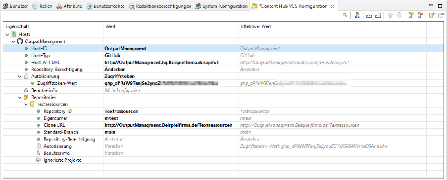

Werden Werte von geerbten Werten überschrieben, wird dies in der Spalte Effektiver Wert dargestellt:

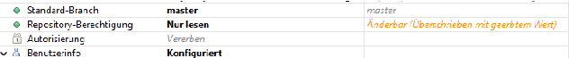

####### 4.3.1.1.1 Host-Konfigurationseigenschaften

|Eigenschaftsname|Beschreibung|
|---|---|
|Host-ID|Ein beliebiger Bezeichner für die Git-Hosting-Plattform. Es sind nur die Zeichen a-z,A-Z,0-9,-,_ erlaubt.|
|Host-Typ|Bestimmt, welche API-spezifische Implementierung zur Kommunikation mit dem Git-Host verwendet wird. Mögliche Optionen sind gitea, gitlab, github.|
|Host-API-URL|Die Base-URL des API-Endpunkts des Hosts. Für CloudHosting-Plattformen sind diese z. B.: https://gitea.com/api/v1, https://gitlab.com/api/v4, https://api.github.com.  Für eine selbst gehostete Installation muss ein Administrator eine entsprechende URL bereitstellen.|
|Repository-Berechtigung|Steuert redaktionelle Rechte für alle Repositories auf diesem Host. Diese Standardberechtigungen können für jedes Repository überschrieben werden.  Mögliche Werte sind:  • Nicht zugreifbar: Projekte aus dem Repository sind im Content Hub-Arbeitsbereich des Benutzers nicht vorhanden. Im Dialog zum Wechseln des Branches werden die Repositories dieses Hosts nicht angezeigt. Content Hub verhält sich, als ob die Projekte im Repository nicht existieren. • Nur lesen: Projekte aus dem Repository sind für den Benutzer sichtbar, aber keine der darin enthaltenen Ressourcen können geändert werden • Änderbar: Projekte sind für den Benutzer sichtbar und Ressourcen darin können gesperrt und geändert werden |
|Benutzerinfo|Standardeinstellungen für alle Benutzer, die diesen Host verwenden  Definiert den Git-Benutzernamen und die GitBenutzer-E-Mail, die verwendet werden, um den Commit durchzuführen, wenn ein Benutzer geänderte Ressourcen veröffentlicht. Diese Eigenschaften unterstützen Variablen ,die eine Zuordnung zu M/User-Benutzerattributen ermöglichen (z. B. können Sie für die Benutzer-E-Mail eingeben: ${name}.${lastName}@mycompany.de).  In der Regel ist es auch möglich, diese Eigenschaften leer zu  lassen, und die Git-Hosting-Plattform füllt sie automatisch aus, wobei davon ausgegangen wird, dass der Besitzer des Autorisierungstokens der Git-Committer ist.|

|Eigenschaftsname|Beschreibung|
|---|---|
|Autorisierung|Siehe Abschnitt 4.3.1.2, „Authentifizierungs- und Autorisierungskonfiguration“, Standardeinstellungen für alle Benutzer, die diesen Host verwenden  |

####### 4.3.1.1.2 Repository-Konfigurationseigenschaften

|Eigenschaftsname|Beschreibung|
|---|---|
|Repository-ID|Der Name/ID des Repositories auf der Git-Hosting-Plattform, muss genau übereinstimmen (z. B.: mymtextrepo)|
|Clone-URL|Die URL, von der aus es möglich ist, das Repository mit Git zu klonen (z. B.: http://github.com/myorg/mymtextrepo.git)|
|Standard-Branch|Der Branch, mit dem die Content Hub Anwenderoberfläche startet (es sei denn, der Benutzer wählt einen anderen Branch aus)|
|Repository-Berechtigung|Steuert redaktionelle Rechte nur für das entsprechende Repository,überschreibt Host-Standardeinstellungen  Mögliche Werte sind:  • Nicht zugreifbar: Projekte aus dem Repository sind im Content Hub-Arbeitsbereich des Benutzers nicht vorhanden. Im Dialog zum Wechseln des Branches wird das Repository nicht angezeigt. Content Hub verhält sich, als ob die Projekte im Repository nicht existieren. • Nur lesen: Projekte aus dem Repository sind für den Benutzer sichtbar, aber keine der darin enthaltenen Ressourcen können geändert werden • Änderbar: Projekte aus dem Repository sind für den Benutzer sichtbar und Ressourcen darin können gesperrt und geändert werden.   Durch die Vergabe projektspezifischer BenutzerBerechtigungen kann die Anzahl der änderbaren Projekte weiter eingeschränkt werden (siehe Abschnitt 4.4.2, „Projektspezifische Benutzer-Berechtigungen“).  |
|Benutzerinformationen|Informationen nur für Benutzer, die das entsprechende Repository verwenden (überschreibt HostStandardeinstellungen)  Definiert den Git-Benutzernamen und die GitBenutzer-E-Mail, die verwendet werden, um den Commit durchzuführen, wenn ein Benutzer geänderte Ressourcen veröffentlicht. Diese Eigenschaften unterstützen Variablen ,die eine Zuordnung zu M/User-Benutzerattributen ermöglichen (z. B. können Sie für die Benutzer-E-Mail eingeben: ${name}.${lastName}@mycompany.de).  In der Regel ist es auch möglich, diese Eigenschaften leer zu  lassen, und die Git-Hosting-Plattform füllt sie automatisch aus, wobei davon ausgegangen wird, dass der Besitzer des Autorisierungstokens der Git-Committer ist.|

|Eigenschaftsname|Beschreibung|
|---|---|
|Autorisierung|Siehe Abschnitt 4.3.1.2, „Authentifizierungs- und Autorisierungskonfiguration“, gilt nur für die Verwendung dieses Repositories (überschreibt HostStandardeinstellungen)  |
|Ignorierte Projekte|Bei der Verwendung mehrerer Repositories im Content Hub Git-Modus kann es vorkommen, dass es Top-LevelProjekte oder -Ordner mit demselben Namen in mehreren verwendeten Repositories gibt. In einigen Fällen sind die kollidierenden Projekte für M/TEXT nicht relevant. Für diese Fälle ist es hier möglich, Projekte aus der Verwendung in Content Hub auszuschließen. Ignorierte Projekte werden von Content Hub beim Laden der Projektliste für ein Repository nicht berücksichtigt.|
|Eigentümer*|Speziell für gitea und github Der Wert muss mit dem Besitzer des Repositories übereinstimmen (Benutzername oder Organisationsname z. B. myorg)|
|Projekt-ID*|Speziell für gitlab Der Wert muss mit der Projekt-ID von gitlab übereinstimmen (z. B.: 54389137) Sie finden die Angabe in GitLab unter Projekte – Projekt auswählen – Weitere Aktionen – – Projekt-ID kopieren.  |

###### 4.3.1.2 Authentifizierungs- und Autorisierungskonfiguration

Die Eigenschaft Autorisierung in der Content Hub VCS-Konfiguration bestimmt das Authentifizerungs- und Autorisierungsverfahren bei Zugriff auf einen bestimmten Host oder ein Repository. Möglich sind die Werte OAuth2 oder Zugriffstoken.

OAuth ermöglicht es dem Nutzer, sich bei der ersten Nutzung gegenüber dem Authentifizierungsserver zu authentifizieren, wobei intern ein temporäres Zugriffstoken erstellt wird. Über dieses Zugriffstoken wird der Zugriff auf das Git-Repository gewährt. OAuth ist die bevorzugte Art, um Content Hub-Benutzern Zugriff auf Git-Repositories zu gewähren.

Zugriffstoken ermöglichen den Zugriff vom Content Hub Server auf Repositories auf der GitHosting-Plattform mithilfe eines vorab bei der Git-Hosting-Plattform erstellten Tokens. Hierbei geschieht die Benutzer-Authentifizierung vorab in der Git-Hosting-Plattform und der Benutzer erhält ein Autorisierungs-Token, das ihm im Content Hub dauerhaft den Zugriff auf seine Ressourcen ermöglicht, ohne dass sich der Benutzer jedes Mal authentifizieren muss.

Standardmäßig werden die Authentifizierungs- und Autorisierungsinformationen in M/Workbench konfiguriert.

Für Test-Zwecke kann die Autorisierungsmethode über die Content Hub Benutzeroberfläche umgeschaltet und ein Zugriffstoken hinterlegt werden. Dieses wird vom System bevorzugt angewendet, auch wenn die Authentifizierungs-/AutorisierungsMethode in M/Workbench anders konfiguriert ist.

Der entsprechende Dialog geht beim Start von Content Hub automatisch auf, wenn Authentifizierungs-/Autorisierungsinformationen auf Repositories nicht konfiguriert

sind oder fehlschlagen. Dieses über die Oberfläche eingegebene Zugriffstoken wird in einem Cookie gespeichert. Um es zu entfernen, löschen Sie bitte dieses Cookie.

####### 4.3.1.2.1 OAuth

OAuth-Autorisierungsabläufe gewähren einer Client-Anwendung eingeschränkten Zugriff auf geschützte Ressourcen auf einem Ressourcenserver, hier dem Git-Repository.

######## 4.3.1.2.1.1 OAuth mit Content Hub einrichten und verwenden

- 1. Zuerst ist es notwendig, eine OAuth-Anwendung auf der Git-Hosting-Plattform zu erstellen. Dies sollte vom Administrator der Git-Hosting-Plattform durchgeführt werden, der die OAuth-Anwendung für die gesamte Organisation erstellen kann.
- 2. Der Administrator beschreibt dann die OAuth-Anwendung in der Content Hub VCS Konfiguration wie in Abschnitt 4.3.1.2.1.2, „OAuth Konfigurationseigenschaften“ beschrieben.

- 3. Benutzer, die sich zum ersten Mal bei Content Hub anmelden, sehen einen "AuthDialog". Der Dialog zeigt eine Liste der konfigurierten Repositories mit der ausgewählten Authentifizierungsmethode an. Im Falle von OAuth muss der Benutzer manuell auf die Schaltfläche Autorisieren klicken.
- 4. Der OAuth-Flow wird gestartet und der Benutzer wird zur Git-Hosting-Plattform weitergeleitet.
- 5. Der Benutzer muss sich bei der Git-Hosting-Plattform anmelden.
- 6. Die Git-Hosting-Plattform fordert den Benutzer auf, Berechtigungen für die von der OAuthAnwendung angegebenen Ressourcen zu gewähren.
- 7. Wenn der Benutzer die Berechtigungen gewährt, wird er zurück zu Content Hub weitergeleitet und kann mit der Arbeit beginnen.

######## 4.3.1.2.1.2 OAuth Konfigurationseigenschaften

Die Möglichkeiten, Anforderungen und Konfiguration von OAuth-Apps variieren je nach GitHosting-Plattform. Es ist möglich, eine OAuth-Anwendung für eine gesamte Organisation (bevorzugt) oder für einzelne Benutzer (zum Testen) zu erstellen.

|Eigenschaft|Beschreibung|
|---|---|
|Client-Secret|Ein "Geheimnis", das nur Content Hub und dem Autorisierungsserver (Git-HostingPlattform) bekannt ist. Das "Geheimnis" wird bei der Erstellung der OAuth-Anwendung generiert.|
|Client-ID|Die ID der OAuth-Anwendung auf dem Autorisierungsserver (Git-Hosting-Plattform), die bei der Erstellung der OAuth-Anwendung generiert wird.|
|Autorisierungs-URI|Die URI der Git-Hosting-Plattform, bei der der OAuth-Flow gestartet wird|

|Eigenschaft|Beschreibung|
|---|---|
| |  https://github.com/login/oauth/ authorize  https://gitlab.com/oauth/authorize https://gitea.com/login/oauth/authorize|
|Zugriffstoken-URI|Die URL der Git-Hosting-Plattform, auf der der OAuth-Code-Austausch stattfindet (diese URL muss vom Content Hub-Server aus zugänglich sein)    https://github.com/login/oauth/ access_token  https://gitlab.com/oauth/token https://gitea.com/login/oauth/ access_token|
|Endpunkt-Redirect-URI|Die URI des Content Hub-Servers, zu dem der Benutzer nach der Erteilung der Berechtigungen auf der Git-Hosting-Plattform weitergeleitet wird (diese URL muss vom Browser des Benutzers aus zugänglich sein).    https://example.com/contenthub/app/ oauth/github/callback  https://example.com/contenthub/app/ oauth/gitlab/callback  https://example.com/contenthub/app/ oauth/gitea/callback  Es ist auch möglich, nur den Pfad zu Content Hub als Redirect-URI anzugeben. Auf diese Weise wird Content Hub den Host-Teil der URL aus dem Browser des Benutzers nehmen und eine absolute Redirect-URI konstruieren, wenn der Benutzer die Autorisierung aus dem AuthDialog startet.  Diese Funktion ermöglicht es Benutzern, eine Instanz von Content Hub aus mehreren Netzwerken zu öffnen, in denen Content Hub unter verschiedenen URLs zugänglich sein könnte, z. B.: aus dem internen Firmennetzwerk unter http://  intranet.example.com/contenthub und aus dem Internet unter https://example.com/contenthub.    /contenthub/app/oauth/github/callback /contenthub/app/oauth/gitlab/callback /contenthub/app/oauth/gitea/callback|

######## 4.3.1.2.1.3 Beispiel: Einrichten von Gitea OAuth

- Beispiel 1: Gitea OAuth App für die Organisation

- 1. Öffnen Sie in Gitea Seitenadministration – Integrationen – Anwendungen (http://gitea.com/ admin/applications)

- 2. Aktivieren Sie die Option Vertraulicher Client.
- 3. Unter URIs für die Weiterleitung werden "erlaubte" URIs angegeben, zu denen der Benutzer weitergeleitet werden kann. Hier ist die Angabe mehrerer URIs erlaubt. Sie können z. B. mehrere Content Hub URIs angeben, wenn die Benutzer sowohl aus einem internen als auch aus einem externen Netzwerk verbinden.

http://10.0.0.150/contenthub/app/oauth/gitea/callback http://example.com/contenthub/app/oauth/gitea/callback

Beachten Sie, dass Content Hub nur zu URIs weiterleitet, die in der Content Hub VCSKonfiguration durch Endpunkt-Redirect URI angegeben sind.

- Beispiel 2: Gitea OAuth App für einen Benutzer

- 1. Öffnen Sie in Gitea Einstellungen – Anwendungen (http://gitea.com/USER/settings/ applications).
- 2. Setzen Sie den Wert für URIs für die Weiterleitung wie im vorigen Beispiel beschrieben.
- 3. Aktivieren Sie die Option Vertraulicher Client.
- 4.3.1.2.1.4 Einrichten von GitHub OAuth

Die GitHub App ist ausgefeilter als die (GitHub) OAuth App. Sie erlaubt mehrere Redirect URIs, die Installation für alle oder ausgewählte Repositories und die Begrenzung des Zugriffs auf IPBereiche. Sie sollten die GitHub App der OAuth App vorziehen, wenn möglich.

Die GitHub OAuth App stellt kein Refresh-Token zur Verfügung, das bedeutet, wenn der Zugriffstoken abläuft, kann Content Hub den Zugriffstoken nur erneuern, wenn der Benutzer noch in seinem GitHub-Konto im selben Browser angemeldet ist.

Beispiel: GitHub OAuth App

- 1. Gehen Sie in GutHub zu Settings – Developer settings – OAuth Apps– New OAuth App (https:// github.com/settings/developers).

- 2. Setzen Sie die Callback URI auf z. B.: https://example.com/contenthub/app/oauth/github/ callback. Es wird nur eine einzelne URL unterstützt.
- 3. Deaktivieren Sie die Option Enable Device Flow.
- 4. Home page URL sollte auf Content Hub verweisen (nicht erforderlich) Beispiel: GitHub App

- 1. Öffnen Sie auf GitHub Settings – Developer settings – GitHub Apps – New GitHub App (https:// github.com/settings/apps).

- 2. Setzen Sie den Wert für Callback URI auf z. B. https://example.com/contenthub/app/oauth/ github/callback. Es werden mehrere Redirect URIs unterstützt.
- 3. Aktivieren Sie die Option Expire user authorization tokens. Dadurch wird ein Refresh-Token bereitgestellt.

- 4. Deaktivieren Sie die Option Request user authorization (OAuth) during installation.
- 5. Deaktivieren Sie die Option Enable Device Flow.
- 6. Wählen Sie im Tab Permissions & Events – Repository permissions – Contents: Read and Write Save changes.
- 7. Wählen Sie im Tab Install App die erstellte Anwendung und installieren Sie sie - entweder für alle oder nur für die ausgewählten Repositories.

- 4.3.1.2.1.5 Einrichten von GitLab OAuth Beispiel: GitLab OAuth App (Benutzer)

- 1. Gehen Sie in GitLab zu Einstellungen – Anwendungen – Neue Anwendung hinzufügen (https:// gitlab.com/-/user_settings/applications).

- 2. Setzen Sie den Wert für Redirect URI auf z. B. https://example.com/contenthub/app/oauth/ gitlab/callback.
- 3. Aktivieren Sie die Option Confidential.
- 4. Setzen Sie die Scopes api, read_repository, write_repository.
- 5. Speichern Sie die Anwendung.

####### 4.3.1.2.2 Zugriffstoken

Zugriffstoken können auf der Git-Hosting-Plattform von einem Administrator oder sogar von den Benutzern selbst generiert werden, wobei nur die absolut notwendigen Berechtigungen für den Betrieb des Content Hub zugewiesen werden.

Es ist abzuwägen, ob ein einziges, übergreifendes Zugriffstoken für alle Benutzer des Content Hub verwendet werden soll oder ob für jeden Benutzer ein eigenes Token erstellt wird. Beide Varianten haben Vor- und Nachteile.

Die sicherste Variante ist die, dass je Nutzer ein eigenes Token verwendet wird. Dabei entsteht allerdings ein höherer Aufwand bei der Generierung der Tokens und der Einrichtung des Content Hub für jeden Nutzer.

Die Nutzung eines einzigen, übergreifenden Zugriffstokens ist einfacher zu konfigurieren, kann allerdings ein Sicherheitsrisiko sein, da der Zugriff nicht benutzerspezifisch entzogen werden kann. Außerdem teilen in dieser Variante alle Benutzer dieselben Ratenbegrenzungs-Zähler und können schnell die Ratenbegrenzung erreichen.

Im Folgenden werden die wichtigsten Punkte bei der Erstellung von Zugriffstoken beispielhaft für verschiedene Git-Hosting-Plattformen erläutert.

######## 4.3.1.2.2.1 Beispiel: GitHub persönliche Zugriffstoken

Bei GitHub ist möglich, entweder "classic" Token oder "fine-grained" (engl. feingranular) Token zu verwenden. Letztere bieten eine bessere Kontrolle über Berechtigungen, z. B. ist es mit einem feingranularen Token möglich, nur Zugriff auf die ausgewählten Repositories zu gewähren.

- 1. Öffnen Sie die GitHub-Einstellungen Settings – Developer settings – Personal Access Tokens– Tokens: classic (https://github.com/github/settings/tokens) und erstellen Sie einen neuen Token.

- 2. Erforderliche Bereiche: repo
- 3. Ablaufdatum nach Bedarf festlegen
- 4.3.1.2.2.2 Beispiel: GitLab persönliche Zugriffstoken

- 1. Öffnen Sie die Einstellungen Einstellungen – Zugriffstoken – Neues Token hinzufügen (https:// gitlab.com/-/user_settings/personal_access_tokens.

- 2. Erforderliche Bereiche api, read_repository, write_repository

######## 4.3.1.2.2.3 Beispiel: GitLab Repository Zugriffstoken

- 1. Öffnen Sie Projekte – <Projekt auswählen> – Weitere Aktionen – – Projekteinstellungen – Zugriffstoken (https://gitlab.com/-/user_settings/personal_access_tokens)

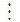

- 2. Erforderliche Bereiche api, read_repository, write_repository

######## 4.3.1.2.2.4 Beispiel: Gitea Zugriffstoken

- 1. Öffnen Sie die Einstellungen Einstellungen – Anwendungen – Zugriffstoken verwalten (https:// gitea.com/USER/settings/applications).
- 2. Erforderliche Berechtigungen repositories : read/write

##### 4.3.2 Im Datenbank-Modus

Folgende Einstellungen müssen für den Betrieb von Content Hub im Datenbank-Modus vorgenommen werden:

- 1. Konfigurieren der Repository-URL in der server.ini

|[Tonic|ContentHub] RepositoryURL=http://some.repo.xyz/seriem.git (1)|
|---|

(1) URL eines VCS-Repositories, in das Content Hub die Commits mit den Änderungen überträgt. Die URL dieses Repositories muss die gleiche sein wie die für die RepositorySynchronisation verwendete.

Die Repository-URL wird von Content Hub im Datenbank-Modus benötigt. Wenn Content Hub Teil des EAR-Deployments ist, wird diese Eigenschaft beim Start des M/TEXT-Servers überprüft und verhindert, dass der M/TEXT-Server startet, wenn sie fehlt.

- 2. Es können Benutzerdefinierte Eigenschaften wie folgt in der server.ini konfiguriert werden. Die benutzerdefinierten Eigenschaften sind ein Mechanismus, der es dem Skript für die Repository-Synchronisierung ermöglicht, flexibler zu sein, indem er es den Benutzern ermöglicht, Variablen aus der server.ini (oder M/Workbench) an das Skript für die Repository-Synchronisierung zu übergeben, bevor es ausgeführt wird.

|[Tonic|ContentHub|Repository] (1) custom.branch=master (2) custom.username=mtext|
|---|

- (1) Benutzerdefinierte Eigenschaften können in der server.ini definiert werden. Diese Eigenschaften werden beim Veröffentlichen an das Skript für die RepositorySynchronisierung übergeben. Die benutzerdefinierte Eigenschaft muss mit dem Präfix custom beginnen.
- (2) Sie können auf die benutzerdefinierte Eigenschaft aus dem Skript zur RepositorySynchronisierung verweisen, z. B. über ${custom.branch} oder ${custom.username}.

Unser Standard-Skript erwartet für GIT den Branch wie in (2) angegeben. Für SVN wird der Branch mit der URL übergeben. Im Datenbank-Modus ist jede Content Hub-Instanz an ein Repository gebunden und überträgt Änderungen nur an einen Branch in diesem Repository. Sowohl das Repository als auch der Branch sind in der server.ini konfigurierbar. Mit Hilfe der Repository-Synchronisation ist es möglich, die Server- (bzw. Content Hub-) Datenbank aus verschiedenen Branchen aufzubauen, wobei das Committen immer in den konfigurierten Branch geht.

Ob eine benutzerdefinierte Eigenschaft erforderlich oder optional ist, hängt davon ab, ob sie vom Skript für die Repository-Synchronisierung referenziert wird und ob das Skript ohne sie ausgeführt werden kann.

Über den Dialog zur Repository-Synchronisation in M/Workbench können Sie die Werte für jede benutzerdefinierte Eigenschaft in einem Dialogfeld eingeben.

- 3. Skript zur Repository-Synchronisierung anpassen: Informationen zur Anpassung des Repository-Synchronisationsskriptes finden Sie im Abschnitt 4.3.3, „Konfiguration des Repository-Synchronisationsskriptes“.

- 4.3.3 Konfiguration des RepositorySynchronisationsskriptes

Der Zugriff auf Ressourcen im Versionsverwaltungssystem im Kontext von Content Hub wird über das Repository-Synchronisationsskript gesteuert. Das heißt, sowohl für lesende als auch für schreibende Aktionen stehen im Repository-Synchronisationsskript eigene Ant-Targets zur Verfügung, die im Zuge der Content Hub Konfiguration angepasst werden.

Im Zuge der Einführung des M/TEXT TONIC Content Hubs hat kwsoft® notwendige Erweiterungen am Standard-Repository-Synchronisierungsskript vorgenommen, die nachfolgend näher erläutert werden.

Skript zur Repository-Synchronisierung anpassen:

- • Sie können M/TEXT TONIC Content Hub mit jedem Versionsverwaltungsystem benutzen. Für den Git-Modus ist die Nutzung von Git Voraussetzung. Die Kommunikation erfolgt äquivalent zur Repository-Synchronisation über ein ANT-Skript. kwsoft® liefert ein Standardskript aus für Subversion und für Git. Dieses Skript kann entsprechend Ihren Anforderungen angepasst werden. Das mit der Serie M/ ausgelieferte Standardskript beinhaltet die Ant-Targets: checkout, reset, info, commit, handlePublishError.
- • Das Standardskript für SVN und Git kann mit M/Workbench erstellt werden. Wenn Sie einige benutzerdefinierte Änderungen in Ihrem bestehenden Skript vorgenommen haben, müssen Sie diese Änderungen manuell mit dem neuen Standardskript zusammenführen.

Siehe hierzu auch Kapitel "Repository-Synchronisation" im Handbuch 'Ressourcenverwaltung in der Serie M/'

- • In den von kwsoft® ausgelieferten Skripten müssen Anpassungen vorgenommen werden. In der Regel ist es mindestens notwendig, den Benutzer anzupassen (usr/pwd).
- • Es ist möglich, den Pfad des Dump-Root, in dem Veröffentlichungsfehler-Dumps gespeichert werden, mit der Ant-Eigenschaft errorDumpRoot zu setzen. Standardmäßig ist es auf das Content Hub-Arbeitsverzeichnis des Benutzers eingestellt.

Oft wird bei der Repository Synchronisation der Zugriff auf das VCS-Repository auf dem Server ohne Zugangsdaten durchgeführt und ist daher read-only. Schreibzugriff wird für die Repository-Synchronisation nicht benötigt.

M/TEXT TONIC Content Hub dagegen braucht Schreibberechtigung im Versionsverwaltungssystem. Stellen Sie daher sicher, dass das Skript mit den angegebenen Anmeldeinformationen auf dem VCS Schreibberechtigung hat.

###### 4.3.3.1 Hinweise zur Anpassung des Standard-Skriptes

Wir empfehlen, das Versionsverwaltungssystem so zu konfigurieren, dass es die Zeilenenden von Textdateien bei der Übergabe oder beim Klonen/Auschecken NICHT umwandelt. Dies ist wichtig, um Konflikte bei der Veröffentlichung von Änderungen durch Content Hub zu vermeiden.

Wenn die in der Datenbank aktivierte Datei Endungen im Linux-Stil hat, die gleiche Datei aus dem VCS-Repository aber Endungen im Windows-Stil hat, kommt es zu einem Konflikt, der den Veröffentlichungsvorgang von Content Hub stoppt. In einer Produktionsumgebung sollte es ausreichen, sicherzustellen, dass das VCS auf einem Rechner (Server), der die Repository-Synchronisation und die Veröffentlichungsoperationen von Content Hub durchführt, Zeilenumwandlungen vermeidet.

####### 4.3.3.1.1 AntGitTasks Plugin für Ant

Statt der Installation nativer Git-Binärdateien auf dem Server wird das Ant-Plugin AntGitTasks, welches Java-Git-Implementierung nutzt, verwendet. Die Dokumentation für das Plugin finden Sie in M/TEXT docs/AntGitTasks unter .AntGitTasks Plugin für Ant.

Wenn Sie Git als VCS mit dem Standardskript verwenden wollen, fügen Sie mtext-jgit als Komponente dem Property installer.product der Datei profile.properties hinzu.

####### 4.3.3.1.2 Laufzeitfehlerbehandlung

Die Ausführung des Synchronisationsskripts für die Interaktion mit dem VCS ist eine wichtige Aufgabe für den Veröffentlichungsprozess von Content Hub. Wenn während der Skriptausführung ein Fehler auftritt - z. B. beim Lesen des Repository oder beim Commit - muss Content Hub eine entsprechende Information darüber erhalten.

Exit-Codes und Ausgaben von Ant-Tasks, die native Tools oder Java-Klassen aufrufen/ ausführen, müssen daher in speziellen Ant-Eigenschaften erfasst/umgeleitet werden, die dieser Namenskonvention folgen:

|Ausgabetyp|Muster|Beschreibung|
|---|---|---|
|output (stdout)|log.<targetName>Out*|Die Ausgabe wird im Serverlog protokolliert.|
|error output (stderr)|log.<targetName>Err*|Wenn Content Hub hier eine Ausgabe feststellt, geht es davon aus, dass während der Ausführung ein Fehler aufgetreten ist, und hält den Veröffentlichungsprozess an.|
|exit code|log.<targetName>Result*|Wenn etwas auf die Ergebniseigenschaft gesetzt wird und nicht Code 0 ist, wird der Veröffentlichungsprozess gestoppt.|

- • Optimale Konfiguration von Git
- • Stellen Sie sicher, dass die Git Eigenschaft core.autocrlf auf false gesetzt ist. Wenn Sie Content Hub auf Windows betreiben und Git-for-Windows verwenden, ist diese Eigenschaft standardmäßig auf true gesetzt.
- • Das von M/TEXT TONIC Content Hub verwendete Repository sollte ein "bare" Repository sein. Das Commiten in ein Repository mit Working-Tree kann zu unerwarteten Zuständen im Working-Tree führen.
- • Das Standardskript für die Git-Repository-Synchronisierung prüft, ob die Einstellung core.autocrlf nicht aktiviert ist und ob das ein "bare"-Repository ist (wenn die URL auf das Dateisystem zeigt).

Diese Prüfung wird bei Ausführung des info target vorgenommen, bevor das commit target ausgeführt wird.

Schlägt die Prüfung fehl, wird die Ausführung des Ant-Skripts unterbrochen und keine Übergabe durchgeführt. Dies kann deaktiviert werden, indem man verifyGitConfig auf false setzt oder direkt checkRepo konfiguriert. (siehe dazu auch die Dokumentation von mtextAntGitTasks)

- • Optimale Konfiguration von SVN
- • Vergewissern Sie sich, dass Ihr SVN-Client keine automatische Konvertierung von Zeilenenden durchführt. Dies wird normalerweise konfiguriert mit svn:eol-style . Diese Eigenschaft sollte in Ihrem SVN-Repository nicht gesetzt sein.

####### 4.3.3.1.3 Automatische Repository-Synchronisierung nach einem Commit

In gewissen Umgebungen (z. B. Entwicklungs- oder Test-Stages) kann es gewünscht sein, dass unmittelbar nach der Übermittlung von geänderten Ressourcen in das Versionsverwaltungssystem auch eine Repository-Synchronisierung durchgeführt wird.

Das von kwsoft® ausgelieferte Ant-Skript berücksichtigt diesen Anwendungsfall. Über das AntProperty autoRepoSync=true kann gesteuert werden, dass die Repository-Synchronisierung nach dem Commit automatisch ausgeführt werden soll.

Content Hub führt nach jedem erfolgreichen Commit das Ant-Target afterCommit aus.

Generell sollte berücksichtigt werden, dass zusätzliche Aufgaben, die nach dem Commit auszuführen sind, nur durch eine Änderung des afterCommit-Targets in das Skript aufgenommen werden und nicht durch Änderung des commit-Targets selbst.

#### 4.4 Benutzerverwaltung

Um M/TEXT TONIC Content Hub verwenden zu können, muss ein Benutzer verschiedene Berechtigungen besitzen.

Zur Anmeldung an Content Hub, müssen dem Benutzer über Eigenschaften - M/TEXT in der M/User-Perspektive in M/Workbench die Rechte Zugriff über Server-API und Redaktionsoberfläche verwenden zugewiesen werden.

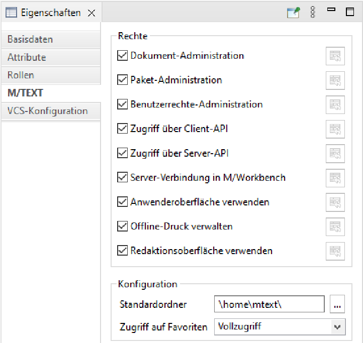

##### 4.4.1 Allgemeine Benutzer-Berechtigungen

Für die Benutzung von Content Hub können weitere Berechtigungen bestimmt werden, die die allgemeinen Zugriffsmöglichkeiten auf Ressourcen in Content Hub regeln.

Diese Berechtigungen werden über Attribute des Benutzers in M/User in M/Workbench gesetzt. Per Default sind diese Attribute auf "Nein" eingestellt.

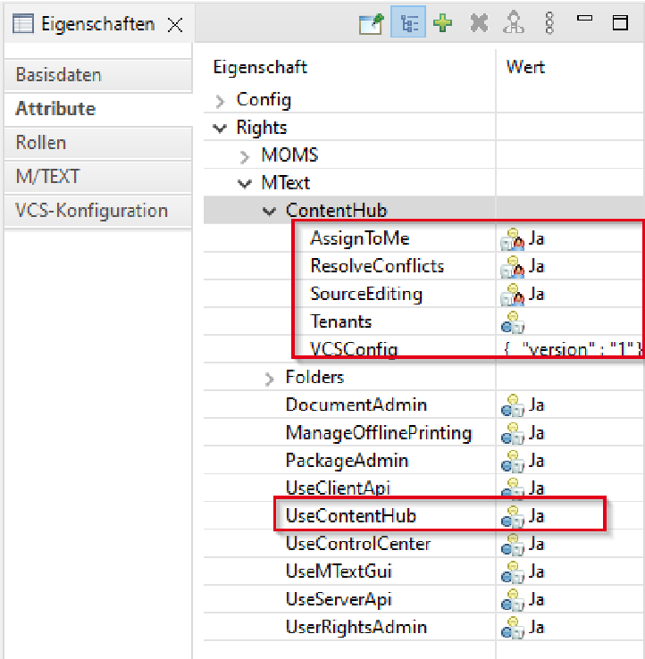

######### Der folgenden Tabelle können Sie alle Attribute mit der dazugehörigen Erläuterung entnehmen:

|Berechtigungen|Beschreibung|
|---|---|
|Mir zuordnen (AssignToMe)|Ist diese Berechtigung aktiviert, kann ein Benutzer die unveröffentlichten Änderungen eines anderen Content Hub-Benutzers übernehmen und weiter bearbeiten.|
|Konflikte auflösen (ResolveConflicts)|Wenn eine Content Hub-Ressource während der Veröffentlichung in einen Konflikt gerät, können Benutzer mit dieser Berechtigung mit der rechten Maustaste auf die Ressource im Projekte-Panel klicken und "Als gelöst markieren" aufrufen, um die konfliktbehaftete Ressource zu verwerfen und die Ressource freizuschalten.|
|_rightsContentHub|Benutzer können Rechte auf bestimmte Ordner erhalten (siehe Abschnitt 4.4.2, „Projektspezifische Benutzer-Berechtigungen“). Zur Speicherung dieser Zugriffsrechte gibt es das Attribut  _rightsContentHub. Dieses Attribut liegt unter Folders > library und enthält die Standard-Zugriffsrechte für den gesamten Arbeitsbereich. Alle Projekte und Unterordner erben die Zugriffsrechte aus diesem Eintrag.  Ändern Sie die Zugriffsrechte für einen anderen Ordner über Redaktionsberechtigungen, so erscheint ein weiterer _rightsContentHub-Eintrag. Der dazugehörige Wert ergibt sich aus den Feldern Änderung und Ordner anzeigen in der Ansicht Redaktionsberechtigungen.|

|Berechtigungen|Beschreibung|
|---|---|
| |  Nehmen Sie hier keine Änderungen an den Attributen vor, sondern ausschließlich über die Ansicht Redaktionsberechtigungen.|
|Content Hub verwenden (UseContentHub)|Legt fest, ob ein Benutzer Content Hub überhaupt verwenden kann.|

##### 4.4.2 Projektspezifische Benutzer-Berechtigungen

Einem Benutzer können projektspezifische Rechte vergeben werden. So kann gesteuert werden welche Projekte ein Benutzer bearbeiten kann bzw. welche Projekte ihm innerhalb Content Hub angezeigt werden.

Die Berechtigungsvergabe erfolgt auf Ebene von M/TEXT-Projekten. Berechtigungen, die auf Ebene des Wurzelprojekts (Projekte) vergeben wurden, vererben sich an Kindprojekte und können dort explizit erweitert oder eingeschränkt werden.

Für Multi-Mandanten-Szenarien: Redaktionsberechtigungen müssen für Fragmentprojekte nicht explizit vergeben werden. Eine Angabe des Tenants im Bereich Attribute des Benutzers ist ausreichend, damit der Benutzer im entsprechenden Fragment-Projekt Änderungen vornehmen kann (siehe Abschnitt 4.4.3, „Konfiguration für Multi-Mandanten-Szenarien“).

Die Redaktionsberechtigungen-Ansicht, über die diese Einstellungen vorgenommen werden, ist Teil der M/User Perspektive.

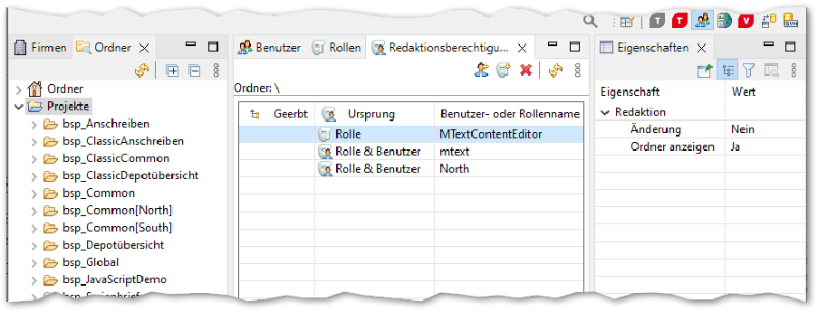

|Berechtigungen|Beschreibung|
|---|---|
|Änderung|Gibt an, ob der Benutzer in dem Projekt Ressourcen ändern darf.|
|Ordner anzeigen|Gibt an, ob der Projektordner für den Benutzer im Content Hub-Projektfenster sichtbar ist.    Es sind nur Anwendungsprojekte sichtbar.|

Falls die Ansicht Redaktionsberechtigungen nicht sichtbar ist, kann sie über Fenster Sicht anzeigen - Andere - Redaktionsberechtigungen eingeblendet werden. Sollte dies nicht funktionieren, kann es notwendig sein, die Perspektive zurückzusetzen (Fenster -

Perspektive - Perspektive zurücksetzen).

Wenn Sie ältere M/User-Benutzerdefinitionen aus einer XML importieren, prüfen Sie, ob die Content Hub-Berechtigung erstellt wurde. Falls nicht, wählen Sie Projekte und weisen jedem Benutzer manuell Berechtigungen zu.

Im Git-Modus können Sie zusätzlich zu den projektspezifischen BenutzerBerechtigungen Berechtigungen für die Repositories vergeben (siehe Abschnitt 4.3.1.1, „Git-Host- und Repository-Konfigurationseigenschaften“). Content Hub gewährt Zugriff auf Projekte nur dann, wenn dieser sowohl in den repositroryspezifischen Berechtigungen, als auch in den projektspezifischen Berechtigungen vergeben sind

##### 4.4.3 Konfiguration für Multi-Mandanten-Szenarien

Damit ein Benutzer in einem mandantenspezifischen Fragment-Projekt arbeiten kann, braucht er die entsprechenden Rechte. Fügen Sie dem Benutzer unter Attribute – MText – ContentHub – Tenants die Mandanten hinzu, für die er arbeiten darf (z. B. Mandant North).

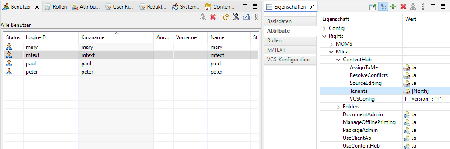

Wenn ein Benutzer berechtigt sein soll, im Stammprojekt (BASE) zu arbeiten, geben Sie ihm die entsprechende Redaktionsberechtigung im Wurzelprojekt Projekte (siehe Abschnitt 4.4.2, „Projektspezifische Benutzer-Berechtigungen“). Hat der Benutzer keine Änderungsrechte für das Stammprojekt, so kann er nur im Fragment-Projekt für seinen Mandanten arbeiten.

Ein mögliches Vorgehen ist, in M/User eine Rolle für alle Content Hub-Benutzer einzuführen. Dieser Rolle und all ihren Angehörigen werden auf Projekte-Ebene keine Bearbeitungsrechte eingeräumt. So können die Benutzer keine Änderungen an Stammprojekten vornehmen. Wenn Sie den Content Hub-Benutzern dann im Bereich Attribute Tenants/Mandanten zuweisen, so können die Benutzer Ressourcen für den Mandanten öffnen. Dazu müssen die Projekte, in denen die Ressourcen liegen, sowie die Vorlage, aus der heraus gearbeitet werden soll, entsprechend konfiguriert werden (siehe Abschnitt 4.5, „Projekte und Vorlagen einrichten für Mandanten“).

Soll ein Benutzer Änderungsrechte in einem Stammprojekt erhalten, müssen diese zusätzlich über die Redaktionsberechtigungen des Projekts zugewiesen werden.

##### 4.4.4 Benutzerindividuelle Anpassung der VCS-Konfiguration für den Git-Modus

Die grundsätzliche Konfiguration der Git-Repositories für Content Hub im Git-Modus wird in

- der Sicht Content Hub VCS-Konfiguration vorgenommen (siehe Abschnitt 4.3.1, „Im Git-Modus“).

Die hier eingestellten Berechtigungen, Zugangsdaten etc. werden an alle Rollen und Benutzer vererbt.

Wenn ein Benutzer oder eine Gruppe von Benutzern (vertreten durch eine Rolle) Zugriff auf eine andere Menge von Repositories, eine andere Autorisierung oder andere GitBenutzeranmeldeinformationen benötigt, legen Sie dies in der VCS Konfiguration des ausgewählten Benutzers bzw. der ausgewählten Rolle fest.

Um auf den Benutzer VCS Konfigurationseditor von M/Workbench zuzugreifen:

- 1. Öffnen Sie die Perspektive M/User.
- 2. Wählen Sie die Sicht Benutzer bzw. die Sicht Rollen.
- 3. Wählen Sie den gewünschten Benutzer oder die gewünschte Rolle aus.
- 4. Wählen Sie in der Sicht Eigenschaften die Registerkarte VCS-Konfiguration aus. Die Beschreibung der möglichen Werte für die Eigenschaften finden Sie unter Abschnitt 4.3.1.1, „Git-Host- und Repository-Konfigurationseigenschaften“.

- 4.5 Projekte und Vorlagen einrichten für Mandanten

Content Hub kann für Multi-Mandanten-Szenarien konfiguriert werden. In M/Workbench müssen dazu nicht alle Fragment-Projekte einzeln angelegt werden. Es genügt in den Projekteigenschaften die möglichen Mandanten vorzubereiten. Die mandantenspezifischen Fragment-Projekte können dann von Content Hub automatisch angelegt werden. Das Vorgehen wird im Folgenden erklärt.

Es sollten jene Projekte mandantenspezifisch eingerichtet werden, in denen übergeordnete Ressourcen liegen. Dies können Basis- oder Framework-Projekte sein. Weitere Informationen zum Konzept der Fragment-Projekte finden Sie im Handbuch Ressourcenverwaltung in der Serie M/.

Um zwischen mehreren Mandanten auswählen zu können, brauchen Sie ein Metadatum, das

- den Mandanten enthält, den sogenannten Mandantenselektor (z. B. $Metadata.Tenant). Die Option Ins Dokument übernehmen muss aktiviert sein.

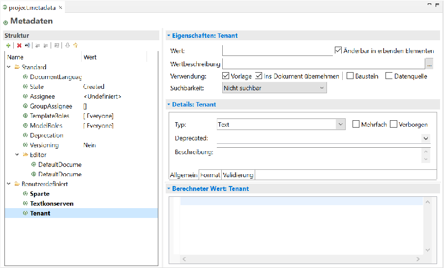

In den Projekteigenschaften des Projektes, das mandantenfähig sein soll, muss dieser Datenmodellknoten als Mandantenselektor referenziert werden (Projekteigenschaften - M/TEXT Projekt). Als Mandanten werden die möglichen Mandanten angegeben. Dies gilt auch für Projekte, die mandantenfähige Grafiken enthalten.

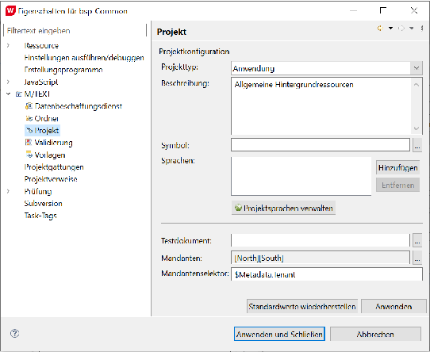

In der Vorlage, die für unterschiedliche Mandanten genutzt werden soll, muss auf Dokumentebene unter Eigenschaften - Fragmente der Mandantenselektor (z. B. $Metadata.Tenant) ausgewählt werden.

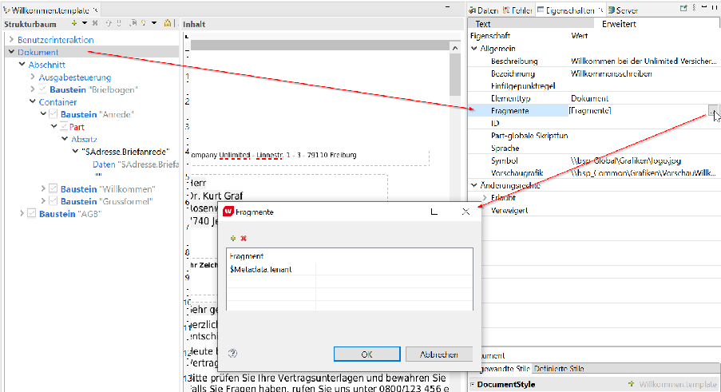

Beachten Sie, dass Referenzen auf Bausteine und andere Ressourcen für das Arbeiten mit Fragment-Projekten bzw. Mandanten relativ sein müssen.

#### 4.6 Editiervorlagen einrichten

Es besteht die Möglichkeit, Bausteine im Content Hub zu editieren. Dafür kann der Baustein entweder in eine Vorlage eingefügt und dort geändert werden. Bei Bausteinen, die standardmäßig nicht in einer Vorlage enthalten sind, sondern erst bei Bedarf eingefügt werden, ist es für eine Content Hub-Benutzerin komfortabler, wenn der Baustein auch direkt geöffnet werden kann, ohne den Umweg über eine Vorlage nehmen zu müssen. Diese Möglichkeit können Sie schaffen, indem Sie Editiervorlagen bereitstellen. Editiervorlagen bieten einem Baustein einen Kontext, in dem er angezeigt wird. Sie enthalten neben einem Briefpapier auch die passende Datenversorgung. Wenn eine Content Hub-Redakteurin an einem Baustein in einer Editiervorlage arbeitet, kann sie nur den Baustein verändern. Die Editiervorlage ist zwar im Editorbereich sichtbar, jedoch nicht änderbar. Im Bereich Struktur sind nur die Strukturelemente des Bausteins abgebildet.

Editiervorlagen werden in M/Workbench erstellt und verwaltet. Eine Anleitung dazu finden Sie im Handbuch 'M/Workbench für M/TEXT' im Abschnitt "Editiervorlagen".

#### 4.7 Benutzeroberfläche anpassen

Die Benutzeroberfläche von Content Hub ist konfigurierbar. Dazu muss in M/Workbench eine Datei \\Configuration\ui\default.contenthub.layout.xml im Workspace vorhanden sein. Über das Kontextmenü im Projektexplorer Neu – Andere... – Content Hub Konfiguration wird diese Datei angelegt. Die Konfiguration der Benutzeroberfläche funktioniert analog zu der des M/TEXT TONIC Anwendereditors. Dort wird über die Datei default.editor.layout.xml die Oberfläche angepasst.

Die Nutzung des Kontextobjekts $context wird in Content Hub nicht unterstützt. Die in $context verfügbare Funktionalität ist in vielen Fällen in Content Hub nicht anwendbar. So funktionieren etwa Toolbar-Buttons nicht, in denen $context verwendet wird.

Siehe hierzu das Handbuch M/TEXT TONIC - Textadministration, Kapitel "Editorkonfiguration".

#### 4.8 Automatische Aktualisierung mehrfachreferenzierter Bausteine konfigurieren

Wird ein mehrfach referenzierter Baustein in einer Vorlage verändert, werden standardmäßig alle Referenzen automatisch aktualisiert. Bei komplexen Vorlagen kann dies unter Umständen zu Pewrformance-Problemen führen.

Die automatische Aktualisierung kann in M/Workbench konfiguriert werden.

- 1. Öffnen Sie M/Workbench.
- 2. Öffnen Sie in der Menüleiste Fenster - Einstellungen.
- 3. Wählen Sie M/TEXT TONIC - Content Designer.
- 4. Deaktivieren/aktivieren Sie die Option Automatische Aktualisierung mehrfachreferenzierter Bausteine.

Wird ein mehrfach referenzierter Baustein in einer Vorlage geändert, erscheint ein Hinweis, der auf die notwendige manuelle Aktualisierung des Content Hub Anwendereditors hinweist.

#### 4.9 Checkliste zur Einrichtung von ContentHub

Im Folgenden werden einige Punkte aufgeführt, die bei der Einrichtung von Content Hub zu beachten sind:

######## 1. Komponenten

- a. Fügen Sie den Wert contenthub zum Property installer.product hinzu.
- b. Falls Sie ein Git-Repository verwenden, fügen Sie den Wert mtext-jgit zum Property installer.product hinzu.

######## 2. Datenbank

a. Erstellen Sie die ContentHub-Tabellen mit den mitgelieferten DDL-Skripten

*CreateOverlayTables.sql und *CreateOverlayTriggers.sql im selben Schema wie die M/TEXT-Tabellen.

######## 3. Server Ini

- a. Fügen Sie die Datenbank-Eigenschaften DBSchema und Database zu MTextServer| Database hinzu.
- b. Konfigurieren Sie das Logging.

- c. Legen Sie über [Tonic|ContentHub]BackendMode= fest, ob sie Content Hub im Datenbank-Modus oder im Git-Modus betreiben wollen.
- d. Konfigurieren Sie für den Datenbank-Modus das VCS-Ziel-Repository [Tonic| ContentHub]RepositoryUrl=.
- e. Wenn Sie Git im Datenbank-Modus verwenden und wenn Ihr VCS-RepositoryBranch ein anderer ist als master, konfigurieren Sie ihn mit [Tonic|ContentHub| Repository]custom.branch=.

######## 4. Versionsverwaltungs-System (VCS)

- a. Stellen Sie sicher, dass Ihr VCS die Zeilenenden nicht automatisch konvertiert.
- b. Stellen Sie sicher, dass Ihr VCS-Repository vom Server aus beschreibbar ist.
- c. Konfigurieren Sie das Authentifizierungsverfahren für Content Hub im Git-Modus.

######## 5. M/Workbench

- a. Richten Sie den Zugang des Benutzers zu Content Hub ein, indem Sie ihm das Attribut Serververbindung in M/Workbench geben.
- b. In der Ansicht Redaktionsberechtigungen können Sie die Berechtigungen einrichten.

- i. Stellen Sie sicher, dass der Benutzer mindestens die Berechtigung Ordner anzeigen auf Projekte hat.
- ii. Stellen Sie sicher, dass der Benutzer über die entsprechenden Rechte verfügt, um Ressourcen mit den erforderlichen Eigenschaften zu ändern.
- iii. Stellen Sie sicher, dass der Administrator die Resolve conflicts hat.

- c. Für den Git-Modus beschreiben Sie in der Sicht Content Hub VCS-Konfiguration die GitHosts und Repositories.
- d. Skript zur Repository-Synchronisierung erstellen oder aktualisieren, um mit ContentHub kompatibel zu sein.

- i. Stellen Sie sicher, dass Sie korrekte usr und pwd Anmeldeinformationen für Ihr VCS haben.
- ii. Konfigurieren Sie bei Bedarf ein anderes Verzeichnis für die von Content Hub veröffentlichten Fehlerdumps mit der Ant-Eigenschaft errorDumpRoot. Stellen Sie sicher, dass dieses Verzeichnis auf dem Server beschreibbar ist.

- e. Stellen Sie sicher, dass Ihr Workspace mit Hilfe des RepositorySynchronisierungsskripts in der Datenbank aktiviert ist.

#### 4.10 Aufruf der Content Hub-Anwenderoberfläche

Der Aufruf von M/TEXT TONIC Content Hub erfolgt über die URL http://<hostname>:<portname>/ contenthub.

|http://localhost:8080/contenthub|
|---|

Informationen zum Arbeiten mit Content Hub finden Sie im Handbuch 'M/TEXT TONIC Content Hub - Textadministration'.

### 5. Content Hub Overlay-Ressourcen

Sobald ein Benutzer eine Ressource in M/TEXT TONIC Content Hub bearbeitet, ist diese für andere Benutzer gesperrt und eine benutzerspezifische Kopie der Ressource wird in der Serie M/-Datenbank gespeichert. Das Sperren geschieht automatisch, sobald die erste Änderung an der Ressource vorgenommen wird. Im Projektexplorer und Strukturbaum des Benutzers wird die Vorlage automatisch mit der Markierung Gesperrt versehen.

Will der Benutzer die Vorlage speichern oder schließen, muss er über einen Dialog seine Änderungen entweder speichern oder verwerfen. Wenn mehrere Ressourcen verändert wurden, kann der Benutzer auswählen, welche davon gespeichert und welche zurückgesetzt werden sollen. Werden die Änderungen gespeichert, werden die Ressourcen im Projektexplorer und Strukturbaum mit der Markierung Geändert versehen.

Aus der Sicht eines anderen Content Hub-Benutzers gibt es keinen Unterschied zwischen Ressourcen, die gerade in Bearbeitung sind (Gesperrt) oder solchen, die bereits gespeichert (Geändert) oder veröffentlicht (Warten auf Aktivierung) wurden. Diese Ressourcen sind alle mit einer Markierung versehen, die anzeigt, durch welchen Benutzer die Ressource gesperrt ist. Die folgende Grafik verdeutlicht das.

|Sicht des Benutzers Linus|Sicht eines anderen Benutzers|
|---|---|
|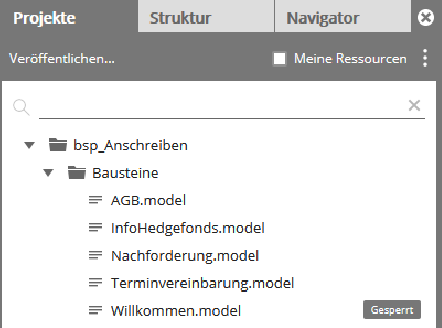|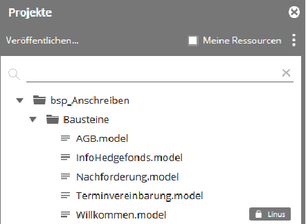|

Gesperrte Ressourcen können von anderen Benutzern nicht bearbeitet werden, außer ein Benutzer besitzt die Berechtigung "Mir zuordnen" (siehe Abschnitt 4.4.1, „Allgemeine BenutzerBerechtigungen“). Dann kann die Sperrung durch diesen Benutzer aufgehoben werden..

Ressourcen sind dann nicht mehr gesperrt, wenn sie

- • im Datenbank-Modus vom Administrator auf den Serie M/ Server übertragen wurden,
- • im Git-Modus an das Versionsverwaltungssystem übertragen wurden,
- • vom Content Hub-Benutzer zurückgesetzt wurden (über Änderungen verwerfen) oder
- • vom Administrator entsperrt wurden (siehe Abschnitt 5.1, „Verwalten von Content Hub Overlay-Ressourcen aus M/Workbench“).

#### 5.1 Verwalten von Content Hub Overlay-Ressourcen aus M/Workbench

Über M/Workbench haben Sie die Möglichkeit, Content Hub-Ressourcen einzusehen und zu verwalten. Beispielsweise können Sie Overlay-Ressourcen entsperren, löschen oder Inhalte im Fall von Konflikten exportieren.

Nutzen Sie hierzu die Sichten Content Hub Ressourcen und Ordner in der Server-Perspektive. In der Sicht Content Hub Ressourcen finden Sie eine Liste aller Content Hub Overlay Ressourcen

(gekennzeichnet mit ), die auf dem Serie M/ Server vorliegen. Im Git-Modus werden die Content Hub Overlay Ressourcen für jeden Branch eines jeden Repositories einzeln angezeigt.

Neben den Content Hub Overlay Ressourcen lassen sich auch "aktive" Ressourcen anzeigen (gekennzeichnet mit ). Die Bedeutung dieses Zustands unterscheidet sich zwischen Content Hub im Datenbank-Modus und im Git-Modus:

- • Im Datenbank-Modus gelten die Ressourcen als aktiv, die über die Repository-Synchronisation in die Datenbank synchronisiert wurden.
- • Im Git-Modus gelten die Ressourcen als aktiv, die in das angeschlossene Versionsverwaltungssystem commited wurden.

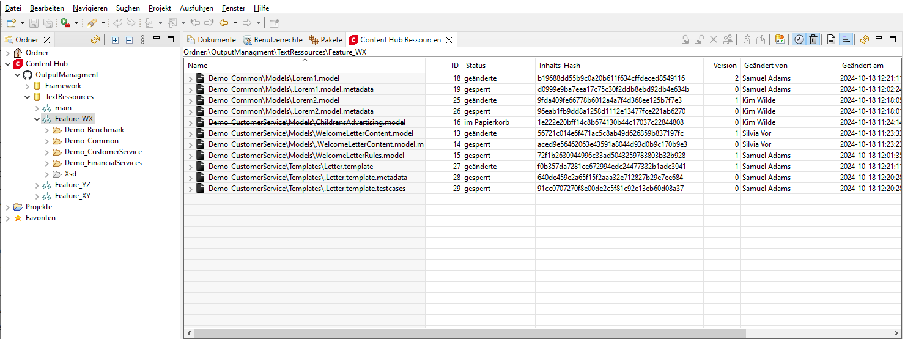

In der Sicht Content Hub Ressourcen können Sie unter anderem den Status und die derzeit aktivierte Version der Ressource einsehen.

Beachten Sie, dass die angezeigte Liste über die Symbolleiste gefiltert werden kann. Die Erläuterungen dazu finden Sie unten.

Sie können u.a. folgende Aktionen auf einzelnen bzw. mehreren Ressourcen durchführen (über die Symbolleiste bzw. das Kontextmenü):

•

Sperren - kann genutzt werden, um Konflikte zu vermmeiden, wenn Sie in M/Workbench Ressourcen verändern wollen, auf die auch Content Hub-Benutzerinnen Zugriff haben.

- • Entsperren - Diese Aktion kann nur auf Content Hub Overlay-Ressourcen angewendet werden. Diese Overlay-Ressourcen werden dann verworfen und damit als Ressourcen im Papierkorb markiert.
- • Versionen aus dem Papierkorb löschen

- • Ressourcen einem Benutzer zuweisen - Diese Aktion ändert den Benutzer in der Spalte Geändert von und kann nur auf Content Hub Ressourcen und nicht auf Versionen angewendet werden.
- • Vergleichen - Sie können entweder zwei Versionen einer Ressource miteinander vergleichen oder eine Ressource mit der aktiven Version der Ressource vergleichen.

•

Exportieren - Diese Aktion kann nur auf Content Hub-Overlay-Ressourcen und deren Versionen angewendet werden. Die Aktion exportiert die Ressourcen in ein Verzeichnis auf Ihrem Computer.

•

Importieren - Diese Aktion wird in der Toolbar aktiviert, wenn ein Projekt oder ein Unterordner des Projekts in der Sicht Ordner ausgewählt ist. Die ausgewählte Datei wird in den Ordner importiert, der in der Sicht Ordner ausgewählt wurde. Es können nur folgende Dateien importiert werden: Bausteine, Vorlagen, .testcase-Datien, .metadata-Dateien, Grafiken.

Aus dem Kontextmenü verhält sich das Importieren anders als aus der Symbolleiste. Sie können über das Kontextmenü nur eine Ressource importieren, die dann als die fokussierte Ressource importiert wird. Wenn eine aktive Ressource fokussiert ist, wird eine neue Content-Hub-Ressource erstellt. Wenn eine Content-Hub-Ressource fokussiert ist, wird sie durch die neue Version überschrieben.

• Den Status einer Content Hub-Ressource können Sie in der Sicht Eigenschaften ändern, wenn die Ressource in der Sicht Content Hub Ressourcen fokussiert ist.

In der Symbolleiste haben Sie unterschiedliche Möglichkeiten der Filterung der angezeigten Ressourcen. So können Sie u.a. aktive oder gelöschte Ressourcen ein-/ausblenden oder die früheren Versionen der Ressourcen anzeigen.

- • Offline-Modus umschalten im Git-Modus:
- • Ist der Offline-Modus nicht eingeschaltet, so werden Ihnen neben den Content Hub Overlay Ressourcen auch die im jeweiligen Repository/Branch "aktiven" Ressourcen angezeigt und Sie können diese verwalten (z. B. sperren). Voraussetzung dafür ist, dass Sie auf das VCS zugreifen können. Bei einer Autorisierung über einen statischen Zugriffstoken ist dies möglich. Bei einer Autorisierung über OAuth ist dies nicht von M/Workbench unterstützt (Stand 6.15). Dieser Modus ist aufgrund des Zugriffs auf das VCS langsamer als der OfflineModus.
- • Im Offline-Modus findet kein Zugriff auf das Versionsverwaltungssystem statt. Sie sehen daher nur die (in der Serie M/ Datenbank vorliegenden) Content Hub Overlay Ressourcen. Diese können Sie verwalten (z. B. entsperren oder verändern). Sie können jedoch keine aktiven Ressourcen sperren.
- • Versionen anzeigen - Wenn dieser Filter aktiviert ist, werden auch alle Versionen aller Benutzer für jede Ressource angezeigt. Die Versionen werden als Untereinträge unter jeder Ressource angezeigt und haben kein Symbol. Einzelne Versionen einer Ressource können über das Kontextmenü miteinander verglichen werden. Außerdem haben Sie die Möglichkeit, die einzelnen Versionen in eine Datei zu exportieren oder aus einer Datei zu importieren.

•

Gelöschte Ressourcen anzeigen - Wenn dieser Filter aktiviert ist, werden auch alle Ressourcen im Papierkorb (als gelöscht markiert) angezeigt. Die Namen dieser Ressourcen sind durchgestrichen.

- • Aktive Ressourcen anzeigen - Wenn dieser Filter aktiviert ist, werden auch alle in "aktiven" Ressourcen angezeigt. Diese Ressourcen haben ein weißes Dateisymbol. Dieser Filter kann nicht zusammen mit dem Filter Ressourcen aller Unterordner anzeigen verwendet werden. Die

- Definition aktiver Ressourcen unterscheidet sich zwischen dem Datenbank-Modus und dem Git-Modus (s.o.).
- • Ressourcen aller Unterordner anzeigen - Wenn dieser Filter aktiviert ist, werden alle Ressourcen aus allen Unterordnern des ausgewählten Ordners angezeigt. Dieser Filter kann nicht zusammen mit dem Filter Aktive Ressourcen anzeigen verwendet werden.

#### 5.2 Status von Content Hub Overlay-Ressourcen

Die folgenden Schaubilder zeigen, welchen Status Overlay-Ressourcen in Content Hub durch welche Aktionen erhalten. Die erste Grafik zeigt den Standardfall, die zweite den Konfliktfall.

- Abbildung 5.1. Mögliche Status und Statusübergänge von Content Hub-Overlay-Ressourcen und zugehörige Aktionen im Standardfall

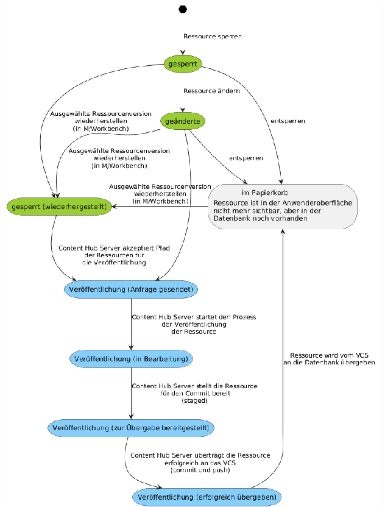

######### Abbildung 5.2. Mögliche Status und Statusübergänge von Content Hub-Overlay-Ressourcen undzugehörige Aktionen im Konfliktfall

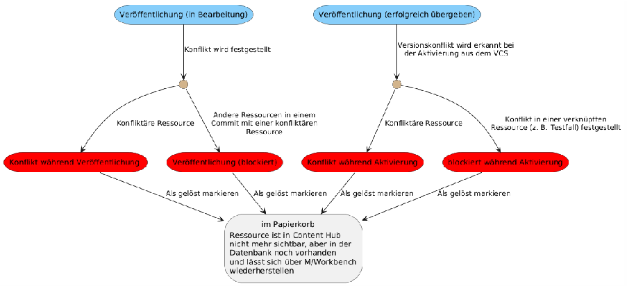

### 6. Konfliktbehandlung undFehlerbehebung

Content Hub kann nur Ressourcen sehen, die bereits in der Datenbank aktiviert sind (DatenbankModus) bzw. die im VCS vorliegen (Git-Modus). Die Veröffentlichung ist der Prozess der Übermittlung von geänderten (Overlay-)Ressourcen aus den Content Hub-Datenbanktabellen in das Versionsverwaltungssystem (VCS).

Wenn der Benutzer anfängt, eine Ressource zu ändern, speichert das System die Version dieser Ressource, um später potenzielle Konflikte zu erkennen. Wenn die geänderte Ressource veröffentlicht wird, muss die Ursprungsversion im VCS noch unverändert vorliegen. In diesem Fall wurde die Ressource also nicht durch einen anderen Benutzer oder Vorgang in der Datenbank oder im VCS verändert und die Änderung durch den Content Hub kann konfliktfrei eingespielt werden.

Ob die Version identisch ist, wird ermittelt, indem der SHA-1-Hash der Ressourcen aus dem VCS zum Zeitpunkt der Veröffentlichung berechnet und mit dem in der Datenbank gespeicherten Hash verglichen wird.

#### 6.1 Konfliktursachen

Versionskonflikte treten auf, wenn ein Content Hub-Benutzer eine Ressource bearbeitet hat, diese Ressource aber nach der Bearbeitung in einem anderen Zustand im Serie M/ Server vorgefunden wird. Dies kann die folgenden Gründe haben:

- • dass entweder jemand anderes dieselbe Ressource in M/Workbench geändert hat, während der Content Hub-Benutzer seine Änderungen vorgenommen hat oder
- • dass die Ressource bereits im VCS geändert wurde, als der Content Hub-Benutzer mit der Bearbeitung der Ressource angefangen hat, aber die Änderungen vom VCS nicht mit der Datenbank synchronisiert waren, d.h. der Content Hub-Benutzer bearbeitete eine alte Version der Ressource.

#### 6.2 Konflikt beim Veröffentlichen

Tritt während des Veröffentlichungsvorgangs ein Versionskonflikt in einer geänderten Datei auf, so wird Content Hub:

- 1. den Veröffentlichungsprozess stoppen und die kollidierende Ressource mit dem Status CONFLICT_PUBLISH versehen
- 2. andere Ressourcen, die Teil dieses Veröffentlichungsvorgangs waren (und sich nicht selbst in einem Konflikt befinden), nicht übertragen und als BLOCKED_PUBLISH markieren (im Projekt-Explorer durch das Abzeichen "KONFLIKT" mit weißem Hintergrund gekennzeichnet)
- 3. Ein Fehlerdump wird auf dem Server erstellt. Dieser Dump enthält konfliktbehaftete und blockierte Ressourcen sowie einen Textbericht summary.txt mit detaillierten Informationen zu jeder Datei (siehe hierzu auch Abschnitt 4.3, „Einrichten von Versionsverwaltungs-Systemen im Kontext von Content Hub “).

- 4. handlePublishError im Ant-Skript wird aufgerufen, wo Sie eine Konfliktbehandlung implementieren können (z. B. den Fehlerdump zippen und an den Administrator senden)

Um solche Probleme zu minimieren, wird empfohlen, die Repository-Synchronisierung automatisch nach jeder Übergabe an das VCS durchzuführen. Das kann geschehen entweder durch die Implementierung eines VCS-Hooks oder durch den Aufruf des RepositorySynchronisationstools aus dem Commit-Ziel innerhalb des Repository-Synchronisationsskriptes.

#### 6.3 Konflikt bei der Repository-Synchronisierung

Immer dann, wenn ein Benutzer an einer Ressource in Content Hub arbeitet, also eine bestehende Ressource ändert oder eine neue erstellt, kann es vorkommen, dass einige Zeit später ein externer Benutzer (z. B. von M/Workbench) eine andere Version derselben Version committet und diese Version auch mit der Datenbank synchronisiert wird. Dies führt zu einem Konflikt mit dem Content Hub-Benutzer, der seine noch nicht abgeschlossenen Änderungen noch nicht veröffentlicht hat.

Konflikte dieser Art werden bei der Repository-Synchronisierung erkannt und die Ressource in Content Hub wird als CONFLICT_UNLOCK markiert.

Wenn die konfliktbehaftete Ressource in Content Hub eine "verwandte" Ressource hat (z. B.

.Brief.template.metadata), dann wird die verwandte Ressource, die nicht direkt im Konflikt steht, als BLOCKED_UNLOCK markiert und in den Dump zusammen mit der Datei summary.txt aufgenommen und in unpublished_resource_conflicts auf dem Server abgelegt.

Im Anschluss wird ein handlePublishConflicts- target im Repository-Synchronisierungsskript ausgeführt, um über den Konflikt zu informieren.

In der Benutzeroberfläche kann der Benutzer auf die konfliktbehafteten Ressourcen klicken und Mark as resolved aufrufen, um die Änderungen zu verwerfen und die Ressourcen freizugeben.

Die Erkennung unveröffentlichter Resourcen mit Konflikten ist standardmäßig aktiviert, kann aber in der server.ini deaktiviert werden.

Verzeichnisstruktur auf dem Server mit Beispiel-Fehlerdump:

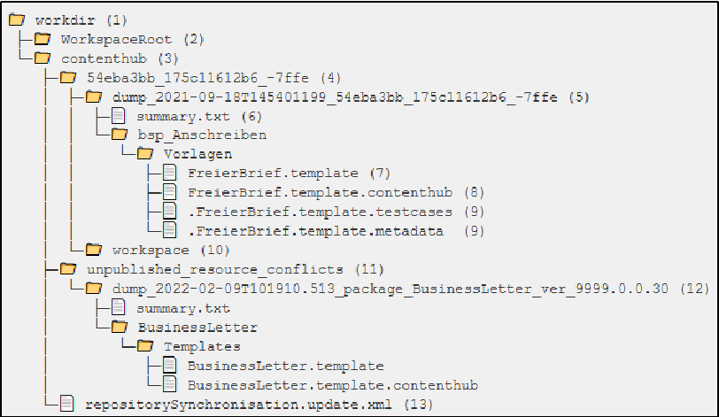

- • (1) Fehlerdumpverzeichnis des Servers
- • (2) Arbeitsverzeichnis der Repositorysynchronisation
- • (3) Arbeitsverzeichnis des Content Hub
- • (4) Arbeitsverzeichnis für einen bestimmten Content Hub-Benutzer (benannt nach der GUID des Benutzers)
- • (5) Dump der fehlgeschlagenen Veröffentlichungen, stattgefunden am 2021-09-18T145401199 durch den Benutzer 54eba3bb_175c11612b6_-7ffe
- • (6) Bericht mit Details zum fehlgeschlagenen Veröffentlichungsvorgang
- • (7) konfliktbehaftete Datei - Version, die im VCS war
- • (8) konfliktbehaftete Datei - geänderte Version von Content Hub
- • (9) blockierte Dateien, die zusammen mit der konfliktbehafteten Datei veröffentlicht wurden
- • (10) Arbeitskopie des Repositorys, in dem die Änderungen veröffentlicht werden
- • (11) Verzeichnis zum Speichern von Dumps unveröffentlichter Ressourcenkonflikte
- • (12) Auszug der konfliktbehafteten unveröffentlichten Ressourcen (entdeckt während der Synchronisierung des Repositorys, als die neue Version 9999.0.0.30 des Pakets BusinessLetter aktiviert wurde)
- • (13) Kopie des Synchronisationsskripts, das für den Veröffentlichungsvorgang verwendet wurde

#### 6.4 Löschen von Overlay-Ressourcen

Wenn ein Benutzer eine Vorlage bearbeitet und diese dabei automatisch gesperrt wird, dann wird eine Kopie der Vorlage in der Datenbank erstellt, anstatt die ursprünglische Version zu überschreiben. Bei jeder nachfolgenden Änderung und Speicherung wird eine weitere Version

der Ressource in der Datenbank abgelegt. So sammeln sich sogenannte Overlay-Ressourcen an, die in Content Hub nicht sichtbar sind. Sie können aber einerseits über die Versionshistorie (Kontextmenü Historie) wieder hergestellt werden und blockieren andererseits das Löschen von scheinbar leeren Ordnern durch den Benutzer.

Um dieses Verhalten zu ändern gibt es ein optionales Property deletePublishedResourceHistory in der Konfigurationsdatei server.ini (default ist false). So können obsolete Overlay-Ressourcen beim Veröffentlichen einer bearbeiteten Vorlage gelöscht werden (true) oder wie bisher nur als "gelöscht" markiert werden (false). Ebenfalls gelöscht werden die Historie der Vorlage und zugehörige versionierte "Blobs" wie z. B. Bilder.

Aus den folgenden Datenbank-Tabellen wird gelöscht:

- • mxcs_overlay_resource
- • mxcs_overlay_resourceblobs
- • mxcs_overlay_resourceversions Folgender Eintrag ist in der Konfigurationsdatei server.ini vorzunehmen:

|[Tonic|ContentHub] deletePublishedResourceHistory=true|false|
|---|

Das explizite Löschen der Ressourcen aus der Datenbank kann über folgendes Statement durchgeführt werden:

|DELETE FROM <schema>.mxcs_overlay_resource|
|---|

<schema> ist der Name des Schemas, das zum Speichern von M/TEXT-Tabellen verwendet wird.

#### 6.5 Aktualisierung des In-Memory-Workspace-Modells

Es ist möglich, das In-Memory-Workspace-Modell über die Content Hub-Anwenderoberfläche zu aktualisieren. Halten Sie dazu die Shift-Taste gedrückt und klicken Sie im Projekt-Explorer-Menü auf die drei vertikal angeordneten Punkte und Server-Arbeitsbereich aktualisieren. Dies aktualisiert den Workspace auf dem verbundenen Server.

In einer Clusterumgebung aktualisiert diese Funktion derzeit nur das Arbeitsbereichsmodell auf dem Serverknoten, der die Anfrage verarbeitet (Stand Version 6.15).

#### 6.6 Diagnose-Daten des Content Hubausgeben

Verbinden Sie sich in M/Workbench mit einem M/TEXT-Server, klicken mit der rechten Maustaste auf den Serverdeskriptor und wählen Sie Content Hub Diagnosedaten ausgeben. Dies wird Informationen über das Git-Modus-Workspace-Modell im Speicher, damit zusammenhängende Caches und Ratenbegrenzungszähler (falls verfügbar) im Textformat ausgeben.

In einer Clusterumgebung gibt diese Funktion derzeit nur Daten von dem mit M/Workbench verbundenen M/TEXT-Serverknoten aus (Stand Version 6.16).

#### 6.7 Anzeigen von leeren Projektordnern

Bei der Vorbereitung von Projekten kann es vorkommen, dass man bereits den ein oder anderen Ordner angelegt/vorbereitet hat, um neue Inhalte wie z. B. "Bausteine", "Vorlagen" usw. aufzunehmen, die konkreten Ressourcen darin aber noch nicht vorhanden sind.

Wenn man diese Ordner in M/Workbench erstellt und sie leer lässt, dann werden sie bei der Repository Synchronisation nicht in die Laufzeitdatenbank übernommen. Folglich sind sie im Content Hub nicht sichtbar und können z. B. nicht als Zielordner für das Speichern neuer Bausteine verwendet werden.

Das lässt sich jedoch leicht umgehen, indem man in M/Workbench eine (leere) Datei in diesem leeren Ordner anlegt. Als Dateiname wählen Sie ".empty.properties" (Achtung: Punkt am Anfang). So ist der Ordner nicht mehr leer und wird von der Repository Sychronistation in der (Content Hub) Datenbank erstellt.

Stellen Sie sicher, dass .empty.properties-Dateien nicht von Ihrem Versionskontrollsystem ignoriert werden, da die Dateien sonst nicht übertragen werden, was diese Vorgehensweise unwirksam macht.

Über die M/Workbench M/TEXT-Serverperspektive und die Ansicht Ordner sehen Sie, welche Ordner in der Datenbank vorhanden sind.

