## Serie M/ 6.16

Installation and configuration

# M/TEXT TONIC Content Hub

This manual was released at 25.07.2025

Tip: Take a look at the PDF file "Serie M/ Glossary" to find out more about terms used in the Serie M/.

Feedback: This manual has been investigated and assembled with the utmost care. If, however, you should come across any errors, unaccouracies or incompletenesses, we would like you to inform us (<documentation@kwsoft.de>).

Note: The underlying databases for Serie M/ products should only be changed using official Serie M/ products. By altering these directly we cannot guarantee that Serie M/ products will continue to operate correctly. We reserve the right to change the database structure at any time and without prior notice.

|The symbols used in the manual:|The symbols used in the manual:|The symbols used in the manual:|The symbols used in the manual:|
|---|---|---|---|
||Example||System dependent|
||Please note||Prerequisite|
||Background||Warning|
||Note||Cross reference|
||Data privacy||Example video|

Copyright © 2025 kühn & weyh Software GmbH

Linnéstr. 1-3, D-79110 Freiburg Fone 0761/8852-0 Fax 0761/8852-666 E-Mail documentation@kwsoft.de Homepage www.kwsoft.de

##### Table of Contents

- 1. What is new? ......................................................................................................................... 1

- 1.1. New features for Release 6.16 .................................................................................... 1

2. Introduction ........................................................................................................................... 2

- 2.1. Operation ................................................................................................................... 2

3. Technical Summary ................................................................................................................ 4

- 3.1. Where does the Content Hub fit within the Serie M/ system? ...................................... 4

- 4. Installation and Setup .......................................................................................................... 11

- 4.1. System requirements ................................................................................................ 11
- 4.2. Installation process ................................................................................................... 11

- 4.2.1. Assembly ........................................................................................................ 11
- 4.2.2. Configuration parameter ................................................................................ 12
- 4.2.3. Setting up the database ................................................................................. 13

- 4.3. Setting up version control systems in the context of Content Hub ............................. 13

- 4.3.1. In the Git mode ............................................................................................. 14
- 4.3.2. In the Database mode ................................................................................... 22
- 4.3.3. Configuration of the repository synchronization script ................................... 22

4.4. User administration .................................................................................................. 25

- 4.4.1. General user rights ........................................................................................ 25

- 4.5. Set up projects and templates for tenants ................................................................ 29
- 4.6. Setting up editing templates ..................................................................................... 30
- 4.7. Customize user interface .......................................................................................... 31
- 4.8. Configure automatic updating of multiple referenced models ................................... 31
- 4.9. Setup checklist for Content Hub ............................................................................... 31
- 4.10. Calling up the Content Hub user interface .............................................................. 33

- 4.4.2. Project-specific user rights ............................................................................. 27
- 4.4.3. Configuration for multi-tenant scenarios ........................................................ 27
- 4.4.4. Customization of the VCS configuration for Git mode ..................................... 28

- 5. Content Hub Overlay Ressources ........................................................................................ 34

- 5.1. Managing Content Hub overlay resources from M/Workbench .................................. 35
- 5.2. Resource status in detail ........................................................................................... 36

- 6. Conflict handling and troubleshooting ................................................................................. 39

- 3.2. Content Hub resource workflow ................................................................................. 4

- 3.2.1. Resource workflow in Git mode ....................................................................... 6
- 3.2.2. Resource workflow in Database mode ............................................................. 7

3.3. The Git mode .............................................................................................................. 8

- 3.3.1. Requirements for using the Git mode .............................................................. 8 3.3.2. Details on Git mode ......................................................................................... 8

- 6.1. Causes of conflicts .................................................................................................... 39
- 6.2. Conflicts during publication ...................................................................................... 39
- 6.3. Conflicts during repository synchronization .............................................................. 40
- 6.4. Deleting overlay resources ........................................................................................ 41
- 6.5. Updating the in-memory workspace model .............................................................. 42
- 6.6. Dump diagnostic data of the Content Hub ................................................................ 42
- 6.7. Displaying empty project folders ............................................................................... 42

M/TEXT TONIC Content Hub 6.16 iii

### 1. What is new?

Our products are continuously improved and developed. All new features, compatibility notes, improvements as well as corrections for release 6.16 can be found in the corresponding ReleaseNotes.

A selection of the most important changes for M/TEXT TONIC Content Hub is listed below.

#### 1.1 New features for Release 6.16

######## Reference search

• Content Hub users now have the option to display the templates or modules in which the models they want to edit are used. This helps them to avoid making changes in templates that they did not intend. To activate the reference search, a search engine instance must be available: either ElasticSearch or OpenSearch. Furthermore, some entries are required in the i file (see Section 4.2.2.1, “Configuration of the Reference search”).

######## Configuration

- • For testing purposes, it is possible to enter an access token to Git repositories directly in the Content Hub interface.
- • In the Content Hub resource view in M/Workbench, there are new functions for exporting and importing Content Hub resources and for comparing different resource versions.
- • Conent Hub in Git mode now supports the exclusion of top-level projects of a repository to avoid project conflicts due to identical folder names. Excluded folders are not taken into account by Content Hub when loading the project list for a repository. Further information can be found in the Section 4.3.1.1.2, “Repository configuration properties”.

######## Usability

• The view of the user- and role-specific VCS configuration has been improved. There is now a

new VCS Configuration tab in the properties of a user or role in the M/User perspective.. Debugging

• In the Server view, a new context menu function, Dump Content Hub diagnostic data has been introduced. The function can be used to instruct the server to create a diagnostic data dump file, which is helpful when analysing problems related to the Content Hub Gitmode.

### 2. Introduction

Creating templates requires both technical and specialist expertise. In practice, these tasks are usually undertaken by people with different roles and specialties.

Technical editors create the basic template and associated resources, including central elements such as layouts and styles (CI/CD). They take care of customized template data supply and define the rules for output settings and associated basic template structures. M/Workbench is used for technical editing processes.

Specialist editors expand the basic template by adding specialist content. They create texts, tables and forms, using elements provided by the basic template and associated resources (styles, models, graphics, etc.). Specialist editing is usually carried out by the relevant specialist department within a company.

M/TEXT TONIC Content Hub is the Serie M/’s editing system. It makes it possible to create and edit M/TEXT TONIC templates and models as part of the specialist editing process.

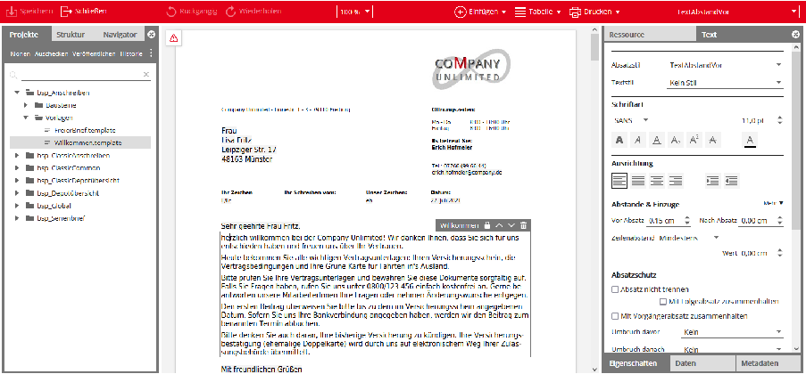

#### 2.1 Operation

Templates and models created or edited using the editing system are part of the Serie M/ project structure. The editing system has a project explorer that displays all application projects. Technical editing projects (library projects), which contain resources used only for specialist editing, are not displayed in the project explorer.

Templates can only be created in the editing system within application projects, and are always based on the basic templates prepared by technical editors. A new template is created by cloning a basic template in a wizard. Basic templates saved in application projects by a technical editor can be edited directly. If an application project is not visible in the Content Hub, a corresponding permission may be missing (see Section 4.4, “User administration ”). Specialist content within a template is created and updated using an Editor that is in essence identical to the TONIC User Editor. This Editor also has a structure tree just like that in the M/Workbench template designer.

Resource maintenance in the editing system is based on the version control system also used for M/Workbench. In contrast to M/Workbench, however, the specialist editor cannot access the

Introduction

version control system. Version control system operations (checkout, commit, etc.) are carried out internally by the system.

To simplify things, the editing system prevents conflicts that might occur when two editors attempt to edit a single resource. If a user starts to edit a resource, that resource will not be accessible in Content Hub to other Content Hub users until the edit is published or the changes have been undone. Initially, only the user making the edits can view the changes they have made. The changes only become visible to all users after publication.

Resources are published using an assistant. The assistant is used to select the resources to be published from a list of resources being edited and add a comment to it. After publication, the resource is unlocked and committed in the associated version control system; it is then visible to other specialist editors.

Note that changes can be made simultaneously in M/Workbench to the same resource as in Content Hub. This can lead to a version conflict.

### 3. Technical Summary

This section explores the technical aspects of the M/TEXT TONIC Content Hub.

#### 3.1 Where does the Content Hub fit withinthe Serie M/ system?

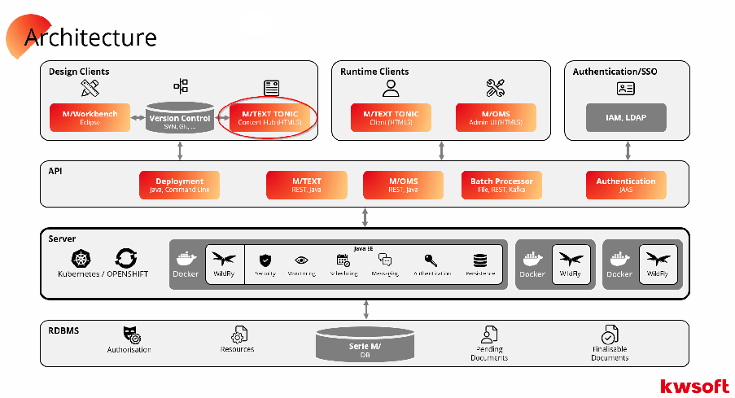

Functionally, the M/TEXT TONIC Content Hub editing system is somewhere between M/Workbench and the M/TEXT TONIC User Editor. It can be viewed either as M/Workbench with fewer functions or as the M/TEXT TONIC User Editor with additional functions.

M/TEXT Content Hub can be configured for different operating modes:

- • Git mode: This mode is more flexible and enables most real, complex use cases. In Git mode, users can work simultaneously and optionally on different Git feature branches and change resources in them. A Git hosting platform is required to operate this mode.
- • Database mode: This mode enables resources to be edited in just one assigned branch in the version management system. In this mode, Content Hub is permanently linked to this branch, i.e. feature branches are not supported. This mode is therefore suitable for simpler editing workflows.

Content Hub is configured for a fixed operating mode and behaves slightly differently depending on the operating mode. The differences are described in the following chapters.

#### 3.2 Content Hub resource workflow

Serie M/ resource development and resource deployment are carried out by saving resources within a version control system with associated repository synchronization. This is a fundamental

principle used within the Serie M/. Access to resources in the version management system in the context of Content Hub is controlled via the repository synchronization script.

Resources edited as part of the specialist editing process are subject to the same versioning and coordinated deployment requirements as resources edited as part of the M/Workbench technical editing process. To ensure that resources edited as part of the specialist editing process can be seamlessly integrated into existing processes, resource maintenance in the M/TEXT TONIC Content Hub editing system also makes use of the version control system fundamental to M/Workbench.

When Content Hub starts editing resources, the text editor selects a resource from the project structure. Depending on the operating mode (Git/database), the resources read come either from a Git branch or directly from the Serie M/ resource store; this is explained below. Different resources can be edited by different text editors at the same time.

If a user starts to edit a resource, that resource will not be accessible to other users until the edit is published or the changes have been undone. Initially, only the user making the edits can view the changes they have made. The changes only become visible to all users after publication.

Changed resources are stored as so-called overlay resources in special change tables of the Serie M/ database until publication and overlay the corresponding original resources for the changing user. Other content hub users continue to see the original resource during this time.

Edited resources are published using a wizard that can be used to select the resources to be published in order to trigger the final commit in the version management system. The corresponding commit comment is requested from the user.

Once published, the resource is once again available to all users and is committed in the associated version control system. From there, the edited resources are saved in the Serie M/ database resource store via the normal resource deployment process (repository synchronization), creating a new version of the original resource.

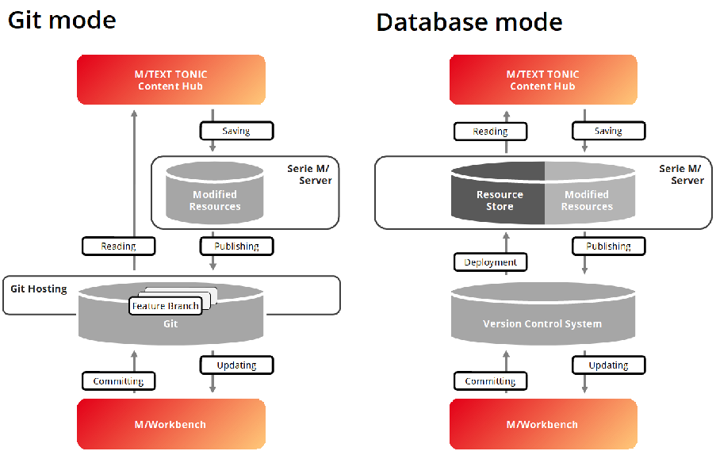

The data flow of both variants is explained below.

##### 3.2.1 Resource workflow in Git mode

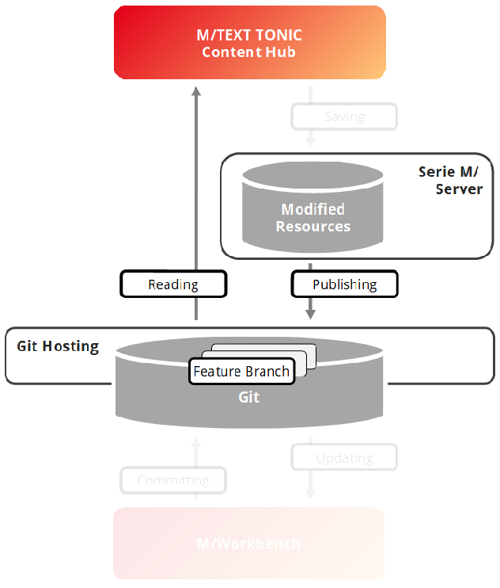

To access the Serie M/ project structure and the resources it contains, M/TEXT TONIC Content Hub accesses one (or more) branches in one (or more) Git repositories in Git mode via the HTTP API of the Git host. These repositories must be made available via a Git hosting solution.

As long as the user is working on a resource in Content Hub, the changes to resources are cached in the M/TEXT Server database. When the user publishes the changes, Content Hub writes the changed resources directly back to the Git branch from which they were read. This is done via a Git commit.

The version management system to be connected is configured in a view in M/Workbench. The settings for the Git hosting platform and the repositories to which Content Hub has access are specified here. The assignment of special read and write rights for individual users or roles is carried out via M/User.

##### 3.2.2 Resource workflow in Database mode

In database mode, Content Hub reads the resources offered for editing directly from the Serie M/ resource store.

Content Hub synchronizes itself in database mode with exactly one branch in the connected version management system. This branch is permanently configured and forms the basis for resource processing in this mode.

The repository and the branch can be configured in the server.ini configuration file.

######## Use of projects from different branches

More complex environments are structured in such a way that the M/TEXT projects are distributed across different repositories or repository branches and are merged during repository synchronization. For these scenarios, we recommend using Git mode (see

Section 3.2.1, “Resource workflow in Git mode”).

If you cannot use the Git mode (e.g. if another VCS is used), you can also implement this working method using a customized repository synchronization script.

#### 3.3 The Git mode

##### 3.3.1 Requirements for using the Git mode

- • M/TEXT projects must be available in one or more Git repositories.
- • The repositories must be hosted on a supported Git hosting platform: GitHub cloud/ enterprise, GitLab cloud/self-hosted, Gitea cloud/self-hosted (open-source).
- • The Git hosting platform must be accessible via HTTP(S) from the Content Hub server.
- • It must be possible to clone the Git repositories via HTTP(S).

##### 3.3.2 Details on Git mode

Integration of multiple repositories

- • You can work with projects from several repositories, e.g. if you keep the projects from each department in a separate repository. All projects from the configured repositories are combined by the Content Hub server and presented to the end user as if in a single workspace.
- • It is possible to use different Git hosting platforms for different repositories at the same time (e.g. some repositories in GitHub and others in GitLab).
- • Project name conflicts: In contrast to database mode, the user workspace in Git mode is dynamically assembled based on the repositories specified in the Content Hub VCS configuration and the branches selected by the user.

It is technically possible for a project with the same name to exist in several repositories. Content Hub cannot resolve such conflicts and does not allow the selection of such a constellation in the user interface.

Authorization management

• The user authorizations for the connected repositories are assigned using M/USER mechanisms (per role or per user), e.g. you can make some repositories read-only or deny a user or user role access to some repositories.

Working with several branches

- • All existing branches from the Git repository are offered to users in the Content Hub interface and users can freely change the branch they are working on directly in the user interface.
- • Edited/locked resources remain assigned to their Git branch and are only locked within this branch. (e.g.: if the user edits/locks a resource in one branch and switches to another branch, the lock (and the changes) remain in the original branch. The resource is then not locked in other branches).

Visibility of projects, folders and files in the Content Hub user interface

- • The visibilities differ between database mode and Git mode. In both modes, the user sees a "filtered" view and not all folders and files that are physically located in the VCS workspace. The specific filter applied differs:

- • As only resources from the Serie M/ resource store are visible in database mode, no resources are displayed that have already been excluded from the activation process or repository synchronization.
- • Git mode works directly with the unfiltered files in the Git repository.

To avoid confusion when displaying in Content Hub, the same "default" directories and files are filtered out as the activation process would do (e.g. .settings folder, .XXX.template.testcases file, ...).

Filtering visible resources for the user interface in Content Hub using the

.repositorySynchronization.ignored file is not yet supported (version 6.15).

The procedure for excluding resources during repository synchronization is described in the manual Ressource management in Serie M/.

Storage configuration in the Content Hub Server

- • Content Hub holds resources from Git in a cache. Make sure that the working memory size of the Content Hub server is sufficient.
- • It is generally recommended to configure the maximum memory of the server higher than the size of the workspace.

Restrictions

- • Inserting models using the model search tree is currently not supported in the Content Hub user interface. Models can only be inserted from the project-based insert dialog.
- • User interface customizations defined in the default.contenthub.layout.xml file are not automatically updated when a branch is changed. The settings of the other branch can be applied in the user interface by switching to the desired branch and reloading the application in the browser (F5). Only color adjustments are applied immediately.
- • The list of branches is only loaded once when the user interface is loaded in the browser. To display new branches, you must reload the user interface (F5).
- • To configure the user rights to a project (in the Editorial authorizations view in M/Workbench), it is necessary for the project to be activated in the Serie M/ resource store.

In a future version, we plan to remove the need to activate the workspace and instead use Content Hub folders for the configuration of editorial rights (as of version 6.15).

- • Restrictions on the possible length of host/repository/branch names: Content Hub uses the mxcs_overlay_folders table in the M/TEXT database to store virtual folder names, which are constructed as <host id>:<repo id>:<branch name>. The virtual folder name must not be longer than:

|Database|Maximum length of the virtual folder name|
|---|---|
|PostgreSQL|128 characters|
|DB2|254 characters|
|SQLServer|254 characters|
|Oracle|254 characters|

Automatic synchronization with the Git repository

- • During operation, the Git repository is also cloned to the file system of the Content Hub server in order to avoid costly transfers of large blobs via HTTP and to improve performance.

This cloning process can take a long time under certain circumstances. Until the process is complete, the Content Hub server uses HTTP API requests to retrieve the resources.

Currently, only the HTTP transport is supported for cloning Git repositories. Support for cloning via SSH is planned for a future version.

- • In addition to the cloned file system of the workspace, Content Hub manages an in-memory cache of the cloned workspace state.
- • In order to promptly recognize external changes in the Git repository, Content Hub performs a comparison for certain key events. These key events are
- • when projects are loaded into the project explorer
- • when a user opens a template in the editor

When a change is detected, Content Hub updates the workspace in the background. This process can take a noticeable amount of time (especially for large workspaces with a high number of changes). Web clients are served with the old workspace until the update is complete.

Rate limiting of the HTTP API

- • Cloud-based Git hosting platforms usually implement rate limiting for their HTTP APIs to avoid their servers being overloaded by users.

The limits are specific to each Git hosting platform, but in general, these limits are measured for a specific time period (e.g.: one hour) for each user. For example, GitHub allows a user to make 5000 HTTP API requests per hour. For self-hosted solutions, it is usually possible to increase these limits if needed.

Content Hub must make HTTP API calls that are subject to these rate restrictions. To work around these limitations, the Content Hub server uses a Git repository mirror cloned on the server whenever possible. However, the local copy cannot be used for certain operations, such as checking if a local branch is up to date, listing remote branches, or committing.

|Git Hosting Platform|Minimum version|Rate limit|
|---|---|---|
|GitHub Cloud|API 2022-11-28|5 000 requests / 1 hour Online Documentation|
|GitHub Enterprise Server|3.11 (API 2022-11-28)|15 000 requests / 1 hour Online Documentation|
|GitLab|API v4|Online Documentation|
|GitLab für Unternehmen|17.1|Documentation for general limits, Repository API limits  |
|Gitea (selbst gehostet)|1.22.1|No rate limit|
|Gitea Cloud|1.22.1|Not documented|

- • On some Git hosting platforms (GitHub), ETags are used to prevent API requests that have not retrieved any new data from being counted towards the rate limit.
- • For some Git hosting platforms, it is possible to view the current rate limit counters for a user via Content Hub (see Section 6.6, “Dump diagnostic data of the Content Hub”).

### 4. Installation and Setup

The following chapter describes how to install the M/TEXT TONIC Content Hub and set up the associated user interface.

A checklist for setting up M/TEXT TONIC ContentHub can be found in Section 4.9, “Setup checklist for Content Hub”.

#### 4.1 System requirements

|Supported databases|PostgreSQL, DB2, Oracle, SQLServer|
|---|---|
|Supported application servers|WildFly|

#### 4.2 Installation process

##### 4.2.1 Assembly

When using the assembly tool to assemble the product, the product component contenthub must be transferred to the profile.properties file’s installer.product property.

|installer.product=mtext,moms,contenthub|
|---|

- • The scripts for creating the MXCS_OVERLAY_* tables are delivered as a result of the assembly if the Content Hub module was specified. A corresponding schema adjustment must then still be made.
- • Between the different GA versions distributed and especially between different releases, new properties may be added. Therefore, we generally recommend to create a new "template file" profile-template.properties and then rename it to profile.properties to use it for assembly.

###### 4.2.1.1 Content Hub log entries

The following log entries are generated for the Content Hub by the assembly tool:

|[Logging|Appender|ContentHub] class=org.apache.log4j.FileAppender  [Logging|Appender|ContentHub|options] Append=true File=${CSHome}/contenthub.log Layout=fileLayout  [Logging|Logger|de|kwsoft|mtext|tonic|contenthub] Appender=ContentHub Level=TRACE|
|---|

You can find detailed information regarding logs in the reference book “Serie M/ Configuration Files”, in the chapter “Logging Settings”.

##### 4.2.2 Configuration parameter

The server.ini file specifies whether M/TEXT TONIC Content Hub is operated in database mode (DBMODE) or in Git mode (GITMODE). If no value is specified, the system uses database mode.

|[Tonic|ContentHub] BackendMode=DBMODE | GITMODE|
|---|

For the database mode, an entry is also required that specifies the URL of the connected repository. This URL is passed as the parameter ${repositoryUrl} when communicating with the repository synchronization script.

|[Tonic|ContentHub] RepositoryURL=<URL>|
|---|

The settings for the version control system and the Git hosting platform for Git mode are not made in server.ini, but in an editor in M/Workbench.

For Git mode, you can optionally specify a directory path in which the Content Hub server clones remote repositories. If this path is not specified, Content Hub uses the folder specified under [M/TEXT] Work by default, in which the subfolder contenthub_repo_cache is created.

|[Tonic|ContentHub] MirrorCachePath=/tmp/mirror_cach_temp|
|---|

The MirrorCachePath entry must point to an empty folder whose contents can be deleted by Content Hub to remove obsolete repositories when the VCS configuration changes.

###### 4.2.2.1 Configuration of the Reference search

A reference search is very helpful for users of Content Hub. With this, they can easily find out in which templates (or building blocks) models are used. This helps them to avoid making changes in unintended places. To configure the reference search in Content Hub, a search engine instance must be available: either ElasticSearch or OpenSearch. Content Hub requires all indices privileges in the search engine instance.

Furthermore, the following entries are required in the server.ini file:

|[Tonic|ContentHub|ReferenceSearch] EngineURL=<URL> AuthMode=NONE | BASIC | BEARER | ELASTIC_APIKEY | ELASTIC_OAUTH_CLIENT_CREDENTIALS AuthUser=<user> AuthPass=<password> AuthToken=<token> IndexNamePrefix=<prefix>|
|---|

In EngineURL, specify the URL of the search engine instance that you want to use. In IndexNamePrefix, specify a prefix to be used for the indexes of the content hub instance (for example, contenthub-ref-search). In AuthMode, specify the method of authentication to the search engine. The following list provides details about the possible values:

- • NONE - no authentication
- • BASIC - Login with user and password. Enter these under AuthUser and AuthPass.

- • BEARER - Use of OAuth Bearer Token / Service Token Tokens are created and renewed in the search engine. You enter the token under AuthToken.

Information on creating tokens in ElasticSearch can be found here: https:// www.elastic.co/guide/en/elasticsearch/reference/current/security-api-get-token.html und https://www.elastic.co/guide/en/elasticsearch/reference/current/security-apicreate-service-token.html

- • ELASTIC_APIKEY

This option is only available for ElasticSearch. The creation and renewal of “Api Keys” is done in the search engine. You enter the “Api Key” under AuthToken.

Instructions for creating “Api Keys” in ElasticSearch can be found here: https:// www.elastic.co/guide/en/elasticsearch/reference/current/security-api-create-apikey.html

- • ELASTIC_OAUTH_CLIENT_CREDENTIALS

This option is only available for ElasticSearch. Client credentials for OAuth are created and renewed in the search engine. You enter these under AuthUser and AuthPass.

Instructions for creating client credentials for OAuth in ElasticSearch can be found here: https://www.elastic.co/guide/en/elasticsearch/reference/current/security-apiget-token.html

##### 4.2.3 Setting up the database

Content Hub requires additional tables to temporarily save edited resources. These tables begin with the prefix mxcs_overlay_*.

To create these tables, the assembly tool generates the DDL scripts

*CreateOverlayTables.sql and *CreateOverlayTriggers.sql.

Just as with M/TEXT, M/TEXT TONIC Content Hub has a database schema including a version number. Both systems use different version numbers.

The Content Hub application is saved in the EAR as a WAR (mtextTonicContentHub.war) and accesses the database tables using the DataSource provided by the application server. The connection information is taken from the M/TEXT standard database.

|[MTextServer|Database] Database=postgresql DBSchema=mtext|
|---|

#### 4.3 Setting up version control systems inthe context of Content Hub

In order to pass on the changed resources from Content Hub to the version control system (VCS), the system must know the location of the VCS repository and a repository synchronization script compatible with your VCS must be set up in the Serie M/ server.

The communication with the version control system is controlled via the repository synchronization script. This contains special ANT targets for the operation of Content Hub.

##### 4.3.1 In the Git mode

The configuration of the connected repositories in Git mode takes place in the Content Hub VCS configuration view in M/Workbench. The view is part of the M/User perspective. Here you specify all Git hosts and repositories that Content Hub is allowed to access. The repository settings are inherited by M/User users and roles. Adjustments relating to permissions, authorization, user info or the default branch can be made at user or role level. These are defined via the VCSConfig attribute of an M/User user or an M/User role (To create the attribute, see Section 4.4.4, “Customization of the VCS configuration for Git mode”).

###### 4.3.1.1 Git host and repository configuration properties

The global configuration in the Content Hub VCS Configuration view describes all possible repositories that are accessible to the Content Hub server and defines all the necessary properties of each one. The configuration is hierarchical: Git hosts must be defined first, and then specific repositories can be defined for each host. Git hosts and repositories can only be defined in the global VCS configuration.

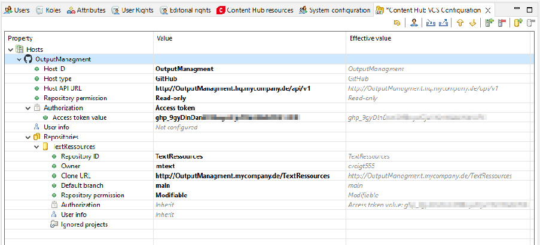

If values are overwritten by inherited values, this is shown in the Effective value column:

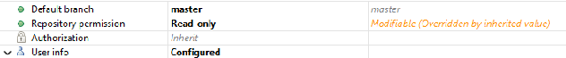

####### 4.3.1.1.1 Host Configuration properties

|Property name|Description|
|---|---|
|Host ID|An arbitrary identifier for the Git hosting platform. Only the characters a-z,A-Z,0-9,-,_ are permitted.|
|Host type|Determines which API-specific implementation is used to communicate with the Git host. Possible options are gitea, gitlab, github.|
|Host API URL|The base URL of the API endpoint of the host. For cloud hosting platforms, these are e.g: https://gitea.com/api/v1, https://gitlab.com/api/v4, https://api.github.com.  For a self-hosted installation, an administrator must provide a corresponding URL.|
|Repository permissions|Controls editorial rights for all repositories on this host. These default permissions can be overwritten for each repository.  Possible values are:  • Inaccessible: Projects from the repository are not available in the user's Content Hub workspace. The repositories of this host are not displayed in the dialog for changing the branch. Content Hub behaves as if the projects do not exist in the repository. • Read-only: Projects from the repository are visible to the user, but none of the resources they contain can be changed • Modifiable: Projects are visible to the user and resources in them can be locked and changed |
|User info|Default settings for all users who use this host Defines the Git username and Git user email used to commit when a user publishes changed resources. These properties support variables that allow mapping to M/ User user attributes (e.g. you can enter for the user email: ${name}.${lastName}@mycompany.de).  It is usually also possible to leave these properties empty and the Git hosting platform will automatically fill them in, assuming that the owner of the authorization token is the Git committer.|
|Authorization|See Section 4.3.1.2, “Authentication and authorization configuration”, Default settings for all users who use this host  |

####### 4.3.1.1.2 Repository configuration properties

|Property name|Description|
|---|---|
|Repository ID|The name/ID of the repository on the Git hosting platform must match exactly (e.g.: mymtextrepo)|

|Property name|Description|
|---|---|
|Clone URL|The URL from which it is possible to clone the repository with Git (e.g.: http://github.com/myorg/mymtextrepo.git)|
|Default branch|The branch with which the Content Hub user interface starts (unless the user selects a different branch)|
|Repository permissions|Controls editorial rights only for the corresponding repository, overrides host default settings  Possible values are:  • Inaccessible: Projects from the repository are not available in the user's Content Hub workspace. The repository is not displayed in the dialog for changing the branch. Content Hub behaves as if the projects in the repository do not exist. • Read-only: Projects from the repository are visible to the user, but none of the resources they contain can be changed • Modifiable: Projects from the repository are visible to the user and resources in them can be locked and modified.   The number of projects that can be changed can be further restricted by assigning project-specific user rights (see Section 4.4.2, “Project-specific user rights”).  |
|User info|Information only for users who use the corresponding repository (overwrites host default settings)  Defines the Git username and Git user email used to commit when a user publishes changed resources. These properties support variables that allow mapping to M/User user attributes (e.g. you can enter for the user email:${name}.${lastName}@mycompany.de).  It is usually also possible to leave these properties empty and the Git hosting platform will automatically fill them in, assuming that the owner of the authorization token is the Git committer.|
|Authorization|See Section 4.3.1.2, “Authentication and authorization configuration”, only applies to the use of this repository (overwrites host default settings)  |
|Ignored projects|When using multiple repositories in Content Hub Git mode, there may be top-level projects or folders with the same name in multiple repositories in use. In some cases, the conflicting projects are not relevant for M/TEXT. For these cases, it is possible here to exclude projects from use in Content Hub. Ignored projects are not taken into account by Content Hub when loading the project list for a repository.|
|Owner*|Especially for gitea and github The value must match the owner of the repository (user name or organization name e.g. myorg)|
|Project ID*|Especially for gitlab The value must match the project ID of gitlab (e.g.: 54389137)|

|Property name|Description|
|---|---|
| |You can find the information in GitLab under Projects - Select project - Further actions - - Copy project ID.  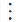|

###### 4.3.1.2 Authentication and authorization configuration

The Authorization property in the Content Hub VCS configuration determines the authentication and authorization procedure when accessing a specific host or repository. The values OAuth2 or access token are possible.

OAuth allows the user to authenticate themselves to the authentication server the first time they use it, whereby a temporary access token is created internally. Access to the Git repository is granted via this access token. OAuth is the preferred way to grant Content Hub users access to Git repositories.

Access token enable access from the Content Hub server to repositories on the Git hosting platform using a token created in advance on the Git hosting platform. User authentication takes place in advance on the Git hosting platform and the user receives an authorization token that allows them to permanently access their resources in the Content Hub without having to authenticate themselves each time.

By default, the authentication and authorization information is configured in M/Workbench.

For test purposes, the authorization method can be switched via the Content Hub user interface and an access token can be stored. This is preferred by the system, even if the authentication/authorization method is configured differently in M/Workbench.

The corresponding dialog opens automatically when Content Hub is started if authentication/authorization information on repositories is not configured or fails. This access token entered via the interface is saved in a cookie. To remove it, please delete this cookie.

####### 4.3.1.2.1 OAuth

OAuth authorization flows grant a client application limited access to protected resources on a resource server, in this case the Git repository.

######## 4.3.1.2.1.1 Set up and use OAuth with Content Hub

- 1. First, it is necessary to create an OAuth application on the Git hosting platform. This should be done by the administrator of the Git hosting platform, who can create the OAuth application for the entire organization.
- 2. The administrator then describes the OAuth application in the Content Hub VCS configuration as described in Section 4.3.1.2.1.2, “OAuth configuration properties”.

- 3. Users who log in to Content Hub for the first time will see an "Auth dialog". The dialog shows a list of the configured repositories with the selected authentication method. In the case of OAuth, the user must manually click on the Authorize button.
- 4. The OAuth flow is started and the user is redirected to the Git hosting platform.
- 5. The user must log in to the Git hosting platform.

- 6. The Git hosting platform prompts the user to grant permissions for the resources specified by the OAuth application.
- 7. If the user grants the permissions, they are redirected back to Content Hub and can start working.

######## 4.3.1.2.1.2 OAuth configuration properties

The options, requirements and configuration of OAuth apps vary depending on the Git hosting platform. It is possible to create an OAuth application for an entire organization (preferred) or for individual users (for testing).

|Property|Description|
|---|---|
|Client secret|A "secret" that is only known to Content Hub and the authorization server (Git hosting platform). The "secret" is generated when the OAuth application is created.|
|Client ID|The ID of the OAuth application on the authorization server (Git hosting platform), which is generated when the OAuth application is created.|
|Authorization URI|The URI of the Git hosting platform where the OAuth flow is started    https://github.com/login/oauth/ authorize  https://gitlab.com/oauth/authorize https://gitea.com/login/oauth/authorize|
|Access token URI|The URL of the Git hosting platform on which the OAuth code exchange takes place (this URL must be accessible from the Content Hub server)    https://github.com/login/oauth/ access_token  https://gitlab.com/oauth/token https://gitea.com/login/oauth/ access_token|
|Content Hub redirect URI|The URI of the Content Hub server to which the user is redirected after granting permissions on the Git hosting platform (this URL must be accessible from the user's browser).    https://example.com/contenthub/app/ oauth/github/callback  https://example.com/contenthub/app/ oauth/gitlab/callback  https://example.com/contenthub/app/ oauth/gitea/callback|

|Property|Description|
|---|---|
| |It is also possible to specify only the path to Content Hub as the redirect URI. In this way, Content Hub will take the host part of the URL from the user's browser and construct an absolute redirect URI when the user starts the authorization from the Auth dialog.  This function allows users to open an instance of Content Hub from several networks in which Content Hub could be accessible under different URLs, e.g.: from the internal company network under http://intranet.example.com/ contenthub and from the Internet at https:// example.com/contenthub.    /contenthub/app/oauth/github/callback /contenthub/app/oauth/gitlab/callback /contenthub/app/oauth/gitea/callback|

######## 4.3.1.2.1.3 Example: Setting up Gitea OAuth

- Example 1: Gitea OAuth app for the organization

- 1. In Gitea, open Site administration - Integrations - Applications (http://gitea.com/admin/ applications)

- 2. Activate the Confidential client option.
- 3. Under Redirect URI, "permitted" URIs are specified to which the user can be forwarded. Several URIs may be specified here. For example, you can specify several Content Hub URIs if the users connect from both an internal and an external network.

http://10.0.0.150/contenthub/app/oauth/gitea/callback http://example.com/contenthub/app/oauth/gitea/callback

Note that Content Hub only redirects to URIs that are specified in the Content Hub VCS configuration by Endpoint Redirect URI.

- Example 2: Gitea OAuth app for one user

- 1. In Gitea, open Settings - Applications (http://gitea.com/USER/settings/applications).
- 2. Set the value for Redirect URI as described in the previous example.
- 3. Activate the Confidential client option.
- 4.3.1.2.1.4 Setting up GitHub OAuth

The GitHub app is more sophisticated than the (GitHub) OAuth app. It allows multiple redirect URIs, installation for all or selected repositories and restriction of access to IP ranges. You should prefer the GitHub app to the OAuth app if possible.

The GitHub OAuth app does not provide a refresh token, which means that if the access token expires, Content Hub can only renew the access token if the user is still logged into their GitHub account in the same browser.

Example: GitHub OAuth App

- 1. In GutHub, go to Settings – Developer settings – OAuth Apps– New OAuth App (https:// github.com/settings/developers).

- 2. Set the Callback URI to e.g.: https://example.com/contenthub/app/oauth/github/callback. Only a single URL is supported.
- 3. Deactivate the option Enable Device Flow.
- 4. Home page URL should refer to Content Hub (not required) Example: GitHub App

- 1. Open on GitHub Settings – Developer settings – GitHub Apps – New GitHub App (https:// github.com/settings/apps).

- 2. Set the callback URI to e.g. https://example.com/contenthub/app/oauth/github/callback. Several redirect URIs are supported.
- 3. Activate the option Expire user authorization tokens. This provides a refresh token.
- 4. Deactivate the option Request user authorization (OAuth) during installation.
- 5. Deactivate the option Enable Device Flow.
- 6. Choose Permissions & Events – Repository permissions – Contents: Read and Write – Save changes.
- 7. Select the created application in the Install App tab and install it - either for all or only for the selected repositories.

- 4.3.1.2.1.5 Setting up GitLab OAuth Example: GitLab OAuth app (user)

- 1. In GitLab, go to Settings - Applications - Add new application (https://gitlab.com/-/ user_settings/applications).

- 2. Set the value for Redirect URI to e.g. https://example.com/contenthub/app/oauth/gitlab/ callback.
- 3. Activate the option Confidential.
- 4. Set the scopes api, read_repository, write_repository.
- 5. Save the application.

####### 4.3.1.2.2 Access token

Access tokens can be generated on the Git hosting platform by an administrator or even by the users themselves, with only the absolutely necessary permissions for the operation of Content Hub being assigned.

You need to decide whether to use a single, overarching access token for all Content Hub users or to create a separate token for each user. Both options have advantages and disadvantages.

The safest option is to use a separate token for each user. However, this results in more work when generating the tokens and setting up the Content Hub for each user.

Using a single, overarching access token is easier to configure, but can be a security risk because access cannot be revoked on a user-specific basis. In addition, in this variant, all users share the same rate limiting counters and can quickly reach the rate limit.

The most important points when creating access tokens for various Git hosting platforms are explained below as examples.

######## 4.3.1.2.2.1 Example: GitHub personal access tokens

With GitHub, it is possible to use either "classic" tokens or "fine-grained" tokens. The latter offer better control over permissions, e.g. with a fine-grained token it is only possible to grant access to the selected repositories.

- 1. Open the GitHub settingsSettings – Developer settings – Personal Access Tokens– Tokens: classic (https://github.com/github/settings/tokens) and create a new token.

- 2. Required areas: repo
- 3. Set expiration date as required
- 4.3.1.2.2.2 Example: GitLab personal access tokens

- 1. Open the settings Settings - Access token - Add new token (https://gitlab.com/-/user_settings/ personal_access_tokens.

- 2. Required areas api, read_repository, write_repository

######## 4.3.1.2.2.3 Example: GitLab repository access token

- 1. Open Projects - <Select project> - Further actions – – Project settings - Access token (https:// gitlab.com/-/user_settings/personal_access_tokens)

- 2. Required areas api, read_repository, write_repository

######## 4.3.1.2.2.4 Example: Gitea access token

- 1. Open the settings Settings - Applications - Manage access tokens (https://gitea.com/USER/ settings/applications).
- 2. Required authorizations repositories : read/write

##### 4.3.2 In the Database mode

The following settings must be made to operate Content Hub in database mode:

- 1. Configuring the repository URL in the server.ini

|[Tonic|ContentHub] RepositoryURL=http://some.repo.xyz/seriem.git (1)|
|---|

(1) URL for a VCS repository to which the Content Hub transfers the commits containing the edits. The URL for this repository must be the same as that used for repository synchronization.

The repository URL is required by Content Hub in the database mode. If Content Hub is part of the EAR deployment, this property is checked during M/TEXT server startup, and will prevent the M/TEXT server from starting if its missing.

- 2. You can configure user-defined properties in the server.ini as follows. The custom properties are a mechanism allowing the repository synchronization script to be more flexible by making it possible for users to pass variables from server.ini (or M/Workbench) to the repository synchronization script before its execution.

|[Tonic|ContentHub|Repository] (1) custom.branch=master (2) custom.username=mtext|
|---|

- (1) You can define user-defined properties in the server.ini. These properties are transferred to the repository synchronization script during publication. The user-defined properties must start with the prefix custom.
- (2) You can reference the user-defined property in the repository synchronization script, for example using ${custom.branch} or ${custom.username}.

For GIT, our standard script expects a branch as in example (2) above. For SVN, the branch is transferred using a URL. In the database mode, every Content Hub instance is connected to a repository and only transfers edits to a branch within that repository. Both the repository and the branch can be configured in the server.ini. Repository synchronization makes it possible to fill the server’s database (or the Content Hub’s database) with different branches, although in this case the commit will always be entered into the configured branch.

Whether any custom property is required or optional depends on whether it is referenced from the repository synchronization script, and whether the script can execute without it missing.

You can use the repository synchronization dialog in M/Workbench to enter the values for each user-defined property in a dialog box.

- 3. Customize repository synchronization script: Information on customizing the repository synchronization script can be found in Section 4.3.3, “Configuration of the repository synchronization script”.

- 4.3.3 Configuration of the repository synchronization script

Access to resources in the version management system in the context of Content Hub is controlled via the repository synchronization script. This means that separate Ant targets are

available in the repository synchronization script for both read and write actions, which are adapted as part of the Content Hub configuration.

As part of the introduction of the M/TEXT TONIC Content Hub, kwsoft® has made necessary enhancements to the standard repository synchronization script, which are explained in more detail below.

Customize script for repository synchronization:

- • You can use M/TEXT TONIC Content Hub with any version control system. The use of Git is a prerequisite for Git mode. Communication takes place similarly to repository synchronization, via an ANT script. kwsoft® delivers a standard script for Subversion and GIT. This script can be customized to meet your requirements. The standard script delivered as part of the Serie M/ contains the targets: checkout, reset, info, commit, handlePublishError.
- • The standard script for SVN and GIT can be created using M/Workbench. If you have customized your existing script, you must merge your customization manually with the new standard script.

For more information, see the “Repository Synchronization” chapter in the “Ressource management in Serie M/” Guide.

- • Adjustments must be made to the scripts supplied by kwsoft®. As a rule, it is at least necessary to customize the user (usr/pwd).
- • The scripts delivered by kwsoft® usually require that, at the least, the user be changed (usr/pwd).
- • It is possible to customize the dump root path, to which publication error dumps are saved, using the ANT property errorDumpRoot. The default value is set to the Content Hub user’s working directory.

During repository synchronization, access to the VCS repository on the server is often carried out without access data and is therefore read-only. Write access is not required for repository synchronization.

M/TEXT TONIC Content Hub, on the other hand, requires write authorization in the version management system. Therefore, make sure that the script with the specified login information has write authorization on the VCS.

###### 4.3.3.1 Notes for customizing the standard script

We recommend configuring the version control system so that it does NOT transform line endings in text files during transfer or during cloning/check out. This is important for avoiding conflicts when publishing edits made in Content Hub.

If the file activated in the database has Linux-style line endings, but the same file in the VCS repository has Windows-style line endings, there will be a conflict that will halt the Content Hub publication process. In a production environment, it should be enough to ensure that the VCS avoids line transformations on the computer (server) that implements Content Hub repository synchronization and publication operations.

####### 4.3.3.1.1 AntGitTasks ANT plugin

The GIT version of the script has been customized. Instead of installing native GIT binary data on the server, it uses the ANT plugin AntGitTasks, which in turn uses Java GIT implementations.

You can find documentation for the plugin in M/TEXT docs/AntGitTasks under .AntGitTasks ANT plugin.

If you want to use GIT as a VCS with the standard script, add the component mtext-jgit to the installer.product property in the profile.properties file.

####### 4.3.3.1.2 Runtime errors

Executing the synchronization script in order to interact with the VCS is an important part of the Content Hub publication process. If an error occurs during script execution, for example when reading the repository or when committing, then Content Hub must be informed.

Exit codes and ANT task outputs that call/execute native tools or Java classes must therefore be saved in or redirected to special ANT properties with the following naming conventions:

|Output type|Pattern|Description|
|---|---|---|
|output (stdout)|log.<targetName>Out*|The output is logged in the server log.|
|error output (stderr)|log.<targetName>Err*|If Content Hub determines that output has been saved here, it assumes that an error occurred during execution and stops the publication process.|
|exit code|log.<targetName>Result*|The results property has any setting other than Code 0, the publication process will be halted.|

- • Optimal GIT configuration
- • Make sure that the GIT property core.autocrlf is set to false. If you run Content Hub on Windows with GIT-for-Windows, this property is set to true as a default.
- • The repository used by M/TEXT TONIC Content Hub should be a bare repository. Committing in a repository with a working tree can lead to unexpected working tree statuses.
- • The default Git repository synchronization script checks whether the setting core.autocrlf is not enabled and if the repository is bare (when the URL points to filesystem). These checks are done when info target is executed prior to executing commit target. If the check fails Ant script execution is interrupted and no commit is performed.

The check can be easily disabled by setting verifyGitConfig to false or directly by configuring checkRepo task (see also mtextAntGitTasks documentation for details)

- • Optimal SVN configuration
- • Make sure that your SVN client does not automatically convert line endings. This is usually configured using svn:eol-style . This property should not be set in your SVN repository.

####### 4.3.3.1.3 Automatic repository synchronization after a commit

In certain environments (e.g., development or test stages), it may be desirable to also perform a repository synchronization immediately after committing changed resources to the version control system.

The Ant script supplied by kwsoft® takes this use case into account. The Ant property autoRepoSync=true can be used to control that the repository synchronization should be executed automatically after the commit. Content Hub executes the ant target afterCommit after each successful commit.

In general, it should be taken into account that additional tasks to be performed after the commit are added to the script only by modifying the afterCommit target and not by modifying the commit target itself.

#### 4.4 User administration

In order to use M/TEXT TONIC Content Hub, a user must have certain rights. To log in to Content Hub, the user must be assigned the rights Use server API and Use editorial interface via Properties - M/TEXT in the M/User perspective in M/Workbench.

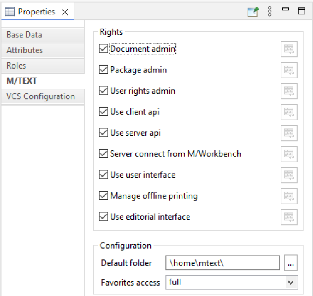

##### 4.4.1 General user rights

For the use of Content Hub, further permissions can be determined that regulate the general access to resources in Content Hub.

These rights are set via attributes of the user in M/User in M/Workbench. By default, these attributes are set to "No".

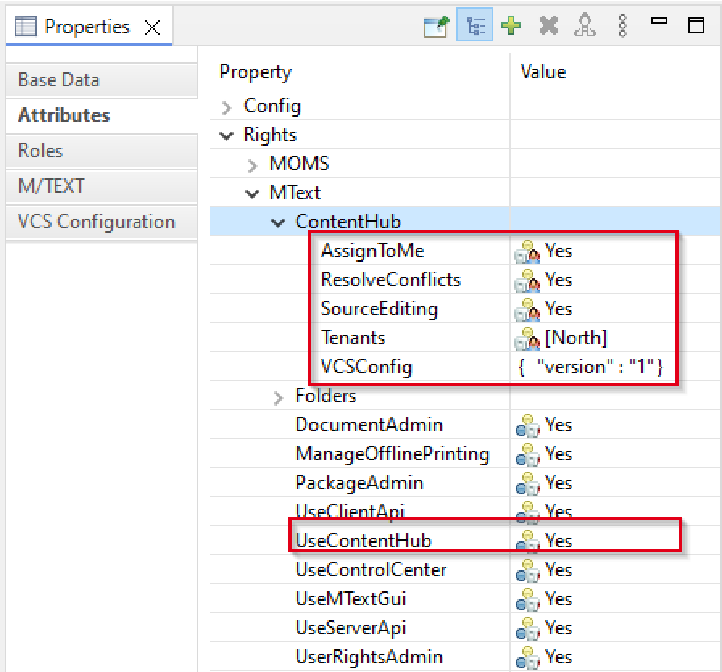

######### In the following table you can see all attributes with the corresponding explanation:

|Rights|Description|
|---|---|
|Assign to me (AssignToMe)|If this permission is enabled, a user can take another Content Hub user's unpublished changes and edit them further.|
|Resolving conflicts (ResolveConflicts)|If a Content Hub resource encounters a conflict during publication, users with this authorization can right-click on the resource in the project panel and call “Mark as resolved” to discard the conflicted resource and unlock it.|
|_rightsContentHub|Users can be granted rights to specific folders (see Section 4.4.2, “Project-specific user rights”). To store these access rights the attribute _rightsContentHub exists. This attribute is located under Folders > library and contains the default access rights for the entire workspace. All projects and subfolders inherit the access rights from this entry.  If you change the access rights for another folder via Editorial rights, another _rightsContentHub entry appears. The associated value is derived from the Change and Show Folder fields in the Editorial rights view.    Do not make any changes to the attributes here, but only via the Editorial rights view.|
|Use Content Hub (UseContentHub)|Determines whether a user can use Content Hub at all.|

##### 4.4.2 Project-specific user rights

A user can be assigned project-specific rights. This allows you to control which projects a user can edit and which projects are displayed to him within Content Hub.

Rights are assigned at the level of M/TEXT projects. Rights assigned at the root project level (Projects) are inherited by child projects and can be explicitly extended or restricted there.

For multi-tenant scenarios: Editorial permissions do not need to be explicitly assigned for fragment projects. Specifying the Tenant in the user's Attributes area is sufficient for the user to make changes in the corresponding fragment project (see Section 4.4.3, “Configuration for multi-tenant scenarios”).

The Editorial rights view through which these settings are made is part of the M/User perspective.

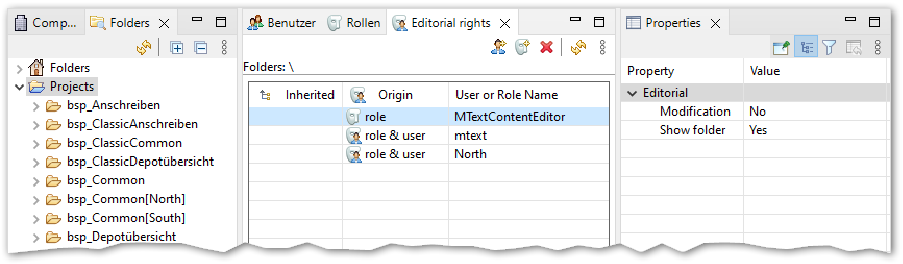

|Rights|Description|
|---|---|
|Show folder|Determines whether the project folders are visible to the user in the Content Hub project window.|
|Edits|Determines whether the use can edit resources in the project.    Only application projects are visible.|

If the Editorial rights view is not visible, it can be shown via Window - Show View - Other

- Editorial rights. If this does not work, it may be necessary to reset the perspective (Window - Perspective - Reset Perspective). If you are importing older M/USER definitions from an XML, check whether or not Content Hub authorizations have been set. If not, select Projects and assign rights to each user manually.

In Git mode, you can assign authorizations for the repositories in addition to the project-specific user authorizations (see Section 4.3.1.1, “Git host and repository

configuration properties”). Content Hub only grants access to projects if this is assigned both in the repository-specific authorizations and in the project-specific authorizations.

##### 4.4.3 Configuration for multi-tenant scenarios

For a user to be able to work in a tenant-specific fragment project, he needs the appropriate rights. Under Attributes - MText - ContentHub - Tenants, add the tenants for which the user is allowed to work (e.g. client North).

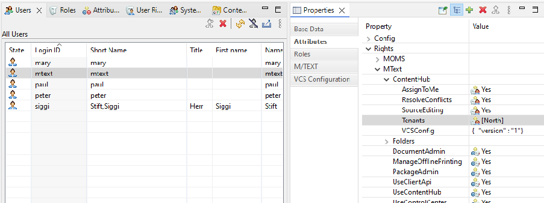

If a user is to be authorized to work in the root project (BASE), give him the corresponding editing rights in the root project Projects (see Section 4.4.2, “Project-specific user rights”). If the user has no editing rights for the root project, he can only work in the fragment project for his tenant.

One possible approach is to introduce a role for all Content Hub users in M/User. This role and all its members are not granted editorial rights at the Projects level. This way, the users cannot make any changes to master projects. If you then assign Tenants to Content Hub users in the Attributes section, the users can open resources for the tenant. To do this, the projects in which the resources reside and the template from which to work must be configured accordingly (see Section 4.5, “Set up projects and templates for tenants”).

If a user is to be given modification rights in a master project, these must also be assigned via the project's editorial rights.

##### 4.4.4 Customization of the VCS configuration for Gitmode

The basic configuration of the Git repositories for Content Hub in Git mode is carried out in the Content Hub VCS configuration view (see Section 4.3.1, “In the Git mode”). The authorizations, access data etc. set here are inherited by all roles and users. If a user or group of users (represented by a role) requires access to a different set of repositories, a different authorization or different Git user credentials, specify this in the VCS configuration of the selected user or role. To access the user VCS configuration editor of M/Workbench:

- 1. Open up the perspective M/User.
- 2. Select the view User or the view Roles.
- 3. Select the desired user or role.
- 4. Select the Attributes tab in the Properties view.
- 5. Navigate to Rights - MText - ContentHub - VCSConfig and then click on the ... button to open the editor.

If the VCSConfig attribute does not yet exist in the list, create it via the Add entry context menu.

The description of the possible values for the properties can be found under Section 4.3.1.1, “Git host and repository configuration properties”.

#### 4.5 Set up projects and templates fortenants

Content Hub can be configured for multi-tenant scenarios. In M/Workbench, it is not necessary to create all fragment projects individually. It is sufficient to prepare the possible tenants in the project properties. The tenant-specific fragment projects can then be created automatically by Content Hub. The procedure is explained below.

The projects in which higher-level resources are located should be set up on a tenantspecific basis. These can be base or framework projects. For more information on the concept of fragment projects, see the manual Ressource management in Serie M/.

To be able to choose between several tenants, you need a metadatum that contains the tenant, the so-called tenant selector (e.g. $Metadata.Tenant). The Insert to documents option must be enabled.

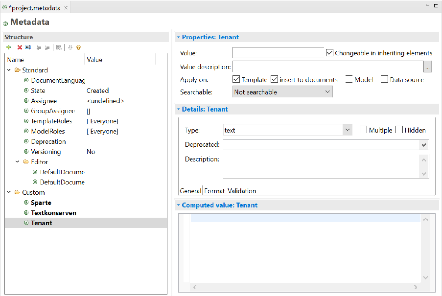

In the project properties of the project that is to be tenant-enabled, this data model node must be referenced as a tenant selector (Project properties - M/TEXT - Project). The possible tenants are specified as Tenants. This also applies to projects that contain tenant-enabled images.

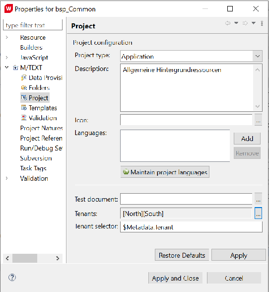

In the template that is to be used for different tenants, the tenant selector (e.g. $Metadata.Tenant) must be selected at the document level under Properties - Fragments.

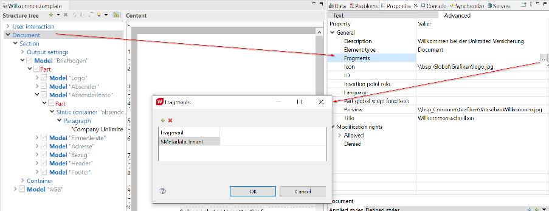

Note that references to models and other resources must be relative for working with fragment projects or tenants.

#### 4.6 Setting up editing templates

It is possible to edit models in the Content Hub. To do this, the model can either be inserted into a template and changed there. For models that are not included in a template by default, but are only inserted when required, it is more convenient for a Content Hub user if the model can also be opened directly without having to take the diversions via a template. You can create this option by providing editing templates. Editing templates provide a model with a context in

which it is displayed. In addition to a stationery, they also contain the appropriate data provision. When a Content Hub user works on a model in an editing template, she can only change the model. Although the editing template is visible in the editor area, it cannot be changed. Only the structural elements of the model are displayed in the Structure area.

Editing templates are created and managed in M/Workbench. You can find instructions on how to do this in the manual 'M/Workbench for M/TEXT - Administration and Configuration' in the section "Editing templates".

#### 4.7 Customize user interface

The Content Hub user interface can be configured. To do this, the file \Configuration\ui \default.contenthub.layout.xml must be available in the M/Workbench workspace. Create the file via the project explorer context menu by selecting New - Other... – Content Hub Configuration. The user interface configuration is carried out analogue to that of the M/TEXT TONIC User Editor. There, the file default.editor.layout.xml is used to customize the interface.

The use of the context object $context is not supported in Content Hub. In many cases, the functionality available in $context cannot be applied in Content Hub. For example, toolbar buttons in which $context is used do not work.

See the "M/TEXT TONIC - Text administration" manual, chapter "Editor configuration".

#### 4.8 Configure automatic updating ofmultiple referenced models

If a model that is referenced multiple times in a template is changed, all references are automatically updated by default. In complex templates, this can lead to performance issues under certain circumstances.

The automatic update can be configured in M/Workbench.

- 1. Open M/Workbench.
- 2. In the menu bar, open Window - Preferences.
- 3. Select M/TEXT TONIC - Content Designer.
- 4. Deactivate/activate the option Automatic refresh of multiple-referenced models.

If a model referenced multiple times is changed in a template, a message appears indicating that the Content Hub user editor must be updated manually.

#### 4.9 Setup checklist for Content Hub

Some of the points that need to be considered when setting up Content Hub are listed below:

######## 1. Components

- a. Add contenthub as a value to the property installer.product
- b. If you are using Git repository, add mtext-jgit to the properts installer.product

######## 2. Database

a. Create ContentHub tables using the provided DDL scripts

*CreateOverlayTables.sql and *CreateOverlayTriggers.sql in the same schema as M/TEXT tables

######## 3. Server Ini

- a. Add database properties DBSchema and Database to MTextServer|Database
- b. Configure the logging
- c. Use [Tonic|ContentHub]BackendMode= to specify whether you want to operate Content Hub in database mode or in Git mode.
- d. For the database mode configure the target VCS repository[Tonic| ContentHub]RepositoryUrl=
- e. When using Git in the database mode and if your VCS repo branch is other than master, configure it using [Tonic|ContentHub|Reposotry]custom.branch=

######## 4. Version Control System

- a. Ensure your VCS does not auto-convert line endings
- b. Ensure your VCS repo is writable from the server
- c. Configure the authentication procedure for Content Hub in Git mode.

######## 5. M/Workbench

- a. Setup user’s access to ContentHub by giving the user the attribute Server connect from M/Workbench
- b. On the Editorial Rights view setup the permissions:

- i. Ensure the user has at least Show folder permissions on the Projects item
- ii. Ensure the user has appropriate rights to modify the resources on required properties
- iii. Ensure the administrator has the Resolve conflicts permission

- c. For Git mode, describe the Git hosts and repositories in the Content Hub VCS configuration view.
- d. Create or update the repository synchronization script to be compatible with ContentHub

- i. Ensure you have the correct usr and pwd credentials for your VCS
- ii. If required, configure a different directory for ContentHub to publish error dumps using the errorDumpRoot Ant property. Ensure this directory is writable on the server.

- e. Make sure your workspace is activated to the database using the repository synchronization script

#### 4.10 Calling up the Content Hub userinterface

The M/TEXT TONIC Content Hub is accessed via the URL http://<hostname>:<portname>/ contenthub.

|http://localhost:8080/contenthub|
|---|

Information on working with Content Hub can be found in the manual 'M/TEXT TONIC Content Hub

- Text editing'.

### 5. Content Hub Overlay Ressources

As soon as a user begins editing a resource in M/TEXT TONIC Content Hub, the resource will be locked and inaccessible to other users, and a copy of the resource specific to the user will be saved in the database. Resources are locked automatically as soon as the user begins editing the resource. The template is then automatically marked as Locked in the user’s project explorer and structure tree.

If the user wishes to save or close the template, they must use a dialog to either save or discard their edits. If multiple resources have been edited, the user can select which edits are to be saved and which undone. If the edits are saved, the resources are marked in the project explorer and the structure tree as being Edited.

From the point of view of other users, there is no difference between resources that are currently being edited (Locked) and those that have already been saved (Edited) or published (Activation Pending). These resources all display a marking containing the name of the user that has locked the resource, as shown in the graphic below.

|What user Linus sees|What other users see|
|---|---|
|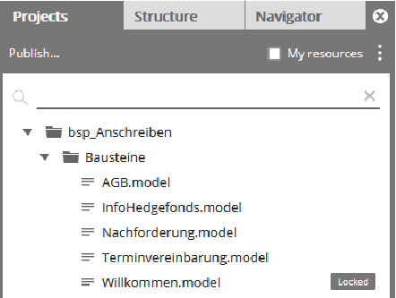|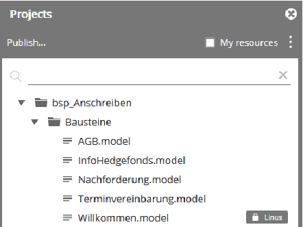|

Locked resources cannot be edited by other users, unless a user has the "Assign to me" permission (see ). Then the locking can be removed by this user (see Section 4.4.1, “General user rights”).

Resources will be unlocked

- • once they have been transferred to the Serie M/ Server by an administrator in the database mode,
- • they were transferred to the version control system in Git mode,
- • they have been reset by the Content Hub user (via Discard changes) or
- • they have been unlocked by the administrator (see Section 5.1, “Managing Content Hub overlay resources from M/Workbench”).

#### 5.1 Managing Content Hub overlayresources from M/Workbench

You can use M/Workbench to view and manage Content Hub resources. For example, you can unlock and delete overlay resources or export content in the event of conflicts.

Use the Content Hub resources and Folder views in the server perspective for this. In the Content Hub resources view, you will find a list of all Content Hub overlay resources (labeled with ) that are available on the Serie M/ server. In Git mode, the Content Hub Overlay resources are displayed individually for each branch of each repository.

In addition to the content hub overlay resources, "active" resources can also be displayed (labeled with ). The meaning of this status differs between Content Hub in database mode and in Git mode:

- • In database mode, the resources that have been synchronized into the database via repository synchronization are considered active.
- • In Git mode, the resources that have been committed to the connected version management system are considered active.

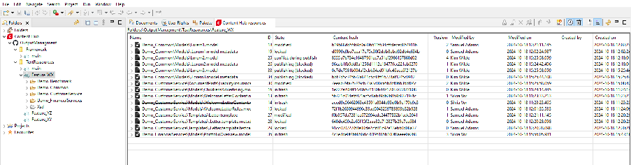

Among other things, you can view the status and the currently activated version of the resource here.

Please note that the displayed list can be filtered using the toolbar. You will find the explanations below.

You can perform the following actions on individual or multiple resources, among others (via the toolbar or the context menu):

•

Lock - can be used to avoid conflicts if you want to change resources in M/Workbench to which Content Hub users also have access.

- • Unlock - This action can only be applied to Content Hub resources. These are then marked as resources in the recycle bin. It cannot be applied to versions or resources in the recycle bin.
- • Delete versions from the recycle bin
- • Assign resources to a user - This action changes the user in the Changed by column and can only be applied to Content Hub resources and not to versions.
- • Compare - You can either compare two versions of a resource with each other or compare a resource with the active version of the resource.

•

Export - This action can only be applied to Content Hub resources and their versions. The action exports the resources to a directory on your computer.

•

Import - This action is activated in the toolbar when a project or a subfolder of the project is selected in the Folder view. The selected file is imported into the folder that was selected in the Folder view. Only the following files can be imported: Models, templates, .testcase files, .metadata files, graphics.

Importing from the context menu behaves differently to importing from the toolbar. You can only import one resource via the context menu, which is then imported as the focussed resource. If an active resource is focussed, a new content hub resource is created. If a content hub resource is focussed, it is overwritten by the new version.

• You can change the status of a Content Hub resource in the Properties view if the resource is focussed in the Content Hub resources view.

In the toolbar, you have various options for filtering the resources displayed. For example, you can show/hide active or deleted resources or display the previous versions of the resources.

- • Switch offline mode in Git mode:
- • If offline mode is not activated, the "active" resources in the respective repository/branch are displayed in addition to the Content Hub Overlay resources and you can manage them (e.g. lock them). The prerequisite for this is that you can access the VCS. This is possible with authorization via a static access token. This is not supported by M/Workbench for authorization via OAuth (version 6.15). This mode is slower than offline mode due to the access to the VCS.
- • In offline mode, there is no access to the version management system. You therefore only see the Content Hub Overlay resources (available in the Serie M/ database). You can manage these (e.g. unlock or change them). However, you cannot lock any active resources.
- • Show versions - If this filter is activated, all versions of all users are also displayed for each resource. The versions are displayed as sub-entries under each resource and do not have an icon. Individual versions of a resource can be compared with each other using the context menu. You also have the option of exporting the individual versions to a file or importing them from a file.

•

Show deleted resources - If this filter is activated, all resources in the recycle bin (marked as deleted) are also displayed. The names of these resources are crossed out.

- • Show active resources - If this filter is activated, all "active" resources are also displayed. These resources have a white file icon. This filter cannot be used together with the Show resources of all subfolders filter. The definition of active resources differs between the database mode and the Git mode (see above).
- • Show resources from all subfolders - If this filter is activated, all resources from all subfolders of the selected folder are displayed. This filter cannot be used together with the Show active resources filter.

#### 5.2 Resource status in detail

The following diagrams show which status Content Hub overlay resources receive as a result of which actions. The first diagram shows the standard case, the second the conflict case.

######### Figure 5.1. Possible statuses of Content Hub resources and associated actions in the standard case

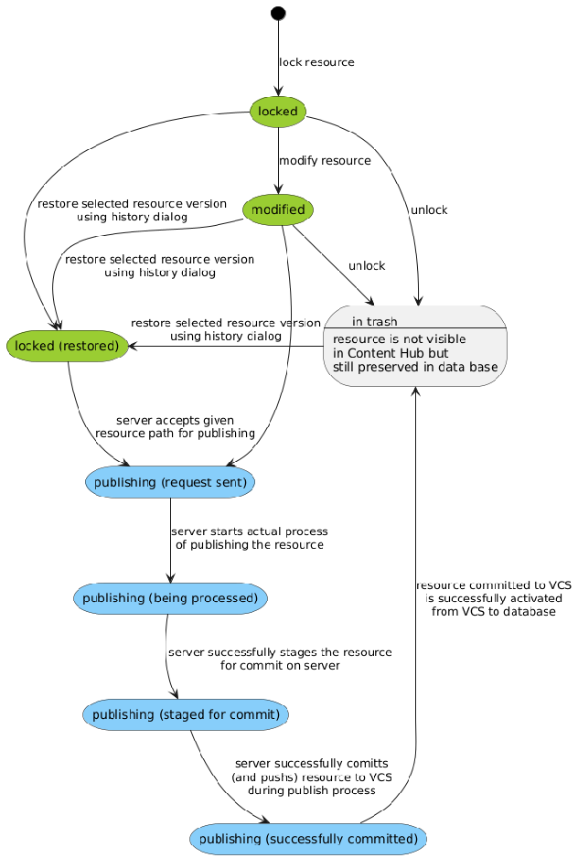

######### Figure 5.2. Possible statuses of Content Hub resources and associated actions in the event of a conflict

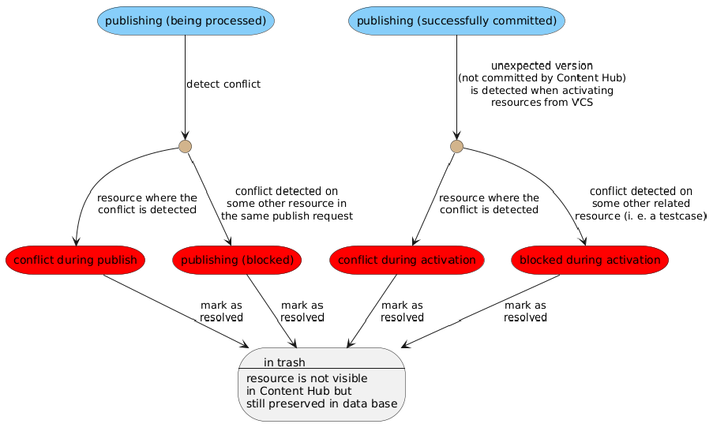

### 6. Conflict handling andtroubleshooting

Content Hub can only see resources that have already been activated in the database (database mode) or which are available in the VCS (Git mode). Publication is the process of transferring edited overlay resources out of the Content Hub database tables and into the version control system.

When the user starts to change a resource, the system saves the version of that resource in order to recognize potential conflicts later. When the changed resource is published, the original version must still be available in the VCS. In this case, the resource has not been changed by another user or process in the database or in the VCS and the change made by Content Hub can be applied without conflict.

The program determines whether or not the version is identical by calculating the resources’ VCS SHA-1-Hash at the time of publishing and comparing it to the hash saved in the database.

#### 6.1 Causes of conflicts

Version conflicts occur when a Content Hub user has edited a resource, but it is found in a different state in the Serie M/ Server after editing. This can be due to the following reasons:

- • Either someone else has edited the same resource in M/Workbench while the user was working on it in Content Hub, or
- • the resource had already been edited in the VCS when the Content Hub user began working on it, but the VCS edits were not synchronized with the database, that is the Content Hub user was editing an older version of the resource.

#### 6.2 Conflicts during publication

If a version conflict occurs in a changed file during the publishing process, Content Hub will:

- 1. Stop the publication process and assign the status CONFLICT_PUBLISH to the conflicted resource
- 2. Not transfer other resources that were part of the publication process (that are not themselves in a state of conflict) and mark them as BLOCKED_PUBLISH (displayed in the project explorer as "CONFLICT" on a white background)
- 3. An error dump will be created on the server. The dump contains conflicted and blocked resources as well as a text report summary.txt containing detailed information on each file (see also Section 4.3, “Setting up version control systems in the context of Content Hub ”).

- 4. handlePublishError will be called in the ANT script in the event that a conflict resolution can be implemented (e.g. zip the error dump and send it to the administrator).

To minimize such problems, it is recommended to perform repository synchronization automatically after each commit to the VCS. This can be done either by implementing a VCS hook

or by calling the repository synchronization tool from the commit target within the repository synchronization script.

#### 6.3 Conflicts during repositorysynchronization

Whenever a user works on a resource in ContentHub, i.e. modifies an existing resource or creates a new one, it may happen that some time later an external user (e.g. from M/Workbench) commits another version of the same version and this version is also synchronized with the database. This leads to a conflict with the ContentHub user who has not yet published his unfinished changes.

Conflicts of this type are detected during repository synchronization and the resource in Content Hub is marked as CONFLICT_UNLOCK.

If the conflicted resource in ContentHub has a "related" resource (e.g.

.Brief.template.metadata), then the related resource that is not directly conflicted is marked as BLOCKED_UNLOCK and included in the dump along with the summary.txt file and placed in unpublished_resource_conflicts on the server.

Following this, a handlePublishConflicts target is executed in the repository synchronization script to inform about the conflict.

In the user interface, the user can click on the conflicting resources and invoke Mark as resolved to discard the changes and release the resources.

Detection of unpublished conflicting resources is enabled by default, but can be disabled in Server.ini.

Directory structure on the server with sample error dump:

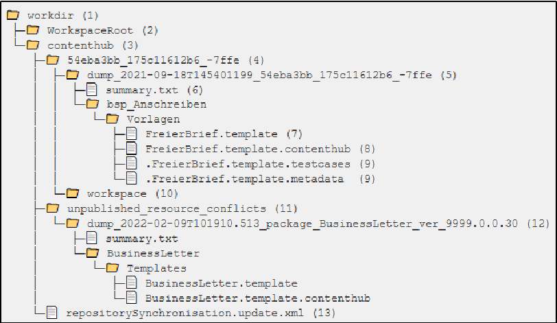

- • (1) Error dump directory of the server
- • (2) Working directory of the repository synchronization

- • (3) Working directory of ContentHub
- • (4) Working directory for a specific ContentHub user (named after the GUID of the user)
- • (5) Dump of failed releases, occurred on 2021-09-18T145401199 by user 54eba3bb_175c11612b6_-7ffe.
- • (6) Report with details about the failed publishing process
- • (7)conflicted file - version that was in the VCS
- • (8) conflicted file - modified version of Content Hub
- • (9) blocked files published together with the conflicted file
- • (10) Working copy of the repository where the changes will be published
- • (11) Verzeichnis zum Speichern von Dumps unveröffentlichter Ressourcenkonflikte
- • (12) Extract of conflicting unpublished resources (discovered during repository synchronization when the new version 9999.0.0.30 of the BusinessLetter package was activated)
- • (13) Copy of the synchronization script used for the publishing process

#### 6.4 Deleting overlay resources

When a user edits a template and it is automatically locked, a copy of this template is created in the database instead of overwriting the original version. With each subsequent change and save, another version of the resource is stored in the database. This is how so-called overlay resources accumulate, which are not visible in Content Hub. On the one hand, however, they can be restored via the version history (context menu History) and on the other hand they block the deletion of seemingly empty folders by the user.

To change this behaviour, there is an optional property deletePublishedResourceHistory in the server.ini configuration file (default is false). This allows obsolete overlay resources to be deleted when publishing an edited template (true) or, as before, only to be marked as "deleted" (false). The history of the template and associated versioned "blobs" such as images are also deleted.

From the following database tables will be deleted:

- • mxcs_overlay_resource
- • mxcs_overlay_resourceblobs
- • mxcs_overlay_resourceversions The following entry must be made in the server.ini configuration file:

|[Tonic|ContentHub] deletePublishedResourceHistory=true|false|
|---|

The explicit deletion of resources from the database can be carried out using the following statement:

|DELETE FROM <schema>.mxcs_overlay_resource|
|---|

<schema> is the name of the schema used to save M/TEXT tables.

#### 6.5 Updating the in-memory workspacemodel

It is possible to update the in-memory workspace model via the Content Hub user interface. To do this, hold down the Shift key and click on the three vertically arranged dots and Refresh server workspace in the Project Explorer menu. This will update the workspace on the connected server.

In a cluster environment, this function currently only updates the workspace model on the server node that is processing the request (version 6.15).

#### 6.6 Dump diagnostic data of the ContentHub

Connect to an M/TEXT server in M/Workbench, right-click on the server descriptor and select Dump Content Hub diagnostic data. This will output information about the Git mode workspace model in memory, associated caches and rate limit counters (if available) in text format.

In a cluster environment, this function currently only outputs data from the M/TEXT server node connected to M/Workbench (version 6.15).

#### 6.7 Displaying empty project folders

It may be the case, when preparing projects, that you have already created/prepared folders for accepting new contents (models, templates, etc.), but have not yet filled the folders with any resources.

If you create these folders in M/Workbench but leave them empty, then they will not be adopted into the run time database by repository synchronization. They will therefore not be visible from within the Content Hub and cannot be used to save new models or other elements.

This can be easily avoided, however, by adding an (empty) file to the empty folder in Workbench. Use ".empty.properties" as the file name (please note the period at the beginning of the name). Once you have added this file, the folder is no longer empty and repository synchronization will create it in the (Content Hub) database.

Make sure that .empty.properties files are not ignored by your version control system: if they are, the files will not be transferred and this process will not work.

You can see which folders are available in the database in the M/Workbench M/TEXT Server perspective, Folders view.

