## Serie M/ 6.16

Anwenderhandbuch

# Textredaktion mit M/TEXT TONIC Content Hub

Handbuch herausgegeben am 16.05.2025

Tipp: Für die zentralen Begriffe im Rahmen der Serie M/ steht das "Glossar zur Serie M/" als gesonderte PDF-Datei zur Verfügung.

Feedback: Das vorliegende Handbuch wurde mit großer Sorgfalt recherchiert und zusammengestellt. Sollten Sie dennoch auf einen Fehler, eine Ungenauigkeit oder eine Unvollständigkeit stoßen, bitte informieren Sie uns (<documentation@kwsoft.de>).

Hinweis: Die Datenbanken unserer Produkte dürfen nur über das Produkt selbst geändert

werden. Andernfalls können wir keine Gewähr dafür übernehmen, dass das Produkt weiterhin problemlos läuft. Zudem behalten wir uns vor, die Struktur der Datenbank jederzeit und ohne vorherige Ankündigung zu ändern.

|Bedeutung der im Handbuch verwendeten Symbole|Bedeutung der im Handbuch verwendeten Symbole|Bedeutung der im Handbuch verwendeten Symbole|Bedeutung der im Handbuch verwendeten Symbole|
|---|---|---|---|
||Beispiel||Systemabhängig|
||Bitte beachten||Voraussetzung (Ausnahme, Einschränkung)|
||Hintergrund||Warnung|
||Hinweis||Querverweis|
||Datenschutz||Beispielvideo|

Copyright © 2025 kühn & weyh Software GmbH

Linnéstr. 1-3, D-79110 Freiburg Telefon 0761/8852-0 Telefax 0761/8852-666 E-Mail documentation@kwsoft.de Homepage www.kwsoft.de

##### Inhalt

- 1. Was ist neu? .......................................................................................................................... 1

- 1.1. Neue Features in Release 6.16 .................................................................................... 1

2. Einführung ............................................................................................................................. 2

- 2.1. Funktionen .................................................................................................................. 2

- 4. Ressourcenstatus ................................................................................................................. 55

- 2.2. Der Ressourcen-Workflow in Content Hub .................................................................. 3

3. Arbeiten im Redaktionssystem .............................................................................................. 4

- 3.1. Der Bearbeitungsworkflow .......................................................................................... 4

- 3.1.1. Vorlagen im Projektexplorer öffnen .................................................................. 4
- 3.1.2. Neue Vorlagen erstellen ................................................................................... 5
- 3.1.3. Bestehende Ressourcen ändern ....................................................................... 6
- 3.1.4. Ressourcen veröffentlichen ............................................................................ 10

- 3.2. Einführung in das Dokumentenmodell ...................................................................... 11
- 3.3. Bearbeiten und Einfügen von Dokument-Elementen ................................................. 13

- 3.3.1. Formularfelder einfügen ................................................................................ 13
- 3.3.2. Grafiken und Anlagen einbinden .................................................................... 16
- 3.3.3. Dokumentenlogik ........................................................................................... 18
- 3.3.4. Bausteine ....................................................................................................... 22
- 3.3.5. Auswahl ......................................................................................................... 24
- 3.3.6. Referenzen auf Ressourcen ............................................................................ 26
- 3.3.7. Übersetzungen ............................................................................................... 27
- 3.3.8. Barcodes ........................................................................................................ 30
- 3.3.9. Guide-Elemente und Dateneingabe-Elemente ................................................ 32
- 3.3.10. Änderungsrechte .......................................................................................... 39
- 3.3.11. Metadaten .................................................................................................... 41

- 3.4. Funktionen auf der Content Hub-Oberfläche ............................................................ 42

- 3.4.1. Daten-Ansicht ................................................................................................. 42
- 3.4.2. Grammatikprüfung ......................................................................................... 44
- 3.4.3. Referenzsuche ................................................................................................ 45
- 3.4.4. Lineale ........................................................................................................... 46
- 3.4.5. Der Quellcode-Editor ...................................................................................... 46
- 3.4.6. Die Ausgabe-Optionen ................................................................................... 47
- 3.4.7. Tastaturbedienbarkeit .................................................................................... 47
- 3.4.8. Navigator ....................................................................................................... 48

- 3.5. Kommentare einfügen .............................................................................................. 49
- 3.6. Arbeiten mit Mandanten ........................................................................................... 50 3.6.1. Mandantenspezifische Grafiken ...................................................................... 51
- 3.7. Arbeiten mit (Feature-)Branches ............................................................................... 52
- 3.8. Fehlerbehebung ........................................................................................................ 54

- 3.8.1. Leere Ordner löschen .................................................................................... 54
- 3.8.2. Aktualisierung des In-Memory-Arbeitsbereichs ............................................... 54

- 4.1. Manuelles Sperren und Entsperren von Ressourcen ................................................. 55
- 4.2. Versionskonflikte ....................................................................................................... 56

- 4.2.1. Ursachen von Versionskonflikten ................................................................... 56
- 4.2.2. Umgang mit Versionskonflikten ...................................................................... 56

Textredaktion mit M/TEXT TONIC Content Hub 6.16 iii

### 1. Was ist neu?

Unsere Produkte werden fortlaufend verbessert und weiterentwickelt. Sämtliche Neuerungen, Hinweise zur Kompatibilität, Verbesserungen sowie Korrekturen für das Release 6.16 finden Sie in den zugehörigen ReleaseNotes.

Eine Auswahl der besonders hervorzuhebenden Änderungen für M/TEXT TONIC Content Hub finden Sie nachfolgend aufgelistet.

#### 1.1 Neue Features in Release 6.16

######## Arbeitsweise

- • Sie haben nun die Möglichkeit, sich anzeigen zu lassen, in welchen Vorlagen oder Bausteinen die Bausteine aufgerufen werden, die Sie bearbeiten möchten. Auf diese Weise vermeiden Sie Änderungen in Vorlagen, die Sie nicht vorgesehen haben (siehe Abschnitt 3.4.3, „Referenzsuche“).

- • Der Content Hub unterstützt nun die Erstellung und Bearbeitung von Formularfeldern (Textfeld, Kombinationsfeld, Optionsfeld usw.). Formularfeldern können per Kontextmenü eingefügt werden (siehe Abschnitt 3.3.1, „Formularfelder einfügen“).

######## Stile

• Allen Elementen im Strukturbaum können jetzt vordefinierte benannte Stile zugewiesen werden. Dies erfolgt über die Reiter Eigenschaften - Allgemein.

### 2. Einführung

Der Prozess der Vorlagenerstellung beinhaltet sowohl technische als auch fachliche Aspekte. In der Praxis werden die entsprechenden Aufgaben typischerweise von Personen mit unterschiedlichen Kompetenzen und Rollen durchgeführt.

Technische Redakteure erstellen die Rahmenvorlage und zugehörige Ressourcen-Frameworks mit zentralen Elementen wie Layouts und Stilen (CI/CD). Sie kümmern sich um die vorlagenspezifische Datenversorgung und legen die Regeln für die Ausgabesteuerung und die damit verbundene grundsätzliche Struktur der Vorlage fest. Die technische Redaktion erfolgt mit M/Workbench.

Fachliche Redakteure erweitern die Rahmenvorlage um die fachlichen Inhalte. Sie erstellen Texte, Tabellen und Formulare und verwenden dabei Elemente, die durch die Rahmenvorlage und das Ressourcen-Framework zur Verfügung gestellt werden (Stile, Bausteine, Grafiken, ...). Die fachliche Redaktion erfolgt typischerweise in den Fachabteilungen der Unternehmen.

M/TEXT TONIC Content Hub ist das Redaktionssystem der Serie M/. Es ermöglicht die Erstellung und Änderung von M/TEXT TONIC Vorlagen und Bausteinen im Rahmen des fachlichen Redaktionsprozesses. Der Umgang mit Content Hub im Rahmen der fachlichen Redaktion ist in

- diesem Handbuch beschrieben.

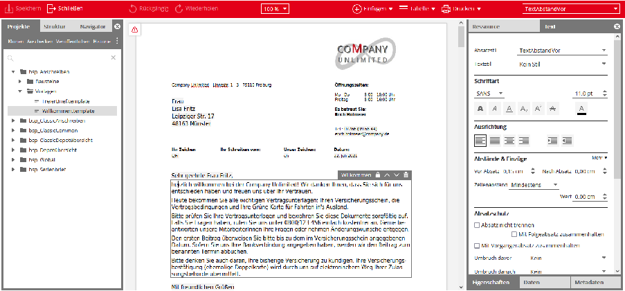

#### 2.1 Funktionen

Vorlagen und Bausteine, die mit dem Redaktionssystem erstellt oder bearbeitet werden, sind Teil der Serie M/ Projektstruktur. Das Redaktionssystem verfügt über einen Projekt-Explorer,

- in dem alle Anwendungsprojekte angezeigt werden. Projekte der technischen Redaktion (Bibliotheksprojekte), in denen sich die Ressourcen befinden, die in der fachlichen Redaktion nur verwendet werden, werden im Projekt-Explorer nicht angezeigt.

Die Erstellung von Vorlagen im Redaktionssystem erfolgt nur in Anwendungsprojekten und basiert immer auf Rahmenvorlagen, die durch technische Redakteure vorbereitet wurden. Eine neue Vorlage wird durch Klonen einer Rahmenvorlage in einem Assistenten erzeugt. Rahmenvorlagen, die durch technische Redakteure in Anwendungsprojekten abgelegt wurden, können direkt bearbeitet werden. Falls ein Anwendungsprojekt nicht im Content Hub sichtbar ist, kann eine entsprechende Berechtigung fehlen. Die Pflege der fachlichen Inhalte einer Vorlage

Einführung

erfolgt mit einem Editor, der grundsätzlich dem TONIC Anwendereditor entspricht. Der Editor ist zusätzlich mit einem Strukturbaum ausgestattet.

Über den Strukturbaum und über den WYSIWYG-Editor können unter anderem folgende Aktionen vorgenommen werden:

- • Erstellung und Bearbeitung von Containern, Absätzen, Absatzteilen (Spans), Tabellen, Grafiken, Barcodes, Formularfeldern
- • Erstellung und Bearbeitung von Übersetzungstexten für Absätze
- • Zugriff auf Datenmodellknoten, um deren Werte auszugeben oder sie in Bedingungen, Fallauswahlen oder Schleifen zu verwenden
- • Füllen von Inhaltserweiterungen aus Framework-Bausteinen
- • Einfügen von Bausteinen
- • Bearbeitung von Bausteinen aus Anwendungsprojekten
- • Extraktion von Inhalten als Bausteine in Anwendungsprojekte
- • Erstellung und Bearbeitung interner Kommentare
- • Erstellung und Bearbeitung von Guide- und Dateneingabeelementen zur interaktiven Bearbeitung des Dokuments im TONIC Anwendereditor
- • Bearbeitung von Benutzerberechtigungen für Dokumentteile.

#### 2.2 Der Ressourcen-Workflow in ContentHub

Für Ressourcen, die im fachlichen Redaktionsprozess bearbeitet werden, gelten die gleichen Anforderungen an Versionierung und ein koordiniertes Deployment, wie für die Ressourcen des technischen Redaktionsprozesses in M/Workbench. Deshalb basiert auch die Ressourcenpflege im Redaktionssystem M/TEXT TONIC Content Hub auf dem Versionsverwaltungssystem, welches auch M/Workbench zugrunde liegt. Zur Vereinfachung für die Benutzer werden die benötigten Operationen (Checkout, Commit, ...) vom System intern durchgeführt.

Zur Vereinfachung verhindert das Redaktionssystem Konfliktsituationen, die bei der konkurrierenden Ressourcenbearbeitung auftreten können. Nimmt ein Benutzer eine Ressource in Bearbeitung, bleibt sie bis zur Änderungsveröffentlichung oder bis zum Rückgängigmachen der Änderungen für andere Content Hub-Benutzer im Content Hub gesperrt. Die vorgenommenen Änderungen sind bis zur Änderungsveröffentlichung nur für den ändernden Benutzer sichtbar.

Die Veröffentlichung erfolgt mit einem Assistenten, mit dem die Ressourcen, die veröffentlicht werden sollen, aus der Liste der bearbeitenden Ressourcen ausgewählt werden und ein Veröffentlichungskommentar eingegeben wird. Die Veröffentlichung bewirkt ein Aufheben der Sperre und einen Commit in das zugeordnete Versionsverwaltungssystem. Die geänderten Ressourcen sind nach der Veröffentlichung für andere fachliche Redakteure sichtbar.

Durch die Funktion "Ordne mir zu" haben Benutzer die Möglichkeit, eine gesperrte Ressource zu übernehmen und den geänderten, unveröffentlichten Stand der Ressource weiter zu bearbeiten.

### 3. Arbeiten im Redaktionssystem

Der Aufruf von M/TEXT TONIC Content Hub erfolgt über die URL http://<hostname>:<portname>/ contenthub.

|http://localhost:8080/contenthub|
|---|

Je nach Konfiguration werden Sie nach der Anmeldung an Content Hub auf eine Git-HostingPlattform weitergeleitet und dort gebeten, Berechtigungen für Ressourcen zu gewähren.

Nachfolgend wird die zentrale Arbeitsweise des Produkts erläutert und es werden weitere Funktionalitäten vorgestellt.

#### 3.1 Der Bearbeitungsworkflow

##### 3.1.1 Vorlagen im Projektexplorer öffnen

Um eine Dokumentvorlage zu ändern, doppelklicken Sie hierzu auf die Vorlage innerhalb des Projektexplorers. Sie öffnet sich im Editorbereich.

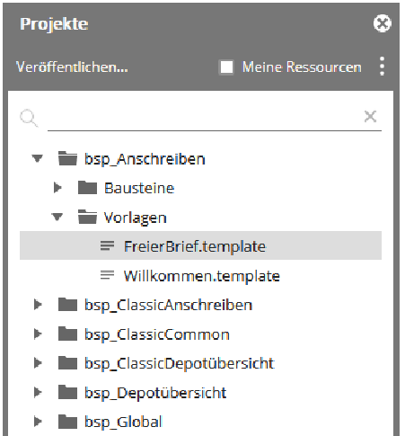

Der Editor öffnet sich. Die Vorlage und darin enthaltene Bausteine können geändert werden.

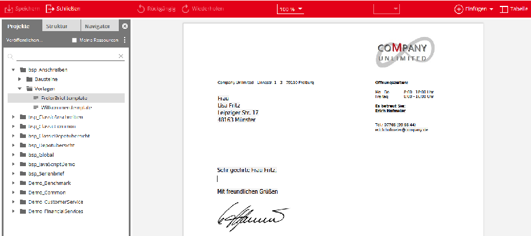

Ist eine Dokumentbearbeitung erforderlich oder liegen Fehler im Dokument vor, so erscheint links oben neben dem geöffneten Dokument ein Warn-Symbol. Beim Anklicken öffnet sich eine Box mit detaillierten Informationen.

Ordner der höchsten Ebene werden in M/TEXT Projekte genannt. Sie besitzen zusätzliche Eigenschaften, die untergeordnete Ordner nicht haben können.

##### 3.1.2 Neue Vorlagen erstellen

Um eine neue Vorlage zu erstellen, wird eine bereits bestehende Vorlage geklont und dann entsprechend verändert. So werden Elemente, die über ein Framework zur Verfügung gestellt werden, wie z. B. das Briefpapier, Fußleisten und Adressfelder einfach übernommen und müssen nicht erstellt werden.

Markieren Sie zum Klonen eine Vorlage im Projektexplorer und wählen Sie im Kontextmenü Klonen. Vergeben Sie außerdem einen Namen und bestimmen Sie einen Zielordner und wählen Sie dann Klonen. Sie können im Dialog über den Button Ordner erstellen einen neuen Ordner im Ressourcenspeicher erstellen. Dieser wird allerdings nur dann übernommen, wenn Sie auch direkt eine Vorlage in den Ordner ablegen. Ansonsten erscheint der Ordner nach Schließen des Dialogs nicht im Projektexplorer.

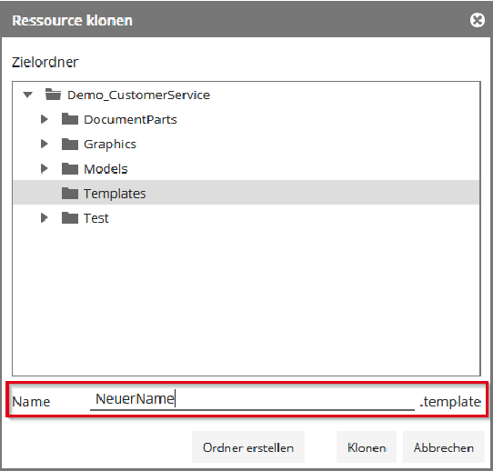

Sie haben eine neue Vorlage erstellt, die den gleichen Inhalt hat wie die geklonte Vorlage. Im Projektexplorer ist die Vorlage mit der Markierung Neu versehen. Durch einen Doppelklick auf die Vorlage im Projektexplorer wird die Vorlage geöffnet und kann bearbeitet werden.

##### 3.1.3 Bestehende Ressourcen ändern

Wenn Sie eine Vorlage im Editorbereich geöffnet haben, können Sie die Vorlage und die Bausteine bearbeiten, aus denen die Vorlage besteht. Klicken Sie in den Text der Vorlage. Es erscheint ein Rahmen, der zeigt, zu welchem Baustein der Text gehört. Am oberen Rand dieses Rahmens kann der Baustein verschoben oder gelöscht werden.

Wenn Sie eine Änderung durchführen, erscheint oben rechts im Inhalt ein Zauberstab-Symbol

. Es kennzeichnet, dass in der Vorlage geänderte Ressourcen enthalten sind bzw. die Vorlage geändert wurde. Eine Übersicht über die Ressourcen, die Sie geändert oder erstellt haben, finden Sie im Projektexplorer. Markieren Sie dazu das Kontrollkästchen bei Meine Ressourcen.

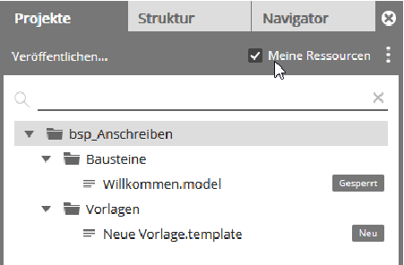

Speichern Sie Ihre Änderungen über die Tastenkombination <STRG + S> oder über den Button Speichern. Im folgenden Dialog können Sie entscheiden, welche geänderten Ressourcen gespeichert werden sollen und welche Ihrer Änderungen Sie verwerfen wollen. Über den Button Rückgängig wird die Ressource in ihren ursprünglichen Zustand zurückversetzt.

Das Speichern von Änderungen führt noch nicht zu deren Veröffentlichung. Bis zur Veröffentlichung sind die Änderungen nur für Sie selbst sichtbar.

Um eine Vorlage zu schließen, klicken Sie auf den Button Schließen in der Symbolleiste.

###### 3.1.3.1 Bausteine einfügen

Um einen bereits bestehenden Baustein in die Vorlage einzufügen, klicken Sie an die entsprechende Stelle, z. B. an das Ende eines Textbausteins und wählen Sie die #-Taste oder wählen Sie im Kontextmenü Einfügen – Baustein. Sie können dann links im Bereich Baustein einfügen einen Baustein auswählen. Im linken Bildschirmbereich kann zwischen Aus Projekt einfügen oder Aus Suchbaum einfügen gewählt werden. Die darin verfügbaren Bausteine werden dann unten angezeigt und können durch Anklicken eingefügt werden.

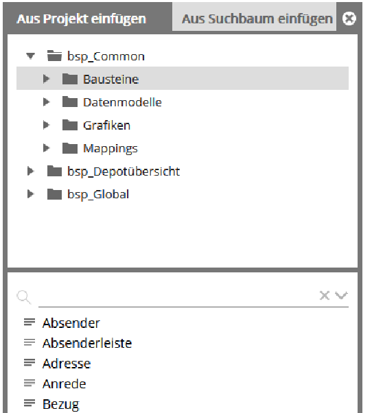

Wenn die für einen Baustein benötigten Daten nicht verfügbar sind, fragt das System diese ab:

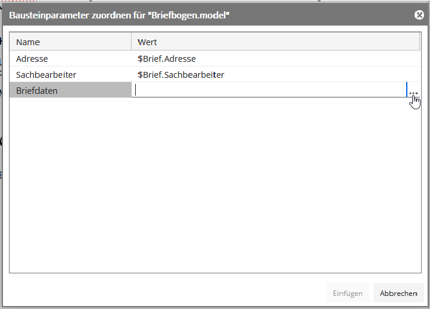

Ein Baustein kann auch im Strukturbaum (Register Struktur) über das Kontextmenü eingefügt werden.

Um einen Baustein zu ändern, fügen Sie ihn in eine Vorlage ein und nehmen Sie die Änderungen dort vor. Dabei wird der Baustein automatisch gesperrt, so dass andere Benutzer ihn nicht bearbeiten können.

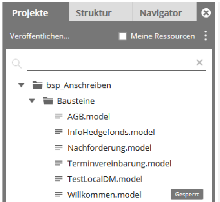

Bitte beachten Sie, dass sich die Änderung eines Bausteins auch auf alle Vorlagen auswirkt, die diesen Baustein referenzieren. Um herauszufinden, welche Vorlagen den Baustein referenzieren, nutzen Sie die Refernzsuche im Kontextmenü des Bausteins (siehe Abschnitt 3.4.3, „Referenzsuche“).

Ausführlichere Informationen zum Umgang mit Bausteinen finden Sie im Abschnitt 3.3.4, „Bausteine “.

###### 3.1.3.2 Absätze einfügen

In Content Hub können Absätze auf zwei verschiedene Arten eingefügt werden: innerhalb eines Bausteins oder vor bzw. nach einem Baustein.

Mit <Enter> wird ein Absatz innerhalb eines Bausteins an der Cursor-Position eingefügt. Befindet sich der Cursor am Anfang bzw. Ende eines Bausteins kann mit <Alt + Enter> ein Absatz auch vor bzw. nach dem Baustein eingefügt werden.

###### 3.1.3.3 Einfügen weiterer Elemente

In Content Hub können neben Bausteinen und Absätzen verschiedene andere Elemente in Dokumente eingefügt werden, unter anderem:

- • Über das Kontextmenü Einfügen - Daten können die Werte von Datenmodellknoten im Dokument ausgegeben werden.
- • Über das Kontextmenü Einfügen - Symbol können Sonderzeichen eingefügt werden.
- • Über das Kontextmenü Einfügen - Grafik bzw. Einfügen - Anlagen können Grafiken oder Anlagen eingefügt werden (siehe Abschnitt 3.3.2, „Grafiken und Anlagen einbinden“).

- • Über das Kontextmenü Einfügen - Barcode können Barcodes eingefügt werden (siehe Abschnitt 3.3.8, „Barcodes“).

- • Über das Kontextmenü des Strukturbaums Einfügen - Logik können Kontroll-Strukturen (Schleife, Bedingung, Fallauswahl, Fall) eingefügt werden. Diese umschließen das Element, auf

- dem das Kontextmenü geöffnet wurde (siehe Abschnitt 3.3.3, „Dokumentenlogik“).

• Über das Kontextmenü Einfügen - Benutzerinteraktion können Sie eine Benutzerinteraktion für die Endanwenderinnen und Endanwender erstellen. Die Benutzerinteraktion kann DatenFelder, Feldgruppen, Aktionsverknüpfungen, Inhaltsverknüpfungen und Guide-Ordner enthalten (siehe Abschnitt 3.3.9, „Guide-Elemente und Dateneingabe-Elemente“).

3.1.4 Ressourcen veröffentlichen

Um geänderte und gespeicherte Ressourcen zu veröffentlichen, wählen Sie im Projektexplorer

- den Button Veröffentlichen. Im folgenden Dialog werden Ihnen alle geänderten Ressourcen angezeigt.

Markieren Sie die Ressourcen, die Sie veröffentlichen möchten und geben Sie einen Änderungskommentar ein. Wenn Sie auf Veröffentlichen klicken, werden die Änderungen an das angeschlossene Versionsverwaltungssystem übergeben. Nach dem nächsten Deployment stehen die geänderten Ressourcen für alle Benutzer zur Verfügung.

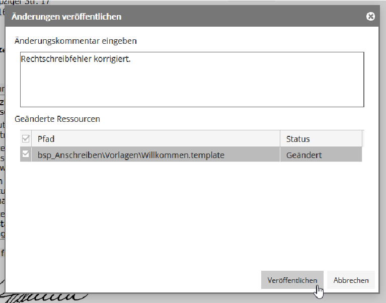

#### 3.2 Einführung in das Dokumentenmodell

Eine TONIC-Dokumentvorlage setzt sich aus verschiedenen Dokument-Elementen zusammen. Diese beschreiben den Inhalt, die Dynamisierungsregeln und die Datensituation des Dokuments. Die Elemente sind hierarchisch angeordnet und unterliegen klar definierten Regeln zur Schachtelung. Auf der äußersten Ebene befindet sich das Dokument, in dem ein oder mehrere Abschnitte enthalten sind. Darin enthalten sind ein oder mehrere Container, in denen Tabellen, Absätze, Grafiken usw. enthalten sind. In Dokumentinstanzen sind zusätzlich die Dokumentdaten in Form von Datenmodellen enthalten.

Anders als im TONIC Anwendereditor wird im Content Hub Editor die Struktur des Dokuments nebem dem WYSIWYG-Bereich abgebildet (WYSIWYG von engl. "what you see is what you get"). Nicht alle Elemente dieser Struktur sind bearbeitbar.

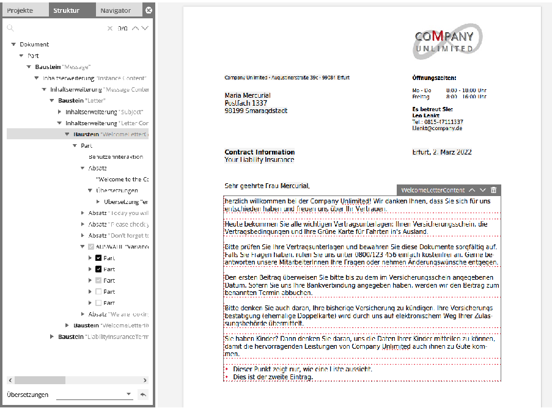

Wenn Sie im Bereich Struktur ein Element anklicken, wird es im Editorbereich fokussiert und umrandet dargestellt. Außerdem werden weitere Sichten im Bereich Eigenschaften angezeigt, in denen Einstellungen vorgenommen werden können, die sich auf das entsprechende Element beziehen.

Anders herum passt sich der Bereich Struktur dem Fokus im Editorbereich an. Die Struktur wird ausgeklappt, wenn Sie ein Element im Editorbereich anklicken. Wenn es sich bei dem Element um Bestandteile der Vorlage handelt, die Sie nicht verändern können, sehen Sie in der Struktur nur den Baustein. Wenn Sie Änderungsrechte haben, sehen Sie weitere Strukturelemente wie Container, Absätze, Absatzteile, Tabellen oder Benutzerinteraktionen.

Eine besondere Stelle nehmen Parts ein, die nicht direkt ein angezeigtes Element darstellen, sondern der Dynamisierung des Dokuments dienen. Sie kapseln ein oder mehrere Elemente des Dokumentenmodells, um

- • sie mit einer Sichtbarkeitsbedingung (WENN) zu versehen,
- • sie in einer Schleife (FÜR ALLE) wiederholt zu produzieren,
- • sie mit einer Fallauswahl zu versehen,
- • ihnen Änderungsrechte zuzuweisen. Diesen Funktionen entsprechend werden Parts im Bereich Struktur unterschiedlich dargestellt:

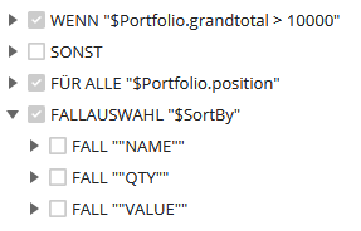

#### 3.3 Bearbeiten und Einfügen vonDokument-Elementen

##### 3.3.1 Formularfelder einfügen

Formularfelder sind Elemente, die in einem interaktiven Ausgabeformat (PDF, HTML) dazu dienen, eingegebene Daten zu speichern. Sie erzeugen interaktive Elemente im Ausgabeformat und kommen insbesondere in Formularen zum Einsatz. An den Feldern können PDF- und HTML-spezifische Feldereignisse festgelegt werden. Formularfelder können im Kindelement Feldbezeichner (Label) die Beschriftung eines Feldes aufnehmen.

Über das Kontextmenü können Formularfelder in eine Vorlage eingefügt werden.

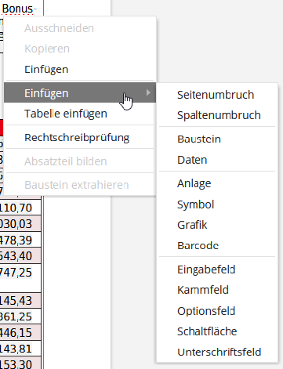

Es gibt die folgenden Typen von Formularfeldern:

- • Eingabefelder (InlineField) können mit einem Datenmodellknoten verknüpft werden. So kann eine Vorbelegung im Formular stattfinden und der eingegebene Wert gespeichert werden. Die am Datenmodellknoten definierten Validierungs- und Formatregeln können im PDFFormular direkt bei der Eingabe überprüft werden. Das Erscheinungsbild von Eingabefeldern

- unterscheidet sich je nach Wert des Dialogfelds im Bereich Validierung, wobei die möglichen Werte hier abhängig vom Typ des Datenmodellknotens sind: Textfeld (Dialogfeld Eingabefeld), Dropdown-Liste/Kombinationsfeld (Dialogfeld Kombinationsfeld), Checkbox (Typ Boolean, Dialogfeld Kontrollkästchen), Datumsfeld oder Zeit-Feld (Typ Datum und Uhrzeit).
- • Kammfelder sind Eingabefelder, bei denen es eine Abtrennung zwischen den einzugebenden Zeichen gibt. Die Kammfeld-Eigenschaften werden einem Eingabefeld über Stile zugeordnet. Im Feldbezeichner eines Kammfeldes sind automatisch Tabulatoren an den Stellen vorhanden, an denen die Zonenpositionen beginnen. So lässt sich beispielsweise ein Kammfeld zur Eingabe eines Datums mit separaten Zonen für Tag, Monat und Jahr einfach beschriften.
- • Optionsfelder (InlineRadioButton) dienen der Auswahl einer Option. Jedes Optionsfeld im Formular kann sich entweder im Zustand ausgewählt oder nicht ausgewählt befinden. Gibt es für einen Datenmodellknoten mehrere mögliche Werte, kann das anhand von mehreren Optionsfeldern abgebildet werden. Jedem Optionsfeld wird dabei ein Wert aus der Werteliste zugeordnet. Die Eigenschaften einer Gruppe von Optionsfeldern wird im DOM-Element PDFOptionsfeldgruppe (PDFRadioGroup) konfiguriert. Dieses ist ein Kindelement einer Section. Es hat keine grafische Darstellung im Dokument.
- • Schaltflächen (InlinePushButton) erzeugen im interaktiven Formular einen Button, der beim Anklicken eine Aktion anstößt. Die Aktionen werden über Feldereignis-Stile zugewiesen.
- • Unterschriftsfelder (InlineSignature) erzeugen im interaktiven Formular ein Unterschriftsfeld, das digital signiert werden kann.

|Eigenschaft|Beschreibung|
|---|---|
|Datenmodellknoten|Gibt den zugehörigen Datenmodellknoten an.|
|Beschreibung|Enthält die Beschreibung eines Elements. Diese wird bei einigen Elementen im Anwendereditor angezeigt und kann von einemScreenreader vorgelesen werden.  Für Optionsfelder gilt: Die Beschreibung wird in PDF-Viewern als Hinweis angezeigt und von Screenreadern vorgelesen, wenn keine Feld-ID angegeben ist.|
|Feld-ID (PDF, HTML)|Name des Feldes, der an ein PDF- oder HTML-Formular übergeben wird. Korrespondiert mit dem HTML-Attribut name.  Mögliche Werte sind ein String oder der Verweis auf einen Datenknoten (kein vollständiges JavaScript). Der Verweis wird bei der Formatierung aufgelöst und der formatierte Datenknotenwert wird als Feld-ID im PDF/HTML verwendet.  Wenn der Wert nicht mit einem Dollar-Zeichen beginnt, wird er als String interpretiert. Ein Punkt am Anfang des Wertes dient als Escape-Zeichen, falls Sie einen String verwenden wollen, der mit einem Dollar-Zeichen beginnt.    Der Wert Feld erzeugt ein Feld mit dem Namen "Feld" in der PDF-Datei.  Beim Wert $Feld1 wird der Datenknoten Feld1 verwendet. Ist der Datenknoten vorhanden, werden Punkte aus seinem formatierten Wert entfernt und das Ergebnis wird als Feldname in der PDF-Ausgabe verwendet. Wenn der Datenknoten nicht existiert, wird ein Formatierungsfehler erzeugt.  Der Wert .$Feld1 erzeugt ein Feld mit dem Namen "$Feld1" in der PDF-Datei.|

|Eigenschaft|Beschreibung|
|---|---|
| |Für Optionsfelder gilt: Der Wert der Feld-ID wird in PDFViewern als Hinweis angezeigt und von Screenreadern vorgelesen.|
|Formular-ID (HTML)|Ordnet das Feld einem HTML-Formular zu. Entspricht dem HTML-Attribut form.|
|Rechtschreibprüfung|Gibt an, ob in einem Element Rechtschreibkontrolle benutzt werden soll oder nicht.|
|Kammfeld|Legt fest, ob ein Eingabefeld als Kammfeld abgebildet wird. Kammfelder sind durch vertikale Linien in Kammern geteilt, in die jeweils ein einzelnes Zeichen eingegeben werden kann. Weitere Voraussetzungen, damit ein Feld als Kammfeld dargestellt wird: Die Stileigenschaften Kammfeld und Maximale Länge sind gesetzt.  Mögliche Werte sind: Kein (normales Eingabefeld), Kammfeld (Kammfeldlinien), Unterstrichen (nur die untere Kammfeldlinie wird gedruckt. Die Kammfeldeigenschaften zu Zonen-, Anfangs und Schlusslinienhöhe und -stärke werden ignoriert. Mit dieser Option lassen sich Eingabefelder mit einer Linie darunter darstellen.)|
|Maximale Länge|Gibt die maximale Zeichenanzahl an, die in das Textfeld eingegeben werden darf. Bei Kammfeldern ist dieser Wert obligatorisch und gibt die Anzahl der Kammern an. Wenn der Kammfeldmerker Kammfeld nicht gesetzt ist, kann die Limitierung der Zeichenanzahl durch die Angabe des Wertes -1 aufgehoben werden.|
|Kammfeld, Zonen (Positionen)|Kommaseparierte Liste mit aufsteigenden ganzen Zahlen, die die Positionen der Zonentrenner angeben. Die Angabe 2,5,10 erzeugt z.B. Zonenlinien nach dem zweiten, fünften und zehnten Zeichen.|
|Werteindex|Optionsfelder werden für Datenmodellknoten eingesetzt, bei denen eine Werteliste hinterlegt ist und einer der Werte "angekreuzt" werden soll. Üblicherweise wird für jeden Eintrag der Werteliste ein Optionsfeld erzeugt. Alle Optionsfelder zum gleichen Datenmodellknoten werden mit der gleichen Gruppen-ID versehen, sodass nur eines im fertigen Dokument vom Nutzer ausgewählt werden kann. Die Eigenschaft Werteindex gibt den Wert der Werteliste an, zu dem das Optionsfeld gehört. Dabei steht der Wert 0 für das erste Element der Werteliste, der Wert 1 für das zweite und so weiter. Der Wert -1 bedeutet, dass das Optionsfeld immer aktiviert ist.  Wenn für das Optionsfeld keine Feld-ID und keine Beschreibung gesetzt sind, wird die Beschreibung des Wertes in PDF-Viewern als Hinweis angezeigt und von Screenreadern vorgelesen. Existiert keine Beschreibung des Wertes, wird der Wert selbst herangezogen.|
|Gruppen-ID (PDF, HTML)|Gruppen-ID, die an ein PDF- oder HTML-Formular übergeben wird.  Mögliche Werte sind ein String oder der Verweis auf einen Datenknoten (kein vollständiges JavaScript). Der Verweis|

|Eigenschaft|Beschreibung|
|---|---|
| |wird bei der Formatierung aufgelöst und der formatierte Datenknotenwert wird als Gruppen-ID im PDF verwendet.  Wenn der Wert nicht mit einem Dollar-Zeichen beginnt, wird er als String interpretiert. Ein Punkt am Anfang des Wertes dient als Escape-Zeichen, falls Sie einen String verwenden wollen, der mit einem Dollar-Zeichen beginnt.|
|Bezeichnung|Enthält die Bezeichnung eines Elements. Die Bezeichnungen werden zum Teil im Anwendereditor angezeigt.  Die Bezeichnungen der folgenden Elementen können auch dynamisch über Datenmodellknoten angegeben werden: Abschnitt, Elemente im Bereich des Guides und des Dateneingabebereichs. Dabei wird ein nachfolgendes Leerzeichen als Ende des Datenmodellknotens interpretiert und nicht ausgegeben. Um ein $-Zeichen anzeigen zu lassen, geben Sie doppelt $$ ein. Der im Anwendereditor angezeigte Wert ändert sich dynamisch bei Änderung des Datenmodellknoten-Wertes durch den Anwender.|
|Gründe für Unterschrift|Hier kann eine Liste mit Gründen für die Unterschrift angegeben werden. Mit der Eigenschaft Grundangabe optional wird bestimmt ob der Unterzeichnende beim digitalen Unterschreiben ein Grund wählen kann oder muss.|
|Grundangabe optional|Gibt an, ob die Angabe eines Grundes bei der Unterschrift optional ist. Die Vorbelegung ist true.|

##### 3.3.2 Grafiken und Anlagen einbinden

In M/TEXT TONIC Content Hub kann ein Benutzer

- • eine Referenz zu einer Grafik oder einer Anlage in eine Vorlage oder einen Baustein einfügen die Grafik oder Anlage existiert dabei schon in der Datenbank.
- • die Referenz auf eine andere vorhandene Grafik oder Anlage ändern. Bereits am Originalbild eingestellte Attribute (Größe, Ausrichtung, Seiten) werden beibehalten.
- • eine neue Grafik oder Anlage hochladen - entweder als neue Ressource oder als Ersatz für eine bereits in der Datenbank vorhandene Grafik.

###### 3.3.2.1 Grafiken und Anlagen im Editor

Es gibt einen gemeinsamen Dialog für Grafik-Aktionen, der aus dem Editorbereich auf mehrere Arten geöffnet werden kann. Der Dialog für Anlage-Aktionen verhält sich analog:

- • im Editorbereich über das Kontextmenü Einfügen – Grafik bzw. Einfügen – Anlage .
- • Bei einer bereits bestehenden Grafik wird diese fokussiert und im Bereich Grafik die Schaltfläche Grafik auswählen angeklickt. Bei einer bereits bestehenden Anlage wird diese fokussiert und im Bereich Anlage die Schaltfläche Anlage auswählen angeklickt.

|Dialog öffnen für eine neue Grafik|Dialog öffnen zum Ändern einer Grafikreferenz|
|---|---|
|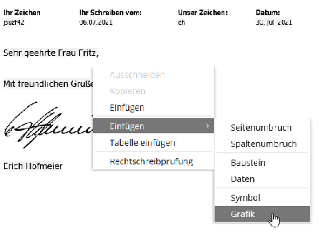|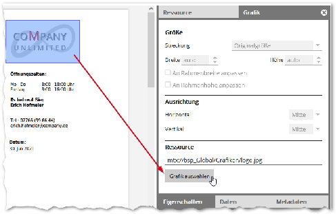|

Es öffnet sich der Dialog Grafik einfügen bzw. Anlage einfügen. Im oberen Bereich dieses Dialogs kann eine Grafik / eine Anlage ausgewählt werden, die in die aktuell geöffnete Vorlage eingefügt werden kann. Auswählbar sind alle Grafiken oder Anlagen, die im aktuellen Projekt und in referenzierten Projekten enthalten sind. Durch Auswahl einer Grafik oder Anlage aus der Baumstruktur und Drücken der Schaltfläche Einfügen wird die ausgewählte Referenz in das Dokument eingefügt.

Der untere Bereich ist zum Hochladen von Grafiken oder Anlagen in den Serie M/ Ressourcenspeicher vorgesehen. Wenn Sie auf die Schaltfläche Öffnen hinter dem Feld Dateiname klicken, wird das Dialogfeld des Browsers angezeigt und Sie können eine Datei zum Hochladen auswählen. Durch Drücken der Schaltfläche Hochladen hinter dem Feld Ressourcenname wird die ausgewählte Grafik bzw. Anlage hochgeladen. Sie wird mit dem Namen Ressourcenname in dem Ordner gespeichert, der aktuell in der Ordnerstruktur oben im Dialog ausgewählt ist. Sie kann direkt in die Vorlage eingefügt werden.

Sie können im Grafik/Anlage einfügen/auswählen-Dialog über den Button Ordner erstellen einen neuen Ordner im Ressourcenspeicher erstellen. Dieser wird allerdings nur dann übernommen, wenn Sie auch eine Grafik oder Anlage in den Ordner hochladen (Über Öffnen – Hochladen).

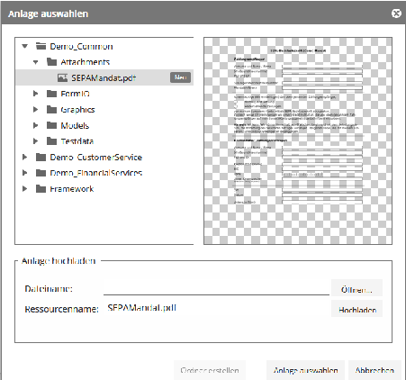

###### 3.3.2.2 Grafiken und Anlagen im Projekt-Explorer

Aus dem Projektexplorer heraus kann eine Grafikoder Anlage über das Kontextmenü Grafik/ Anlage hochladen hochgeladen werden.

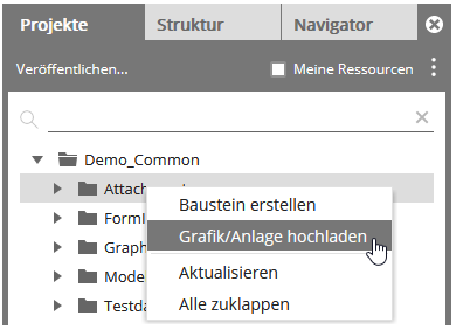

Der Dialog Grafik/Anlage hochladen entspricht dem Dialog Grafik/Anlage einfügen, der im vorherigen Abschnitt beschrieben ist.

##### 3.3.3 Dokumentenlogik

Die Dokumentlogik kann im Content Hub erstellt und bearbeitet werden. So können Sichtbarkeitsbedingungen, SONST-Bedingungen, Schleifen oder Fallauswahlen erstellt und bearbeitet werden.

Mehr Informationen zu Bedingungen (VisibleIf), Schleifen (ForEach) und Fallauswahlen (Switch/Case) finden Sie im Handbuch "M/TEXT TONIC - Textadministration" im Abschnitt "Dynamisierung von Parts".

Im Bereich Logik von Content Hub finden Sie auch die Konfiguration von Bearbeitungsrechten (siehe Abschnitt 3.3.10, „Änderungsrechte“).

###### 3.3.3.1 Logik erstellen

Über das Kontextmenü im Strukturbaum kann unter Einfügen - Logik - Schleife oder Einfügen Logik - Bedingung oder Einfügen - Logik - Fallauswahl oder Einfügen - Logik - Fall ein entsprechender Logikblock um das im Strukturbaum ausgewählte Element eingefügt werden. Jedes Element außer Dokument und dem ersten Part eines Bausteins kann von einem Logikblock umschlossen werden. Dabei wird ein neuer Part als Logikblock im Dokument eingefügt. Dieser wird im Strukturbaum entsprechend seiner Funktion als FÜR ALLE (Schleife), WENN (Bedingung), FALL oder FALLAUSWAHL angezeigt.

- 3.3.3.1.1 Schleifen erstellen Wird eine Schleife eingefügt, erscheint ein Dialog zur Auswahl eines Datenmodellknotens.

Als Basis für die Schleife wird ein Mehrfach-Datenmodellknoten angegeben, wobei der Part für jede Instanz des Mehrfachknotens einmal produziert wird.

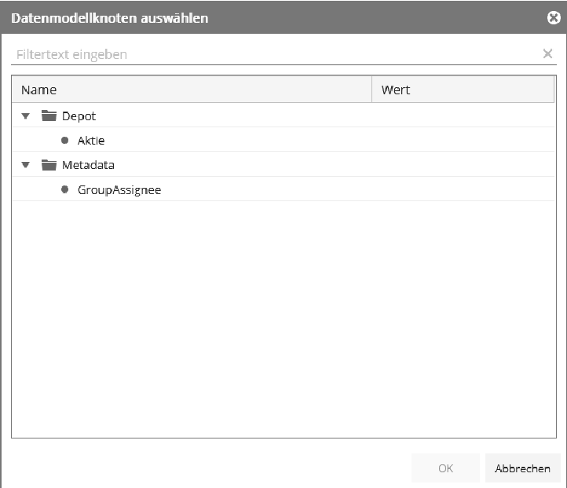

######### Wenn Sie innerhalb der Schleife einen Kind-Datenmodellknoten des Schleifenparameters angeben, so verwenden Sie immer die Daten des ersten Eintrags oben im Dialog. Er stellt das Element dar, was sich in jedem Schleifendurchgang ändert.

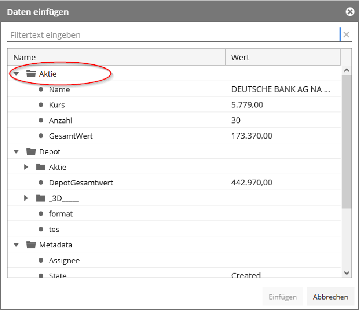

####### 3.3.3.1.2 Bedingungen erstellen

Wird eine Bedingung eingefügt erscheint ein Editor-Dialog, in dem eine oder mehrere Bedingungen angelegt und mit AND/OR verknüpft werden können. Bedingungen können mit Datenmodellknoten, Vergleichsoperatoren und Vergleichswerten definiert werden.

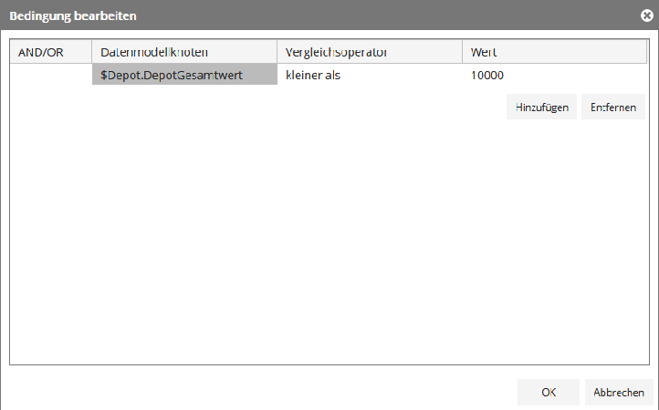

Eine SONST-Bedingung kann einer bestehenden Bedingung über das Kontextmenü im Strukturbaum unter Einfügen - Logik - SONST-Bedingung zugeordnet werden. Im Dokument wird ein Part (im Strukturbaum als SONST gekennzeichnet) mit einem Absatz erzeugt. Wird die SONST-Bedingung über die Checkbox im Strukturbaum aktiviert, kann dieser Absatz bearbeitet werden. Entweder direkt im Editorbereich oder über das Kontextmenü im Strukturbaum mit Im Editor bearbeiten. Dieser Absatz enthält dann den Inhalt, der angezeigt wird, wenn die SONSTBedingung erfüllt ist.

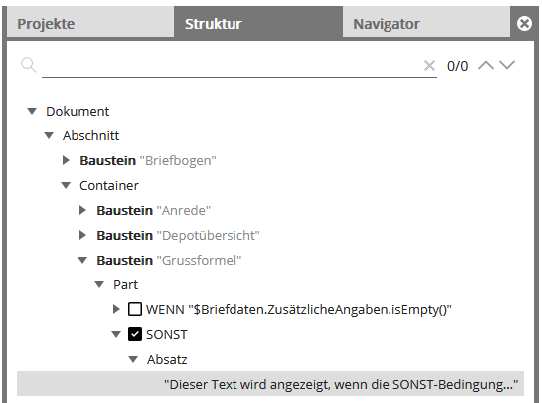

Über die Checkbox vor einer Bedingung, kann diese aktiviert und der entsprechende Part im Editorbereich angezeigt werden, selbst wenn die Bedingung nicht erfüllt ist.

Um Redundanzen durch mehrfache Definition gleicher Bedingungen zu vermeiden, stehen nur zentral von der Administration angelegte Datenmodellknoten zur Auswahl, die diese Bedingungen enthalten. So muss bei Änderungen ein Datenmodellknoten nur einmal zentral angepasst werden.

####### 3.3.3.1.3 Fallauswahlen erstellen

Eine Fallauswahl kann angelegt werden, um Inhalte für mehrere unterschiedliche Datenbelegungen vorzuhalten. Bei der Dokumenterstellung wird der Wert des Datenmodellknotens, der in der Fallauswahl angegeben ist, verglichen mit den Werten in den darunter liegenden Fällen. Der Fall, dessen Vergleichswert mit dem Fallauswahl-Wert übereinstimmt, wird ausgegeben.

Wenn Sie die Fallauswahl einfügen, öffnet sich ein Dialog, in dem Sie einen Datenmodellknoten auswählen können. Nach dem Wert dieses Datenmodellknotens richtet sich, welcher Fall im Dokument angezeigt wird.

Um einen Fall in eine bestehende Fallauswahl einzufügen, fügen Sie zuerst den Inhalt des Falls ein, beispielsweise einen Absatz. Um dieses Element herum erstellen Sie dann über Einfügen

- Logik - Fall das Element Fall. Es öffnet sich ein Dialog, in dem Sie einen Datenmodellknoten auswählen können. Wollen Sie einen festen Vergleichswert für den Fall angeben, können Sie dies im Nachhinein im Bereich Logik unter Fall – Typ verändern.

Auch bei einer Fallauswahl können Sie einen SONST-Fall anlegen, der angezeigt wird, wenn keiner der anderen Fälle eintritt. Fokussieren Sie dafür die Fallauswahl und wähen Sie Einfügen Logik - Fallauswahl SONST.

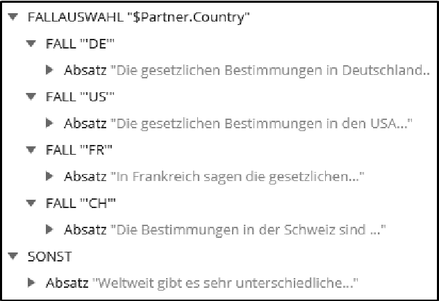

Um die Inhalte der Bedingungen bearbeiten zu können, ändern Sie die Belegung der Testdaten im Bereich Daten (siehe auch Abschnitt 3.4.1, „Daten-Ansicht“).

###### 3.3.3.2 Logik bearbeiten

Wenn ein Logik-Element (Schleife, Bedingung, Fallauswahl, Fall oder SONST-Bedingung) im Strukturbaum ausgewählt ist, wird im rechten Bildschirmbereich die Registerkarte Logik angezeigt (Am unteren Rand muss dafür das Register Eigenschaften geöffnet sein). Hier können die Logik-Skripte gelöscht werden (Leeren). Über die Schaltfläche Bearbeiten kann ein EditorDialog aufgerufen werden, um das entsprechende Skript zu modifizieren.

Bestehende Logik-Elemente können auch über das Kontextmenü im Strukturbaum unter Logik bearbeiten modifiziert werden.

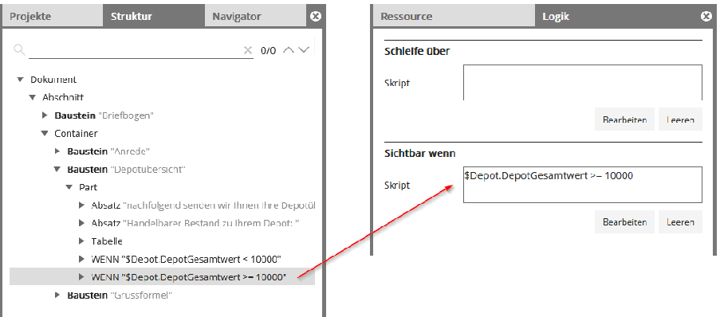

Im Bereich Fall einer Fallauswahl haben Sie außerdem die Möglichkeit, zwischen der Eingabe eines Datenmodellknotens und der Eingabe eines festen Wertes zu wählen. Verändern Sie dafür die Eingabe im Feld Typ.

##### 3.3.4 Bausteine

Bausteine sind wiederverwendbare Teile einer Dokumentvorlage. Sie können im M/TEXT TONIC Content Hub erstellt und bearbeitet werden. Die Erstellung läuft über das Extrahieren von Inhalten in einen Baustein, über das Klonen eines bestehenden Bausteins oder über das Erstellen eines Bausteins aus dem Projekt-Explorer.

###### 3.3.4.1 Bausteine extrahieren

Elemente können im Strukturbaum oder im Editorbereich markiert und so dann als Baustein extrahiert, also ausgelagert werden. Dadurch werden die ausgelagerten Elemente in anderen Vorlagen wiederverwendbar.

Wenn Sie einen Baustein im Editorbereich markieren und extrahieren müssen sie dafür vollständige gültige Elemente markieren. Das Extrahieren von eineinhalb Absätzen als ein Baustein ist beispielsweise nicht möglich.

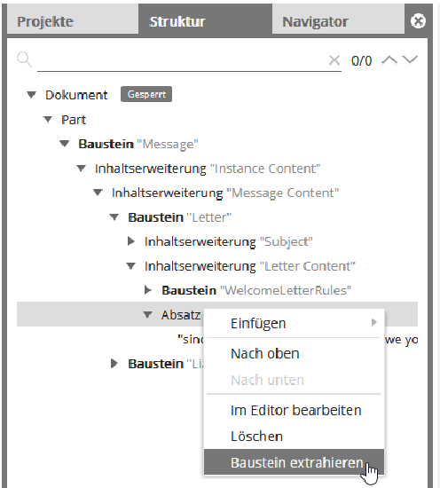

Im folgenden Dialog wird ein Name für den neuen Baustein eingegeben und ein Ziel ausgewählt, an dem er gespeichert werden soll. Als Ziel kann hier ausschließlich ein Ordner innerhalb des aktuellen Projekts ausgewählt werden, wobei Sie über den Button Ordner erstellen einen neuen Ordner erstellen können. Dieser wird allerdings nur dann übernommen, wenn Sie den Baustein auch dort speichern.

Der neu erstellte Baustein ist dann anstelle des extrahierten Inhalts in der Vorlage eingefügt. Die Änderung ist sofort im Editorbereich, im Strukturbaum und im Projektexplorer sichtbar. Im Projektexplorer ist die Ressource als Neu markiert.

###### 3.3.4.2 Bausteine klonen

Ähnlich wie Vorlagen, können auch Bausteine geklont werden, um neue Bausteine zu erstellen. Markieren Sie zum Klonen einen Baustein im Projektexplorer und wählen Sie im Kontextmenü Klonen. Vergeben Sie außerdem einen Namen und bestimmen Sie einen Zielordner und wählen Sie dann Klonen. Um den geklonten Baustein zu verändern, kann dieser in eine Vorlage eingefügt und dort bearbeitet werden. Falls eine passende Editiervorlage konfiguriert wurde, kann der Baustein auch direkt über einen Doppelklick geöffnet werden.

###### 3.3.4.3 Bausteine direkt erstellen

Im Projekt-Explorer des Content Hub können Sie über das Kontextmenü Bausteine erstellen:

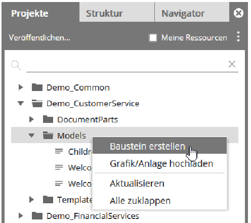

Geben Sie im folgenden Dialog den Namen und die Art (Kann eingefügt werden in) an. Der Baustein kann nun in eine Vorlage eingefügt und geändert werden. Falls eine passende Editiervorlage konfiguriert wurde, kann der Baustein auch direkt über einen Doppelklick geöffnet werden. Beachten Sie, dass ein über den Strukturbaum erzeugter Baustein keine Parameter definiert. Als verwendbare Daten liegen nur die Metadaten vor.

###### 3.3.4.4 Bausteine bearbeiten

Bausteine können direkt im M/TEXT TONIC Content Hub bearbeitet werden, wenn eine entsprechende Editiervorlage dafür vorbereitet wurde. Dazu öffnen Sie den gewünschten Baustein aus dem Projekt-Explorer. Der Baustein wird dann im Editorbereich geöffnet, wobei er in den Kontext einer Vorlage eingebettet ist. Bearbeiten können Sie jedoch nur den Baustein, nicht die Vorlage. Auch im Bereich Struktur sehen Sie nur die Struktur des Bausteins. Nachdem Sie die gewünschten Änderungen vorgenommen haben, können Sie den Baustein speichern und schließen.

Außerdem können Sie Bausteine ändern, die in Vorlagen eingebettet sind, wenn Sie die entsprechende Vorlage öffnen (siehe auch Abschnitt 3.1.3, „Bestehende Ressourcen ändern “).

Vorsicht bei der Änderung von Bausteinen: Die Änderung wirkt sich auch auf alle Vorlagen aus, in denen der Baustein referenziert ist. Um herauszufinden, welche Vorlagen den Baustein referenzieren, nutzen Sie die Referenzsuche im Kontextmenü des Bausteins (siehe Abschnitt 3.4.3, „Referenzsuche“).

##### 3.3.5 Auswahl

Eine Auswahl umfasst mehrere Parts/Bausteine, um sie dem Benutzer zur Auswahl anzubieten. Der Inhalt der vom Anwender ausgewählten Parts/Bausteine wird in das Dokument eingefügt.

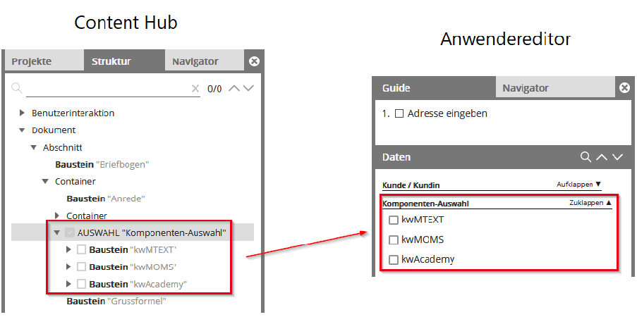

Sie können eine Auswahl so ausgestalten, dass mehrere Parts/Bausteine gleichzeitig auswählbar sind, oder so, dass nur einer der angebotenen Parts/Bausteine auswählbar ist. Außerdem legen Sie über die Auswahlvorbelegung fest, ob das entsprechende Element in der Auswahl vorausgewählt oder zwingend erforderlich ist. Zwingend erforderliche Parts werden dem Anwender in der Auswahl nicht angeboten. Ihre Integration in den Part-Selektor dient lediglich dazu sicherzustellen, dass sie garantiert an einer bestimmten Position - vor oder nach auswählbaren Parts - eingefügt werden.

###### 3.3.5.1 Auswahl einfügen und bearbeiten

Um eine Auswahl einzufügen, öffnen Sie die Struktur und wählen Sie Einfügen – Auswahl auf dem Objekt, in dem Sie die Auswahl einfügen wollen.

Wenn Sie die Auswahl fokussieren, können Sie im Bereich Logik unter Auswahl folgende Einstellungen vornehmen:

- • Bezeichnung: Unter dieser Bezeichnung wird die Auswahl im Endanwendereditor angezeigt.
- • Bedingung: Hier legen Sie fest, ob im Editor alle Elemente der Auswahl auswählbar sein sollen (Ankreuzkästchen) oder nur ein Element (Optionsfeld).
- • Optionale Auswahl: Legt fest, ob der Anwender zwingend mindestens ein Element auswählen muss.

###### 3.3.5.2 Elemente in die Auswahl einfügen und bearbeiten

Um Elemente in eine Auswahl einzufügen, öffnen Sie die Struktur, fokussieren Sie die Auswahl und wählen Sie Einfügen – Baustein bzw. Einfügen – Part. (Sie können Auswahl-Elemente auch schachteln. Wählen Sie dazu Einfügen – Auswahl.)

Wenn Sie Einfügen – Baustein gewählt haben, wird die Bausteinauswahl angezeigt. Bei Einfügen

– Part wird der Part direkt in die Auswahl eingefügt und Sie können ihn mit belibigen Inhalten füllen, die an dieser Stelle in die Struktur der Dokumentvorlage passen.

Wenn Sie den Part/Baustein fokussieren, können Sie im Bereich Logik unter Auswahl-Zugehörigkeit folgende Einstellungen vornehmen:

• Vorausgewählt: Legt fest, ob der Part/Baustein für den Endanwender vorausgewählt sein soll. Mit dem Wert Obligatorisch wird der Part/Baustein ins Dokument eingefügt und kann nicht abgewählt werden. Diese Option dient dazu, sicherzustellen, dass ein Part/Baustein an der richtigen Stelle vor bzw. nach anderen Parts/Bausteinen eingefügt wird.

###### 3.3.5.3 Alternativ: Parts/Bausteine mit Auswahl umschließen

Sie können bereits in einer Vorlage vorhandene Parts/Bausteine mit einer Auswahl umschließen, indem Sie die Parts/Bausteine gemeinsam markieren und im Kontextmenü Einfügen – Logik – Auswahl wählen.

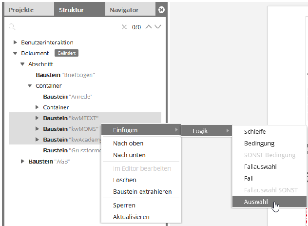

##### 3.3.6 Referenzen auf Ressourcen

Ein Benutzer, der eine komplexe Vorlage bearbeitet, die viele verschachtelte Bausteine enthält, hat die Möglichkeit, herauszufinden, was der tatsächliche Verweis auf einen Baustein ist (ob er relativ oder absolut ist) und auf welche spezifische Ressource ein solcher Verweis auflöst. Dazu wird ein Baustein oder eine Grafik fokussiert und das Register Ressource im rechten Bildschirmbereich geöffnet. Unter Information gibt es zwei Felder:

- • Referenz zeigt die Referenz auf das ausgewählte Element genau so an, wie sie im Code der Vorlage steht, z. B. Bausteine/Header.model oder mtx:Grafiken/company/header.jpg.
- • Ressource zeigt, auf welche Ressource der Verweis auflöst, z. B. bsp_Common\Bausteine \Header.model oder Invoice[GER]\Grafiken\company\header.jpg.

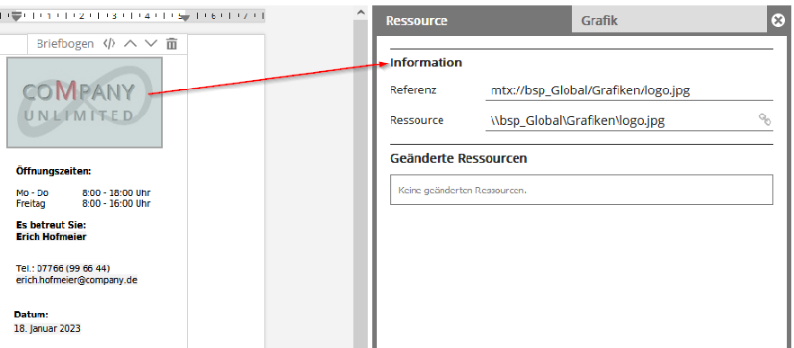

##### 3.3.7 Übersetzungen

Der Inhalt eines Dokuments kann an die Sprache des Empfängers angepasst werden. So wird aus einer Vorlage ein englisches oder ein deutsches Dokument, je nachdem, ob der Empfänger englisch- oder deutschsprachig ist. Die dafür nötigen Übersetzungen werden in die Vorlagen eingefügt. Für die Übersetzungen stehen dabei jeweils die Projektsprachen zur Verfügung, die vorab in M/Workbench definiert wurden. Über das Kontextmenü Einfügen - Übersetzungen in Content Hub kann sowohl für Parts als auch für Absätze eine Übersetzung für jede definierte Projektsprache angelegt werden.

Mit der Auswahl Übersetzungen unterhalb des Strukturbaums kann die Sprache gewechselt werden, in der die Vorlage bearbeitet wird. Auf diese Weise können Texte übersetzt werden.

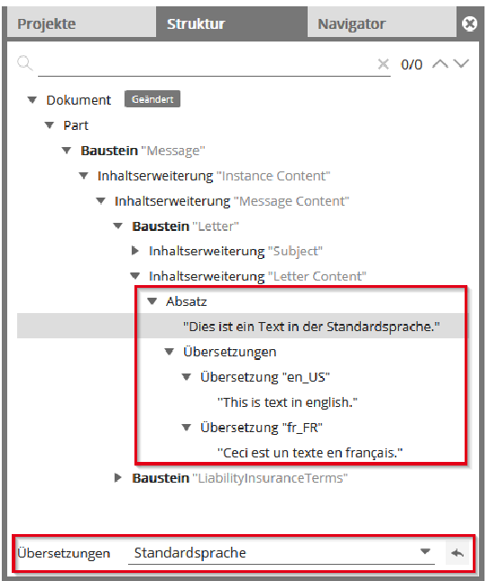

- • Die Übersetzungen sind an den Absatz gebunden, d.h. jeder neue Absatz benötigt eine eigene Übersetzung.
- • Wenn in die zu übersetzende Sprache gewechselt wird, erscheint der Text in der Standardsprache zunächst nicht mehr im Register Struktur.
- • Der Text, der in der Struktur direkt unterhalb des Absatzes angezeigt wird, ist der Text der aktiv ausgewählten Sprache. In der folgenden Grafik ist Französisch als Bearbeitungssprache ausgewählt. Daher wird der französische Text direkt am Absatz (über den Übersetzungen) angezeigt.

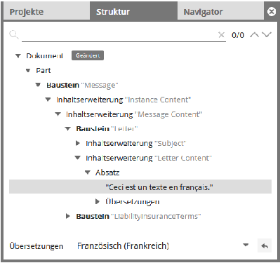

###### 3.3.7.1 Übersetzungen einfügen

Um eine Vorlage in unterschiedliche Sprachen zu übersetzen, gehen Sie wie folgt vor: Folgende Elemente müssen vorbereitet sein: Projektsprachen müssen in M/Workbench hinzugefügt und mit dem Server synchronisiert worden sein.

- 1. Öffnen Sie eine Vorlage.

- 2. Positionieren Sie den Cursor im Reiter Struktur auf dem Element Part, welches die zu übersetzenden Absätze beinhaltet und wählen Sie via Kontextmenü Einfügen Übersetzungen:

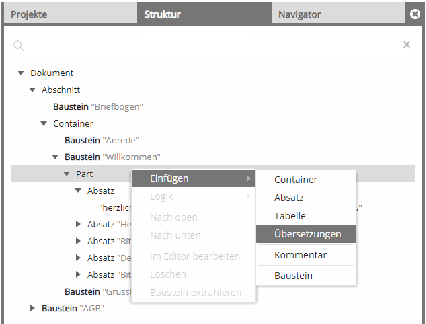

- 3. Es erscheint folgender Dialog:

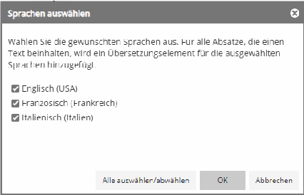

- Nach Bestätigung des Dialoges werden Übersetzungen zu den hier fünf vorliegenden Absätzen hinzugefügt.
- 4. Wählen Sie nun unter Übersetzungen unterhalb des Strukturbaums die gewünschte Sprache aus und fügen Sie Ihre Übersetzung in die mit TRANSLATE: gekennzeichneten Absätze ein.

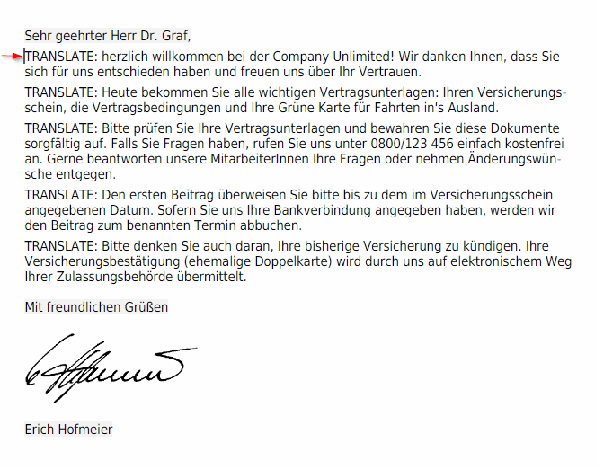

Achten Sie beim Einpflegen der Übersetzungen darauf, dass Sie keine Absätze über die ENTER-Taste hinzufügen, da ansonsten diese neu erstellten Absätze keine Übersetzungen haben.

##### 3.3.8 Barcodes

Barcodes sind vielfältig einsetzbare, maschinenlesbare Grafiken, in denen Daten verschlüsselt werden können. Sie lassen sich in M/TEXT TONIC Content Hub erstellen und bearbeiten.

Zum Erstellen eines Barcodes wählen Sie im Kontextmenü oder in der Symbolleiste Einfügen – Barcode. Per Default wird damit ein Strichcode des Typs Code 128 erzeugt. Wenn Sie den Barcode fokussieren, sehen Sie auf der Oberfläche die Sicht Barcode. In dieser können Sie den Inhalt und das Aussehen des Barcodes verändern. Die folgenden Einstellungsmöglichkeiten sind gegeben:

|Eigenschaft|Beschreibung|
|---|---|
|Code-Typ|Hier können Sie die Art der Kodierung einstellen. Mögliche Werte sind Code 128, Code 39, EAN-13, EAN-128, Data Matrix, Interleaved 2 of 5, PDF417 und QR Code.|
|Kodierung|Legt die Art der Kodierung für den Barcode fest, wenn der Code-Typ QR ausgewählt ist.|
|Daten|Hier werden die Daten eingegeben, die im Barcode verschlüsselt werden sollen. Sie können entweder eine Zahle oder einen String eingeben (z. B. https://kwsoft.de/) oder Sie wählen einen Datenmodellknoten aus, dessen Wert dann als Barcode verschlüsselt dargestellt wird.|
|Ausrichtung|Gibt die Ausrichtung des Barcodes an. Mögliche Werte sind die Drehung um 0°, 90°, 180° und 270°.|
|Ausrichtung umkehren|Gibt an, ob der Barcode gespiegelt werden soll.|
|Auflösung|Gibt die Auflösung in PPI an.|
|Kachelgröße-X|Gibt die Kachelgröße in X-Richtung in Pixel an.|
|Kachelgröße-Y|Gibt die Kachelgröße in Y-Richtung in Pixel an.|
|Fehlergrad|Numerischer Wert, der die Stufe der Fehlerkorrektur angibt.  Für den Code-Typ Code 39 sind mögliche Werte 0 (der generierte Code bekommt kein zusätzliches Kontrollzeichen) und 1 (der generierte Code bekommt ein zusätzliches Kontrollzeichen).  Für den Code-Typ PDF417 sind mögliche Werte 0 (keine Fehlerkorrektur) und 1 bis 8 (PDF417 Fehlerkorrektur Level).  Für den Code-Typ QR sind mögliche Werte 0 (Level L: 7% der Codewörter/Daten können wiederhergestellt werden), 1 (Level M), 2 (Level Q) und 3 (Level H).  Für den Code-Typ Interleaved 2 of 5 hat die Angabe des Fehlergrades keine Auswirkung.  Für die anderen Code-Typen kann kein Fehlergrad angegeben werden.|
|Codegröße|Gibt die Größe des Barcodes an. Gültig für den Code-Typ Data Matrix.|
|Spalten|Legt die Anzahl der Spalten Barcode fest. Wenn der Wert nicht gesetzt ist, wird er automatisch anhand der EingabeZeichenkette berechnet. So bleibt die Vollständigkeit der Daten erhalten. Gültig für den Code-Typ PDF417.|
|Inline-Parameter|Hier werden Datenmodellknoten als Parameter definiert. Diese sind in den Auswahlmenüs der Eigenschaften oben unter $Inline-Parameter-Name auswählbar.|

##### 3.3.9 Guide-Elemente und Dateneingabe-Elemente

Sie können im Content Hub Elemente für den Guide und den Dateneingabebereich im TONIC Anwendereditor erstellen und bearbeiten. Die folgende Grafik zeigt, welche Arten von interaktiven Elementen möglich sind und wie sie sich im Anwendereditor darstellen:

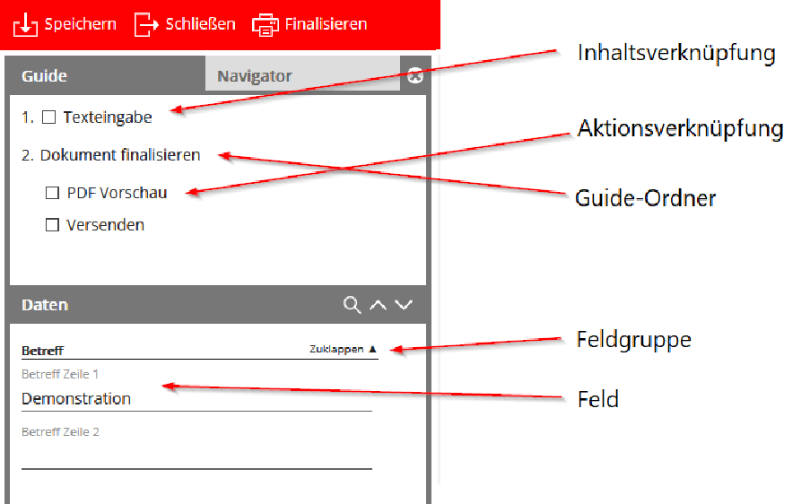

Über Guide-Ordner können zusammengehörende Guide-Einträge (Aktionsverknüpfung, Inhaltsverknüpfung) gruppiert werden. Aktionsverknüpfungen führen eine spezifische, als JavaScript-Ausdruck hinterlegte Aktion aus. Inhaltsverknüpfungen fordern die Benutzerinnen und Benutzer zur Eingabe von Inhalten auf - entweder im Bereich Daten, in einem modalen Dialog oder direkt im Dokument.

Zusammengehörende Daten-Felder können in Feldgruppen gruppiert werden. Jedes Feld ist mit

- einem Datenmodellknoten verknüpft, dessen Wert eingegeben oder geprüft werden soll.

Im Bereich Daten werden im Anwendereditor auch die sog. Auswahlen angezeigt, über die sich Bausteine und Parts einfach an- und abwählen lassen. Die Konfiguration dieser Auswahlen ist im Abschnitt 3.3.5, „Auswahl“ beschrieben.

###### 3.3.9.1 Benutzerinteraktion-Elemente einfügen

Interaktive Guide-Elemente und Dateneingabe-Elemente sind in einer Dokumentvorlage innerhalb einer Benutzerinteraktion platziert. Es kann auch mehrere Benutzerinteraktionen innerhalb einer Vorlage geben. Diese werden im Editor kombiniert in nur einem Guide und

- einem Daten-Bereich dargestellt. Benutzerinteraktionen können entweder am Element Dokument oder an einem Part definiert sein. Dies ist relevant, wenn sich die Parts innerhalb von Bausteinen befinden. Dann wird die Benutzerinteraktion im Baustein gespeichert und gehört somit zu jedem Dokument, dass den Baustein aufruft. Eine Benutzerinteraktion, die am Element Dokument eingefügt ist, gehört nur zu Dokumenten, die aus dieser Vorlage erstellt werden.

Um eine Benutzerinteraktion zu erstellen, öffnen Sie eine Dokumentvorlage oder einen Baustein im Content Hub. Fokussieren Sie im Bereich Struktur das Dokument oder einen Part. Wählen Sie im Kontextmenü Einfügen – Benutzerinteraktion.

In eine Benutzerinteraktin fügen Sie über das Kontextmenü Einfügen die einzelnen interaktiven Elemente ein. Die Einstellungsmöglichkeiten sind in den folgenden Abschnitten erläutert.

###### 3.3.9.2 Das Element Feld

Das Element Feld wird im Anwendereditor im Bereich Daten angezeigt. Es dient dazu, Werte von Datenmodellknoten einzugeben oder zu überprüfen. Sie haben im Bereich Benutzerinteraktion in Content Hub die folgenden Einstellungsmöglichkeiten dafür:

|Eigenschaft|Beschreibung|
|---|---|
|ID übergeordnete Feldgruppe|Hier können Sie eine Feldgruppe angeben, in die das Feld im Anwendereditor eingefügt werden soll. Die Angabe dient dazu, Felder in Feldgruppen einzufügen, die nicht in der gleichen Benutzerinteraktion definiert sind, aber im Dokument vorkommen. Wenn die angegebene Feldgruppe nicht im Dokument vorkommt, wird die Angabe ignoriert und das Feld alleinstehend angezeigt. Die Angabe ist nicht nötig, wenn das Feld in der Benutzerinteraktion bereits in eine Feldgruppe eingefügt ist oder das Feld gar nicht in eine Feldgruppe eingefügt werden soll.  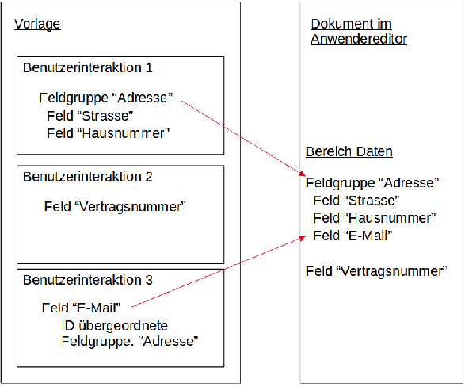|
|Bezeichnung|Die hier eingegebene Bezeichnung wird im Anwendereditor für das Feld angezeigt.|
|Rechtschreibprüfung|Soll eine Rechtschreibprüfung des eingegebenen Wertes erfolgen?|
|Datenmodellknoten|Geben Sie hier den Datenmodellknoten an, dessen Wert eingegeben oder kontrolliert werden soll.|
|Sichtbar wenn|Geben Sie eine Bedingung an, unter der das Feld im Anwendereditor sichtbar sein soll. Die Konfiguration von|

|Eigenschaft|Beschreibung|
|---|---|
| |Bedingungen ist im Abschnitt 3.3.3, „Dokumentenlogik“ beschrieben.  |

###### 3.3.9.3 Das Element Feldgruppe

Das Element Feldgruppe wird im Anwendereditor im Bereich Daten angezeigt. Es dient dazu, Felder zu gruppieren, die thematisch zusammen passen. Sie haben im Bereich Benutzerinteraktion in Content Hub die folgenden Einstellungsmöglichkeiten dafür:

|Eigenschaft|Beschreibung|
|---|---|
|ID|Geben Sie hier eine eindeutige Identifizierung an. Diese kann von Feldern und Feldgruppen in der Eigenschaft ID übergeordnete Feldgruppe refernziert werden.|
|ID übergeordnete Feldgruppe|Hier können Sie die ID einer Feldgruppe angeben, um die "Feldgruppe A" in den "Feldgruppe B" einzufügen. Die Angabe ermöglicht das Einfügen von Feldgruppen in andere Feldgruppen, die nicht in derselben Benutzerinteraktion definiert sind, aber im Dokument vorhanden sind. Wenn die angegebene "Feldgruppe B" nicht im Dokument vorkommt, wird die Angabe ignoriert und die "Feldgruppe A" alleinstehend angezeigt. Die Angabe ist nicht nötig, wenn die "Feldgruppe A" in der Benutzerinteraktion bereits in "Feldgruppe B" eingefügt ist.|
|Bezeichnung|Die hier eingegebene Bezeichnung wird im Anwendereditor für die Feldgruppe angezeigt.|
|Sichtbar wenn|Geben Sie eine Bedingung an, unter der die Feldgruppe im Anwendereditor sichtbar sein soll. Die Konfiguration von Bedingungen ist im Abschnitt 3.3.3, „Dokumentenlogik“ beschrieben.  |

###### 3.3.9.4 Das Element Inhaltsverknüpfung

Das Element Inhaltsverknüpfung wird im Anwendereditor im Bereich Guide angezeigt. Es dient dazu, den Anwender oder die Anwenderin auf Dateneingaben oder Dokumentteile zu lenken, die noch bearbeitet werden sollen.

Elemente, auf die die Inhaltsverknüpfung hinweisen soll (z. B. ein Absatz, der befüllt werden soll) müssen eine ID haben (siehe ID verknüpftes Inhaltselement). Um diese ID zu vergeben, fokussieren Sie das entsprechende Element im Strukturbaum und geben Sie im Bereich Allgemein - Strukturelement unter ID einen eindeutigen Wert an.

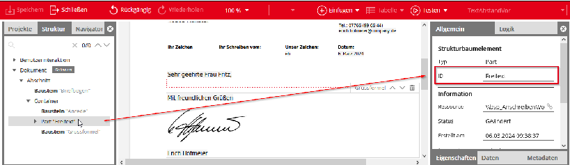

######### Sie haben im Bereich Benutzerinteraktion in Content Hub die folgenden Einstellungsmöglichkeiten für die Inhaltsverknüpfung:

|Eigenschaft|Beschreibung|
|---|---|
|ID|Hier können Sie eine eindeutige ID angeben, um die Inhaltsverknüpfung von anderen Elementen zu referenzieren.|
|ID übergeordneter GuideEintrag|Wenn diese Option gesetzt ist und ein Guide-Ordner mit der angegebenen ID im Dokument existiert (von der Vorlage oder einem anderen im Dokument verwendeten Baustein bereitgestellt), wird das Element zur Laufzeit in diesen Ordner im Anwendereditor eingefügt.  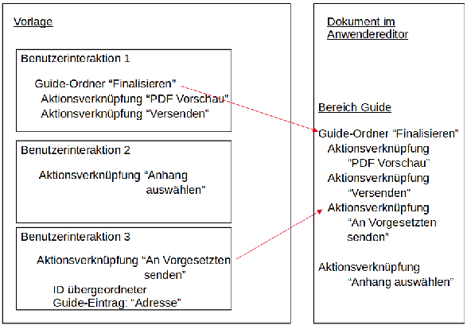|
|ID verknüpftes Inhaltselement|Geben Sie hier die ID des Elements an, auf das die Inhaltsverknüpfung hinweisen soll. Das Element wird dann im Anwendereditor in den Fokus gerückt, animiert und aktiviert, wenn die Inhaltsverknüpfung angeklickt wird.|
|Bezeichnung|Die hier eingegebene Bezeichnung wird im Anwendereditor für die Inhaltsverknüpfung angezeigt.|
|Hinweistext|Der hier eingegebene Hinweistext wird im Anwendereditor unter der Inhaltsverknüpfung angezeigt.|
|Ausführung vorgeschrieben|Gibt an, ob die Ausführung der Inhaltsverknüpfung für den Endanwender vorgeschrieben ist. Vorgeschriebene Inhaltsverknüpfungen werden im Guide hervorgehoben und als Fehler aufgeführt, wenn sie nicht bearbeitet wurden. Das Metadatum ValidationState hat den Wert ERROR, wenn die Inhaltsverknüpfung noch nicht bearbeitet wurde.|

|Eigenschaft|Beschreibung|
|---|---|
|Beim Öffnen ausführen|Gibt an, ob die Inhaltsverknüpfung beim Öffnen des Dokuments automatisch ausgeführt wird. So kann festgelegt werden, welches Element beim Öffnen des Editors fokussiert werden soll. Mögliche Werte: Nie, Immer, Einmalig|
|Datenmodellknoten|Hier kann der Datenmodellknoten angegeben werden, auf den die Inhaltsverknüpfung hinweisen soll. Dieser wird dann im Anwendereditor in den Fokus gerückt, animiert und aktiviert.|
|Sichtbar wenn|Geben Sie eine Bedingung an, unter der die Inhaltsverknüpfung im Anwendereditor sichtbar sein soll. Die Konfiguration von Bedingungen ist im Abschnitt 3.3.3, „Dokumentenlogik“ beschrieben.  |
|Nur diese Feldgruppe (ID) anzeigen|Hier können Sie den Inhalt im Bereich Daten des Anwendereditor einschränken.  Die Angabe einer ID führt dazu, dass nach dem Klicken der Inhaltsverknüpfung nur die Feldgruppe mit dieser ID im Bereich Daten angezeigt wird. Diese Einschränkung des Datenbereichs wird im Anwendereditor über den Filter im Bereich Daten umgesetzt. Durch Entfernen des Filters können Anwenderinnen und Anwender die Einschränkung aufheben.|
|Nur referenzierte Felder anzeigen|Hier können Sie den Inhalt im Bereich Daten des Anwendereditor einschränken.  Die Option Ja führt dazu, dass nach dem Klicken der Inhaltsverknüpfung nur die Felder im Bereich Daten angezeigt werden, die mit dieser Inhaltsverknüpfung verknüpft sind. Diese Einschränkung des Datenbereichs wird im Anwendereditor über den Filter im Bereich Daten umgesetzt. Durch Entfernen des Filters können Anwenderinnen und Anwender die Einschränkung aufheben.  Wenn Sie hier Nein wählen, wird der Bereich Daten nicht eingeschränkt.|

###### 3.3.9.5 Das Element Aktionsverknüpfung

Das Element Aktionsverknüpfung wird im Anwendereditor im Bereich Guide angezeigt. Es dient dazu, spezifische Aufgaben zu erfüllen, wenn es angeklickt wird. Diese sind als JavaScriptAnweisung an der Aktionsverknüpfung hinterlegt. Sie haben im Bereich Benutzerinteraktion in Content Hub die folgenden Einstellungsmöglichkeiten dafür:

|Eigenschaft|Beschreibung|
|---|---|
|ID|Hier können Sie eine eindeutige ID angeben, um die Aktionsverknüpfung von anderen Elementen zu referenzieren.|
|ID übergeordneter GuideEintrag|Wenn diese Option gesetzt ist und ein Guide-Ordner mit der angegebenen ID im Dokument existiert (von der Vorlage oder einem anderen im Dokument verwendeten Baustein bereitgestellt), wird das Element zur Laufzeit in diesen Ordner im Anwendereditor eingefügt.|

|Eigenschaft|Beschreibung|
|---|---|
| |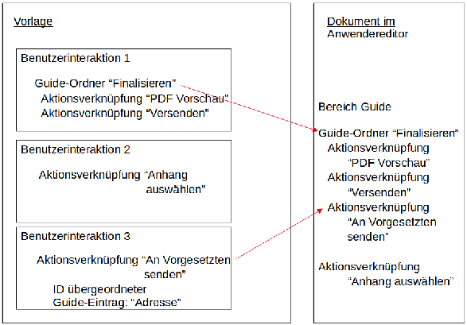|
|Feldgruppen-ID für modalen Dialog|Hier können Sie die ID einer Feldgruppe im Dateneingabebereich angeben. Diese Feldgruppe wird beim Anklicken der Aktionsverknüpfung in einem modalen Dialog zur Bearbeitung geöffnet, bevor das Aktionsskript ausgeführt wird. Im Dateneingabebereich erscheint die Feldgruppe dann nicht.|
|Bezeichnung|Die hier eingegebene Bezeichnung wird im Anwendereditor für die Aktionsverknüpfung angezeigt.|
|Hinweistext|Der hier eingegebene Hinweistext wird im Anwendereditor unter der Aktionsverknüpfung angezeigt.|
|Ausführung vorgeschrieben|Gibt an, ob die Ausführung der Aktionsverknüpfung für den Endanwender vorgeschrieben ist. Vorgeschriebene Aktionsverknüpfungen werden im Guide hervorgehoben und als Fehler aufgeführt, wenn sie nicht bearbeitet wurden. Das Metadatum ValidationState hat den Wert ERROR, wenn die Aktionsverknüpfung noch nicht bearbeitet wurde.|
|Beim Öffnen ausführen|Gibt an, ob die Aktionsverknüpfung beim Öffnen des Dokuments automatisch ausgeführt wird. Mögliche Werte: Nie, Immer, Einmalig|
|Beim Schließen ausführen|Gibt an, ob die Aktionsverknüpfung beim Schließen des Dokuments automatisch ausgeführt wird.  Bitte beachten Sie, dass die Aktionsverknüpfung den Aufruf $context.close() entahlten muss, damit das Dokument geschlossen wird, da der eigentliche Aufruf zum Schließen durch die Eigenschaft abgebrochen wird. Ausnahme: Wenn die Aktionsverknüpfung einen modalen Dialog und kein Skript aufruft.  Der Dialog Dokument speichern wird nicht automatisch ausgeführt, sondern kann in das Skript eingebaut werden.  Mögliche Werte: Nie, Immer, Einmalig (Einmalig: Die Aktionsverknüpfung wird beim Schließen ausgeführt, wenn sie noch nicht manuell oder automatisch durchlaufen wurde.)|
|Schaltfläche für Symbolleistenanzeige|Gibt, ob die Aktionsverknüpfung im Bereich Guide oder in der Symbolleiste des TONIC Anwendereditors angezeigt wird.|

|Eigenschaft|Beschreibung|
|---|---|
| |Hier wird der Name einer Schaltfläche in der Symbolleiste angegeben. Ist das angegebene Element in der Symbolleiste zur Laufzeit vorhanden, wird die Aktionsverknüpfung dort anstatt im Guide angezeigt.  Eine entsprechende Schaltfläche (Element Action) in der Symbolleiste muss in M/Workbench in der Datei \\Configuration \ui\default.editor.layout.xml definiert sein.|
|Sichtbar wenn|Geben Sie eine Bedingung an, unter der die Aktionsverknüpfung im Anwendereditor sichtbar sein soll. Die Konfiguration von Bedingungen ist im Abschnitt 3.3.3, „Dokumentenlogik“ beschrieben.  |
|Aktionsskript|Hier wird ein auszuführendes Skript als JavaScript-Ausdruck hinterlegt. In dem Skript ist der Zugriff auf das Objekt $context möglich.|

###### 3.3.9.6 Das Element Guide-Ordner

Das Element Guide-Ordner wird im Anwendereditor im Bereich Guide angezeigt. Es dient dazu, Aktions- und Inhaltsverknüpfungen zu gruppieren, die thematisch zusammen passen. Sie haben im Bereich Benutzerinteraktion in Content Hub die folgenden Einstellungsmöglichkeiten dafür:

|Eigenschaft|Beschreibung|
|---|---|
|ID|Geben Sie hier eine eindeutige Identifizierung an. Diese kann von Aktions- und Inhaltsverknüpfungen sowie von anderen Guide-Ordnern in der Eigenschaft ID übergeordneter GuideEintrag refernziert werden.|
|ID übergeordneter GuideEintrag|Hier können Sie die ID eines Guide-Ordners angeben, um den "Guide-Ordner A" in den "Guide-Ordner B" einzufügen. Die Angabe ermöglicht das Einfügen von Guide-Ordnern in andere Guide-Ordner, die nicht in derselben Benutzerinteraktion definiert sind, aber im Dokument vorhanden sind. Wenn der angegebene "Guide-Ordner B" nicht im Dokument vorhanden ist, wird die Angabe ignoriert und der "Guide-Ordner A" alleinstehend angezeigt. Die Angabe ist nicht nötig, wenn der Guide-Ordner A in der Benutzerinteraktion bereits in GuideOrdner B eingefügt ist.|
|Bezeichnung|Die hier eingegebene Bezeichnung wird im Anwendereditor für den Guide-Ordner angezeigt.|
|Hinweistext|Die hier eingegebene Hinweistext wird im Anwendereditor unter dem Guide-Ordner angezeigt.|
|Sichtbar wenn|Geben Sie eine Bedingung an, unter der der Guide-Ordner im Anwendereditor sichtbar sein soll. Die Konfiguration von Bedingungen ist im Abschnitt 3.3.3, „Dokumentenlogik“ beschrieben.  |

###### 3.3.9.7 Guide und Dateneingabebereich testen

Um die Darstellung und die Funktion der Benutzerinteraktion-Elemente einer Dokumentvorlage zu testen, lässt sich der TONIC Anwendereditor direkt aus dem Content Hub heraus öffnen. Dabei wird die aktuelle Testdatensituation verwendet. Der Button zum Testen im Anwendereditor befindet sich in der Symbolleiste unter Testen – Interaktive Bearbeitung (Editor).

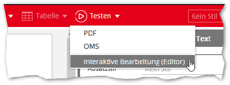

###### 3.3.9.8 Interaktive Felder mit dynamischen Werten belegen

Einige der Eigenschaften im Bereich der Benutzerinteraktion können mit dynamischen Werten aus Datenmodellknoten belegt werden. Dabei gilt: Der eingegebene Wert wird als String interpretiert. Zusätzlich können Sie den Wert dynamisieren, indem Sie über die $-Syntax auf Datenmodellknoten oder Metadatenknoten zugreifen. Ein Leerzeichen oder zwei Punkte markieren dabei das Ende des Datenmodellknotens.

Beispiel des dynamischen Titels einer Aktionsverknüpfung:

|Dokument an $Customer.Name.. senden|
|---|

Diese Syntax kann zur Dynamisierung verwendet werden:

- • in der Eigenschaft ID verknüpftes Inhaltselement von Inhaltsverknüpfungen
- • in der Eigenschaft ID übergeordnete Feldgruppe von Feldern im Dateneingabebereich
- • in den IDs aller Elemente
- • in der Bezeichnung von Elementen im Bereich des Guide und des Dateneingabebereichs

##### 3.3.10 Änderungsrechte

In M/TEXT TONIC Content Hub können Sie Berechtigungen für Benutzerinnen und Benutzer des M/TEXT TONIC Anwendereditors anlegen.

Ein Berechtigungseintrag definiert für eine Benutzerrolle, welche Bearbeitungsoperationen für die in einem Part enthaltenen Elemente erlaubt oder untersagt sind. Die folgenden Operationen sind verfügbar:

- • INPUT: Bearbeitung von Datenfeldern, die vom Part zum Dateneingabebereich hinzugefügt wurden oder als inplace-bearbeitbare Datenfelder im Part enthalten sind.
- • EDIT: Bearbeitung (Veränderung, Löschung, Hinzufügen) von Inhalten.

Berechtigungseinträge können als erlaubende (Erlaubt) oder untersagende (Verweigert) Einträge definiert werden. Dabei vererbt sich die Einstellung an alle Kindelemenete des Parts. Gibt es

an einer Stelle im Dokument mehrere Definitionen für Änderungsrechte, weil mehrere Parts ineinander geschachtelt sind, so gilt die "nächstgelegene" Definition. Auch am Element Dokument sind Änderungsrechte konfigurierbar.

Hat ein Benutzer wegen mehrerer ihm zugewiesener Rollen sowohl erlaubende als auch verweigernde Rechte an einem Part, so hat die Verweigerung Vorrang.

###### 3.3.10.1 Änderungsrechte anlegen

Um Änderungsrechte für ein Element des Dokuments anzulegen, fokussieren Sie das Element im Strukturbaum und wählen Sie im Kontextmenü Einfügen – Logik – Änderungsrechte.

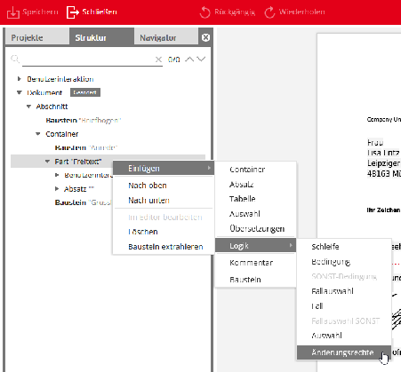

Dadurch legt das System einen Part um das fokussierte Element an und setzt den Fokus in den Bereich Änderungsrechte. Fahren Sie fort mit der Anpassung der Erlaubenden und Verweigernden Änderungsrechten fort, wie im Abschnitt 3.3.10.2, „Änderungsrechte konfigurieren“ beschrieben.

###### 3.3.10.2 Änderungsrechte konfigurieren

Um die Änderungsrechte an einem Part anzupassen, fokussieren Sie den Part im Strukturbaum und öffnen Sie den Bereich Logik. Dort finden Sie unter Änderungsrechte je eine Liste für Erlaubt und Verweigert. In diesen Listen können Sie Benutzerrollen, die in M/USER definiert sind, einfügen. Dann legen Sie fest, ob die Angehörigen dieser Rolle INPUT- oder EDIT-Rechte für den Part bekommen sollen.

Um einer Rolle Änderungsrechte am Part zuzuweisen oder zu verweigern, klicken Sie in der entsprechenden Liste auf das Feld unter Rolle. Daraufhin können Sie eine Benutzerrolle aus der Liste auswählen.

Die Rechte EDIT und INPUT stehen erst einmal auf Nicht gesetzt. Um das zu ändern, klicken Sie ins Feld und haken Sie das Ankreuzkästchen ab.

Zum Hinzufügen oder Verweigern von Änderungsrechten für eine weitere Rolle, klicken Sie auf den Button Hinzufügen in der entsprechenden Zeile. Dadurch wird der Liste eine weitere Zeile hinzugefügt.

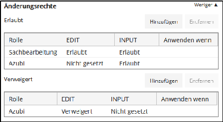

In der Spalte Anwenden wenn können Sie Bedingungen festlegen, unter denen das angelegte Änderungsrecht gilt (z. B. soll ein Text nur dann geändert werden dürfen, wenn das Dokument

- einen bestimmten Status hat).

##### 3.3.11 Metadaten

In der Ansicht Metadaten hat der Benutzer die Möglichkeit, die Werte der vorhandenen Metadaten zu bearbeiten. Sie lässt sich im rechten Bildschirmbereich über das Register Metadaten unten öffnen.

Es werden Standard-Metadaten und benutzerdefinierte Metadaten angezeigt. Metadaten, die nicht geändert werden können sind ausgegraut dargestellt. Wird ein Metadatum bearbeitet, wird die zugehörige Vorlage bzw. der zugehörige Baustein gesperrt, um Konflikte zu vermeiden.

Die Ansicht Metadaten ist unterteilt in mehrere Teile: Im oberen Bereich der Ansicht werden die Metadaten der Dokumentvorlage angezeigt, im unteren Bereich die Metadaten des Bausteins, der im Editor fokussiert ist. Es können Bezeichnung und Beschreibung über […] geändert werden. Es können Angaben für alle Sprachen der Dokumentvorlage bzw. des Bausteins gemacht werden. Die Standard-Metadaten TemplateRoles und ModelRoles können über das Kontextmenü mit Benutzergruppen belegt werden.

Siehe hierzu auch die Abschnitte "TemplateRoles" und "ModelRoles" im Handbuch M/ TEXT TONIC - Textadministration.

Bei den Metadaten der Dokumentvorlage besteht zudem die Möglichkeit eine Vorschaugrafik der Vorlage zur Anzeige im Anwendereditor zu generieren. Die Grafik muss über den ProjektExplorer veröffentlicht werden (siehe auch Abschnitt 3.1.4, „Ressourcen veröffentlichen “).

Über das Kontextmenü können Instanzen zu Mehrfachmetadatenknoten hinzugefügt werden. Mehrfachknoten sind mit einem * gekennzeichnet.

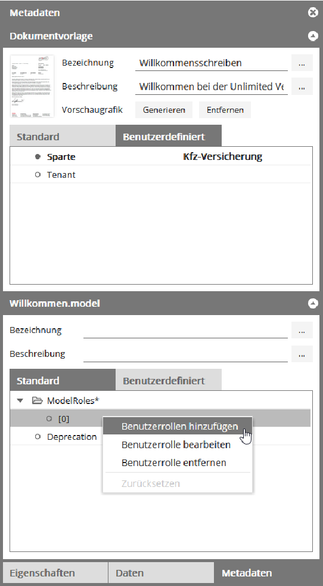

#### 3.4 Funktionen auf der Content Hub-Oberfläche

##### 3.4.1 Daten-Ansicht

In der Ansicht Daten haben Sie die Möglichkeit, die Werte der vorhandenen Daten einzusehen und zu Testzwecken zu verändern. Die Ansicht lässt sich im rechten Bildschirmbereich über das Register Daten unten öffnen.

In der Tabelle der Ansicht sehen Sie die aktuelle Datensituation an der fokussierten Stelle der Dokumentvorlage. Die Datenknoten haben einen Namen und können einen Wert haben. Datenknoten, zu denen mehrere Werte vorliegen (sog. Mehrfachdatenknoten) sind mit einem

* gekennzeichnet. Die Datensituation unterscheidet sich an unterschiedlichen Stellen in der Dokumentvorlage.

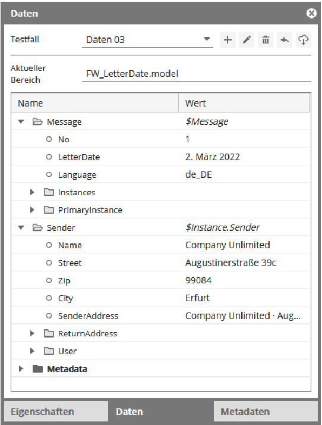

###### 3.4.1.1 Test-Daten verändern

Dynamische Dokumentvorlagen sollen für unterschiedliche Datensituationen gelten. Daher ist es sinnvoll, die Vorlage mit unterschiedlichen Datenbelegungen zu testen.

Um einzelne Werte zu ändern, können Sie die Werte der Datenknoten in der Spalte Wert einfach überschreiben. Die Auswirkungen sehen Sie direkt im mittleren Editorbereich. In der DatenAnsicht werden geänderte Werte fett dargestellt. Um alle vorgenommenen Änderungen an den Werten zurückzunehmen, drücken Sie den Button Testfall zurücksetzen in der Testfall-Leiste der Daten-Ansicht. Wenn Sie geänderte Werte nicht zurücksetzen und die Vorlage speichern und veröffentlichen, so werden auch die Änderungen am Testfall veröffentlicht.

Im Editorbereich können Sie die Werte von Datenknoten nicht verändern.

Um auf vorbereitete Testfälle mit einem kompletten Satz an Daten zurückzugreifen, können Sie in der Testfall-Leiste einen anderen Testfall auswählen. Außerdem stehen weitere Funktionen zur Verfügung, wie das Hinzufügen, Ändern und Löschen eines Testfalls (Änderungen gelten nach Veröffentlichung für alle Benutzer).

Nutzen Sie den Button Datenbeschaffung, um eine Datenbeschaffung zu simulieren. Dies ist möglich, wenn Sie den Wert eines Datenknotens verändert haben, der zum Nachladen von Daten genutzt wird (z. B. die Kundennummer).

##### 3.4.2 Grammatikprüfung

Das Register Sprache ermöglicht es, eine semantische Textanalyse und Grammatikprüfung durchzuführen. Drücken Sie dazu auf den Button Überprüfen. Daraufhin werden Ihnen im oberen Bereich die Ergebnisse einer semantischen Textanalyse anhand von unterschiedlichen Kriterien zur Verfügung gestellt. Darunter werden Einträge zu grammatikalischen Fehlern (Blau), Textverständlichkeit (Orange) oder Verstößen gegen die Corporate Language (Rot) angezeigt. Die Einträge haben jeweils eine korrespondierende Stelle im Editorbereich, wo der Text in der gleichen Farbe unterstrichen ist. Wenn Sie mit der Maus über einen Eintrag fahren, wird die Stelle im Text hervorgehoben.

Die Einträge lassen sich aufklappen, um eine detaillierte Beschreibung der Situation zu erhalten. Zum Teil werden direkt Korrekturvorschläge angezeigt. Diese können über einen einfachen Klick ins Dokument übernommen werden.

Der Button Ignorieren bewirkt, dass der Eintrag bei Ihnen und allen Nutzerinnen und Nutzern des TONIC Anwendereditors nicht mehr angezeigt wird. Um ignorierte Einträge wieder anzuzeigen, nutzen Sie den Button Ignorierte Einträge.

Um neu hinzugekommenen oder angepassten Text zu überprüfen, klicken Sie auf Aktualisieren.

Einträge werden nur für die Texte erzeugt, für die Sie auch die Berechtigung zum Ändern haben.

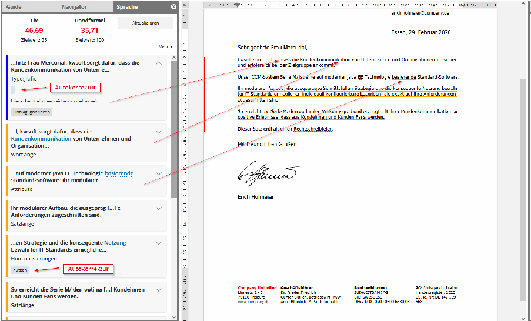

##### 3.4.3 Referenzsuche

Wenn Sie einen Baustein verändern, wirkt sich das in allen Vorlagen aus, die diesen Baustein referenzieren (aufrufen). Daher ist es wichtig zu wissen, ob ein Baustein, an dem Sie Änderungen vornehmen wollen, noch in anderen Kontexten aufgerufen wird.

Nutzen Sie die Referenzsuche, um alle Bausteine und Vorlagen zu finden, die einen bestimmten Baustein aufrufen. Sie finden die Möglichkeit zur Referenzsuch im Bereich Projekte. Wenn Sie auf einem Baustein das Kontextmenü aufrufen, haben Sie die Möglichkeit, aufrufende Vorlagen / Bausteine zu finden.

Für Vorlagen und Bausteine gibt es die Möglichkeit, die Bausteine zu finden, die in der Vorlage /

- dem Baustein aufgerufen werden.

Das Ergebnis wird Ihnen unten im Bereich Referenzen angezeigt. Hier können Sie zwischen der Betrachtung der aufrufenden und aufgerufenen Bausteine auswählen.

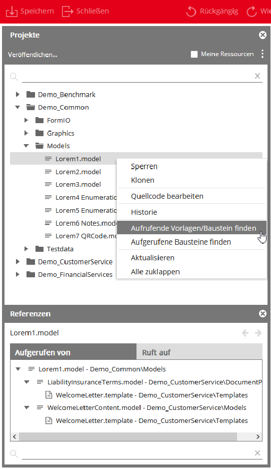

Diese Funktion muss von Ihrer Administration konfiguriert werden. Ist sie nicht konfiguriert, funktioniert die Referenzsuche nicht.

##### 3.4.4 Lineale

Über einen Eintrag in der Konfigurationsdatei \\Configuration\ui \default.contenthub.layout.xml können ein horizontales und ein vertikales Lineal im Editorbereich angezeigt werden. Das vertikale Lineal ist rein informativ, über das horizontale Lineal lässt sich Folgendes steuern:

- • Tabulatoren: In der linken oberen Ecke des Editorbereichs lässt sich der zu platzierende Tabstopp per Maus-Klick einstellen. Zu Wahl stehen Tabstopp links ( ), Tabstopp rechts ( ), Tabstopp dezimal ( ) und Tabstopp zentriert ( ).

Über einen Maus-Klick auf das horizontale Lineal wird ein Tabstopp eingefügt und kann per Drag&Drop an die gewünschte Position bewegt werden. Um einen Tabstopp zu entfernen muss dieser außerhalb des Lineals gezogen werden.

- • Einzüge: Über die Markierungen auf dem horizontalen Lineal können der gesamte Einzug links/rechts ( ) und der Einzug der ersten Zeile ( ) eines Absatzes oder einer Tabellenzelle bestimmt werden.

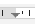

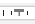

- • Tabellenspalten: Über die Markierungen auf dem horizontalen Lineal kann die Breite von Tabellenspalten ( ) verändert werden.

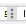

##### 3.4.5 Der Quellcode-Editor

M/TEXT TONIC Content Hub bietet für fortgeschrittene Benutzer die Möglichkeit den Quellcode von Bausteinen und Vorlagen zu bearbeiten. Dazu müssen dem Benutzer entsprechende Rechte vergeben werden. Dann kann über das Kontextmenü ein Baustein oder eine Vorlage im Quellcode-Editor geöffnet und bearbeitet werden. Wird der Quellcode-Editor dann über den Schließen-Button beendet, wird die zugrunde liegende Vorlage im Editor erneut geladen.

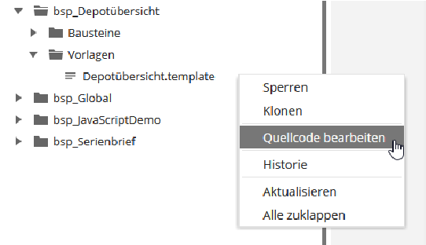

Bausteine können auch aus Vorlagen heraus geöffnet werden:

- • Wird im Quellcode der Cursor in der Pfadangabe eines Bausteins plaziert, kann dieser Baustein über F3 im Quellcode-Editor geöffnet werden.

- • Ist eine Vorlage im Editorbereich geöffnet kann über das </>-Symbol ein Baustein im Quellcode-Editor geöffnet werden.

Die Navigation mit den Vor- und Zurück-Buttons des Browsers ist möglich. Wird beim Bearbeiten einer Vorlage der Quellcode-Editor über den Schließen-Button beendet, wird die Vorlage erneut geladen.

##### 3.4.6 Die Ausgabe-Optionen

Zum Testen verschiedener Funktionalitäten kann es sinnvoll sein, ein Dokument über unterschiedliche Kanäle auszugeben. Daher können Sie ein Dokument testweise als PDF anzeigen lassen, an das angeschlossene OMS senden oder interaktive Elemente des Dokuments im Anwendereditor testen.

In all diesen Szenarien werden die Daten des aktuell angezeigten Testfalls und Nutzers zugrunde gelegt.

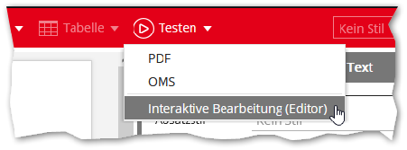

##### 3.4.7 Tastaturbedienbarkeit

M/TEXT TONIC Content Hub lässt sich wie der M/TEXT TONIC Anwendereditor über die Tastatur bedienen. Über die Tastenkombination Strg + Alt + H erreichen Sie einen Hilfe-Dialog, der alle Tastaturkürzel, aufgeteilt in einzelne Bereichen, anzeigt. Ausführlichere Informationen zur Funktionsweise der Tastaturbedienung finden Sie im Handbuch M/TEXT TONIC - Anwendereditor.

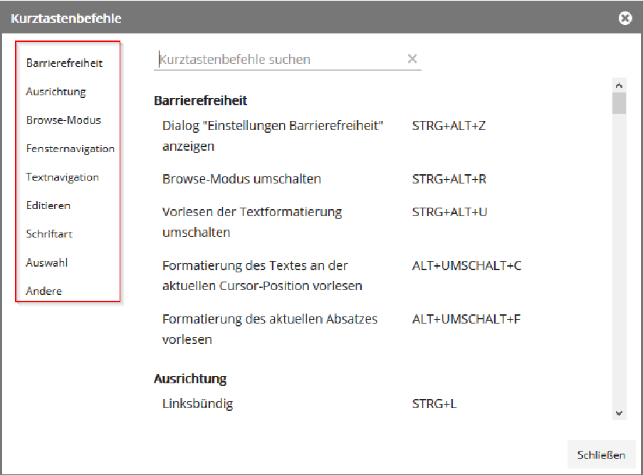

##### 3.4.8 Navigator

Im Bereich Navigator ist eine Übersicht über die Seiten und Abschnitte in der Dokumentvorlage einsehbar. Sie können hier einzelne Abschnitte aus der Vorlage entfernen und die Reihenfolge

- der Abschnitte ändern.

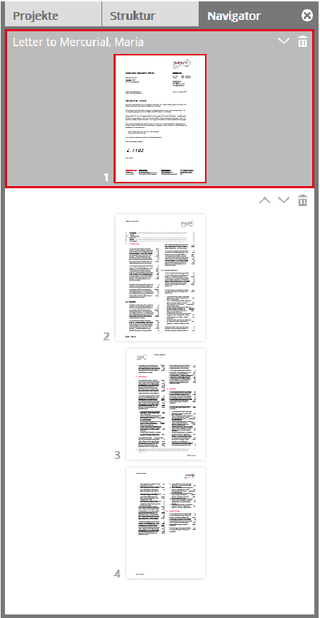

#### 3.5 Kommentare einfügen

Im Strukturbaum können über das Kontextmenü Kommentare eingefügt werden. Kommentartyp und Priorität können im rechten Bildschirmbereich unter Eigenschaften - Kommentar gesetzt werden.

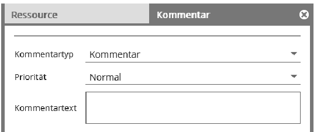

Die Kommentartypen sind Kommentar, Todo und Fixme. Die Priorität kann Niedrig, Normal oder Hoch sein. Der Kommentartext wird im Strukturbaum zusammen mit dem Kommentartyp angezeigt.

#### 3.6 Arbeiten mit Mandanten

Der Content Hub-Benutzer kann für verschiedene Mandanten (auch englisch Tenants) arbeiten. Bei der Arbeitsweise teilen sich mehrere Mandanten die gleichen Ressourcen (wie z. B. Vorlagen). Einzelne Elemente können jedoch mandantenspezifisch gehalten werden. Zum Beispiel kann für

- einen Mandanten North die Absenderleiste angepasst werden.

Technisch wird die mandantenspezifische Ressource in einem Fragment-Projekt gespeichert, so dass die Ressource im Stammverzeichnis unverändert bleibt. Der Content Hub-Benutzer muss vor einer mandantenspezifischen Änderung auswählen, für welchen Mandanten er arbeitet.

Die Projekte, Vorlagen und Benutzerberechtigungen müssen entsprechend angepasst sein, um ein Multi-Mandanten-Szenario zu ermöglichen.

Wählen Sie im Content Hub Editor in der Symbolleiste den Mandanten aus, für den Sie die Vorlage anpassen wollen.

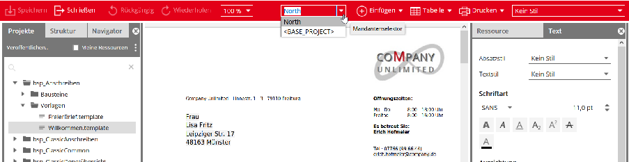

Wenn Sie Änderungen vornehmen, werden diese automatisch im passenden FragmentProjekt gespeichert. Existiert das Fragment-Projekt noch nicht im Projekt-Explorer, so wird es vom System automatisch angelegt. Existiert zwar das Fragment-Projekt, nicht aber die geänderte Ressource (z.B. ein Baustein), so wird sie im Fragment-Projekt neu angelegt bzw. dort gespeichert. Fragment-Projekte haben den gleichen Namen wie das Stammprojekt und führen zusätzlich in eckigen Klammern die Bezeichnung des Mandanten. Die angepasste Ressource wird automatisch im (neu erstellten) Fragment-Projekt abgelegt.

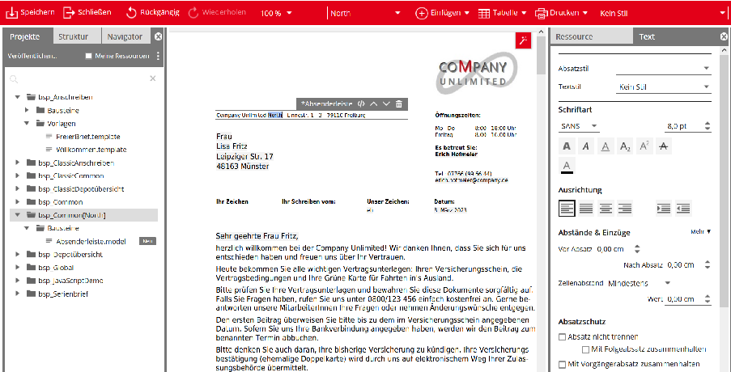

##### 3.6.1 Mandantenspezifische Grafiken

Auch Grafiken können mandantenspezifisch angelegt werden, z. B. für mandantenspezifische Logos. Über einen Rechts-Klick auf die Grafik, die mandantenspezifisch sein soll und Grafik auswählen wird ein Dialog aufgerufen.

Wählen Sie unter Öffnen die mandantenspezifische Grafik aus dem Dateisystem aus. Der Ressourcenname gibt an, unter welchem Namen die Grafik im Arbeitsbereich gespeichert wird.1 Markieren Sie im Verzeichnisbaum die Grafik in dem mandantenspezifischen FragmentProjekt, in dem sie eingefügt werden soll. Klicken Sie dann auf Hochladen, um die Grafik für den ausgewählten Mandanten im Arbeitsbereich zu speichern.

1Im Fall von mandantenspezifischen Grafiken sollte der Ressourcenname mit dem Namen der Grafik im Stammprojekt übereinstimmen. So greift der Baustein, der im Stammprojekt liegt, auf die mandantenspezifische Grafik zu, wenn ein Dokument für den Mandanten erstellt wird.

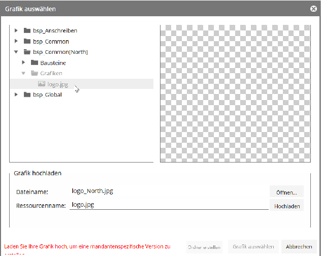

Durch die relative URL auf die Grafik und den identischen Namen referenziert nun die Vorlage bzw. der Baustein automatisch die korrekte Datei im Fragment-Projekt. Sie können den Dialog beenden.

Projekte, Ordner und Ressourcen, die im Dialog Grafik auswählen ausgegraut dargestellt werden, existieren noch nicht im Arbeitsbereich. Wenn Sie dort jedoch eine Grafik hochladen/speichern, wird die Ordnerstruktur automatisch erstellt.

#### 3.7 Arbeiten mit (Feature-)Branches

Die Änderungen, die Sie in Content Hub vornehmen, werden nach der Veröffentlichung in einem Versionsverwaltungssystem abgelegt. Eine beliebte Arbeitsweise in Versionsverwaltungssystemen ist das Arbeiten mit Feature-Branches, bei der für jede neue Funktion oder Änderung an den Ressourcen ein eigener "Branch" erstellt wird, um isoliert nur an

- den neuen Funktionen zu arbeiten.

Diese Arbeitsweise wird von Content Hub unterstützt. Wählen Sie bei dieser Arbeitsweise, bevor Sie die Arbeit in Content Hub beginnnen, unter Branches den Branch aus, an dem Sie Änderungen vornehmen wollen. Je nach Konfiguration wählen Sie dafür zuerst das entsprechende Repository aus.

- 1. Klicken Sie im Bereich Projekte auf Branches, um die Auswahl eines Branches vorzunhemen.

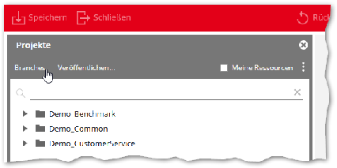

- 2. Wählen Sie das Repository aus, für das Sie den Branch wechseln wollen. Die Projekte, die sich im Repository befinden, erhalten Sie durch Anklicken des Pfeils im Dialog vor dem Repository.

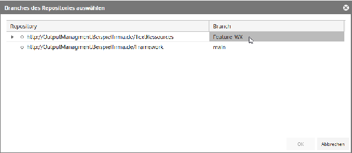

- 3. Wählen Sie nun den (Feature-)Branch aus, an dem Sie arbeiten wollen. Sie sehen jeweils die Informationen zum letzten Commit in den Branch.

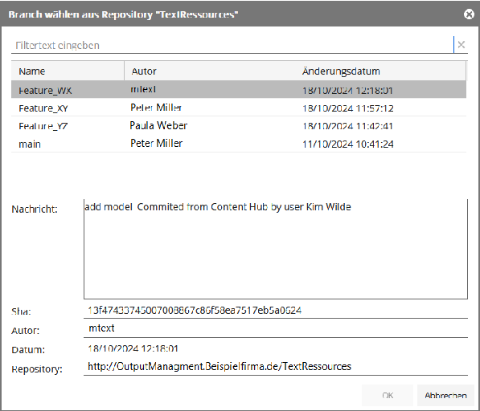

- 4. Es werden nun die Ressourcen aus dem gewählten Branch in den Bereich Struktur der Content Hub Anwenderoberfläche geladen.

Um dauerhaft den Branch angezeigt zu bekommen, auf dem Sie gerade arbeiten, wählen Sie im Menü Projekt-Repository/Branch anzeigen.

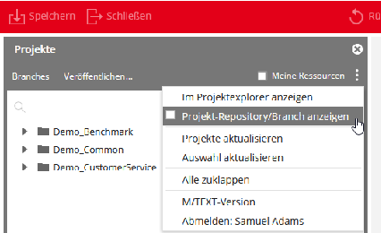

Wenn Sie mit Branches arbeiten, so gilt die Sperre von Ressourcen, die im Content Hub bearbeitet wurden, nur innerhalb eines Branchs. Somit können zwei unterschiedliche Benutzer an der gleichen Ressource arbeiten, so lange sie unterschiedliche Branches gewählt haben.

#### 3.8 Fehlerbehebung

Dieses Kapitel beschreibt mögliche Ursachen und Lösungen von Problemen, die beim Betrieb

- des Redaktionssystems Content Hub auftreten können.

##### 3.8.1 Leere Ordner löschen

Es kann vorkommen, dass scheinbar leere Ordner in Content Hub durch den Benutzer nicht gelöscht werden können. Dies liegt an sogenannten Overlay-Dateien, die darin gespeichert sind. Das Verhalten lässt sich von einem Administrator anpassen, wie im Handbuch 'M/TEXT TONIC Content Hub - Installation und Konfiguration ' beschrieben.

##### 3.8.2 Aktualisierung des In-Memory-Arbeitsbereichs

In Fällen, in denen der in Content Hub sichtbare Workspace/Arbeitsbereich nicht den Erwartungen entspricht, steht zu Debugging-Zwecken eine Funktionen zum Neuladen des Arbeitsbereichs zur Verfügung. Es ist möglich, den In-Memory-Workspace über die Content HubAnwenderoberfläche zu aktualisieren. Halten Sie dazu die Shift-Taste gedrückt und klicken Sie im Projekt-Explorer-Menü auf die drei vertikal angeordneten Punkte und Server-Arbeitsbereich aktualisieren. Dies aktualisiert den Workspace auf dem verbundenen Server.

In einer Clusterumgebung aktualisiert diese Funktion derzeit nur den Arbeitsbereich auf dem Serverknoten, der die Anfrage verarbeitet.

### 4. Ressourcenstatus

Sobald ein Benutzer eine Ressource in M/TEXT TONIC Content Hub bearbeitet, ist diese für andere Benutzer gesperrt und eine benutzerspezifische Kopie der Ressource wird in der Datenbank gespeichert. Das Sperren geschieht automatisch, sobald die erste Änderung an der Ressource vorgenommen wird. Im Projektexplorer und Strukturbaum des Benutzers wird die Vorlage automatisch mit der Markierung Gesperrt versehen.

Will der Benutzer die Vorlage speichern oder schließen, muss er über einen Dialog seine Änderungen entweder speichern oder verwerfen. Wenn mehrere Ressourcen verändert wurden, kann der Benutzer auswählen, welche davon gespeichert und welche zurückgesetzt werden sollen. Werden die Änderungen gespeichert, so werden die Ressourcen im Projektexplorer und Strukturbaum mit der Markierung Geändert versehen.

Aus der Sicht eines anderen Benutzers gibt es keinen Unterschied zwischen Ressourcen, die gerade in Bearbeitung sind (Gesperrt) oder solchen, die bereits gespeichert (Geändert) oder veröffentlicht (Warten auf Aktivierung) wurden. Diese Ressourcen sind alle mit einer Markierung versehen, die anzeigt, durch welchen Benutzer die Ressource gesperrt ist. Die folgende Grafik verdeutlicht das.

|Sicht des Benutzers Linus|Sicht eines anderen Benutzers|
|---|---|
|||

Wenn Sie mit (Feature-)Branches arbeiten, so gilt die Sperre von Ressourcen nur innerhalb eines Branchs. Somit können zwei unterschiedliche Benutzer an der gleichen Ressource arbeiten, so lange sie unterschiedliche Branches gewählt haben.

Gesperrte Ressourcen können von anderen Benutzern nicht bearbeitet werden, außer ein Benutzer besitzt die entsprechende Berechtigung "Mir zuordnen". Dann kann die Sperrung durch

- diesen Benutzer aufgehoben werden.

Ressourcen sind dann nicht mehr gesperrt, wenn sie von einem Administrator auf den Serie M/Server übertragen wurden (im Datenbank-Modus) bzw. wenn sie im Versionsverwaltungssystem veröffentlicht wurden (im Git-Modus).

#### 4.1 Manuelles Sperren und Entsperren vonRessourcen

Zusätzlich zum automatischen Sperren und Entsperren von Ressourcen gibt es die Möglichkeit, diese Vorgänge manuell auszuführen. Öffnen Sie dazu das Kontextmenü im Strukturbaum oder

Projektexplorer auf der entsprechenden Ressource. Über Sperren kann eine bisher ungesperrte Ressource gesperrt werden. Eine gesperrte Ressource kann entsperrt werden. In diesem Fall werden alle Änderungen rückgängig gemacht.

#### 4.2 Versionskonflikte

##### 4.2.1 Ursachen von Versionskonflikten

Versionskonflikte treten auf, wenn ein Content Hub-Benutzer eine Ressource bearbeitet hat, diese aber nach der Bearbeitung in einem anderen Zustand im Versionsverwaltungssystem vorliegt. Dies kann die folgenden Gründe haben:

- • dass entweder jemand anderes dieselbe Ressource in M/Workbench geändert hat, während der Content Hub-Benutzer seine Änderungen vorgenommen hat oder
- • dass die Ressource bereits im Versionsverwaltungssystem geändert wurde, als der Content Hub-Benutzer mit der Bearbeitung der Ressource angefangen hat, aber die Änderungen vom Versionsverwaltungssystem nicht mit der Datenbank synchronisiert wurden, d.h. der Content Hub-Benutzer bearbeitete eine alte Version der Ressource (Datenbank-Modus).

Tritt während des Veröffentlichungsvorgangs ein Versionskonflikt in einer geänderten Datei auf, so bricht Content Hub den Veröffentlichungsvorgang ab. Auf der Anwenderoberfläche wird eine Markierung angezeigt:

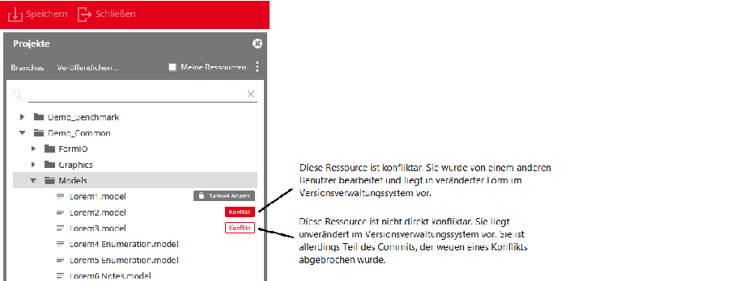

Die Ressource, aufgrund derer der Konflikt auftritt, ist mit einer roten Kachel versehen. Diese Ressource wurde von einem anderen Benutzer bearbeitet und liegt nicht mehr in der Form im Versionsverwaltungssystem vor, mit der Sie ursprünglich die Bearbeitung begonnen haben.

Andere Ressourcen, die im gleichen Vorgang veröffentlicht werden sollten, sind mit einer weißen Konflikt-Markierung versehen. Solche Ressourcen sind nicht direkt konfliktär.

##### 4.2.2 Umgang mit Versionskonflikten

Es gibt mehrere Möglichkeiten, mit solchen Versionskonflikten umzugehen:

- • Sie lösen den Konflikt auf.

Den Konflikt aufzulösen bedeutet hier, die Ressource auf den Ursprungszustand zurückzusetzen. In diesem Fall gehen Ihre Änderungen an der Content Hub-Ressource für Sie verloren. Wenn die Ressource zurückgesetzt ist, können Sie den Arbeitsbereich neu laden und auf der aktuellen Version der Ressource arbeiten, z. B. die gleichen Änderungen erneut vornehmen. Dieses Vorgehen ist zu empfehlen, wenn Sie nur kleine Änderungen vorgenommen haben und sich genau erinnern, welche Änderungen es waren.

Das Auflösen eines Konflikts auf diese Weise funktioniert nur, wenn Sie entsprechende Benutzerrechte besitzen.

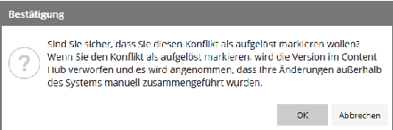

- • Sie bitten einen Administrator, den Konflikt aufzulösen.

Administratoren mit Zugang zu M/Workbench haben die Möglichkeit, die konkurrierenden Ressourcenstände zu vergleichen und für jeden Unterschied in einer Ressource festzulegen, welche Version weiter verwendet werden soll.

Ressourcen, die nur Teil eines fehlgeschlagenen Veröffentlichungsvorgangs waren, selbst aber nicht mit der aktuellen Version der Ressource im Konflikt stehen, kann der Administrator auf den von Ihnen bearbeiteten Stand vor der nicht gelungenen Veröffentlichung setzen.

- • Für Content Hub-Anwenderinnen, die mit dem Quellcode der Vorlagen und Bausteine vertraut sind und Erfahrungen in der Versionsverwaltung von Dateien haben, gibt es eine weitere Alternative. Die Funktion Quellcode bearbeiten kann zur Konfliktlösung benutzt werden. Sie

- können über den Quellcode-Editor Ihre konfliktbehaftete Datei exportieren und sichern. Dann
- lösen Sie den Konflikt auf (setzen also Ihre Änderungen in Content Hub zurück). Als Ergebnis erhalten Sie die Datei, die im Versionsverwaltungssystem bzw. in der Datenbank vorliegt. Den Quellcode dieser Datei können Sie erneut exportieren, die beiden Dateien auf Ihrem Rechner vergleichen und eine "kombinierte" Datei erstellen, die weiter verwendet werden soll. Ihre Änderungen können Sie mithilfe des Quellcode-Editors erneut importieren.

Dieses Vorgehen funktioniert nicht bei Konflikten mit Dateien, die Sie im Content Hub Editor nicht "sehen" können (wie z. B. Metadaten) und ist nur für Benutzerinnen und Benutzer gedacht, die Erfahrungen in der Versionsverwaltung von Dateien haben sowie den Quellcode der Vorlagen und Bausteine interpretieren können.

