## Serie M/ 6.16

User manual

# Text editing with M/TEXT TONIC Content Hub

This manual was released at 16.05.2025

Tip: Take a look at the PDF file "Serie M/ Glossary" to find out more about terms used in the Serie M/.

Feedback: This manual has been investigated and assembled with the utmost care. If, however, you should come across any errors, unaccouracies or incompletenesses, we would like you to inform us (<documentation@kwsoft.de>).

Note: The underlying databases for Serie M/ products should only be changed using official Serie M/ products. By altering these directly we cannot guarantee that Serie M/ products will continue to operate correctly. We reserve the right to change the database structure at any time and without prior notice.

|The symbols used in the manual:|The symbols used in the manual:|The symbols used in the manual:|The symbols used in the manual:|
|---|---|---|---|
||Example||System dependent|
||Please note||Prerequisite|
||Background||Warning|
||Note||Cross reference|
||Data privacy||Example video|

Copyright © 2025 kühn & weyh Software GmbH

Linnéstr. 1-3, D-79110 Freiburg Fone 0761/8852-0 Fax 0761/8852-666 E-Mail documentation@kwsoft.de Homepage www.kwsoft.de

##### Table of Contents

- 1. What is new? ......................................................................................................................... 1

- 1.1. New features for Release 6.16 .................................................................................... 1

2. Introduction ........................................................................................................................... 2

- 2.1. Functions .................................................................................................................... 2

- 4. Resource status ................................................................................................................... 53

- 2.2. The ressource workflow in Content Hub ..................................................................... 3

3. Using the Content Hub Editing System .................................................................................. 4

- 3.1. The processing workflow ............................................................................................ 4

- 3.1.1. Opening templates in the project explorer ....................................................... 4
- 3.1.2. Creating new templates ................................................................................... 5
- 3.1.3. Editing existing resources ................................................................................. 6
- 3.1.4. Publish resources ........................................................................................... 10

- 3.2. Introduction to the Document model ....................................................................... 11
- 3.3. Editing and inserting document elements ................................................................. 13

- 3.3.1. Insert form fields ........................................................................................... 13
- 3.3.2. Insert images and attachments ...................................................................... 16
- 3.3.3. Document logic .............................................................................................. 18
- 3.3.4. Models ........................................................................................................... 22
- 3.3.5. Selection ........................................................................................................ 24
- 3.3.6. Resource references ....................................................................................... 26
- 3.3.7. Translations .................................................................................................... 27
- 3.3.8. Barcodes ........................................................................................................ 30
- 3.3.9. Guide elements and data input elements ....................................................... 31
- 3.3.10. Modification rights ....................................................................................... 39
- 3.3.11. Editing Metadata .......................................................................................... 40

- 3.4. Functions on the Content Hub interface ................................................................... 41

- 3.4.1. Data view ....................................................................................................... 41
- 3.4.2. Grammar check .............................................................................................. 43
- 3.4.3. Reference search ............................................................................................ 43
- 3.4.4. Rulers ............................................................................................................. 45
- 3.4.5. Source code editor ......................................................................................... 45
- 3.4.6. The output options ........................................................................................ 46
- 3.4.7. Keyboard control ............................................................................................ 46
- 3.4.8. Navigator ....................................................................................................... 47

- 3.5. Inserting comments .................................................................................................. 48
- 3.6. Working with tenants ................................................................................................ 49 3.6.1. Tenant specific images ................................................................................... 49
- 3.7. Working with (feature) branches ............................................................................... 50
- 3.8. Handling errors ......................................................................................................... 52

- 3.8.1. Delete empty folder ....................................................................................... 52
- 3.8.2. Updating the in-memory workspace .............................................................. 52

- 4.1. Manually locking and unlocking resources ................................................................ 53
- 4.2. Version conflicts ........................................................................................................ 54

- 4.2.1. Causes of conflicts ......................................................................................... 54
- 4.2.2. Dealing with version conflicts ......................................................................... 54

Text editing with M/TEXT TONIC Content Hub 6.16 iii

### 1. What is new?

Our products are continuously improved and developed. All new features, compatibility notes, improvements as well as corrections for release 6.16 can be found in the corresponding ReleaseNotes.

A selection of the most important changes for M/TEXT TONIC Content Hub is listed below.

#### 1.1 New features for Release 6.16

######## Workflow

- • You now have the option of displaying the templates or models in which the models you want to edit are called up. This way, you avoid making changes in templates that you did not intend (see Section 3.4.3, “Reference search”).

- • Form fields can now be inserted into a template using the context menu.
- • Content Hub now supports the creation and editing of form fields (text fields, combo boxes, radio buttons, etc.). Form fields can be inserted using the context menu (see Section 3.3.1, “Insert form fields”).

######## Styles

• All elements in the structure tree can now be assigned predefined named styles. This is done via the Properties - General tab.

### 2. Introduction

Creating templates requires both technical and specialist expertise. In practice, these tasks are usually undertaken by people with different roles and specialties.

Technical editors create the basic template and associated resources, including central elements such as layouts and styles (CI/CD). They take care of customized template data supply and define the rules for output settings and associated basic template structures. M/Workbench is used for technical editing processes.

Specialist editors expand the basic template by adding specialist content. They create texts, tables and forms, using elements provided by the basic template and associated resources (styles, models, graphics, etc.). Specialist editing is usually carried out by the relevant specialist department within a company.

M/TEXT TONIC Content Hub is the Serie M/’s editing system. It makes it possible to create and edit M/TEXT TONIC templates and models as part of the specialist editing process. This manual describes how to use Content Hub in the context of technical editing.

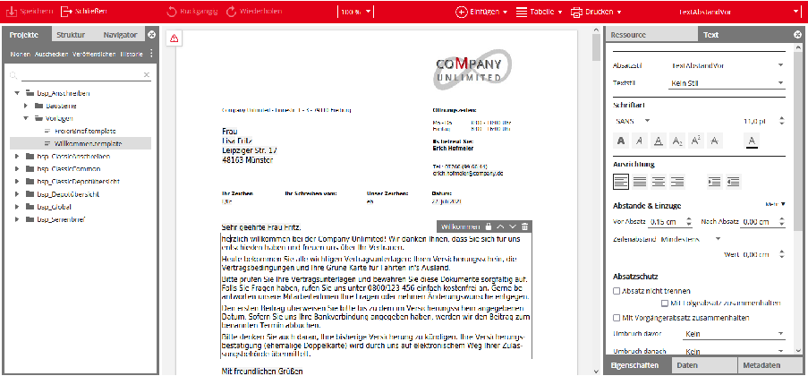

#### 2.1 Functions

Templates and models created or edited using the editing system are part of the Serie M/ project structure. The editing system has a project explorer that displays all application projects. Technical editing projects (library projects), which contain resources used only for specialist editing, are not displayed in the project explorer.

Templates can only be created in the editing system within application projects, and are always based on the basic templates prepared by technical editors. A new template is created by cloning a basic template in a wizard. Basic templates saved in application projects by a technical editor can be edited directly. If an application project is not visible in the Content Hub, a corresponding permission may be missing. Specialist content within a template is created and updated using an Editor that is in essence identical to the TONIC User Editor. This Editor also has a structure tree just like that in the M/Workbench template designer.

The following actions, among others, can be performed via the structure tree and via the WYSIWYG editor:

Introduction

- • Create and edit containers, paragraphs, spans, tables, graphics, barcodes, form fields
- • Create and edit translated texts for paragraphs
- • Create and edit conditions and loops for dynamic modification during content creation (e.g. creating data driven tables)
- • Access data model nodes, in order to output their values or use them in conditions, switches or loops
- • Fill content extensions using basic models
- • Insert models
- • Edit application project models
- • Extract content as application project models
- • Creation and editing of internal comments
- • Creation and editing of guide and data input elements for interactive editing of the document in the TONIC user editor
- • Editing user authorisations for document parts.

#### 2.2 The ressource workflow in Content Hub

The same requirements for versioning and coordinated deployment apply to resources that are edited in the specialist editing process as for the resources of the technical editing process in M/Workbench. This is why resource maintenance in the M/TEXT TONIC Content Hub editorial system is also based on the version management system on which M/Workbench is also based. To simplify matters for users, the required operations (checkout, commit, ...) are performed internally by the system.

To simplify things, the editing system prevents conflicts that might occur when two editors attempt to edit a single resource. If a user starts to edit a resource, that resource will not be accessible in Content Hub to other Content Hub users until the edit is published or the changes have been undone. Initially, only the user making the edits can view the changes they have made. The changes only become visible to all users after publication.

Resources are published using an assistant. The assistant is used to select the resources to be published from a list of resources being edited and add a comment to it. After publication, the resource is unlocked and committed in the associated version control system; it is then visible to other specialist editors.

The function “Assign to me” offers users the option of taking over a locked resource and continuing to edit it in its edited, unpublished state.

### 3. Using the Content Hub EditingSystem

M/TEXT TONIC Content Hub is called via the URL http://<hostname>:<portname>/contenthub.

|http://localhost:8080/contenthub|
|---|

Depending on the configuration, you will be redirected to a Git hosting platform after logging in to Content Hub and asked to grant authorizations for resources there.

In the following, the central working of the product will be explained and further functionalities will be presented.

#### 3.1 The processing workflow

##### 3.1.1 Opening templates in the project explorer

To open a document template, double click on the template within the project explorer. It will open in the editor area.

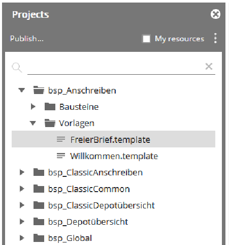

The Editor will open. The template and any models it contains can be edited.

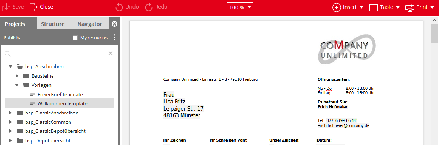

If it is necessary to edit the document, or if there are errors in the document, a warning symbol will appear in the upper left of the screen next to the document. Clicking on the warning will reveal a window containing detailed information on the issue.

Folders of the highest level are called projects in M/TEXT. They have additional properties that subordinate folders cannot have.

##### 3.1.2 Creating new templates

A new template is created by cloning an existing template and then editing it. In this way, elements that are made available via a framework such as stationery, footers and address fields are simply adopted and do not have to be created.

To clone a template, select it in the project explorer and then use the context menu or the tool bar to select Clone. You then need to assign a Name and target folder and once again select Clone.

You can create a new folder in the resource storage in the dialogue via the Create folder button. However, this is only adopted if you also store a template directly in the folder. Otherwise, the folder will not appear in the project explorer after closing the dialogue.

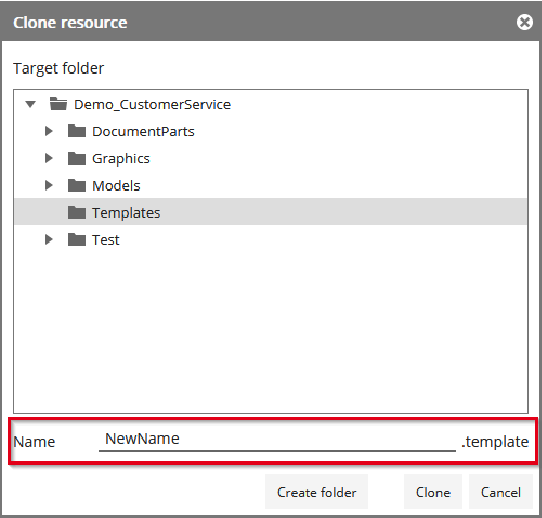

You have now created a new template, which is identical to the cloned template. In the project explorer, this template is marked as being New. Double click on the template in the project explorer to open and edit it.

##### 3.1.3 Editing existing resources

Once you have opened a template in the editor area, you can edit both the template and the models that make up the template. Click on text within the template. A border will appear that indicates the model that the text belongs to. You can use the upper edge of this border to move or delete the model.

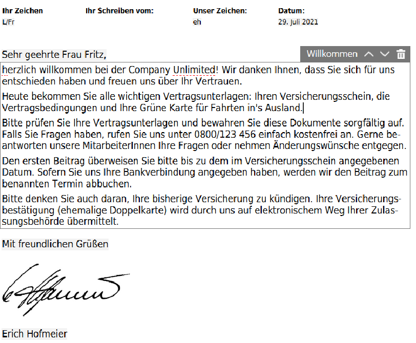

If you make a change, a magic wand symbol appears in the top right corner of the content. It indicates that modified resources are included in the template or that the template itself has been modified.

You can find a summary of the resources that you have edited or created in the project explorer. To do this, tick the check box located next to My Resources.

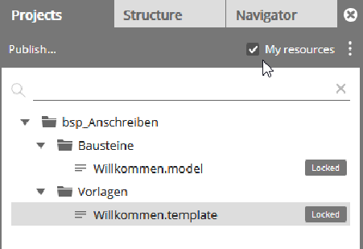

Save your changes using the shortcut <CTRL + S> or by clicking on Save. A dialog will appear, and you can decide which of the resources you have edited should be saved and which edits you wish to discard. Use the Undo button to return the resource to its original state.

Saving changes does not publish the resource. Until the resource is published, you are the only user who can view the changes you have made.

To close a template, click on the Close button in the tool bar.

###### 3.1.3.1 Insert models

To add an existing model to the template, find the spot you want to insert the model into and then click on it (this might be at the end of another text model, for example), and then press # or use the context menu to select Insert – Model. You can then select a model from the Insert Model area on the left of the screen. On the left-hand side of the screen, you can select from Insert From Project or Insert From Search Tree. The models available will, in each case, be displayed below: click on the desired model to insert it.

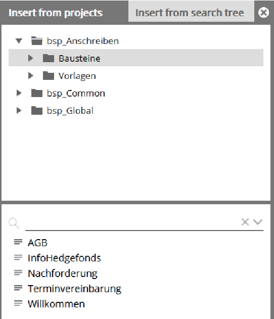

If the data required for a model is not available, the system requests it:

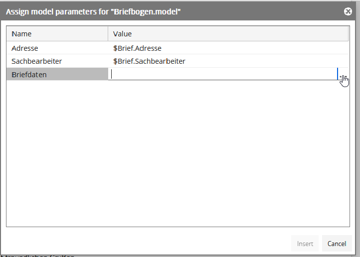

A model can also be inserted in the structure tree (Structure tab) via the context menu. To edit a model, insert it into the template and then make any changes. As you do so, the model will be automatically locked so that other users cannot edit it.

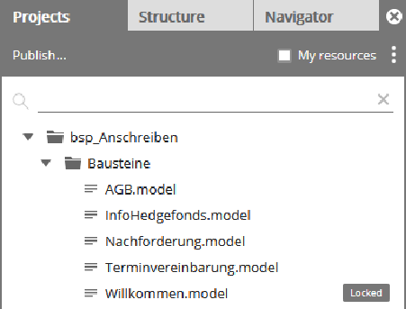

Please note that when you edit a model, the changes you make are also applied to all other templates that reference that model. To find out which templates reference the model, use the reference search in the context menu of the model (see Section 3.4.3,

“Reference search” ). You can find more detailed information on how to use models in the Section 3.3.4, “Models ”.

###### 3.1.3.2 Insert paragraphs

In Content Hub, paragraphs can be inserted in two different ways: within a model or before resp. after a model.

With <Enter> a paragraph is inserted within a model at the cursor position. If the cursor is at the beginning or end of a model, <Alt + Enter> can also be used to insert a paragraph before or after the model.

###### 3.1.3.3 Insert other elements

In addition to models and paragraphs, various other elements can be inserted into documents in Content Hub, including:

- • The values of data model nodes can be output in the document via the context menu Insert Data.
- • Special characters can be inserted via the context menu Insert - Symbol.
- • Images or attachments can be inserted via the context menu Insert - Image or Insert Attachments (see Section 3.3.2, “Insert images and attachments”).

- • Barcodes can be inserted via the context menu of the structure tree Insert - Barcode (see Section 3.3.8, “Barcodes”).

- • Control structures (loop, condition, switch, case) can be inserted via the context menu Insert Logic. These enclose the element on which the context menu was opened (see Section 3.3.3, “Document logic”).

- • You can create a user interaction for the end users via the context menu Insert - User interaction. The user interaction can contain data fields, field groups, action links, content links and guide folders (see Section 3.3.9, “Guide elements and data input elements”).

##### 3.1.4 Publish resources

To publish resources that you have edited and saved, select the Publish button in the project explorer. A dialog will open that displays all edited resources.

Select the resources that you wish to publish and add a comment to them. When you click on Publish, the changes will be transferred to the associated version control system. After the next deployment, the edited resources will be available to all users.

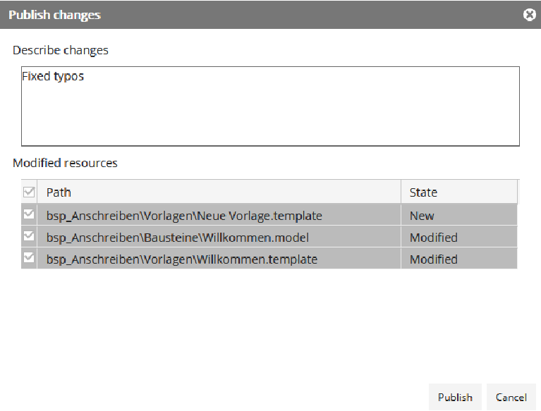

#### 3.2 Introduction to the Document model

A TONIC document template is made up of various document elements. These describe the content, the dynamisation rules and the data situation of the document. The elements are arranged hierarchically and are subject to clearly defined rules for nesting. At the outermost level is the document, which contains one or more sections. This contains one or more containers, which contain tables, paragraphs, graphics, etc. Document instances also contain the document data in the form of data models.

Unlike the TONIC user editor, the Content Hub Editor displays the structure of the document alongside the WYSIWYG area ( from "what you see is what you get"). Not all elements of this structure are editable.

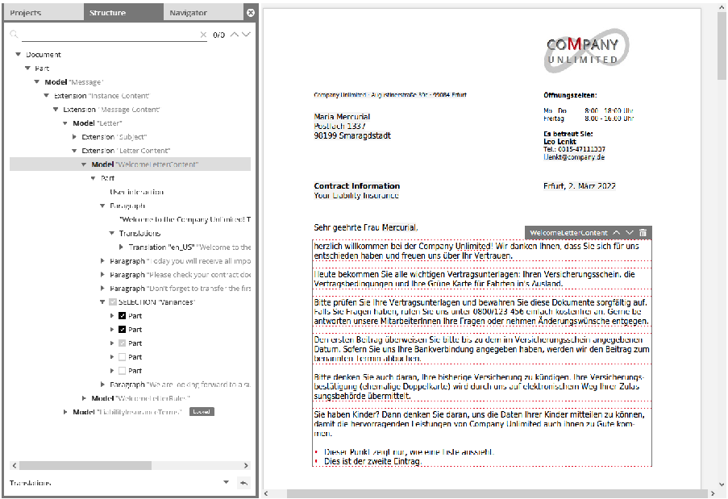

If you click on an element in the Structure area, it is shown focussed and outlined in the editor area. Additional views are also displayed in the Properties area, in which settings relating to the corresponding element can be made.

The other way round, the structure area adapts to the focus in the editor area. The structure is expanded when you click on an element in the editor area. If the element is a component of the template that you cannot change, you will only see the model in the structure. If you have modification rights, you will see other structural elements such as containers, paragraphs, paragraph parts, tables or user interactions.

A special place is held by Parts, which do not directly represent a displayed element, but serve to dynamise the document. They encapsulate one or more elements of the document model in order to

- • provide them with a visibility condition (IF),
- • produce them repeatedly in a loop (FOR EACH),
- • provide them with a switch,
- • assign them modification rights. Corresponding to these functions, parts are displayed differently in the Structure area:

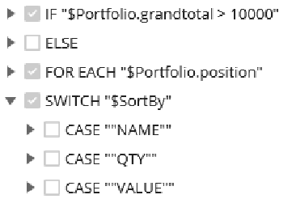

#### 3.3 Editing and inserting documentelements

##### 3.3.1 Insert form fields

Form fields are elements that are used in an interactive output format (PDF, HTML) to save entered data. They create interactive elements in the output format and are used in forms in particular. PDF and HTML-specific field events can be defined for the fields. Form fields can include the label of a field in the field label child element.

Form fields can be inserted into a template via the context menu.

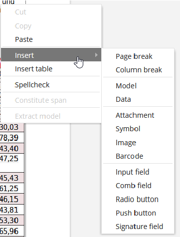

There are the following types of form fields:

- • Input fields (InlineField) can be linked to a data model node. This allows a default value to be set in the form and the entered value to be saved. The validation and format rules defined at the data model node can be checked directly in the PDF form as it is being filled out. The appearance of input fields varies depending on the value of the dialog field in the Validation area, where the possible values here depend on the type of data model node: text field (Input

- Field dialog field), drop-down list/combination list (Combination Field dialog field), checkbox (Boolean type, Checkbox dialog field), date field or time field (Date and Time type).
- • Comb fields are input fields in which there is a separation between the characters to be entered. The comb field properties are assigned to an input field using styles. The field label of a comb box automatically contains tabs at the points where the zone positions begin. This makes it easy to label a comb box for entering a date, for example, with separate zones for day, month and year.
- • Radio buttons (InlineRadioButton) are used to select an option. Each radio button in the form can either be selected or not selected. If there are several possible values for a data model node, this can be represented using several radio buttons. In this case, each radio button is assigned a value from the list of values. The properties of a group of radio buttons are configured in the PDF option group (PDFRadioGroup) DOM element. This is a child element of a section. It has no graphical representation in the document.
- • Buttons (InlinePushButton) create a button in the interactive form that triggers an action when clicked. The actions are assigned via field event styles.
- • Signature fields (InlineSignature) create a signature field in the interactive form that can be digitally signed.

|Properties|Description|
|---|---|
|Data model node|Specifies the associated data model node.|
|Description|Contains the description of an element. This is displayed for some elements in the user editor and can be read aloud by a screen reader.  The following applies to radio buttons: The description is displayed as a note in PDF viewers and read out by screen readers if no field ID is specified.|
|Field ID (PDF, HTML)|Name of the field which will be passed to a PDF or HTML form. Corresponds to the HTML attribute name.  Possible values are a string or the reference to a data node (not a complete JavaScript). The reference is resolved during formatting and the formatted data node value is used as the field ID in the PDF/HTML.  If the value does not begin with a dollar sign, it is interpreted as a string. A dot at the beginning of the value serves as an escape character if you want to use a string that begins with a dollar sign.    The Field value creates a field with the name "Field" in the PDF file.  For the value $Field1, the data node Field1 is used. If the data node exists, points are removed from its formatted value and the result is used as the field name in the PDF output. If the data node does not exist, a formatting error is generated.  The value .$Field1 creates a field with the name "$Field1" in the PDF file.  The following applies to radio buttons: The value of the field ID is displayed as a hint in PDF viewers and read out by screen readers.|

|Properties|Description|
|---|---|
|Form ID (HTML)|Assigns the field to an HTML form. Corresponds to the HTML attribute form.|
|Spellchecking|Specifies whether or not spell checking should be used in an element.|
|Comb field|Determines whether an input field is displayed as a comb field. Comb fields are divided by vertical lines into chambers, into each of which a single character can be entered. Other requirements for a field to be displayed as a comb field: The Comb Field and Maximum Length style properties are set.  Possible values are: None (normal input field), Comb (comb field lines), Underlined (only the lower comb field line is printed). The comb field properties for zone, start and end line height and thickness are ignored. This option can be used to display input fields with a line underneath.)|
|Maximum length|Specifies the maximum number of characters that can be entered into the text field. For comb fields this value is mandatory and specifies the number of chambers. If the comb field flag Comb field is not set, the limitation of the number of characters can be removed by specifying the value -1.|
|Comb field, zones (positions)|Comma-separated list of ascending integers specifying the positions of the zone separators. For example, specifying 2,5,10 creates zone lines after the second, fifth, and tenth characters.|
|Value index|Radio buttons are used for data model nodes where a value list is stored and one of the values is to be "checked". Usually a radio button is generated for each entry of the value list. All radio buttons for the same data model node are assigned the same group ID so that only one can be selected by the user in the finished document. The Value Index property specifies the value of the value list to which the radio button belongs, with a value of 0 representing the first item in the value list, a value of 1 representing the second, and so on. The value -1 means that the radio button is always selected.  If no field ID and no description are set for the option field, the description of the value is displayed as a note in PDF viewers and read out by screen readers. If there is no description of the value, the value itself is used.|
|Group ID (PDF, HTML)|Group ID which will be passed to a PDF or HTML form. Possible values are a string or the reference to a data node (not a complete JavaScript). The reference is resolved during formatting and the formatted data node value is used as the group ID in the PDF. If the value does not begin with a dollar sign, it is interpreted as a string. A dot at the beginning of the value serves as an escape character if you want to use a string that begins with a dollar sign.|
|Title|Contains the title of an element. The labels are partially displayed in the user editor.|

|Properties|Description|
|---|---|
| |The labels of the following elements can also be specified dynamically via data model nodes: Section, Elements in the Guide Area, and Data Entry Area, where a trailing space is interpreted as the end of the data model node and is not output. To display a $ character, double-enter $$. The value displayed in the user editor changes dynamically when the user changes the data model node value.|
|Reasons for signature|A list of reasons for signing can be specified here. The property Reason specification optional determines whether the signer can or must select a reason when signing digitally.|
|Reason specification optional|Specifies whether specifying a reason is optional when signing. The default is true.|

##### 3.3.2 Insert images and attachments

M/TEXT TONIC Content Hub users can

- • Insert a image or attachment reference into a template or model, provided that the image or attachment is already present in the database.
- • Edit the reference to reference a different image or attachment from the database. All attributes assigned to the original image (Size, Orientation, Pages) remain valid.
- • Upload a new image or attachment – either as a new resource or as a replacement for an image / attachment that is already present in the database.

###### 3.3.2.1 Images and attachments in the Editor

There is a dialog available for editing images that can be opened from the editor area in several ways. The dialog for attachment actions behaves analogously:

- • In the editor area via the context menu, Insert – Image or Insert – Attachment
- • If the graphic is already present, focus on the graphic and, in the Image area, click on the Select image button. If the attachment is already present, focus on the attachment and, in the Attachment area, click on the Select attachment button

|Open a dialog for a new image|Open a dialog to edit a image reference|
|---|---|
|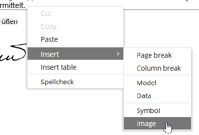|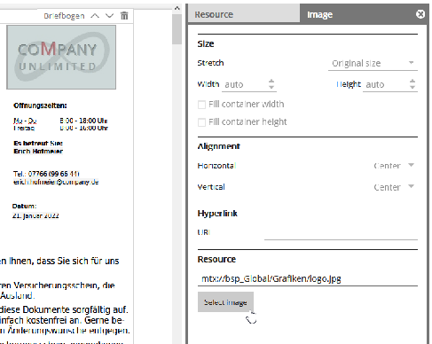|

The Insert image or Insert attachment dialog will open. In the upper section of this dialog, the user can select an image or attachment that can be added to the template that is currently open. The user can select from all images and attachments contained in the current project and referenced projects. The selected reference is added to the document by selecting an image or attachment from the tree structure and clicking the Insert button.

The lower section is used for uploading images or attachments to the Serie M/ resource store. Click on the Browse button located next to the Filename field to open a browser dialog and select a file for upload. Click on the Upload button next to the Resource name field to upload the selected image / attachment. It will be saved under the name entered into Resource Name, in the folder that is selected in the folder structure visible in the upper part of the dialog. It can then be added directly to the template.

You can create a new folder in the resource storage in the Insert/Select Graphics/Attachments dialog by clicking on the Create Folder button. However, this folder will only be saved if you also upload a graphic or attachment to the folder (via Open - Upload).

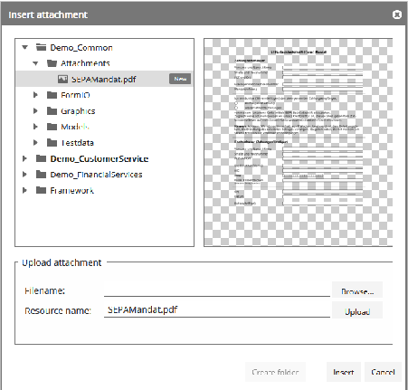

###### 3.3.2.2 Images and attachments in the project explorer

A graphic or attachment can be uploaded from the project explorer by selecting Upload image/ attachment in the context menu.

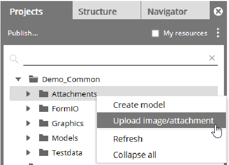

The Upload image/attachment dialog is identical to the Insert image/attachment dialog described in the previous section.

##### 3.3.3 Document logic

The document logic can be created and edited in the Content Hub. Thus, visibility conditions, ELSE conditions, loops or switchs can be created and edited.

More information about conditions (VisibleIf), loops (ForEach) and case selections (switch/case) can be found in the manual "M/TEXT TONIC - Text administration" in the section "Dynamization of parts".

You will also find the configuration of editing rights in the Logic section of Content Hub (see Section 3.3.10, “Modification rights”).

###### 3.3.3.1 Create logic

Using the context menu in the structure tree, a corresponding logic block can be inserted around the element selected in the structure tree by choosing Insert - Logic - Loop or Insert - Logic

- Condition or Insert - Logic - Switch or Insert - Logic - Case. Each element except document and the first part of a model can be enclosed by a logic block. In this case, a new part is inserted as a logic block in the document. It is displayed in the structure tree according to its function as FOR EACH (loop), IF (condition), CASE or SWITCH.

- 3.3.3.1.1 Creating Loops If a loop is inserted, a dialog for selecting a data model node appears.

The basis for the loop is specified as a multiple data model node, producing the part once for each instance of the multiple node.

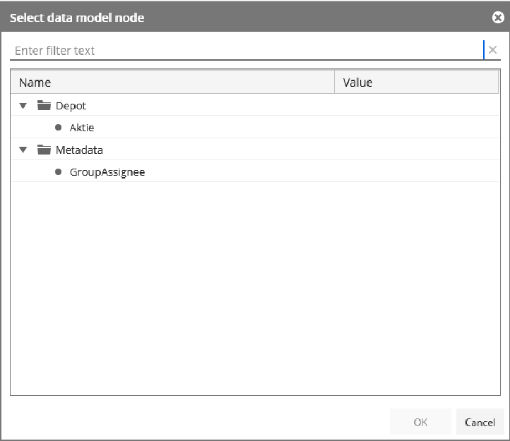

######### If you specify a child data model node of the loop parameter within the loop, always use the data of the first entry at the top of the dialog. It represents the element that changes in each loop iteration.

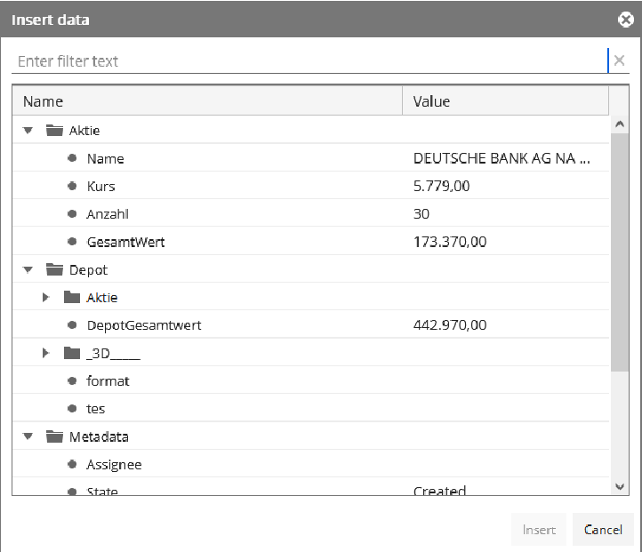

####### 3.3.3.1.2 Creating Conditions

If a condition is inserted, an editor dialog appears in which one or more conditions can be created and linked with AND/OR. Conditions can be defined with data model nodes, comparison operators and comparison values.

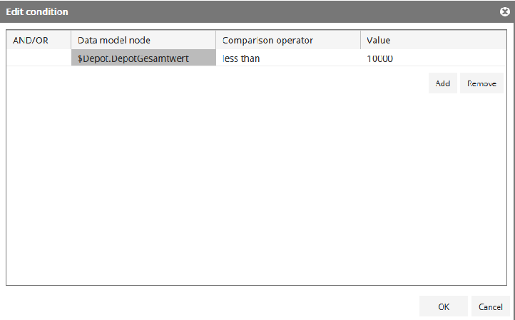

An ELSE condition can be assigned to an existing condition via the context menu in the structure tree under Insert - Logic - ELSE Condition. A part ( labeled as ELSE in the structure tree) with a paragraph is created in the document. If the ELSE condition is activated via the checkbox in the structure tree, this paragraph can be edited. Either directly in the editor area or via the context menu in the structure tree via Edit in editor. This paragraph will then contain the content that will be displayed if the ELSE condition is met.

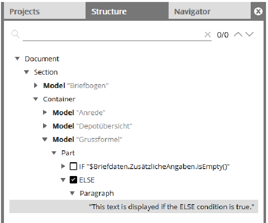

The checkbox in front of a condition can be used to activate it and display the corresponding part in the editor area, even if the condition is not fulfilled.

To avoid redundancies caused by multiple definitions of the same conditions, only data model nodes created centrally by the administration that contain these conditions are

available for selection. This means that when changes are made, a data model node only has to be adjusted once centrally.

####### 3.3.3.1.3 Creating Switches

A switch can be created to provide content for several different data assignments. When the document is created, the value of the data model node specified in the switch is compared with the values in the cases below it. The case for which the comparison value matches the switch value is output.

When you insert the switch, a dialogue opens in which you can select a data model node. The value of this data model node determines which case is displayed in the document.

To insert a case into an existing switch, first insert the content of the case, for example a paragraph. Then create the case element around this element via Insert - Logic - Case. A dialogue opens in which you can select a data model node. If you want to specify a fixed comparison value for the case, you can change this afterwards in the Logic area under Case - Type.

You can also create an ELSE case for a switch, which is displayed if none of the other cases occur. To do this, focus on the case selection and select Insert - Logic - Switch ELSE.

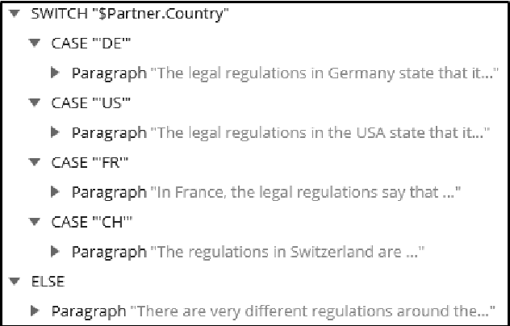

To be able to edit the contents of the conditions, change the assignment of the test data in the Data area (see also Section 3.4.1, “Data view”).

###### 3.3.3.2 Edit logic

When a logic element (loop, condition, case, switch or ELSE condition) is selected in the structure tree, the Logic tab is displayed on the right side of the screen (The Properties tab at the bottom must be open for this). Here the logic scripts can be deleted (Clear). The Edit button can be used to open an editor dialog to modify the corresponding script.

Existing logic elements can also be modified via the context menu in the structure tree by choosing Edit logic.

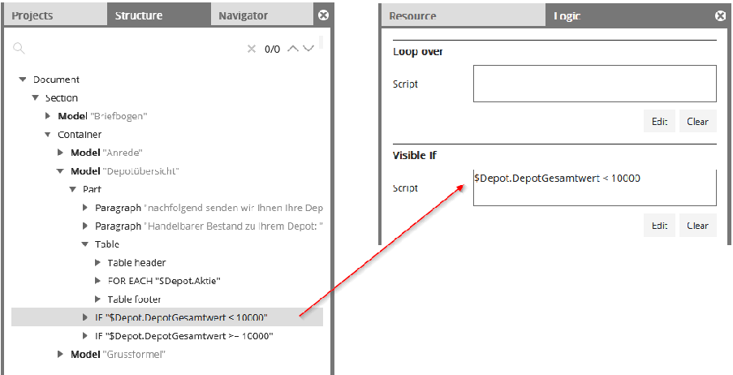

In the area Case of a switch, you also have the option of choosing between entering a data model node and entering a fixed value. To do this, change the entry in the Type field.

##### 3.3.4 Models

Models are reusable parts of a document template. They can be created and edited in the M/TEXT TONIC Content Hub. Creation is done either by extracting content into a model or by cloning an existing model or by creating a model from the Project Explorer..

###### 3.3.4.1 Extracting models

Elements can be highlighted in the structure tree or in the editor area and then extracted as a model.

If you select and extract a model in the editor area, you must select complete valid elements. For example, it is not possible to extract one and a half paragraphs as a model.

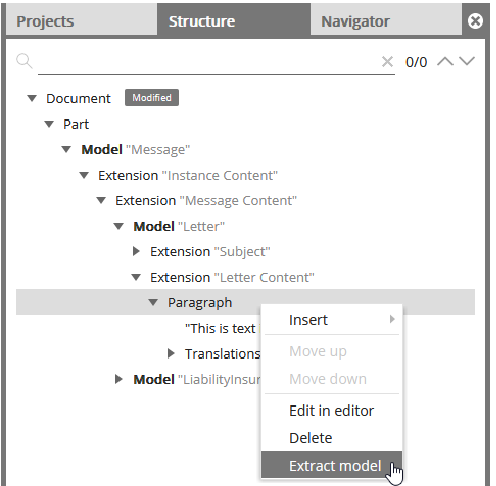

A dialog will appear, into which the user enters a name for the new model and selects a location to which it will be saved. Only a folder within the current project can be selected as the target, whereby you can create a new folder using the Create folder button. However, this folder is only applied if you also save the model there.

The newly created model is then added to the template in place of the extracted contents. This change is visible immediately in the editor area, the structure tree, and the project explorer. The resource is marked as New in the project explorer.

###### 3.3.4.2 Cloning models

Similar to templates, models can also be cloned to create new models. To clone a model, select it in the project explorer and then use the context menu to select Clone. You then need to assign a Name and target folder and once again select Clone.

To modify the cloned model, it must be inserted into a template and edited there. If a corresponding editing template has been configured, the model can also be opened directly by double-clicking on it.

###### 3.3.4.3 Create models directly

In the project explorer of Content Hub, you can create models via the context menu:

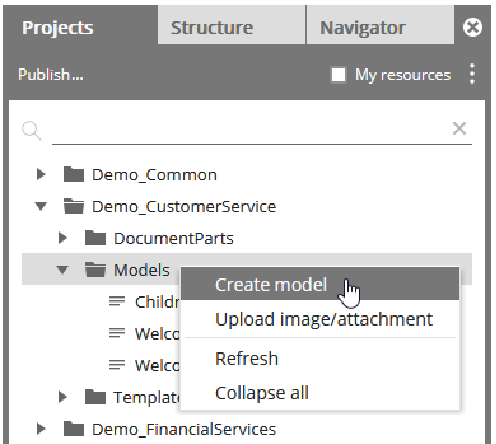

Enter the name and type (Can be inserted in) in the following dialogue. The model can now be inserted into a template and modified. If a corresponding editing template has been configured, the model can also be opened directly by double-clicking on it. Please note that a model created via the structure tree does not define any parameters. Only the metadata is available as usable data.

###### 3.3.4.4 Edit models

Models can be edited directly in M/TEXT TONIC Content Hub if a corresponding editing template has been prepared. To do this, open the desired model from the project explorer. The model is then opened in the editor area, where it is embedded in the context of a template. However, you can only edit the model, not the template. You can also only see the structure of the model in the Structure area. Once you have made the desired changes, you can save and close the model.

You can also modify models that are embedded in templates when you open the corresponding template (see also Section 3.1.3, “Editing existing resources ”).

Be careful when modifying models: The change also affects all templates in which the model is referenced. To find out which templates reference the model, use the reference search in the context menu of the model (see Section 3.4.3, “Reference search”).

##### 3.3.5 Selection

A selection comprises several parts/models in order to provide them to the user for selection. The content of the parts/models selected by the user is inserted into the document.

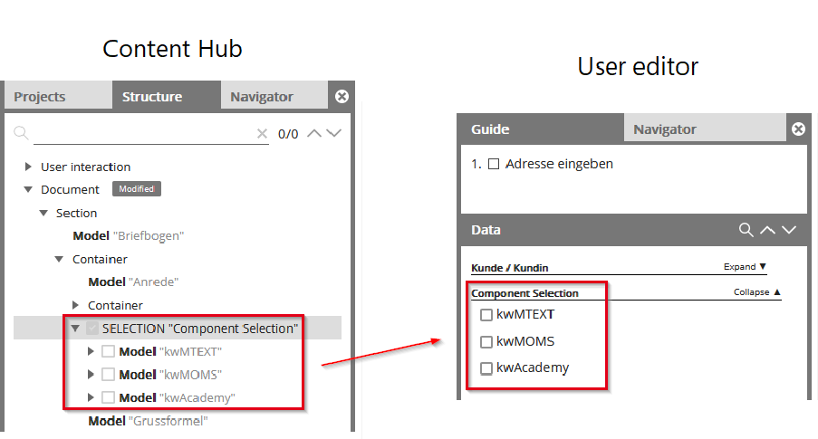

You can configure a selection so that several parts/models can be selected at the same time or so that only one of the parts/models provided can be selected. You can also use the selection preallocation to specify whether the corresponding element in the selection is preselected or mandatory. Mandatory parts are not offered to the user in the selection. Their integration into the part selector only serves to ensure that they are guaranteed to be inserted at a specific position - before or after selectable parts.

###### 3.3.5.1 Inserting and editing a selection

To insert a selection, open the Structure and select Insert - Selection on the object in which you want to insert the selection.

If you focus the selection, you can make the following settings in the Logic area under Selection:

- • Name: The selection is displayed under this name in the end user editor.
- • Condition: Here you specify whether all elements of the selection should be selectable in the editor ( checkbox) or only one element (radio button).
- • Optional selection: Defines whether the user must select at least one element.

###### 3.3.5.2 Inserting and editing elements in the selection

To insert elements into a selection, open the Structure, focus on the selection and select Insert Model or Insert - Part (You can also nest selection elements. To do this, select Insert - Selection).

If you have selected Insert - Model, the model selection is displayed. With Insert - Part, the part is inserted directly into the selection and you can fill it with any content that fits into the structure of the document template at this position.

If you focus the part/component, you can make the following settings in the Logic area under Selection membership:

• Preselected: Defines whether the part/model should be preselected for the end user. With the value Mandatory, the part/model is inserted into the document and cannot be deselected. This option is used to ensure that a part/model is inserted in the correct position before or after other parts/models.

###### 3.3.5.3 Alternative: Enclose parts/models with a selection

You can enclose existing parts/models in a template with a selection by selecting the parts/ models together and choosing Insert - Logic - Selection from the context menu.

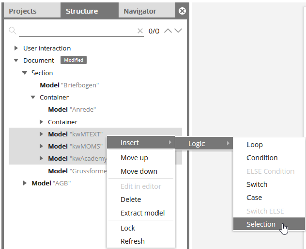

##### 3.3.6 Resource references

A user editing a complex template with multiple nested models has the option of determining the actual reference to a model (whether it is relative or absolute) and the specific resource triggered by the reference.

To do this, focus on a model or a graphic and open the Resource tab located on the right hand side of the screen. There are two fields under Information:

- • Reference displays the reference to the selected element just as it appears in the template’s code, e.g. Models/Header.model or mtx:Graphic/company/header.jpg.
- • Resource shows the resource triggered by the reference, e.g. bsp_Common\Models \Header.model or Invoice[GER]\Graphics\company\header.jpg.

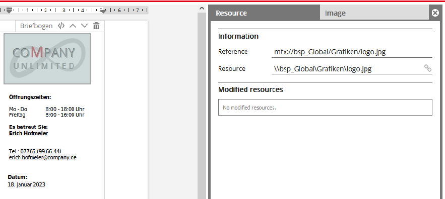

##### 3.3.7 Translations

The content of a document can be adapted to the language of the recipient. Thus, a template becomes an English or a German document, depending on whether the recipient is Englishor German-speaking. The necessary translations are inserted into the templates. The project languages that have been defined in advance in M/Workbench are available for the translations. Via the context menu Insert - Translations in Content Hub, a translation for each defined project language can be created for parts as well as for paragraphs.

The Translations selection below the structure tree can be used to change the language in which the template is edited. In this way, texts can be translated.

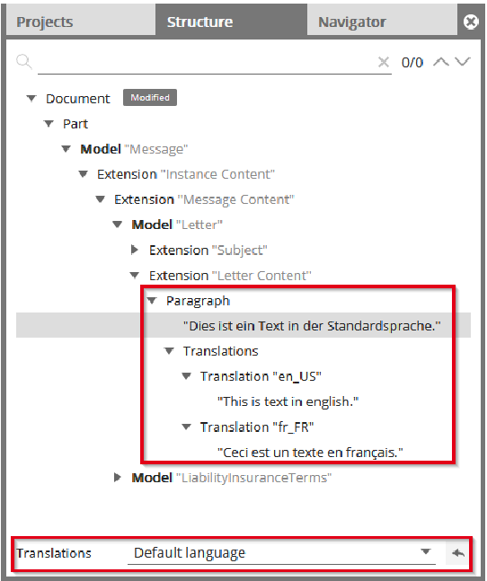

- • The translations are bound to the paragraph, i.e. each new paragraph needs its own translation.
- • When switching to the language to be translated, the text in the standard language initially no longer appears in the Structure tab.
- • The text that is displayed in the structure directly below the paragraph is the text of the actively selected language. In the following image, French is selected as the editing language. Therefore, the French text is displayed directly at the paragraph (above the translations).

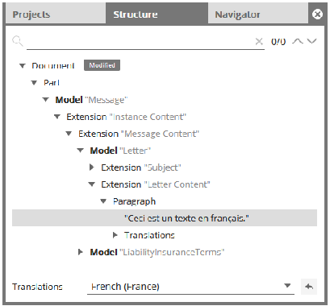

###### 3.3.7.1 Inserting translations

To translate a template into different languages, proceed as follows: The following elements must be prepared: Project languages must have been added in M/Workbench and synchronized with the server.

- 1. Open a template.

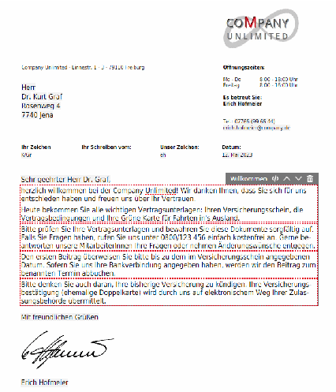

- 2. In the Structure tab, position the cursor on the Part element that contains the paragraphs to be translated and choose Insert - Translations via the context menu:

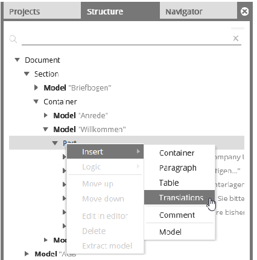

- 3. The following dialog will appear:

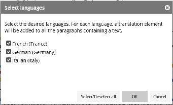

- After confirming the dialog, translations are added to the five paragraphs present in this case.
- 4. Now select the desired language under Translations below the structure tree and insert your translation in the paragraphs marked with TRANSLATE:.

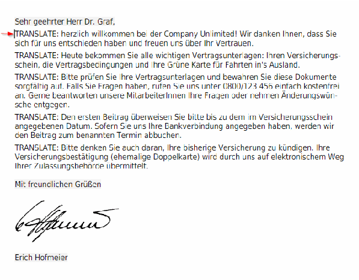

When adding translations, make sure that you do not add paragraphs using the ENTER key, otherwise these newly created paragraphs will have no translations.

##### 3.3.8 Barcodes

Barcodes are versatile machine-readable graphics in which data can be encoded. They can be created and edited in M/TEXT TONIC Content Hub.

To create a barcode, select Insert - Barcode from the context menu or the toolbar. By default, this will create a barcode of type Code 128. When you focus on the barcode, you will see the Barcode view on the interface. In this view you can change the content and the appearance of the barcode. The following setting options are given:

|Properties|Description|
|---|---|
|Code type|Specifies the type of encoding. Possible values are Code 128, Code 39, EAN-13, EAN-128, Data Matrix, Interleaved 2 of 5, PDF417 and QR Code|

|Properties|Description|
|---|---|
|Encoding|Specifies the type of encoding for the barcode. Valid for the code type QR.|
|Input data|Here you can enter the data to be encoded in the barcode.|
|Orientation|Specifies the orientation of the barcode. Possible values are rotation by 0°, 90°, 180° and 270°.|
|Orientation inverted|Specifies whether the barcode should be mirrored.|
|Resolution|Specifies the resolution in PPI.|
|Tile size X|Specifies the tile size in X direction in pixels.|
|Tile size Y|Specifies the tile size in Y-direction in pixels.|
|Error level|Numeric value indicating the level of error correction.  For the code type CODE39 possible values are 0 (the generated code gets no additional control character) and 1 (the generated code gets an additional control character).  For code type PDF417 possible values are 0 (no error correction) and 1 to 8 (PDF417 error correction level).  For the code type QR possible values are 0 (Level L: 7% of code words/data can be recovered), 1 (Level M), 2 (Level Q) and 3 (Level H).  For the code type Interleaved 2 of 5, the specification of the error level has no effect.  For the other code types, no error level can be specified.|
|Code size|Specifies the size of the barcode. Valid for code type ECC200.|
|Data columns|Specifies the number of columns of barcode. If the value is not set, it will be calculated automatically based on the input string. This way the completeness of the data is preserved. Valid for code type PDF417.|
|Inline parameters|Here data model nodes are defined as parameters. These are selectable in the properties drop-down menus at the top under $Name.|

##### 3.3.9 Guide elements and data input elements

You can create and edit elements for the guide and the data input area in the TONIC user editor in Content Hub. The following graphic illustrates which types of interactive elements are possible and how they are displayed in the user editor:

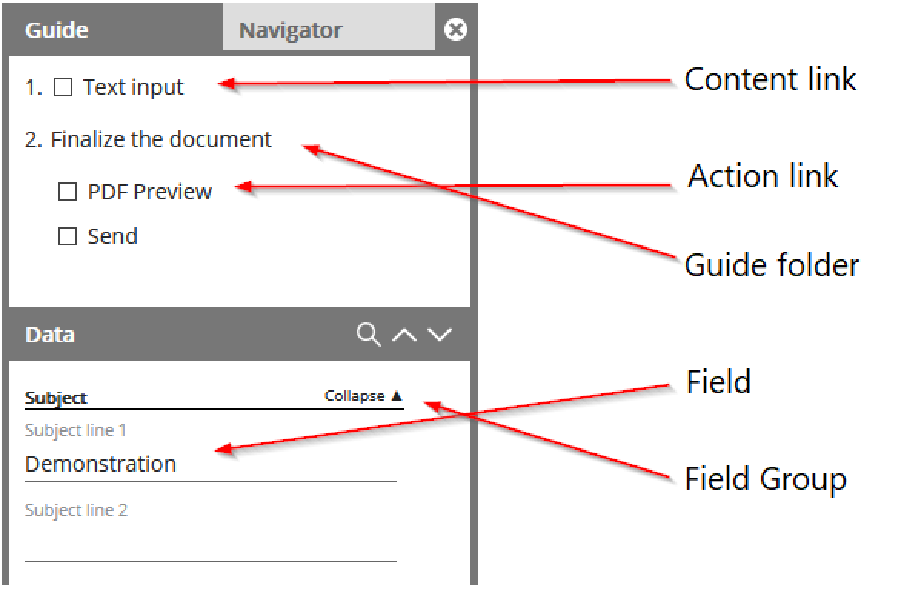

Guide folders can be used to group related guide entries (action link, content link). Action links execute a specific action stored as a JavaScript expression. Content links prompt users to enter content - either in the data area, in a modal dialogue or directly in the document.

Data fields that belong together can be grouped into field groups. Each field is linked to a data model node for whose value is to be entered or checked.

In the Data area, the so-called selections are also displayed in the user editor, which can be used to easily select and deselect models and parts. The configuration of these selections is described in Section 3.3.5, “Selection”.

###### 3.3.9.1 Insert user interaction elements

IInteractive guide elements and data entry elements are placed in a document template within a ser interaction. There can also be several user interactions within a template. These are displayed in the editor combined in just one guide and one data area. User interactions can be defined either on the document element or on a part. This is relevant if the parts are located within models. The user interaction is then saved in the model and therefore belongs to every document that calls up the model. A user interaction that is inserted on the document element only belongs to documents that are created from this template.

To create a user interaction, open a document template or a model in Content Hub. In the Structure area, focus on the document or a part. Select Insert - User interaction in the context menu. You can add the individual interactive elements to a user interaction via the context menu Insert. The setting options are explained in the following sections.

###### 3.3.9.2 The Field element

The Field element is displayed in the Data area of the user editor. It is used to enter or check the values of data model nodes. You have the following setting options for this in the User interaction area in Content Hub:

|Property|Description|
|---|---|
|Parent field group ID|Here you can specify a field group into which the field is to be inserted in the user editor. The specification is used to insert fields in field groups that are not defined in the same user interaction but occur in the document. If the specified field group does not occur in the document, the specification is ignored and the field is displayed alone. The specification is not necessary if the field is already inserted into a field group in the user interaction or if the field is not to be inserted into a field group at all.  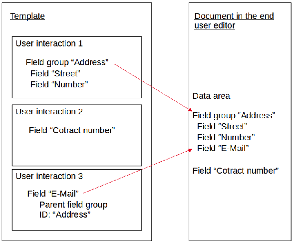|
|Title|The title entered here is displayed in the user editor for the field.|
|Spell checking|Should the entered value be spell-checked?|
|Data model node|Enter the data model node whose value is to be entered or checked here.|
|Visible if|Specify a condition under which the field should be visible in the user editor. The configuration of conditions is described in Section 3.3.3, “Document logic”.  |

###### 3.3.9.3 The Field group element

The Field group element is displayed in the Data area of the user editor. It is used to group fields that fit together thematically. You have the following setting options for this in the User interaction area in Content Hub:

|Property|Description|
|---|---|
|ID|Enter a unique identification here. This can be referenced by fields and field groups in the Parent field group ID property.|
|Parent field group ID|Here you can specify the ID of a field group in order to insert "Field group A" into "Field group B". The specification allows you to insert field groups into other field groups that are not defined in the same user interaction but are present in the document. If the specified "Field group B" does not appear in the document, the specification is ignored and "Field group A" is displayed on its own. The specification is not necessary if "Field group A" is already inserted in "Field group B" in the user interaction.|
|Title|The title entered here is displayed in the user editor for the field group.|
|Visible if|Specify a condition under which the field group should be visible in the user editor. The configuration of conditions is described in Section 3.3.3, “Document logic”.  |

###### 3.3.9.4 The Content link element

The Content link element is displayed in the Guide area of the user editor. It is used to direct the user to data entries or parts of the document that still need to be edited.

EElements to be referenced by the content link (e.g. a paragraph that is to be filled) must have an ID (see Linked content element ID). To assign this ID, focus on the corresponding element in the structure tree and enter a unique value under ID in the Common - Structure tree element area.

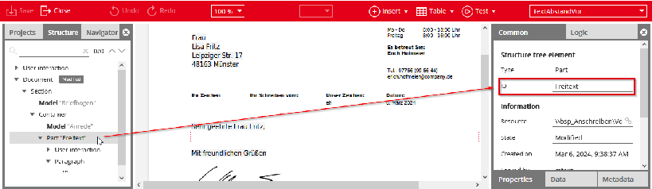

You have the following setting options for the content link in the User interaction area in Content Hub:

|Property|Description|
|---|---|
|ID|Here you can specify a unique ID to reference the content link from other elements.|
|Parent field group ID|If this option is set and a guide folder with the specified ID exists in the document (provided by the template or another model used in the document), the element is inserted into this folder in the user editor at runtime.|

|Property|Description|
|---|---|
| |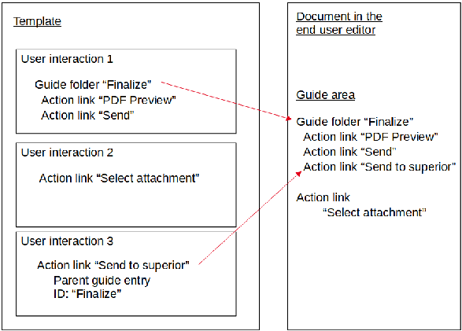|
|Linked content element ID|Enter the ID of the element to which the content link should point here. The element is then brought into focus in the user editor, animated and activated when the content link is clicked.|
|Title|The title entered here is displayed in the user editor for the content link.|
|Hint|The hint text entered here is displayed in the user editor under the content link.|
|Execution mandatory|Specifies whether the execution of the content link is mandatory for the end user. Prescribed content links are highlighted in the guide and listed as errors if they have not been edited. The ValidationState metadatum has the value ERROR if the content link has not yet been edited.|
|Run on open|Specifies whether the content link is automatically executed when the document is opened. This allows you to specify which element should be focussed when the editor is opened. Possible values: Never, Always, Once|
|Data model node|The data model node to which the content link should refer can be specified here. This is then brought into focus, animated and activated in the user editor.|
|Visible if|Specify a condition under which the content link should be visible in the user editor. The configuration of conditions is described in Section 3.3.3, “Document logic”.  |
|Show this field group (ID) only|Here you can restrict the content in the Data area of the user editor.  Specifying an ID means that only the field group with this ID is displayed in the Data area after clicking the content link. This restriction of the data area is implemented in the user editor via the filter in the area Data. Users can remove the restriction by removing the filter.|
|Show referenced fields only|Here you can restrict the content in the Data area of the user editor.  The Yes option means that after clicking the content link, only the fields linked to this content link are displayed in the data|

|Property|Description|
|---|---|
| |area. This restriction of the data area is implemented in the user editor via the filter in the area Data. Users can remove the restriction by removing the filter.  If you select No, the Data area will not be restricted.|

###### 3.3.9.5 The action link element

The Action link element is displayed in the Guide area of the user editor. It is used to fulfil specific tasks when it is clicked. These are stored as JavaScript instructions on the action link. You have the following setting options for this in the User interaction area in Content Hub:

|Property|Description|
|---|---|
|ID|Here you can specify a unique ID to reference the action link from other elements.|
|Parent guide entry ID|If this option is set and a guide folder with the specified ID exists in the document (provided by the template or another model used in the document), the element is inserted into this folder in the user editor at runtime.  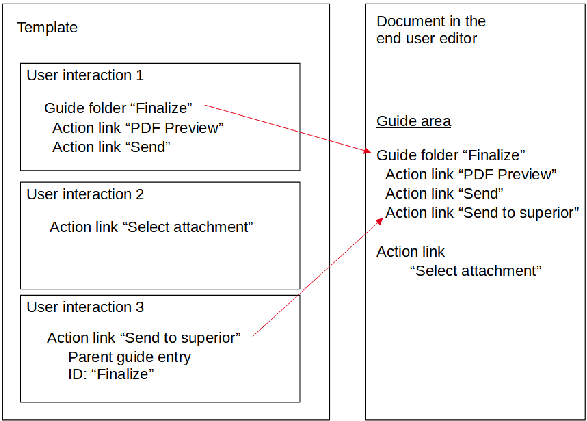|
|Field group ID for modal dialog|Here you can specify the ID of a field group in the data input area. This field group is opened for editing in a modal dialogue when the action link is clicked before the action script is executed. The field group then does not appear in the data input area.|
|Title|The title entered here is displayed in the user editor for the action link.|
|Hint|The hint text entered here is displayed in the user editor under the action link.|
|Execution mandatory|Specifies whether the execution of the action link is mandatory for the end user. Required action links are highlighted in the guide and listed as errors if they have not been edited. The ValidationState metadatum has the value ERROR if the action link has not yet been processed.|

|Property|Description|
|---|---|
|Run on open|Specifies whether the action link is executed automatically when the document is opened. Possible values: Never, Always, Once|
|Run on close|Specifies whether the action link is automatically executed when the document is closed.  Please note that the action link must contain the call $context.close() so that the document is closed, as the actual call to close is cancelled by the property. Exception: If the action link calls a modal dialogue and not a script.  The Save document dialogue is not executed automatically, but can be integrated into the script.  Possible values: Never, Always, Once (Once: The action link is executed on closing if it has not yet been run manually or automatically).|
|Button for toolbar presentation|Specifies whether the action link is displayed in the Guide area or in the toolbar of the TONIC user editor.  The name of a button in the toolbar is specified here. If the specified element is available in the toolbar at runtime, the action link is displayed there instead of in the Guide.  A corresponding button ( element Action) in the toolbar must be defined in M/Workbench in the file \\Configuration\ui \default.editor.layout.xml.|
|Visible if|Specify a condition under which the action link should be visible in the user editor. The configuration of conditions is described in Section 3.3.3, “Document logic”.  |
|Action script|A script to be executed is stored here as a JavaScript expression. Access to the $context object is possible in the script.|

###### 3.3.9.6 The Guide folder element

The Guide folder element is displayed in the Guide section of the user editor. It is used to group action and content links that fit together thematically. You have the following setting options for this in the User interaction area in Content Hub:

|Property|Description|
|---|---|
|ID|Enter a unique identification here. This can be referenced by action and content links as well as by other guide folders in the Parent guide entry ID property.|
|Parent field group ID|Here you can specify the ID of a guide folder in order to insert "Guide folder A" into "Guide folder B". The specification enables the insertion of guide folders into other guide folders that are not defined in the same user interaction but are present in the document. If the specified "Guide folder B" is not present in the document, the specification is ignored and "Guide folder A" is displayed on its own. The specification is|

|Property|Description|
|---|---|
| |not necessary if "Guide folder A" is already inserted in "Guide folder B" in the user interaction.|
|Title|The title entered here is displayed in the user editor for the guide folder.|
|Hint|The hint text entered here is displayed in the user editor under the guide folder.|
|Visible if|Specify a condition under which the guide folder should be visible in the user editor. The configuration of conditions is described in Section 3.3.3, “Document logic”.  |

###### 3.3.9.7 Testing the guide and data input area

To test the display and function of the user interaction elements of a document template, the TONIC user editor can be opened directly from Content Hub. The current test data scenario is used for this. The button for testing in the user editor is located in the toolbar under Test Interactive processing (editor).

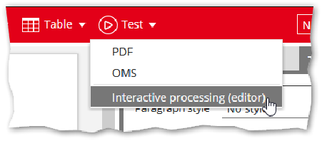

###### 3.3.9.8 Assign dynamic values to interactive fields

Some of the properties in the user interaction area can be assigned dynamic values from data model nodes. The following applies: The entered value is interpreted as a string. You can also dynamise the value by accessing data model nodes or metadata nodes using the $ syntax. A space or two dots mark the end of the data model node.

Example of the dynamic title of an action link:

|Send document to $Customer.Name..|
|---|

This syntax can be used for dynamisation:

- • in the Linked content element ID property of content links
- • in the property Parent field group ID of fields in the data input area
- • in the IDs of all elements
- • in the Title of elements in the guide area and the data input area

##### 3.3.10 Modification rights

In M/TEXT TONIC Content Hub, you can create permissions for users of the M/TEXT TONIC user editor.

An permission entry defines for a user role which editing operations are permitted or prohibited for the elements contained in a part. The following operations are available:

- • INPUT: Editing of data fields that have been added to the data input area by the part or are contained in the part as inplace-editable data fields.
- • EDIT: Editing ( modification, deletion, addition) of content.

Permission entries can be defined as permitting (Allowed) or prohibiting (Denied) entries. The setting is inherited by all child elements of the part. If there are several definitions for modification rights at one point in the document because several parts are nested within each other, the "closest" definition applies. Modification rights can also be configured on the document element.

If a user has both permissive and prohibitive permissions for a part due to several roles assigned to them, the prohibition has priority.

###### 3.3.10.1 Creating modification rights

To create modification rights for an element of the document, focus on the element in the structure tree and select Insert - Logic - Modification rights in the context menu.

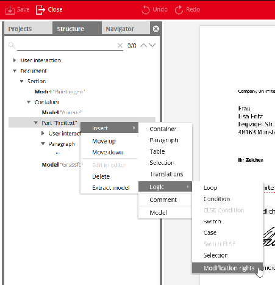

As a result, the system creates a Part around the focussed element and sets the focus in the Modification rights area. Proceed with the adjustment of the Allow and Deny modification rights as described in Section 3.3.10.2, “Configuring modification rights”.

###### 3.3.10.2 Configuring modification rights

To adjust the modification rights for a part, focus on the part in the structure tree and open the Logic area. There you will find a list for Allowed and Denied under Modification rights. You can add user roles that are defined in M/USER to these lists. Then specify whether the members of this role should have INPUT or EDIT rights for the part.

To assign or deny a role modification rights to the part, click on the field under Role in the corresponding list. You can then select a user role from the list.

The EDIT and INPUT rights are initially set to Not set. To change this, click in the field and tick the box.

To add or deny modification rights for another role, click on the Add button in the corresponding line. This adds another line to the list.

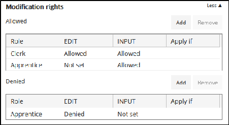

In the Apply if column, you can define conditions under which the created change authorisation applies (e.g. a text may only be changed if the document has a certain status).

##### 3.3.11 Editing Metadata

In the Metadata view, the user has the option of editing the values of existing metadata. The metadata view is opened by clicking on the Metadata tab located at the bottom right of the screen.

Standard metadata and user defined metadata are visible here. Metadata that cannot be edited are grayed out. If a metadatum is edited, the associated template or model is locked to avoid conflicts.

The Metadata view is divided into several sections: The upper section of the view shows document template metadata, the lower section shows the metadata connected to the model that is focused in the Editor. Labels and descriptions can be edited by clicking [...]. Descriptions can be edited for all document template or model languages. The standard metadata TemplateRoles and ModelRoles can be assigned to user groups via the context menu.

See also the sections "TemplateRoles" and "ModelRoles" in the manual M/TEXT TONIC Text administration.

In the case of document template metadata, there is also the option of generating a preview of the template to be displayed in the User Editor. The graphic must be published using the project explorer (see also Section 3.1.4, “Publish resources ”).

Multi-metadata node instances can be added via the context menu. Multi-nodes are marked with a *.

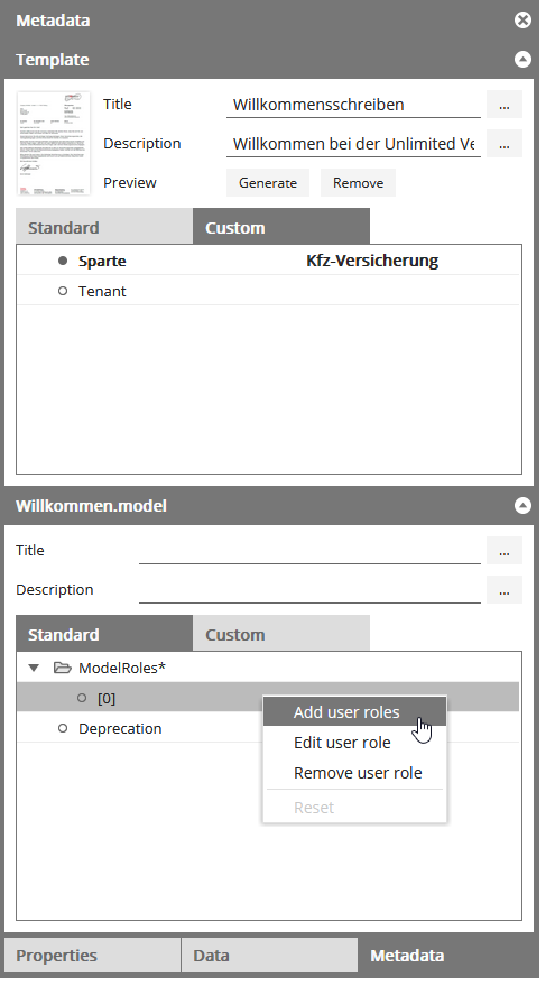

#### 3.4 Functions on the Content Hub interface

##### 3.4.1 Data view

In the Data view, you have the option of viewing the values of the existing data and changing them for test purposes. The view can be opened in the right-hand screen area via the Data tab at the bottom.

In the table in this view, you can see the current data situation at the focussed point in the document template. The data nodes have a name and can have a value. Data nodes for which several values exist (so-called multiple data nodes) are marked with an *. The data situation differs at different points in the document template.

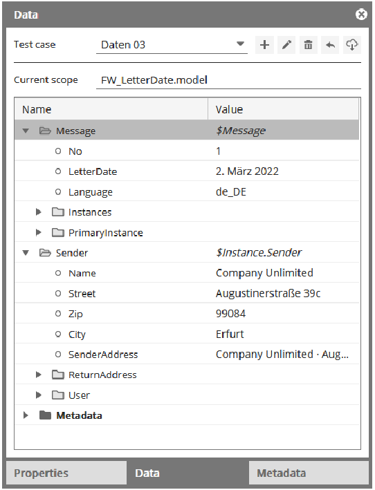

###### 3.4.1.1 Changing test data

Dynamic document templates should apply to different data situations. It is therefore recommended to test the template with different data assignments.

To change individual values, you can simply overwrite the values of the data nodes in the Value column. You can see the effects directly in the centre editor area. Changed values are displayed in bold in the data view. To cancel all changes made to the values, press the Reset test case button in the test case bar of the data view. If you do not reset changed values and save and publish the template, the changes to the test case will also be published.

In the editor area, you cannot change the values of data nodes.

To access prepared test cases with a complete set of data, you can select another test case in the test case bar. Other functions are also available, such as adding, changing and deleting a test case (changes apply to all users after publication).

Use the Data retrieval button to simulate a data retrieval. This is possible if you have changed the value of a data node that is used to reload data (e.g. the customer number).

##### 3.4.2 Grammar check

The Language tab allows you to perform a semantic text analysis and grammar check in german texts. To do this, click on the Check button. The results of a semantic text analysis based on various criteria will then be made available to you in the upper area. Below this, entries for grammatical errors (blue), text comprehensibility (orange) or violations of corporate language (red) are displayed. The entries each have a corresponding location in the editor area where the text is underlined in the same color. If you move the mouse over an entry, the position in the text is highlighted.

The entries can be expanded to obtain a detailed description of the situation. In some cases, correction suggestions are displayed directly. These can be transferred to the document with a simple click.

The Ignore button means that the entry is no longer displayed for you and all users of the TONIC user editor. To display ignored entries again, use the Ignored entries button.

To check newly added or adjusted text, click on Refresh. Entries are only created for the texts for which you have authorization to change.

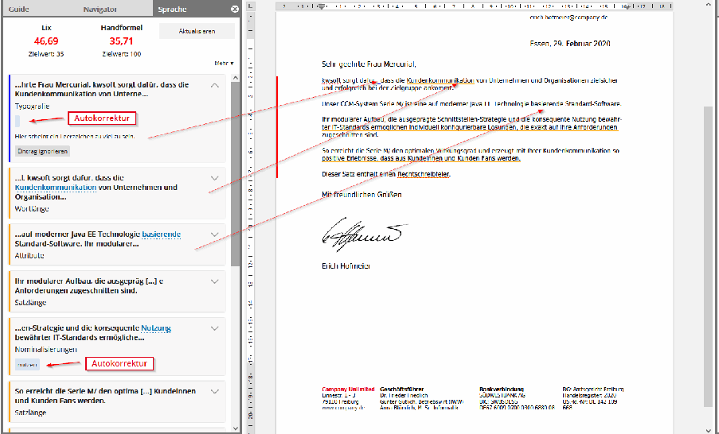

##### 3.4.3 Reference search

If you change a model, this will have an effect on all templates that reference (access) this model. It is therefore important to know whether a model that you want to change is accessed in other contexts.

Use the reference search to find all models and templates that call a specific model. You will find the option to search for references in the Projects section. If you open the context menu on a model, you will have the option to find calling templates/models.

For templates and models, there is an option to find the models that are called up in the template/model.

The result is displayed in the References section below. Here you can choose between viewing the calling and called models.

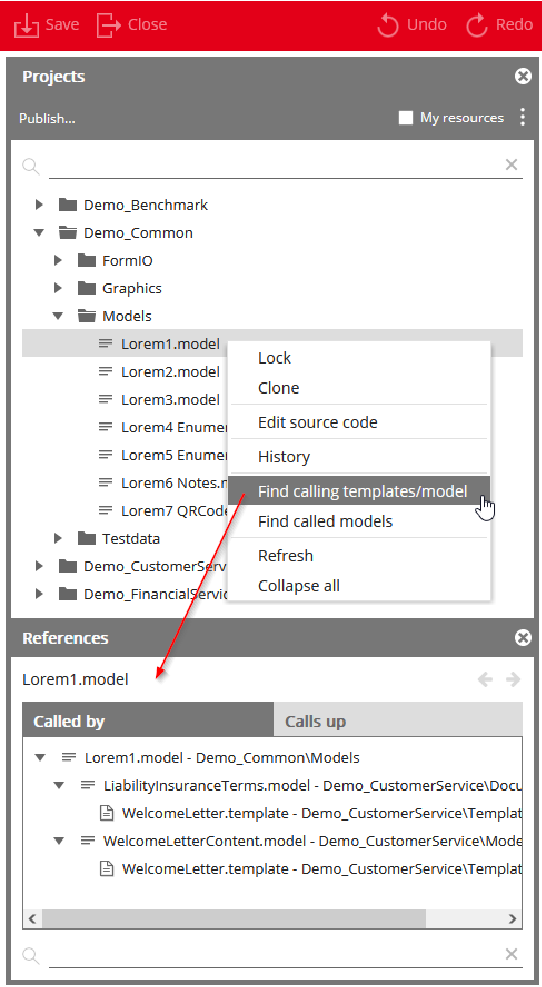

This function must be configured by your administrator. If it is not configured, the reference search will not work.

##### 3.4.4 Rulers

To display a horizontal and a vertical ruler in the editor area an entry in the configuration file \\Configuration\ui\default.contenthub.layout.xml must be set. The vertical ruler is purely informative, the horizontal ruler can be used to control the following:

- • Tabs: In the upper left corner of the editor area, the tab stop to be placed can be defined by mouse click. Available are tab stop left ( ), tab stop right ( ), tab stop decimal ( ) und tab stop centred ( ).

A tab stop is inserted by clicking on the horizontal ruler and can be moved to the desired position using Drag&Drop. To remove a tab stop, it must be dragged outside the ruler.

- • Indents: Via the markings on the horizontal ruler, the entire indent left/right ( ) and the indent of the first line ( ) of a paragraph or a table cell can be set.

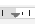

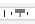

- • Table columns: The width of table columns can be changed via the markers ( ) on the horizontal ruler.

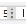

##### 3.4.5 Source code editor

M/TEXT TONIC Content Hub offers advanced users the possibility to edit the source code of models and templates. To do this, the user must be assigned appropriate rights. Then a model or template can be opened and edited in the source code editor via the context menu. If the source code editor is then closed via the close button, the underlying template is reloaded in the editor.

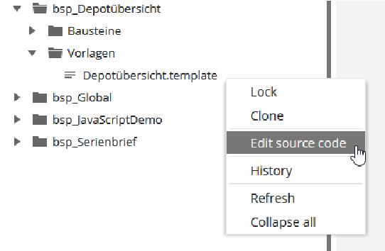

Models can also be opened from inside templates:

- • If the cursor is placed in the path specification of a model in the source code, this model can be opened in the source code editor via F3.
- • If a template is open in the editor area, a model can be opened in the source code editor via the </> icon.

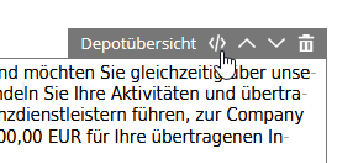

Navigation with the forward and back buttons of the browser is possible. If the source code editor is closed via the close button while editing a template, the template is reloaded.

##### 3.4.6 The output options

To test various functionalities, it can be useful to output a document via different channels. You can therefore display a document as a test PDF, send it to the connected OMS or test interactive elements of the document in the user editor.

All these scenarios are based on the data of the currently displayed test case and user.

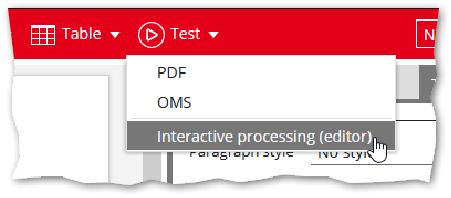

##### 3.4.7 Keyboard control

Like the M/TEXT TONIC user editor, M/TEXT TONIC Content Hub can be operated using the keyboard. Use the key combination Ctrl + Alt + H to open a help dialogue that displays all keyboard shortcuts, divided into individual sections. You can find more detailed information on how keyboard controls work in the manual M/TEXT TONIC User Editor.

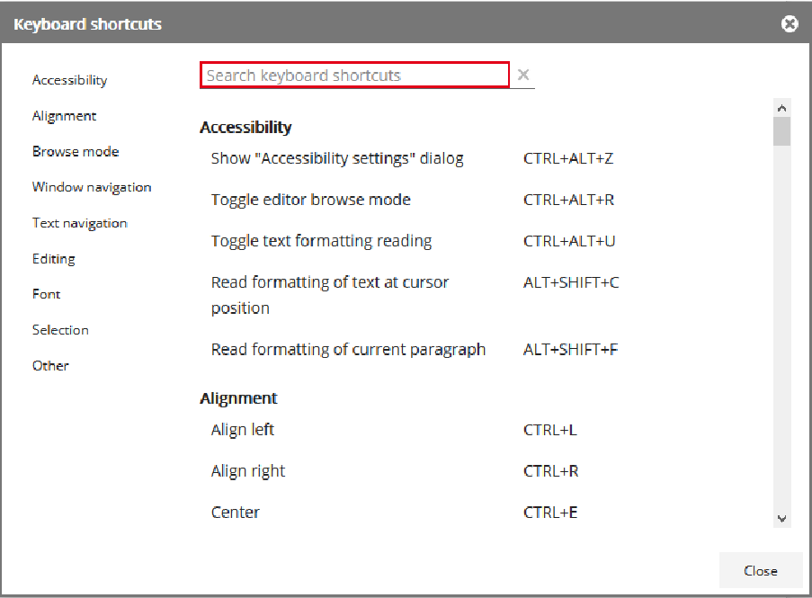

##### 3.4.8 Navigator

In the Navigator area, you can see an overview of the pages and sections in the document template. Here, you can remove individual sections from the template and change the order of the sections.

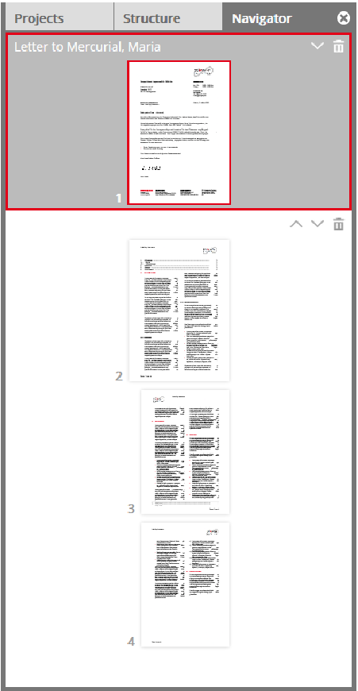

#### 3.5 Inserting comments

Via the context menu Comments can be inserted in the structure tree. Comment type and priority can be set in the right hand side of the screen under Properties - Comment.

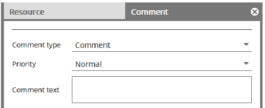

Comment types are Comment, Todo and Fixme. The Priority can be Low, Normal or High. The Comment text is displayed in the structure tree together with the comment type.

#### 3.6 Working with tenants

The Content Hub user can work for different tenants. When working this way, multiple tenants share the same resources (such as templates). However, individual elements can be kept tenantspecific. For example, for a tenant North, the sender bar can be customized.

Technically, the tenant-specific resource is stored in a fragment project so that the resource in the root directory remains unchanged. The Content Hub user must select which tenant they are working for before making a tenant-specific change.

The projects, templates and user permissions must be adapted accordingly to enable a multi-tenant scenario.

In the Content Hub Editor toolbar, select the tenant for which you want to customize the template.

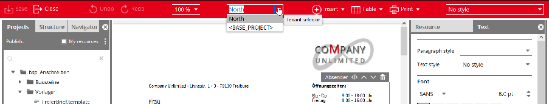

When you make changes, they are automatically saved in the appropriate fragment project. If the fragment project does not yet exist in the Project Explorer, the system creates it automatically.If the fragment project exists, but not the changed resource (e.g. a module), it is created in the fragment project or saved there. Fragment projects have the same name as the base project and also have the name of the tenant in square brackets. The adjusted resource is automatically stored in the (newly created) fragment project.

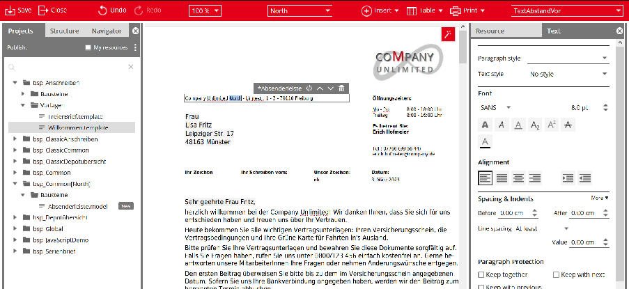

##### 3.6.1 Tenant specific images

Graphics can also be created tenant-specific, e.g. for tenant-specific logos. Right-click on the graphic that is to be tenant-specific and chose Select Image to open a dialog.

Under Browse, select the tenant-specific graphic from the file system. The Resource name specifies under which name the graphic is saved in the workspace.1 In the directory tree, select the graphic in the tenant-specific fragment project where you want to insert it. Then click Upload to save the graphic for the selected tenant in the workspace.

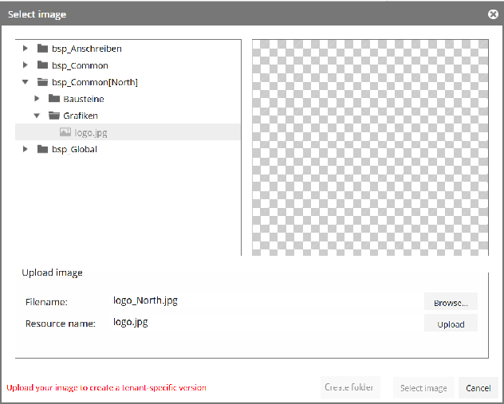

Due to the relative URL to the graphic and the identical name, the template or the module now automatically references the correct file in the fragment project. You can close the dialog.

Projects, folders and resources that are grayed out in the Select Graphic dialog do not yet exist in the workspace. However, when you upload/save a graphic there, the folder structure is created automatically.

#### 3.7 Working with (feature) branches

The changes you make in Content Hub are stored in a version management system after publication. A popular way of working in version management systems is to work with feature branches, where a separate "branch" is created for each new function or change to the resources so that only the new functions can be worked on in isolation.

This working method is supported by Content Hub. When working in this way, select the branch you want to make changes to under Branches before you start working in Content Hub. Depending on the configuration, first select the corresponding repository.

- 1. Click on Branches in the Projects area to select a branch.

1In the case of tenant-specific graphics, the resource name should match the name of the graphic in the base project. This way, the model located in the base project accesses the tenant-specific graphic when a document is created for the tenant.

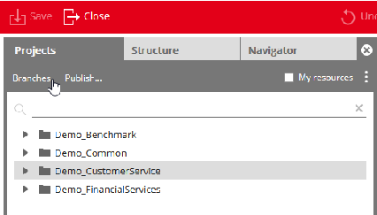

- 2. Select the repository for which you want to change the branch. You can view the projects in the repository by clicking on the arrow in the dialog in front of the repository.

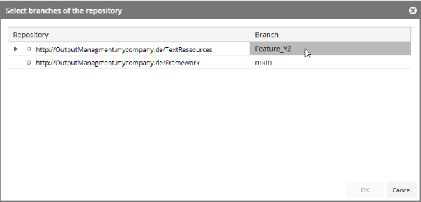

- 3. Now select the (feature) branch you want to work on. You will see the information on the last commit to the branch.

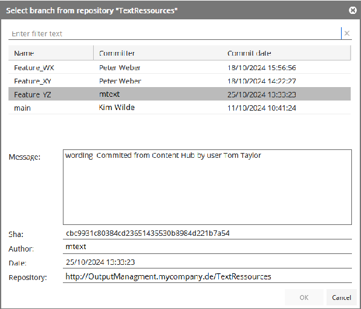

- 4. The resources from the selected branch are now loaded into the Structure area of the Content Hub user interface.

To permanently display the branch you are currently working on, select Show project repository/branch in the menu.

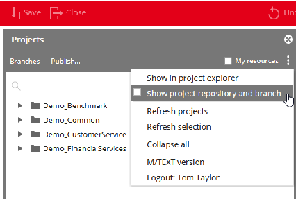

If you are working with branches, the blocking of resources that have been edited in the Content Hub only applies within a branch. This means that two different users can work on the same resource as long as they have selected different branches.

#### 3.8 Handling errors

This chapter describes potential causes of and solutions to problems that may occur while the Content Hub editing system is in operation.

##### 3.8.1 Delete empty folder

It may happen that apparently empty folders in Content Hub cannot be deleted by the user. This is due to so-called overlay files that are stored in them. The behavior can be adjusted as described in the manual 'M/TEXT TONIC Content Hub - Installation and Configuration'.

##### 3.8.2 Updating the in-memory workspace

In cases where the workspace/workspace visible in Content Hub does not meet expectations, a function for reloading the workspace is available for debugging purposes. It is possible to refresh the in-memory workspace via the Content Hub user interface. To do this, hold down the Shift key and click on the three vertically arranged dots and Refresh server workspace in the Project Explorer menu. This will update the workspace on the connected server.

In a cluster environment, this function currently only updates the workspace on the server node that is processing the request.

### 4. Resource status

As soon as a user begins editing a resource in M/TEXT TONIC Content Hub, the resource will be locked and inaccessible to other users, and a copy of the resource specific to the user will be saved in the database. Resources are locked automatically as soon as the user begins editing the resource. The template is then automatically marked as Locked in the user’s project explorer and structure tree.

If the user wishes to save or close the template, they must use a dialog to either save or discard their edits. If multiple resources have been edited, the user can select which edits are to be saved and which undone. If the edits are saved, the resources are marked in the project explorer and the structure tree as being Edited.

From the point of view of other users, there is no difference between resources that are currently being edited (Locked) and those that have already been saved (Edited) or published (Activation Pending). These resources all display a marking containing the name of the user that has locked the resource, as shown in the graphic below.

|What user Linus sees|What other users see|
|---|---|
|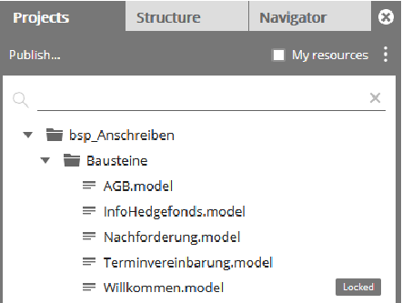|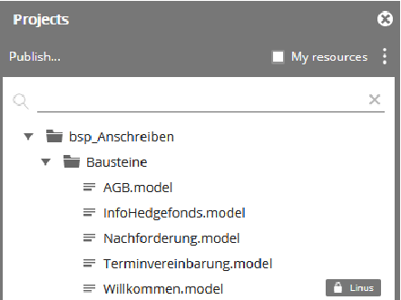|

If you are working with (feature) branches, the locking of resources only applies within a branch. This means that two different users can work on the same resource as long as they have selected different branches.

Locked resources cannot be edited by other users, unless a user has the "Assign to me" permission. Then the locking can be removed by this user.

Resources will be unlocked once they have been transferred to the Serie M/ Server by an administrator (in database mode) or if they have been published in the version management system (in Git mode).

#### 4.1 Manually locking and unlockingresources

In addition to resources being locked and unlocked automatically, there is the option of doing so manually. To do this, find the relevant resource in either the structure tree or the project explorer and open the context menu. Use Lock to lock a resource that is accessible. It is also possible to unlock a locked resource. Doing so will undo all changes.

#### 4.2 Version conflicts

##### 4.2.1 Causes of conflicts

Version conflicts occur when a Content Hub user has edited a resource, but it is in a different state in the version control system after editing. This can be due to the following reasons:

- • Either someone else has edited the same resource in M/Workbench while the user was working on it in Content Hub, or
- • the resource had already been edited in the VCS when the Content Hub user began working on it, but the VCS edits were not synchronized with the database, that is the Content Hub user was editing an older version of the resource (database mode).

If a version conflict occurs in a modified file during the publishing process, Content Hub cancels the publishing process. A marker is displayed on the user interface:

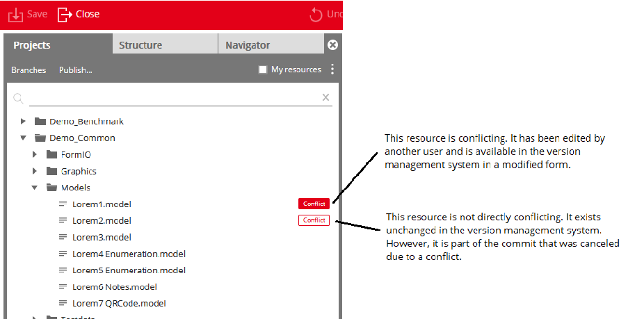

The resource causing the conflict is marked with a red tile. This resource has been edited by another user and is no longer available in the version management system in the form in which you originally started editing it.

Other resources that should be published in the same process are marked with a white conflict marker. Such resources are not directly conflicting.

##### 4.2.2 Dealing with version conflicts

There are several ways to deal with such version conflicts:

- • You resolve the conflict

Resolving the conflict here means resetting the resource to its original state. In this case, your changes to the Content Hub resource will be lost for you. Once the resource has been reset,

you can reload the workspace and work on the current version of the resource, e.g. make the same changes again.

Resolving a conflict in this way only works if you have the appropriate user rights.

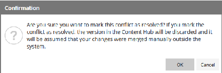

- • You ask an administrator to resolve the conflict

Administrators with access to M/Workbench have the option of comparing the competing resource statuses and specifying which version should continue to be used for each difference in a resource.

Resources that were only part of a failed publishing process, but are not in conflict with the current version of the resource, can be set by the administrator to the status you edited before the unsuccessful publishing.

- • For Content Hub users who are familiar with the source code of templates and models and have experience in version management of files, there is another alternative. The Edit source code function can be used to resolve conflicts. You can use the source code editor to export and save your conflicting file. You then resolve the conflict (i.e. reset your changes in Content Hub). As a result, you receive the file that is available in the version management system or in the database. You can export the source code of this file again, compare the two files on your computer and create a "combined" file for further use. You can re-import your changes using the source code editor.

This procedure does not work for conflicts with files that you cannot "see" in the Content Hub Editor (such as metadata) and is only intended for users who have experience in version management of files and can interpret the source code of the templates and models.

