## Serie M/ 6.16

Anwenderhandbuch

# M/TEXT TONIC Anwenderoberfläche

Handbuch herausgegeben am 19.05.2025

Tipp: Für die zentralen Begriffe im Rahmen der Serie M/ steht das "Glossar zur Serie M/" als gesonderte PDF-Datei zur Verfügung.

Feedback: Das vorliegende Handbuch wurde mit großer Sorgfalt recherchiert und zusammengestellt. Sollten Sie dennoch auf einen Fehler, eine Ungenauigkeit oder eine Unvollständigkeit stoßen, bitte informieren Sie uns (<documentation@kwsoft.de>).

Hinweis: Die Datenbanken unserer Produkte dürfen nur über das Produkt selbst geändert

werden. Andernfalls können wir keine Gewähr dafür übernehmen, dass das Produkt weiterhin problemlos läuft. Zudem behalten wir uns vor, die Struktur der Datenbank jederzeit und ohne vorherige Ankündigung zu ändern.

|Bedeutung der im Handbuch verwendeten Symbole|Bedeutung der im Handbuch verwendeten Symbole|Bedeutung der im Handbuch verwendeten Symbole|Bedeutung der im Handbuch verwendeten Symbole|
|---|---|---|---|
||Beispiel||Systemabhängig|
||Bitte beachten||Voraussetzung (Ausnahme, Einschränkung)|
||Hintergrund||Warnung|
||Hinweis||Querverweis|
||Datenschutz||Beispielvideo|

Copyright © 2025 kühn & weyh Software GmbH

Linnéstr. 1-3, D-79110 Freiburg Telefon 0761/8852-0 Telefax 0761/8852-666 E-Mail documentation@kwsoft.de Homepage www.kwsoft.de

##### Inhalt

- 1. Was ist neu? .......................................................................................................................... 1

- 1.1. Neue Features in Release 6.16 .................................................................................... 1

2. Der M/TEXT TONIC Anwendereditor ...................................................................................... 2

- 2.1. Die Symbolleiste ......................................................................................................... 2

- 2.2. Guide, Dateneingabebereich, Navigator und Sprache ................................................. 3
- 2.3. Der Editor ................................................................................................................... 6 2.3.1. Lineale ............................................................................................................. 7
- 2.4. Der Bereich Eigenschaften .......................................................................................... 8
- 2.5. Die Standardoberfläche .............................................................................................. 9
- 2.6. Barrierefreie Bedienung .............................................................................................. 9

- 2.6.1. Allgemeine Umsetzung der Barrierefreiheit ...................................................... 9
- 2.6.2. Screenreader Unterstützung .......................................................................... 10

- 2.7. Tastaturbedienbarkeit ............................................................................................... 11

- 2.7.1. Besonderheiten im Bereich Guide .................................................................. 12
- 2.7.2. Besonderheiten im Bereich Daten .................................................................. 12
- 2.7.3. Besonderheiten im Bereich Eigenschaften ..................................................... 13
- 2.7.4. Besonderheiten im Bereich Symbolleiste ....................................................... 13
- 2.7.5. Besonderheiten im Bereich Editor .................................................................. 14

M/TEXT TONIC Anwenderoberfläche 6.16 iii

### 1. Was ist neu?

Unsere Produkte werden fortlaufend verbessert und weiterentwickelt. Sämtliche Neuerungen, Hinweise zur Kompatibilität, Verbesserungen sowie Korrekturen für das Release 6.16 finden Sie in den zugehörigen ReleaseNotes.

Eine Auswahl der besonders hervorzuhebenden Änderungen im Bereich M/TEXT TONIC Anwendereditor finden Sie nachfolgend aufgelistet.

#### 1.1 Neue Features in Release 6.16

- • Sie haben nun die Möglichkeit, in einem neuen Register Anmerkungen auf der linken Seite Anmerkungen zu Ihren Texten im Dokument zu hinterlassen. Diese Anmerkungen können von nachfolgenden Bearbeiterinnen und Bearbeitern des Dokuments eingesehen und weiter kommentiert werden.

- • Ihnen wird nun die Bezeichnung eines Bausteins im Editor angezeigt, wenn Sie ihn in ein Dokument eingefügt haben. Zuvor wurde der technische Name angezeigt.
- • Die Überprüfungs-Treffer im Register Sprache zeigen jetzt an, von welcher Backend-Engine sie erzeugt wurden (TextLab, LanguageTool oder semantics) (siehe Abschnitt 2.2, „Guide, Dateneingabebereich, Navigator und Sprache“).

- • Falls im Rahmen der Sprachprüfung ein "Vorschlagstext" zurückgegeben wird, wird dieser jetzt in den Textanalyse-Ergebniskacheln im Bereich Sprache angezeigt. Vorschläge werden als Alternative zu Ersetzungsvorschlägen in Fällen zurückgegeben, in denen Ersetzungen nicht direkt angewendet werden können, weil die Struktur des Satzes oder Absatzes geändert werden muss.
- • Die Anzeige der Buttons im Navigator zum Einfügen von Anlagen und zum Einfügen von Document Parts hat sich geändert. Ihr Administrator kann die Buttons nun anzeigen lassen oder ausblenden.
- • Die Funktion Einfügen als Text (Strg + Umschalttaste + V) ist jetzt im Kontextmenü des TONIC Anwendereditors verfügbar. Durch diese Funktion wird der Text ohne Formatierungen eingefügt.
- • Bausteine, die Sie aufgelöst haben (zum Beispiel durch Veränderung des Inhalts) werden nun grau umrandet dargestellt. Sie können den gesamten Inhalt löschen und verschieben.
- • Im Bereich Bausteine einfügen wird nun im unteren Teil des Panels (Baustein-Liste) der Hinweis Ordner ist leer angezeigt, wenn im oberen Teil des Bereichs ein Ordner ausgewählt wird, der keine Bausteine enthält.
- • Im Guide ist es nun möglich, ein einmal ausgewähltes Element wieder abzuwählen, ohne erneut eines der angebotenen Elemente auswählen zu müssen, wenn es sich um eine optionale Auswahl handelt, bei der nur ein Element ausgewählt werden kann.

### 2. Der M/TEXT TONICAnwendereditor

Der M/TEXT TONIC Anwendereditor ist als browserbasierte HTML5-Anwendung realisiert. Er bietet einen WYSIWYG-Editor und ein übersichtliches Design. Der Anwendereditor ist in der M/Workbench konfigurierbar, so dass kundenindividuell nur die benötigten Bearbeitungselemente aufgeführt werden. Somit bietet er eine optimale Anpassung an spezielle Arbeitssituationen und Aufgabenstellungen. Der Anwendereditor ist über die Tastatur bedienbar. Die entsprechenden Tastenkombinationen zur Bedienung finden Sie im Abschnitt 2.7, „Tastaturbedienbarkeit “.

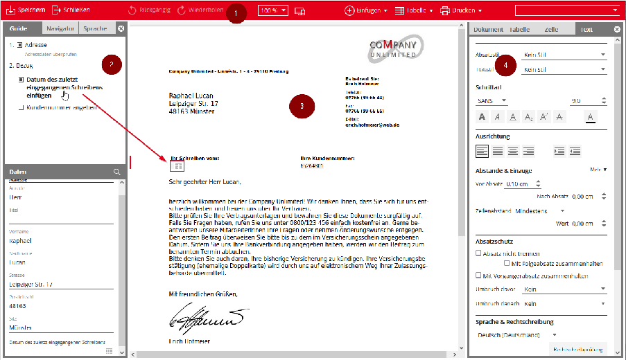

Das Bild oben zeigt den Anwendereditor mit einer geöffneten Dokument. Im Bereich Guide werden Ihnen hier erforderliche Bearbeitungsschritte angezeigt. Durch einen Klick auf den jeweiligen Text springt der Fokus automatisch an die Stelle, an der etwas eingefügt oder geprüft werden soll.

Im Editor selbst stehen Ihnen umfangreiche Bearbeitungsmöglichkeiten zur Verfügung. Nutzen Sie dafür das Kontextmenü (rechte Maustaste), den Bereich Text oder die Symbolleiste.

Vorbereitete Text-Bausteine einfügen können Sie über das Kontextmenü (Einfügen – Baustein) oder über das Raute-Zeichen #.

Der Anwendereditor gliedert sich in verschiedene Bereiche, die nachfolgend detailliert beschrieben werden.

#### 2.1 Die Symbolleiste

- Am oberen Rand des Anwendereditors sehen Sie die Symbolleiste. Hier können - abhängig von den Berechtigungen des Benutzers - verschiedene Aktionen im Dokument durchgeführt werden wie z.B. das Einfügen von Bausteinen oder Anlagen, weiterer Ressourcen oder Tabellen

in das Dokument. Diese Funktionen sind ebenfalls über das Kontextmenü aufrufbar. Auch das Speichern und Schließen des Dokuments, das Ändern der Auflösung, die Anzeige im Responsive Layout und das Drucken sowie das Ändern von Absatzstilen erfolgt über die Symbolleiste.

Zum Einfügen von Tabellen gibt es zwei Möglichkeiten. Klickt man auf den Eintrag Tabelle in

- der Symbolleiste, kann man entweder über Tabelle einfügen einen Dialog öffnen oder direkt die Größe der Tabelle über ein Kachelfeld auswählen.

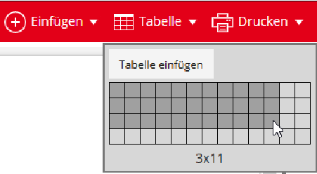

Im Dialog Tabelle einfügen gibt es die Möglichkeit, Tabellenköpfe und -füße direkt zu definieren sowie die Tabelle ohne Umrandungslinien zu erstellen. Tabellenköpfe und -füße können über den Bereich Eigenschaften auch im Nachhinein zu einer Tabelle hinzugefügt werden.

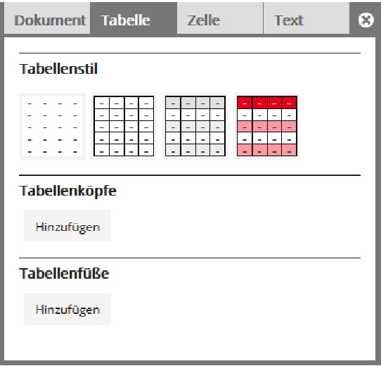

#### 2.2 Guide, Dateneingabebereich, Navigatorund Sprache

Auf der linken Seite sehen Sie ein Fenster mit mehreren Registern: Das erste Register beinhaltet den Guide und den Dateneingabebereich. Der Guide führt den Anwender durch das Dokument, z.B. durch gezieltes Ansteuern von relevanten Textpassagen oder fehlenden Dateneingaben. Er ist in einzelne Punkte unterteilt, die, wenn sie angeklickt

werden, zum entsprechenden Element führen. Fehlen notwendige Eingaben, werden diese hier angezeigt.

Zu jedem Guide-Eintrag existiert ein Kontrollfeld. Der jeweilige Status der Verarbeitung (unverarbeitet, angeklickt) wird über dieses Kontrollfeld entsprechend gekennzeichnet. Die Markierung lässt sich auch separat setzen oder entfernen. Sie hat keinen Einfluss darauf, ob das Dokument abgeschlossen werden kann, sondern dient nur der besseren Übersicht.

Im Dateneingabebereich können Daten. z. B. aus Fachanwendungen, überprüft und geändert werden.

Zeilenumbrüche innerhalb eines Datenwerts lassen sich mit Eingabe von <Umschalt> + <Eingabe> erzeugen. Ein Zeilenumbruch wird im Dateneingabefeld durch einen Pfeil ( ) dargestellt.

Einige Guide-Einträge können den Bereich Daten zur besseren Übersicht einschränken, wenn Sie auf den Guide-Eintrag klicken. Dies wird über die Filterleiste im Daten-Bereich umgesetzt. Um wieder den kompletten Daten-Bereich anzuzueigen, löschen Sie den Filter über das KreuzSymbol.

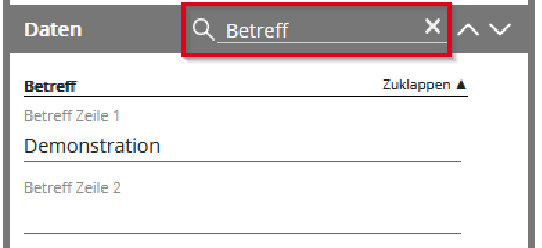

Beachten Sie, dass durch das Einfügen eines Bausteins in das Dokument weitere GuideEinträge oder Dateneingabefelder hinzukommen können, da die Inhalte der Bereiche Guide und Daten sowohl an Vorlagen als auch an Bausteinen definiert sein können.

Im zweiten Register auf der linken Seite (2) stellt der Navigator eine Übersicht über die Seiten

- des Dokuments dar. Wird eine Seite angeklickt, springt die Ansicht im Bereich Editor zu dieser Seite. Im Navigator können Anlagen an das Dokument hinzugefügt und auch wieder gelöscht werden, sowohl über das Büroklammer-Symbol, als auch mittels Drag&Drop. Dies ist nur möglich, wenn der Benutzer die Berechtigung zum Editieren des Dokuments besitzt.

Das Register Sprache auf der linken Seite (2) ermöglicht es, eine Grammatikprüfung durchzuführen. Drücken Sie dazu auf den Button Überprüfen. Daraufhin werden Ihnen im oberen Bereich die Ergebnisse einer semantischen Textanalyse anhand von unterschiedlichen Kriterien zur Verfügung gestellt. Darunter werden Einträge zu grammatikalischen Fehlern (Blau), Textverständlichkeit (Orange) oder Verstößen gegen die Corporate Language (Rot) angezeigt. Die Einträge haben jeweils eine korrespondierende Stelle im Editorbereich, wo der Text in der gleichen Farbe unterstrichen ist. Wenn Sie mit der Maus über einen Eintrag fahren, wird die Stelle im Text hervorgehoben.

Die Einträge lassen sich aufklappen, um eine detaillierte Beschreibung der Situation zu erhalten. Zum Teil werden direkt Korrekturvorschläge angezeigt. Diese können über einen einfachen Klick ins Dokument übernommen werden.

Der Button Ignorieren bewirkt, dass der Eintrag bei Ihnen nicht mehr angezeigt wird. Die Ignorieren-Funktion hat keine Auswirkung auf die angezeigten Einträge von anderen Nutzerinnen und Nutzern. Um ignorierte Einträge wieder anzuzeigen, nutzen Sie den Button Ignorierte Einträge.

Bei Verwendung einer Backend-Engine von semantics, zeigt ein Symbol welche Engine die Fundstelle gemeldet hat.

Um neu hinzugekommenen oder angepassten Text zu überprüfen, klicken Sie auf Aktualisieren.

- • Einträge werden nur zu Texten erzeugt, für die Sie auch Änderungsrechte besitzen.
- • Die Unterstreichungen im Editorbereich werden nicht in das fertige Dokument gedruckt.

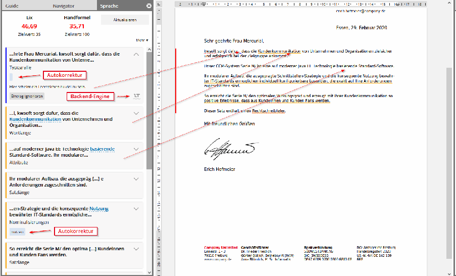

Im Register Anmerkungen auf der linken Seite (2) können Sie Anmerkungen zum Dokument hinterlassen, die von nachfolgenden Benutzern gelesen, kommentiert und beendet / gelöst werden können. Die Anmerkungen werden nicht in das finale Dokument übertragen, welches an den Kunden gesendet wird.

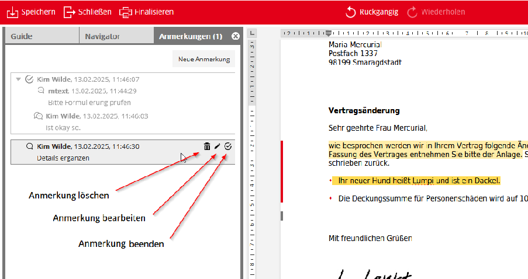

Zum Erstellen einer neuen Anmerkung markieren Sie einen Text aus dem Dokument und klicken auf die Schaltfläche Neue Anmerkung im Bereich Anmerkungen. Schreiben Sie den

Anmerkungstext und speichern Sie die Anmerkung über Hinzufügen. (Der Text, der zum Zeitpunkt des Hinzufügens im Editor markiert ist, wird von der Anmerkung umschlossen.)

Eine Anmerkung kann zu einem Diskussionsstrang werden, indem Antworten darauf erstellt werden. Die Antworten werden unterhalb der Anmerkung angeordnet und können selbst wieder beantwortet werden. Solange auf eine Anmerkung bzw. eine Antwort nicht geantwortet wurde, kann sie vom Ersteller verändert oder gelöscht werden.

Wenn das Anmerkungsfenster aktiviert ist, werden die referenzierten Texte im Dokument farblich hervorgehoben. Die Anmerkungen und die referenzierten Texte sind miteinander verknüpft. Wird eine Anmerkung aktiviert, wird der zugehörige Text fokussiert und umgekehrt. Beim ersten Aktivieren des Anmerkungsfensters nach dem Öffnen des Editors wird die jüngste Anmerkung fokussiert.

Für die Erstellung von Anmerkungen gelten die folgenden Regeln:

- • Anmerkungen sind möglich für Texte, Bilder und ganze Bausteine, die im Sinne der Freitexteingabe ins Dokument eingefügt wurden.
- • Anmerkungen für Teile eines Baustein sind nicht möglich. Stattdessen wird der Kommentar auf den gesamten Bausteinaufruf bzw. Bausteininhalt ausgedehnt.
- • Anmerkungen sind nur möglich, wenn Ihnen ein Anmerkungsrecht für den Bereich zugewiesen wurde.

Bestehende offene Anmerkungen in einem Dokument werden im Register Anmerkungen mit

- einer Zahl angezeigt, wie in der folgenden Grafik zu sehen ist.

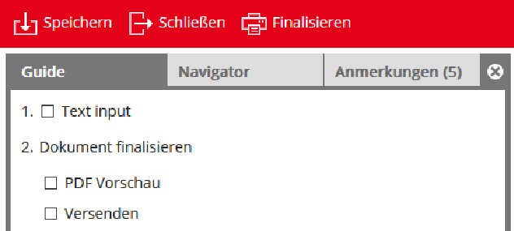

Wird das Fenster mit den darin enthaltenden Registern über das Schließen-Symbol (X) oben rechts beendet, erscheint oben links ein Pfeilsymbol. Über dieses Symbol kann das Fenster jederzeit schnell wieder eingeblendet werden. Das Verhalten lässt sich über die Konfigurationsdatei default.editor.layout.xml anpassen.

#### 2.3 Der Editor

Mittig befindet sich der WYSIWYG-Editor (3), in dem das Dokument im aktuellen Bearbeitungsstand angezeigt ist. Die Eingabe von Daten ist teilweise auch direkt im Editor möglich. Außerdem lassen sich an dafür vorgesehenen Stellen Inhalte in das Dokument einfügen und Stileigenschaften ändern. Anlagen können mittels Drag&Drop in den Editor dem Dokument hinzugefügt werden, falls die Berechtigung hierzu besteht (siehe Abschnitt 2.2, „Guide, Dateneingabebereich, Navigator und Sprache“).

- An der linken Seite des Editor wird angezeigt, welche Stellen im Dokument manuell bearbeitet werden können. Es gibt dafür drei Farben:

- • dunkelgrau - Sie besitzen Bearbeitungsrechte
- • rot - Sie besitzen Bearbeitungsrechte und der Absatz ist fokussiert
- • hellgrau - Sie besitzen keine Bearbeitungsrechte, Nutzer mit einer anderen Rolle besitzen jedoch Bearbeitungsrechte

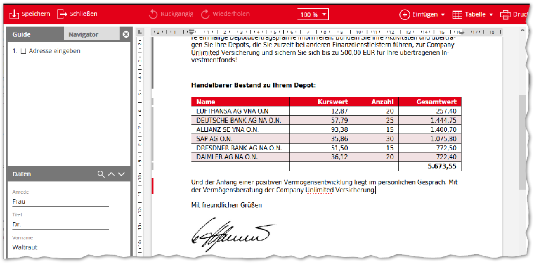

In den Texten im Editor werden Rechtschreib- oder Tippfehler sowie Grammatikfehler unterstrichen dargestellt. Über das Kontextmenü erhalten Sie zum Teil Korrekturvorschläge.

Bausteine, die Sie direkt hinter der Briefanrede einfügen, beginnen normalerweise automatisch mit einem Kleinbuchstaben. Dies liegt an der vorkonfigurierten Kleinschreibung an dieser Stelle. Wenn Sie allerdings manuelle Änderungen an dem Text direkt nach der Briefanrede vornehmen, werden diese nicht automatisch klein geschrieben.

##### 2.3.1 Lineale

Über einen Eintrag in der Konfigurationsdatei default.editor.layout.xml können ein horizontales und ein vertikales Lineal im Editorbereich angezeigt werden. Das vertikale Lineal ist rein informativ, über das horizontale Lineal lässt sich Folgendes steuern:

- • Tabulatoren: In der linken oberen Ecke des Editorbereichs lässt sich der zu platzierende Tabstopp per Maus-Klick einstellen. Zu Wahl stehen Tabstopp links ( ), Tabstopp rechts ( ), Tabstopp dezimal ( ) und Tabstopp zentriert ( ).

Über einen Maus-Klick auf das horizontale Lineal wird ein Tabstopp eingefügt und kann per Drag&Drop an die gewünschte Position bewegt werden. Um einen Tabstopp zu entfernen muss dieser außerhalb des Lineals gezogen werden.

- • Einzüge: Über die Markierungen auf dem horizontalen Lineal können der gesamte Einzug links/rechts ( ) und der Einzug der ersten Zeile ( ) eines Absatzes oder einer Tabellenzelle bestimmt werden.

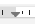

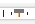

- • Tabellenspalten: Über die Markierungen auf dem horizontalen Lineal kann die Breite von Tabellenspalten ( ) verändert werden.

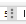

#### 2.4 Der Bereich Eigenschaften

Auf der rechten Seite befindet sich der Bereich Eigenschaften (4) . Dieser enthält mehrere Registerkarten.

In der ersten Registerkarte Dokument werden detaillierte Informationen über das Dokument zur Ausgabe, zu Unterschriften, Metadaten und Versionen dargestellt. Verschiedene Versionen

- eines Dokuments können über den Bereich Versionen miteinander verglichen werden. Weitere Informationen hierzu finden Sie im Abschnitt "Dokumente versionieren in M/TEXT TONIC" im Handbuch 'Ressourcenverwaltung in der Serie M/'.

Eine weitere Registerkarte beinhaltet den Stilgestaltungsbereich Text. Hier können im WYSIWYG-Editor fokussierte Elemente angepasst werden. Der Bereich ist nur dann verfügbar, wenn die Eigenschaften des fokussierten Elements verändert werden dürfen. Die Bearbeitungsmöglichkeiten sind dabei unterteilt in verschiedene Kategorien, z.B. Schriftart und Ausrichtung. Im Editor markierter Text kann hier als Hyperlink definiert werden. Es können außerdem vordefinierte Absatz- oder Textstile ausgewählt werden.

Absatzstile wirken sich dabei auf den gesamten Absatz aus, Textstile betreffen nur den markierten Text. Tippen Sie beispielsweise ein "H" als ersten Buchstaben bei der Stilauswahl, werden ausschließlich Stile mit dem Anfangsbuchstaben "H" angezeigt. Auch die Auswahl Kein Stil ist möglich, um eine Stilauswahl rückgängig zu machen.

Hier befindet sich auch die Kategorie Sprache & Rechtschreibung. Die zu prüfende Sprache kann eingestellt und eine Rechtschreibprüfung des Dokuments vorgenommen werden.

Kontextabhängig werden die Register Tabelle , Zelle sowie Anlage in dem Bereich Eigenschaften dargestellt. Hier können die Stileigenschaften von Tabellen und ihren Zellen geändert werden. Anlagen können in ihrer Größe und Ausrichtung bestimmt werden. Ein Seitenbereich der anzuzeigenden Anlagenseiten kann definiert werden.

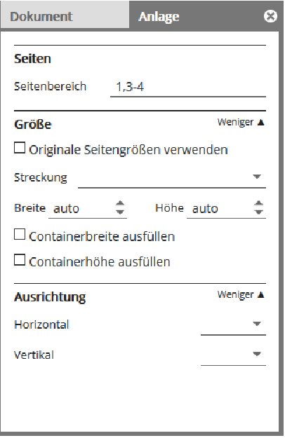

#### 2.5 Die Standardoberfläche

In der Standardoberfläche werden Vorlagen zur Erstellung von Dokumenten angeboten und es können bestehende Dokumente eingesehen werden. In einem persönlichen und einem Gruppen-Postkorb werden Dokumente angezeigt, die dem jeweiligen Nutzer bzw einer Gruppe zur Bearbeitung zugewiesen sind.

Nach dem Login erscheint die Oberfläche zur Auswahl einer Vorlage:

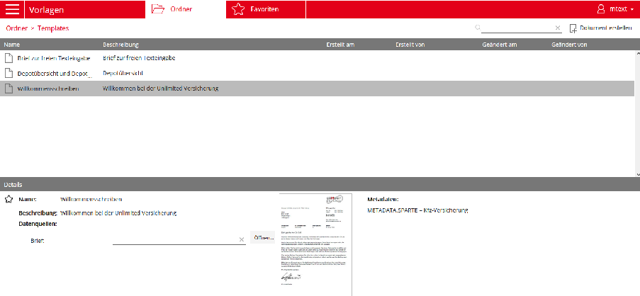

Mit einem Klick auf die Beschreibung der Vorlage wird diese markiert. Im unteren Bereich werden dann Details angezeigt. Hier kann die Vorlage über den Stern links neben dem Namen als Favorit ausgezeichnet werden. Datenquellen zur Verwendung in der Vorlage können angegeben werden. Metadaten der Vorlage werden angezeigt, ebenso eine Vorschaugrafik, falls eine Grafik hierzu in M/Workbench definiert oder in M/TEXT TONIC Content Hub generiert wurde.

Mit einem Klick auf den Namen der Vorlage wird diese im Editor geöffnet.

#### 2.6 Barrierefreie Bedienung

Dieser Abschnitt beschreibt, wie der TONIC Anwendereditor die barrierefreie Bedienung unterstützt.

##### 2.6.1 Allgemeine Umsetzung der Barrierefreiheit

Der M/TEXT TONIC Anwendereditor ist barrierefrei nutzbar. Da er vollständig über die Tastatur bedienbar ist, können sehbehinderte Menschen uneingeschränkt im Anwendereditor navigieren und das Dokument mit weiteren Inhalten füllen und gestalten. Dabei unterstützt der Anwendereditor den Einsatz assistiver Technologien wie Screenreadern, einer Braillezeilenausgabe und Vergrößerungssoftware.

Weitere Eigenschaften des Anwendereditors unterstützen ebenfalls die Barrierefreiheit. Durch den Guide können relevante Dateneingabefelder und Textpassagen gezielt angesteuert werden. Dadurch wird das manuelle Suchen der entsprechenden Stellen im Dokument überflüssig.

Der Dateneingabebereich erleichtert die Dokumentbearbeitung insbesondere für sehbehinderte Anwender ebenso. Da alle benötigten Daten zentral an dieser Stelle überprüft und geändert werden können, fällt die Suche nach Dateneingabefeldern im Dokument weg.

Fokussierte Elemente können in der Sicht Text mit Stilen versehen werden. Dabei sind kontextsensitiv nur diejenigen Stileigenschaften aufgeführt, die auch änderbar sind. Außerdem kann die Menge der zur Verfügung stehenden Optionen durch die zentrale Editorkonfiguration weiter verkleinert werden, was die Navigation erleichtert. Im Extremfall können alle möglichen Absatzstile in Vorlagen vordefiniert werden, so dass die Auswahl von Stilen maximal vereinfacht wird.

In der Konfiguration des Anwendereditors werden alle Farben festgelegt, die dem Endanwender zur Verfügung stehen. Diese Farben werden mit eindeutigen Namen versehen, die im Anwendereditor von einem Screenreader vorgelesen werden können.

Grundsätzlich ist die Bausteintechnik, die in der Serie M/ ein Grundprinzip darstellt, ein Aspekt, der die Arbeit für alle Anwender drastisch erleichtert. Bausteine können Textpassagen, Dialoge, Grafiken und Logik enthalten, die durch einen einfachen Klick dem Dokument hinzugefügt werden können.

##### 2.6.2 Screenreader Unterstützung

- Der WYSIWYG-Editierbereich des M/TEXT TONIC Anwendereditors stellt aus technischer Sicht ein besonderes Oberflächenelement dar, in dem ein eigener Cursor verwaltet wird. ScreenreaderFunktionen, die auf dem Auslesen des technischen Objektbaumes und auf Informationen von System- und virtuellen Cursorn basieren, werden in diesem Fensterbereich nicht unterstützt.

Da die Verfügbarkeit von umfangreichen Vorlese- und Navigationsfunktionen für die Bearbeitung eines Dokuments durch einen sehbehinderten Menschen unerlässlich ist, stellt der M/TEXT TONIC Anwendereditor hierfür eine entsprechende, auf die Funktionsweise des Editors optimierte Screenreader Unterstützung zur Verfügung.

Die Unterstützung muss dazu beim Öffnen des ersten Dokuments im Dialog Einstellungen Barrierefreiheit über die Tastenkombination Strg + Alt + Z explizit eingeschaltet werden. Die Einstellung wird benutzerindividuell gespeichert und beim Öffnen weiterer Dokumente wiederverwendet.

Die Unterstützung umfasst dabei Navigationsfunktionen, über die durch entsprechende Tastenkombinationen gezielt zu den Elementen des Dokuments navigiert werden kann. Dazu gehören nicht nur typische Inhaltselemente wie z. B. Absätze, Überschriften und Grafiken, sondern auch Strukturelemente wie Regionen, Abschnitte, Bausteine oder die nächstmögliche Stelle, an der eine Dokumentenbearbeitung möglich bzw. erlaubt ist.

- Des Weiteren können die Formatierung von Text und die Rollen der Elemente bei eingeschalteter Screenreader Unterstützung vorgelesen werden.

Im Standardfall erfolgt die Ausgabe des Screenreaders über eine Sprachausgabe. Zusätzlich kann die Ausgabe auch über eine Braillezeile erfolgen. Die Braille Unterstützung wird ebenfalls im Dialog Einstellungen Barrierefreiheit aktiviert.

Ein eigener Browse-Modus ermöglicht die Navigation im Dokument über einen virtuellen Cursor. Bei dieser Navigation bleibt der sichtbare Cursor an der ursprünglichen Postion stehen, d.h. die fokussierte Stelle bleibt erhalten. Zusätzlich schaltet im Browse-Modus die Tastatur in einen Navigationsmodus um. In diesem Modus erfolgt die Navigation durch einfache Tastenbetätigung und nicht über umständlichere Tastenkombinationen. So führt z.B. das Betätigen der Taste H im Browse-Modus zur nächsten Überschrift (Heading).

Bitte achten Sie darauf, dass bei der Arbeit im M/TEXT TONIC-Anwendereditor im Bereich Editor die als virtueller oder Browse-Modus bezeichneten Modi Ihres Screenreaders nicht aktiv sind. In den anderen Bereichen oder in Dialogen können auch virtueller Modus und Browse-Modus genutzt werden.

Zur optimalen Unterstützung des JAWS-Screenreaders werden mit M/TEXT TONIC anwendungsspezifische JAWS-Skripte ausgeliefert.

Zur Installation müssen diese Skripte aus dem assemblierten Verzeichnis \AddOns \MTextCS\JAWS in das JAWS-Profil (%USERPROFILE%\AppData\Roaming\Freedom Scientific\JAWS\<jaws_version>\Settings\<jaws_installation_language>) kopiert werden.

#### 2.7 Tastaturbedienbarkeit

Der Editor stellt über die Tastenkombination Strg + Alt + H einen Hilfe-Dialog zur Verfügung, der alle Tastaturkürzel, aufgeteilt in einzelne Bereichen, anzeigt.

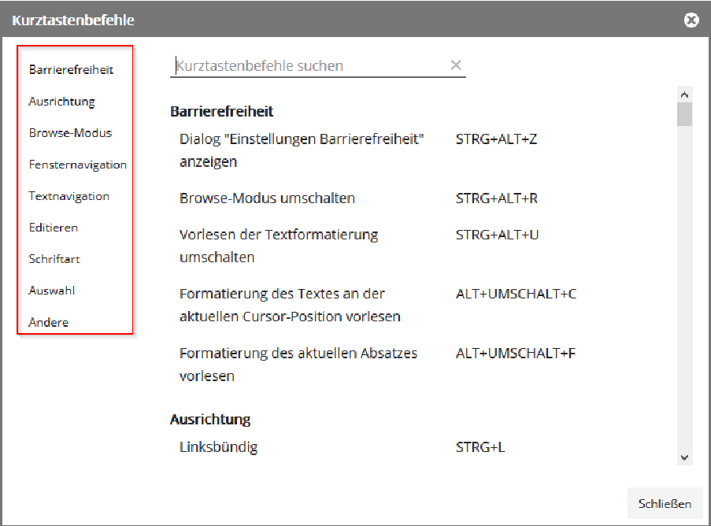

Die Navigation im Anwendereditor erfolgt mehrstufig. In einem ersten Schritt wird über eine Tastenkombination angegeben, in welchen der Bereiche gesprungen werden soll.

Wird ein Bereich des Anwendereditors verlassen und dann wieder an die gleiche Stelle zurück gewechselt, springt der Fokus an die zuvor fokussierte Position.

Die Navigation innerhalb der einzelnen Bereiche verhält sich, außer im Bereich Editor, immer ähnlich:

- • Mit der Taste Tab und der Tastenkombination Umschalt + Tab wird zum nächsten bzw. vorigen Element navigiert.
- • In Bereichen, in denen verschiedene Kategorien vorhanden sind, wird zwischen den Kategorien mit der Tastenkombination Strg + Umschalt + abwärts/aufwärts navigiert.
- • Zwischen verschiedenen Registerkarten (z. B. Guide und Navigator oder Dokument und Text) lässt sich mit der Tastenkombination Strg + Umschalt + links/rechts navigieren.
- • Schalter werden mit der Taste Eingabe betätigt.
- • Kombinationsfelder und Menüs enthalten eine Liste an möglichen Eingabewerten. Diese Liste und ihre verschiedenen Einträge werden mit Hilfe der Pfeiltasten abwärts und aufwärts angesteuert.
- • Drehschalter werden, wenn sie angesteuert werden, als Ganzes fokussiert. Soll der Wert geändert werden, wird mit einer der Pfeiltasten aufwärts und abwärts in den Schalter gewechselt. Hier kann nun über die Pfeiltasten aufwärts und abwärts der Wert des Schalters erhöht werden oder es wird direkt ein neuer Wert eingegeben.

Besonderheiten in der Tastaturbedienung, die von diesem generellen Verhalten abweichen, sind im Folgenden beschrieben.

##### 2.7.1 Besonderheiten im Bereich Guide

Die einzelnen Guide-Einträge können über die Taste Tab angesteuert werden. Wird der Guide verlassen und wieder aktiviert, wird der zuletzt aktive Eintrag wieder fokussiert. Zu jeden Guide-Eintrag gibt es zur besseren Übersicht ein Kontrollfeld (siehe Abschnitt 2.2, „Guide,

Dateneingabebereich, Navigator und Sprache“). Um den Haken in einem Kontrollfeld manuell zu setzen bzw. zu entfernen, wird er mit den Pfeiltasten rechts/links fokussiert und die Taste Eingabe gedrückt.

Die Einträge im Guide können mehrstufig gruppiert sein. Beim Ansteuern eines Gruppeneintrags wird nicht die Gruppe fokussiert, sondern das erste Kindelement. Bei Verwendung eines Screenreaders wird der Name des übergeordneten Gruppenelements vorgelesen.

Oben im Bereich Guide werden Fehlermeldungen oder Statusinformationen, z. B. über das erneute Laden von Daten angezeigt. Diese Meldungen können vom Guide aus mit der Tastenkombination Umschalt + Tab über dem obersten Guide-Eintrag erreicht werden. Mit der Taste Eingabe wird die Liste der Meldungen geöffnet, durch die mit der Taste Tab bzw. Umschalt

+ Tab navigiert werden kann. Die Taste Eingabe führt direkt zum entsprechenden fehlerhaften Element.

Ein Screenreader weist auf Fehlermeldungen und Statusinformationen hin, wenn sie neu auftreten.

##### 2.7.2 Besonderheiten im Bereich Daten

Ist die Eingabe eines Datums gefordert, kann dieses direkt eingetippt werden. Alternativ lässt sich durch die Pfeiltaste abwärts eine Datumsauswahl in Form eines Kalenders öffnen. In dieser Datumsauswahl kann mit den Pfeiltasten zwischen den Tagen und Wochen navigiert werden. Mit der Tastenkombination Strg + Pfeiltaste rechts bzw. Strg + Pfeiltaste links lässt sich zum nächsten bzw. vorherigen Monat springen. Mit Strg + Pfeiltaste aufwärts bzw. Strg + Pfeiltaste

abwärts wird zum nächsten bzw. vorherigen Jahr gesprungen. Dieses Verhalten gilt auch in Dateneingabefeldern, die sich direkt im Dokument befinden (Inplace-Felder).

##### 2.7.3 Besonderheiten im Bereich Eigenschaften

Im Bereich Eigenschaften stehen die Registerkarten Dokument und Text, kontextabhängig auch Tabelle und Zelle zur Verfügung. Zwischen den Registerkarten wird mit den Pfeiltasten links und rechts navigiert. Über die Taste Eingabe wird die Registerkarte ausgewählt, woraufhin der Fokus direkt zum ersten bearbeitbaren Element springt. Um wieder zur Registerkartenauswahl zu gelangen, wird die Tastenkombination Umschalt + Tab verwendet.

Befindet sich der Fokus innerhalb einer Registerkarte, lässt sich über die Tastenkombination Strg

+ links/rechts zwischen den Registerkarten navigieren.

Die Registerkarte Text besteht aus mehreren Kategorien (z. B. Absatzstil, Schriftart, Ausrichtung, ...). Diese gliedern den Bereich thematisch und enthalten jeweils mehrere Elemente. Zwischen den Elementen wird mit Tab und Umschalt + Tab navigiert. Die Kategorien sind teilweise noch aufklappbar. Der Schalter Mehr bzw. Weniger kann angesteuert werden. Über die Taste Eingabe wird die Kategorie dann erweitert bzw. reduziert.

Zur schnellen Navigation lässt sich mit der Tastenkombination Strg + abwärts/aufwärts direkt zum ersten Element der nächsten bzw. vorigen Kategorie navigieren.

Ist ein Bereich des Dokuments nicht zur Bearbeitung freigegeben, ist der Bereich Eigenschaften deaktiviert und kann nicht angesteuert werden. Ein Screenreader gibt einen entsprechenden Hinweis, wenn versucht wird, in den Bereich Eigenschaften zu wechseln, obwohl dies nicht möglich ist.

Die Farben, die bei einer Farbauswahl (z. B. bei Auswahl der Schriftfarbe) zur Verfügung stehen, sind konfigurierbar. Auch die Farbnamen, die ein Screenreader vorliest, können konfiguriert werden. Ist kein Farbname vorkonfiguriert, wird der RGB-Wert der Farbe angesagt. Eine Farbauswahl wird mit der Taste Eingabe geöffnet und in den tabellarisch angeordneten Farben wird mit den Pfeiltasten navigiert.

##### 2.7.4 Besonderheiten im Bereich Symbolleiste

Die Navigation im Bereich Symbolleiste funktioniert wie im allgemeinen Teil beschrieben. Dabei können kontextsensitiv nur diejenigen Elemente angesteuert werden, die auch verfügbar sind.

Wird im Menü Einfügen der Eintrag Daten ausgewählt, öffnet sich ein Dialog zur Datenauswahl. In diesem werden alle Daten angezeigt, die eingefügt werden können. Sie können in verschiedene Datenmodelle unterteilt sein. Ein reduziertes Datenmodell lässt sich mit der Pfeiltaste rechts öffnen. Mit den Pfeiltasten aufwärts und abwärts wird zwischen den Datenmodellknoten navigiert. Mit der Pfeiltaste links wird zum übergeordneten Element navigiert oder ein erweitertes Datenmodell reduziert.

Im Menü Einfügen wird über den Eintrag Symbol ein Dialogfenster geöffnet, aus dem Symbole ausgewählt werden können. Hier kann mit den Pfeiltasten, sowie den Tasten Pos1, Ende und Bild aufwärts/abwärts zwischen den Symbolen navigiert und mit der Taste Eingabe ein Symbol eingefügt werden. Nach Einfügen eines Symbols springt der Fokus in den Bereich Editor zurück, der Dialog bleibt geöffnet. Durch die Tastenkombination Alt + Umschalt + W wechselt der Fokus zwischen dem Dialogfenster und dem Editor. Dieses Verhalten gilt für alle nicht-modalen Dialoge.

##### 2.7.5 Besonderheiten im Bereich Editor

Der WYSIWYG-Editor zeigt das Dokument im aktuellen Zustand an. Hier stehen diverse Tastenkombinationen zur Navigation und Textbearbeitung zur Verfügung, weshalb dieser Abschnitt in verschiedene Themengebiete unterteilt ist.

- • Innerhalb des Bereichs Editor dient die Taste Tab nicht, wie sonst im Anwendereditor üblich, der Navigation, sondern der Einrückung der Schreibmarke. Sie produziert hier also ein Tabulatorzeichen.
- • Bitte achten Sie darauf, dass bei der Arbeit im Bereich Editor die als virtueller oder Browse-Modus bezeichneten Modi Ihres Screenreaders nicht aktiv sind und stattdessen im Formular- oder Fokusmodus gearbeitet wird. (siehe Abschnitt 2.6.2, „Screenreader Unterstützung “).

Wird von einem anderen Bereich in den Bereich Editor zurückgewechselt, liest ein Screenreader zur Orientierung den Namen der aktuellen Region sowie die aktuelle Zeile bzw. den aktuell markierten Text vor.

Es kann in Dokumenten geschützte Bereiche geben, in denen eine Bearbeitung des Textes sowie die Eingabe von Text, Tabellen, etc. nicht möglich ist. Wird versucht, etwas in solch einen Bereich zu schreiben, liest ein Screenreader einen entsprechenden Hinweis vor.

###### 2.7.5.1 Navigation im Bereich Editor

Da ein Dokument aus verschiedenenen, teils verschachtelten Elementen besteht, gibt es im Bereich Editor diverse Tastenkombinationen zur Navigation. Sie finden eine Übersicht darüber im Anwendereditor über die Tastenkombination Strg + Alt + H.

Im Bereich Editor gibt es einen eigenen Browse-Modus, der durch die Tastenkombination Strg + Alt + R aktiviert wird. Der Browse-Modus ermöglicht die Navigation im Dokument mit einem virtuellen Cursor, ohne dabei die Position des Eingabecursors zu verschieben. Das angesteuerte Objekt wird dabei vorgelesen. Die Eingabe von Zeichen in das Dokument ist in diesem Modus nicht möglich. Wird der Browse-Modus verlassen, kehrt der Fokus zurück zum Eingabecursor.

###### 2.7.5.2 Bausteine einfügen

In M/TEXT TONIC können vorbereitete Bausteine direkt in das Dokument geladen werden. Über die Rautetaste # erreichen Sie die Bausteinliste, in der Sie über ein Suchfeld und mit den Pfeiltasten abwärts und aufwärts nach Bausteinen suchen können. Ein fokussierter Baustein wird als Vorschau im WYSIWYG-Editor angezeigt. Die Auswahl eines Bausteins erfolgt über die Taste Eingabe. Jedoch kann nicht jeder Baustein an jeder beliebigen Stelle im Dokument eingefügt werden. Kann ein Baustein nicht eingefügt werden, wird neben dem entsprechenden Baustein eine Meldung ausgegeben bzw. von einem Screenreader vorgelesen. Um die Bausteinauswahl zu verlassen, drücken Sie die Taste Esc.

###### 2.7.5.3 Tipp- und Rechtschreibfehler

Tipp- und Rechtschreibfehler werden vom System erkannt und auch Korrekturvorschläge werden unterbreitet. Ein Screenreader weist auf einen Tippfehler hin, wenn ein fehlerhaftes Wort

fertig geschrieben oder angesteuert wird. Im Browse- Modus kann über die Taste W auch direkt der nächste Rechtschreibfehler angesteuert werden.

Befindet sich der Fokus an bzw. in einem fehlerhaften Wort, findet sich im Kontextmenü (Umschalt + F10) die Liste der Korrekturvorschläge. Mit den Pfeiltasten abwärts und aufwärts wird durch die Liste navigiert und mit der Taste Eingabe ein Korrekturvorschlag oder die Option Hier ignorieren ausgewählt.

###### 2.7.5.4 Inplace-Felder

Inplace-Felder lassen sich anspringen. Nutzen Sie dafür z. B. die Tastenkombination Strg + Pfeil rechts / Pfeil links oder Alt + I / Alt + Umschalt + I.

Die Bearbeitung von Inplace-Feldern funktioniert wie die Bearbeitung von Datumsfeldern (siehe Abschnitt 2.7.2, „Besonderheiten im Bereich Daten“). Die Bearbeitung bzw. Auswahl von Daten in Schaltern, Kombinationsfeldern und Drehschaltern per Tastatur sind im Abschnitt 2.7, „Tastaturbedienbarkeit “ erklärt.

Um ein Inplace-Feld zu verlassen, drücken Sie die Taste ESC. Der Fokus springt an den Zeilenanfang.

