## Serie M/ 6.16

User's Manual

# M/TEXT TONIC User Editor

This manual was released at 19.05.2025

Tip: Take a look at the PDF file "Serie M/ Glossary" to find out more about terms used in the Serie M/.

Feedback: This manual has been investigated and assembled with the utmost care. If, however, you should come across any errors, unaccouracies or incompletenesses, we would like you to inform us (<documentation@kwsoft.de>).

Note: The underlying databases for Serie M/ products should only be changed using official Serie M/ products. By altering these directly we cannot guarantee that Serie M/ products will continue to operate correctly. We reserve the right to change the database structure at any time and without prior notice.

|The symbols used in the manual:|The symbols used in the manual:|The symbols used in the manual:|The symbols used in the manual:|
|---|---|---|---|
||Example||System dependent|
||Please note||Prerequisite|
||Background||Warning|
||Note||Cross reference|
||Data privacy||Example video|

Copyright © 2025 kühn & weyh Software GmbH

Linnéstr. 1-3, D-79110 Freiburg Fone 0761/8852-0 Fax 0761/8852-666 E-Mail documentation@kwsoft.de Homepage www.kwsoft.de

##### Table of Contents

- 1. What is new? ......................................................................................................................... 1

- 1.1. What is new in Release 6.16 ....................................................................................... 1

2. M/TEXT TONIC User Editor .................................................................................................... 2

- 2.1. The Toolbar ................................................................................................................ 2

- 2.2. Guide, Input Area, Navigator and Language ................................................................ 3
- 2.3. The Editor ................................................................................................................... 6 2.3.1. Rulers ............................................................................................................... 7
- 2.4. The Properties Area .................................................................................................... 8
- 2.5. The standard interface ................................................................................................ 9
- 2.6. Accessible Operation .................................................................................................. 9

- 2.6.1. Generally accessible implementation ............................................................... 9
- 2.6.2. Screen reader support ................................................................................... 10

- 2.7. Keyboard Usability .................................................................................................... 11

- 2.7.1. Guide features ............................................................................................... 12
- 2.7.2. Data features ................................................................................................. 12
- 2.7.3. Properties features ......................................................................................... 12
- 2.7.4. Toolbar features ............................................................................................. 13
- 2.7.5. Editor features ............................................................................................... 13

M/TEXT TONIC User Editor 6.16 iii

### 1. What is new?

Our products are continuously improved and further developed. All new features, compatibility notes, improvements and corrections for release 6.16 can be found in the corresponding release notes.

A selection of the most important changes in the M/TEXT TONIC user editor is listed below.

#### 1.1 What is new in Release 6.16

- • You now have the option of selecting a new tab Annotations on the left-hand side to leave annotations on your texts in the document. These annotations/comments can be viewed and further commented on by subsequent editors of the document.

- • The name of a model is now displayed in the editor if you have inserted it into a document. Previously, the technical name was displayed.
- • In the Language tab with the results of the text analysis, an icon now shows you which backend engine from semantics (TextLab, LanguageTool, semantics) reported the finding (see Section 2.2, “Guide, Input Area, Navigator and Language”).

- • If a "suggested text" is returned during the spell check, it is now displayed in the text analysis result tiles in the Language section. Suggestions are returned as alternatives to replacement suggestions in cases where replacements cannot be applied directly because the structure of the sentence or paragraph needs to be changed.
- • The display of the buttons in the navigator for inserting attachments and inserting document parts has changed. Your administrator can now choose to display or hide the buttons.
- • The Paste as Text function (Ctrl + Shift + V) is now available in the TONIC user editor's context menu. This function pastes the text without formatting.
- • Models that you have dissolved (for example, by changing the content) are now displayed with a gray border. You can delete and move the entire content.
- • In the Insert models area, the message The selected foldeer does not contain models is now displayed in the lower part of the panel (model list) if a folder that does not contain any models is selected in the upper part of the area.
- • In the Guide, it is now possible to deselect an item once it has been selected without having to select one of the items offered again if it is an optional selection where only one item can be selected.

### 2. M/TEXT TONIC User Editor

The M/TEXT TONIC User Editor is a HTML5 application. It has a WYSIWYG Editor and an easy to use design. The Application Editor can be configured in M/Workbench, so that only those elements required by the customer are present. It therefore offers optimal adjustment for specialized work settings and tasks. The User Editor is operated using the keyboard. You can find the relevant key combinations for operation in Section 2.7, “Keyboard Usability ”.

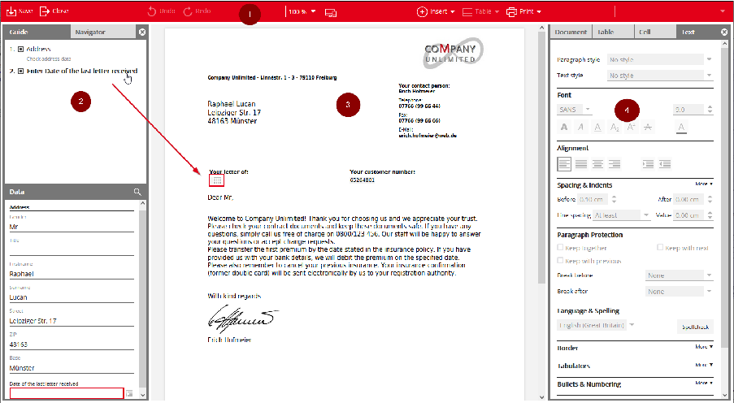

The image above shows the user editor with an open document. The required editing steps are displayed here in the Guide area. By clicking on the respective text, the focus automatically jumps to the point where something is to be inserted or checked.

Extensive editing options are available in the editor itself. Use the context menu (right mouse button), the Text area or the toolbar.

You can insert prepared text blocks via the context menu (Insert - Model) or via the hash sign #. The User editor is divided into different areas, which are described in detail below.

#### 2.1 The Toolbar

The Toolbar lines the top of the Application Editor window (1). It can be used to carry out a variety of actions -depending on user rights - in the document, for example inserting models or attachments, adding additional resources or tables to the document. These functions are also available via the context menu. Saving and closing the document, changing the resolution, changing to a responsive layout, printing and changing paragraph styles are also functions of the Toolbar.

There are two ways to insert tables. If you click on the Table entry in the toolbar, you can either open a dialog via Insert table or directly select the size of the table via a tile field.

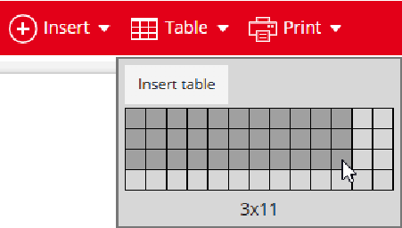

In the Insert table dialog there is the possibility to define table headers and footers directly as well as to create the table without border lines. Table headers and footers can also be added to a table afterwards via the Properties area.

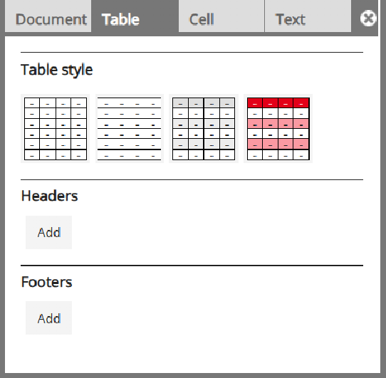

#### 2.2 Guide, Input Area, Navigator andLanguage

On the left hand side of the Application Editor is a window with two tabs (2) The first tab contains the Guide and the Data input area. The Guide guides the user through the document, for example by implementing targeted jumps to relevant text passages or data input points. It is divided into individual points that, when clicked on, lead the user to the relevant element. In addition, the Guide shows if input is missing. There is a control field for each Guide entry. The respective status of the processing (unprocessed, clicked) is marked accordingly via this control field. The tick can also be set separately or removed. It has no influence on whether or not the document can be completed, it simply helps the user track what they are doing.

The Data input area can be used to check and change data, for example data from specialist applications.

Line breaks within a data value can be created by entering <Shift> + <Enter>. A line break is represented by an arrow ( ) in the data entry field.

Some guide entries can restrict the Data area for a better overview when you click on the guide entry. This is implemented via the filter bar in the data area. To display the entire data area again, delete the filter using the cross symbol.

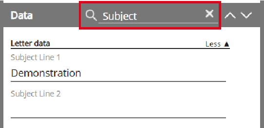

Please note that additional Guide entries or data input fields may be added if you add a model to the document, as the contents of the Guide and Data areas can be defined both in templates and in models.

The second tab (2) on the left hand side is the Navigator, containing a list of the document pages. By clicking on a page, the view in the Editor area will switch to that page. You can add attachments to the document and delete them again in the Navigator, using both Drag&Drop and the paper clip icon. This is only possible if the user has document edit rights.

The Language tab on the left-hand side (2) allows you to perform a grammar check for german texts. To do this, click on the Check button. The results of a semantic text analysis based on various criteria will then be made available to you in the upper area. Below this, entries for grammatical errors (blue), text comprehensibility (orange) or violations of the corporate language (red) are displayed. The entries each have a corresponding location in the editor area where the text is underlined in the same color. If you move the mouse over an entry, the position in the text is highlighted.

The entries can be expanded to obtain a detailed description of the situation. In some cases, correction suggestions are displayed directly. These can be transferred to the document with a simple click.

The Ignore button means that the entry is no longer displayed for you. The ignore function has no effect on the entries displayed by other users. To display ignored entries again, use the Ignored entries button.

If a semantics backend engine is used, an icon shows which engine reported the finding. To check newly added or adjusted text, click on Refresh.

- • Entries are only created for texts for which you also have change rights.
- • The underlines in the editor area are not printed in the finished document.

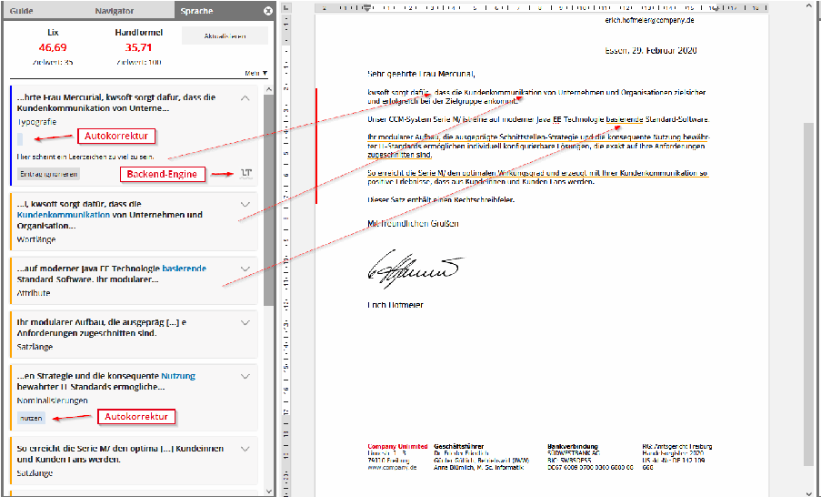

In the Annotations tab on the left-hand side (2), you can leave comments on the document that can be read, commented on and closed/resolved by subsequent users. The comments are not transferred to the final document that is sent to the customer.

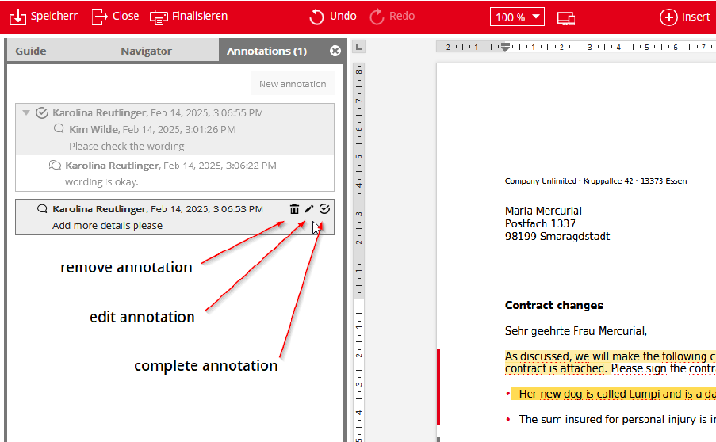

To create a new annotation, select a text from the document and click on the New annotation button in the Annotations area. Write the annotation text and save the annotation by clicking Add. (The text that is selected in the editor at the time of adding is enclosed by the annotation).

An annotation can become a discussion thread by creating replies to it. The replies are arranged below the comment and can themselves be answered. As long as a annotation or reply has not been answered, it can be changed or deleted by the creator.

If the annotation window is activated, the referenced texts in the document are highlighted in color. The annotations and the referenced texts are linked to each other. If an annotation is activated, the associated text is focused and vice versa. The first time the annotation window is activated after opening the editor, the most recent annotation is focused.

The following rules apply to the creation of annotations:

- • Annotations are possible for texts, images and entire models that have been inserted into the document as free text.
- • Annotations for parts of a model are not possible. Instead, the comment is extended to the entire model call or model content.
- • Annotations are only possible if you have been assigned an annotation right for the area.

Existing open annotations in a document are displayed in the Annotations tab with a number, as shown in the following graphic.

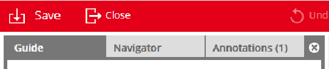

#### 2.3 The Editor

The WYSIWYG Editor is located in the middle of the screen (3), and shows the document in its current state. In some cases it is also possible to enter data in the Editor. In addition, contents can be added to the document and style elements changed at locations designed for these tasks. Attachments can be added to the document in the Editor via Drag&Drop, provided the user has the correct rights (seeSection 2.2, “Guide, Input Area, Navigator and Language”).

The left side of the editor shows which parts of the document can be edited manually. There are three colors for this:

- • dark gray - you have editing rights
- • red - you have editing rights and the paragraph is focused
- • light gray - you do not have editing rights, but users with another role have editing rights

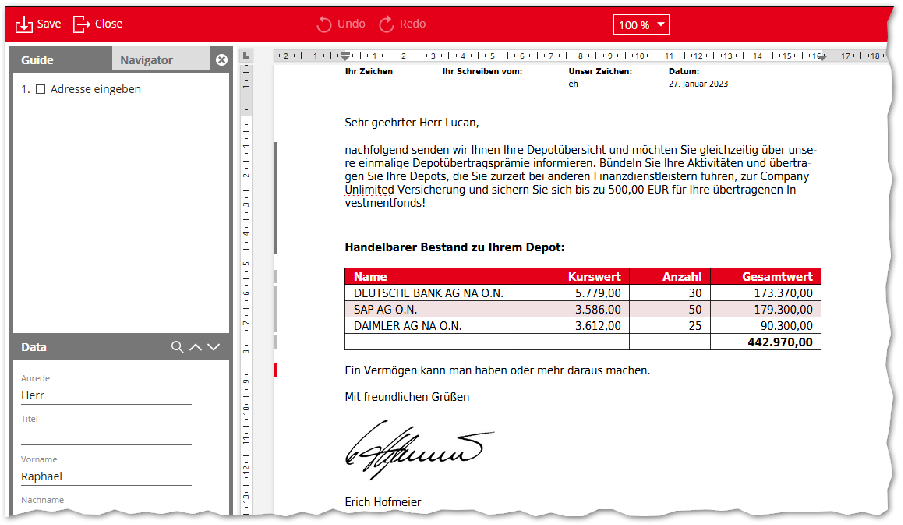

In the texts in the editor, spelling or typing errors and grammatical errors are underlined. Correction suggestions are sometimes provided via the context menu.

Models that you insert directly after the letter salutation normally begin automatically with a lower case letter. This is due to the preconfigured lower case at this point. However, if you make manual changes to the text directly after the letter salutation, these are not automatically written in lower case.

##### 2.3.1 Rulers

To display a horizontal and a vertical ruler in the editor area an entry in the configuration file default.editor.layout.xml must be set. The vertical ruler is purely informative, the horizontal ruler can be used to control the following:

- • Tabs: In the upper left corner of the editor area, the tab stop to be placed can be defined by mouse click. Available are tab stop left ( ), tab stop right ( ), tab stop decimal ( ) und tab stop centred ( ).

A tab stop is inserted by clicking on the horizontal ruler and can be moved to the desired position using Drag&Drop. To remove a tab stop, it must be dragged outside the ruler.

- • Indents: Via the markings on the horizontal ruler, the entire indent left/right ( ) and the indent of the first line ( ) of a paragraph or a table cell can be set.

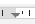

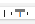

- • Table columns: The width of table columns can be changed via the markers ( ) on the horizontal ruler.

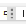

#### 2.4 The Properties Area

The Properties area is located on the right hand side of the screen (4). It contains several tabs. The first tab, Document, displays detailed information on the document, the output, signatures, metadata and versions. Different versions of a document can be compared with each other via the Versions area. For more information, see the section "Versioning documents in M/TEXT TONIC" in the manual 'Ressource management in Serie M/'. The second tab on the right hand side contains the style design area Text. Here you can adjust the elements that are focused in the WYSIWYG Editor. The area is only available if the properties of the focused elements can be changed. The editing options are divided into a variety of category, e.g. Paragraph style, Font and Orientation. Text that has been highlighted in the Editor can be defined as a hyperlink here. You can also select predefined paragraph or text styles. Paragraph styles affect the entire paragraph, while text styles affect only the selected text. For example, if you type "H" as the first letter in the style selection, only styles starting with "H" will be displayed. It is also possible to select No style to undo a style selection. You will also find the category Language & Spelling. The language to be spell checked can be entered and the document can be spell checked. Depending on context, two additional tabs will appear in the Properties area, the areas Table and Cell. Here you can adjust the style properties for tables and cells. You can determine the size and layout of the attachments. You can also define a page range for the attachment pages to be displayed.

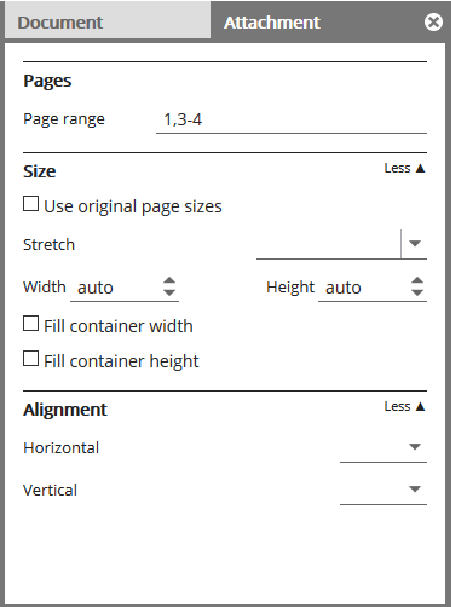

#### 2.5 The standard interface

Templates for creating documents are offered in the standard interface and existing documents can be viewed there. Documents that are assigned to the respective user or group for editing are displayed in a personal and a group inbox.

Once you have logged in, you will see the interface that allows you to select a template:

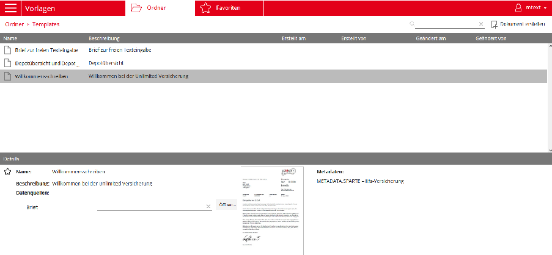

Highlight the template by clicking on its description. The template details will then appear in the lower part of the screen. Here you can add the template to your favorites by clicking the star to the left of its name. You can also enter data sources for use within the template. You will be able to view the template’s metadata, as well as a preview of the template, provided that a preview has been defined in M/Workbench or generated in the M/TEXT TONIC Content Hub.

Click on the template’s name to open it in the Editor.

#### 2.6 Accessible Operation

This section describes how the M/TEXT TONIC User Editor supports accessibility.

##### 2.6.1 Generally accessible implementation

The M/TEXT TONIC User Editor has options for barrier free operation. As it can be operated using the keyboard only, people with visual impairments can navigate within the Application Editor without issue and add additional content and design to the document. The Application Editor supports the use of assistive technologies such as screen readers, a refreshable braille display, and magnifying software.

Additional Application Editor properties also support accessibility. The Guide can be used to directly jump to relevant data input fields and text passages. This means there is no need to manually search for the relevant positions within the document.

The data input area makes document editing easier for everyone, but in particular for the visually impaired. Because all required data are edited and checked in a central location, there is no need to search for data input fields within the text.

Elements in focus can be assigned styles in the Text view. This feature is context-sensitive and only those style properties that can be changed are listed. In addition, the number of available options can be further decreased using the central Editor configuration, which makes navigation easier. In extreme cases, all potential paragraph styles within a template can be predefined, to make selecting styles as simple as possible.

All colors available to the end user are determined in the Application Editor configuration. These colors are assigned unique names that could be read from within the Application Editor by a screen reader.

The model technique that is a fundamental Serie M/ usage principle is another aspect that significantly simplifies work for all users. Models may contain text, dialogs, graphics, and logic that can be added to the document with a simple click.

##### 2.6.2 Screen reader support

The WYSIWYG editing area in the M/TEXT TONIC Application Editor is, from a technical perspective, a specialized interface element which manages its own cursor. Screen reader functions based on reading the technical object tree and on information from system and virtual cursors are not supported in this window area.

As availability of comprehensive read-aloud and navigational functions is necessary for a visually impaired person to edit a document, the M/TEXT TONIC Application Editor provides relevant support for screen readers that is optimized to match the way the Editor functions.

You must explicitly turn on this support when opening the first document in the dialog Accessibility Settings, using the shortcut Ctrl + Alt + Z. The setting is saved individually for each user and then used for all further documents that are open. If this support is activated, the notification "Voice output support on" will be output every time a document is opened.

The support includes navigation functions, so that the relevant shortcuts can be used to navigate directly to the document elements. These do not just include typical content elements such as, for example, paragraphs, headings, and graphics, but also structural elements such as regions, sections, models, or the next position at which the user can edit the document.

In addition, the text format and the role of the elements can be read out loud if the screen reader support is turned on.

- As a default, the screen reader output takes place using voice output. The output can, additionally, be realized with a refreshable braille display. Braille support is also activated in the Accessibility Settings dialog.

The Browse mode allows for document navigation using a virtual cursor. For this type of navigation, the visible cursor remains fixed in its original position, i.e. the document will remain focused at the chosen position. In addition, the keyboard will switch to a navigation mode in browse mode. In this mode, navigation is carried out using simple key presses, no need for more complicated shortcuts. For example, clicking the H key in Browse mode will take the user to the next Heading.

Please ensure that your screen reader is not set to the modes known as Virtual or Browse mode when working in the M/TEXT TONIC Application Editor Editor area . The Virtual mode and Browse mode can, however, be used in other areas or in the dialog.

For optimal support of the JAWS screen reader, application-specific JAWS scripts are provided with M/TEXT TONIC.

For installation, these scripts must be copied from the assembled directory \AddOns \MTextCS\JAWS to the JAWS profile (%USERPROFILE%\AppData\Roaming\Freedom Scientific\JAWS\<jaws_version>\Settings\<jaws_installation_language>).

#### 2.7 Keyboard Usability

The editor provides a help dialog via the key combination Ctrl + Alt + H, which contains the keyboard shortcuts, divided into specific areas.

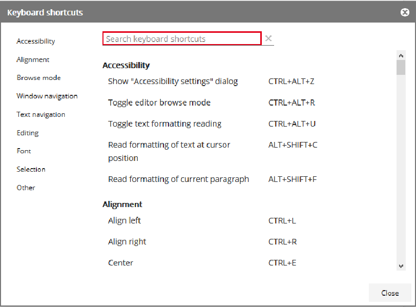

Navigation in the Application Editor requires multiple steps. In the first step, a shortcut is used to enter which area you want to navigate to. You can go to the areas Guide, Data input area, Navigator, Editor, Properties and Toolbar using the following shortcuts:

If you leave an area in the Application Editor and then switch back to the same position again, the focus will jump to the previously focused position.

Navigation within individual areas is, with the exception of the Editor area, always similar:

- • use the Tab key or the shortcut Shift + Tab to jump to the next or to the previous element.
- • In areas with more than one category, you can navigate between categories using the shortcut Ctrl + Shift + up/down.
- • You can navigate between different tabs (e.g. Guide and Navigator, or Document and Text) using the shortcut Ctrl + Shift + left/right.
- • Buttons are activated using the Enter key.

- • Comboboxes and menus contain a list of possible input values. This list and its various entries can be navigated with help from the up and down arrow keys.
- • Rotary switches are focused on as a whole when navigated to. If the user wishes to change the value, the up and down arrow keys can be used to change focus to the switch itself. Then, the up and down arrow keys can be used to change the value of the switch, or you can directly enter a new value.

Special keyboard operation features that differ from these functions are described below.

##### 2.7.1 Guide features

Individual Guide entries can be jumped to using the Tab key. If you leave the Guide and then activate it once more, the last active entry will spring into focus. There is a control field for each Guide entry to help users track what they are doing (see Section 2.2, “Guide, Input Area, Navigator and Language”). To manually set or remove the check mark within a control field, focus it using the right or left arrow key and then press Enter. The Guide entries can be grouped on multiple levels. When jumping to a group entry, focus will not be on the group but rather on the first child element. If you are using a screen reader, the name of the superior group element will be read out loud. At the top of the Guide area, you will see error notifications or status information, e.g. regarding reloading data. These notifications can be focused on from the Guide using the shortcut Shift + Tab above the topmost Guide entry. The Enter key is used to open the list of notifications, and you can navigate through the list using the Tab key or the shortcut Shift + Tab. The Enter key will take you directly to the element that has caused the error.

A screen reader will inform the user as to error messages and status information when they first appear.

##### 2.7.2 Data features

If you need to enter a date, you can simply type it in directly. Alternatively, the down arrow key opens a date selection window in the form of a calendar. In this date selection window, you can use the arrow keys to navigate between the days and the weeks. You can jump to the next and/ or the previous month using the shortcut Ctrl + right arrow (next month) and Ctrl + left arrow (previous month). Use Ctrl + up arrow and Ctrl + down arrow to jump to the next or previous year respectively. This also applies to data entry fields that are located directly within the document (Inplace fields).

##### 2.7.3 Properties features

In the Properties area you can find the tabs Document and Text, and, depending on context Table and Cell. Navigate between the tabs using the left and right arrow keys. Use the Enter key to select the tab, after which the focus will automatically jump to the first element that can be edited. Use Shift + Tab to select which tab you want to jump to next.

If the focus is on an element within a tab, the shortcuts Ctrl + left/right can be used to navigate between tabs.

The Text tab consists of several categories (e.g. paragraph style, font, orientation, etc.). These divide the area thematically and each contain several elements. Navigate between the elements using Tab and Shift + Tab.

In some cases, you can expand the categories. Hover your mouse over the More or Less buttons. Use the Enter key to expand or collapse the category.

For quick navigation, the shortcuts Ctrl + up/down can be used to navigate directly to the first element of the next/previous category.

If an area of the document has not been unlocked for editing, the Properties area will be deactivated and you cannot navigate to it. A screen reader will provide a relevant notification if the user attempts to navigate to the Properties area when doing so is not possible.

The colors that are available for color selection (e.g. when selecting font color) can be configured. The color names read aloud by the screen reader can also be configured. If there is no preconfigured color name, the RGB value of the color will be read out. Color selection is opened using the Enter key and the arrow keys are then used to navigate through the colors which are arranged in a table.

##### 2.7.4 Toolbar features

The navigation in the Toolbar area works as described in the general instruction section. You can only jump to those elements that are actually available within the document.

If the entry Data is selected in the Insert menu, a dialog for selecting data will be opened. It will show all data that can be inserted. They can be divided into various data models. A reduced data model can be opened with the right arrow key. The up and down arrow keys are used to navigate between the data model nodes. The left arrow key is used to navigate to the superior element or to reduce an expanded data model.

In the Insert menu, you can use the Symbol entry to open a dialog window from which you can select symbols. Here you can use the arrow keys, as well as the keys Home, End and Page up/down to navigate between the symbols and then use the Enter key to insert a symbol. After you have inserted a symbol, the focus will jump back to the Editor, the dialog will remain open. You can use the shortcut Alt + Shift + W to switch focus between the dialog window and the Editor. This behavior applies to all non-modal dialogs.

##### 2.7.5 Editor features

The WYSIWYG Editor displays the document in its current state. There are a variety of shortcuts available for navigation and text editing, which is why this section is divided into different topics.

- • Within the Editor area, the Tab key is not used for navigation, as it is within the other parts of the Application Editor, but is instead used to indent the cursor. That is it produces a tab character.
- • Please ensure, when working in the Editor area, that the Virtual or Browse mode modes for your screen reader are not active; work with the Form or Focus mode instead. (see Section 2.6.2, “Screen reader support ”).

If you switch back to the Editor area from within another area, the screen reader will read the name of the current region and the current line or the text that is currently highlighted, to help with orientation.

Documents may have locked areas in which it is not possible to edit the text or enter texts, tables, etc. If you attempt to write something within a locked area, the screen reader will provide you with a relevant notification.

###### 2.7.5.1 Editor navigation

As a document consists of a variety of elements, some of them nested, there are many shortcuts available within the Editor. You can find an overview of this in the user editor using the key combination Ctrl + Alt + H.

The Editor area has its own browse mode that is activated using the shortcut Ctrl + Alt + R. The browse mode allows navigation in the document with a virtual cursor without changing the position of the input cursor. The object navigated to will be read aloud. It is not possible to enter characters into the document in this mode. If you exit the browse mode, the focus will return to the input cursor.

###### 2.7.5.2 Insert models

In M/TEXT TONIC, you can load prepared models directly into the document. You can use the hash key # to access the model list, in which you can use the search field and the down and up arrow keys to search for models. The model you have focused on will appear as a preview in the WYSIWYG Editor. Select a model using the Enter key. However, not all models can be inserted into any desired position within the document. If a model cannot be inserted, then a notification will be displayed next to the relevant model, or the screen reader will read the notification aloud. Press Esc to leave the model selection list.

###### 2.7.5.3 Typos and spelling errors

Typos and spelling errors are recognized by the system, which will also suggest corrections. A screen reader will alert the user to a typo once an incorrectly spelled word has been written to completion or if it is in focus. In browse mode, you can use the W key to jump directly to the next spelling error.

If the focus is on or in an incorrect word, the list of suggested corrections can be found in the context menu (Shift + F10). Navigate through the list using the down and up arrow keys and select a suggested correction using the Enter key or select the option Ignore.

###### 2.7.5.4 Inplace-Felder

Inplace fields can be jumped to. To do this, use the key combination Ctrl + right arrow / left arrow or Alt + I / Alt + Shift + I, for example.

Editing of inplace fields works like editing of date fields (see Section 2.7.2, “Data features”). Editing or selecting data in buttons, combo boxes and rotary switches by keyboard are explained in Section 2.7, “Keyboard Usability ”.

To exit an inplace field, press the ESC key. The focus jumps to the beginning of the line.

